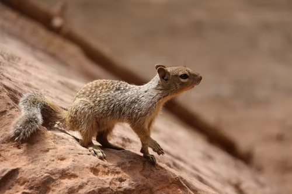

```{r setup, include = FALSE, cache = FALSE, purl = FALSE}
source("assets/setup.R")
```

test

---

class: middle, center, inverse

# Test

## Test test

---

## Алая вспышка осветила силуэт зазубренного крыла

### Алая вспышка осветила силуэт зазубренного крыла

```{r plot1, echo=TRUE, opts.label='fig.medium'}
# Test code appearance
ggplot(diamonds) +
  aes(cut, fill = cut) +
  geom_bar(show.legend = FALSE) +
  labs(x = "Cut", y = "Count", title = "A Fancy diamonds Plot") # можно еще символов 6
```

Этот текст .red[красный], .green[зеленый], .blue[синий], и может быть раскрашен в разные цвета .white.bg-purple[demo].

---

## Алая вспышка осветила силуэт зазубренного крыла

```{r echo=FALSE, opts.label='fig.large'}
# Test code appearance
ggplot(diamonds) +
  aes(cut, fill = cut) +
  geom_bar(show.legend = FALSE) +
  labs(x = "Cut", y = "Count", title = "A Fancy diamonds Plot") # можно еще символов 6
```

---

```{r echo=FALSE, opts.label='fig.full'}
# Test code appearance
ggplot(diamonds) +
  aes(cut, fill = cut) +
  geom_bar(show.legend = FALSE) +
  labs(x = "Cut", y = "Count", title = "A Fancy diamonds Plot") # можно еще символов 6
```

---

# Краткие итоги

---

# Что почитать
