```{r setup, include = FALSE, cache = FALSE, fig.showtext = TRUE}
source("assets/setup.R")
library(xaringanExtra)
use_tile_view()
use_scribble()
use_search(show_icon = FALSE)
use_progress_bar(color = "#6d2b5e", location = "bottom", height = "10px")
use_freezeframe()
# use_webcam()
# use_panelset()
# use_extra_styles(hover_code_line = TRUE)

# http://tachyons.io/docs/
# https://roperzh.github.io/tachyons-cheatsheet/
use_tachyons()
```

```{r libs, include=FALSE, warning=FALSE}
library(tidyverse)
library(cowplot)
library(scales)
```

## Биостатистика, обзор

- Организационные моменты
- Что такое статистика и чем она занимается
- Выборочный метод
- Случайная выборка
- Проблемы при отборе проб
- Типы данных и переменных
- Частоты и вероятности

---

class: middle, center, inverse

# Организационные моменты

???

- расписание
- теория и практика
+ сайт курса
+ чат в telegram
- оценки
- зачет
+ установка R

---

## Ресурсы курса в сети

.center[]

.pull-left[
.center[
Вебсайт (презентации и код)  
[varmara.github.io/biostat101](https://varmara.github.io/biostat101)  
  
]
]

.pull-right[
.center[
Чат для вопросов  
https://t.me/+dnpejPBFBPdjOGQy  
  
]
]

---

## Программы для работы

.pull-left-55[

1. С сайта Comprehensive R Archive Network [cran.r-project.org](https://cran.r-project.org/) нужно скачать
  - __R__
  - __RTools__ — только для пользователей Windows. Это набор утилит для компиляции пакетов R из исходного кода.  

2. __RStudio__ — среда разработки для R (в октябре RStudio станет Posit).  
[rstudio.com](https://rstudio.com)

  Если что, можно воспользоваться __RStudio Cloud__— это облачная версия RStudio (25 часов в месяц на бесплатном тарифе).  
  [rstudio.cloud](https://rstudio.cloud)
]
.pull-right-45[


]

---

class: middle, center, inverse

# Что такое статистика, и чем она занимается


???

...

И каково место статистики в науке и, в частности, в биологии...

---

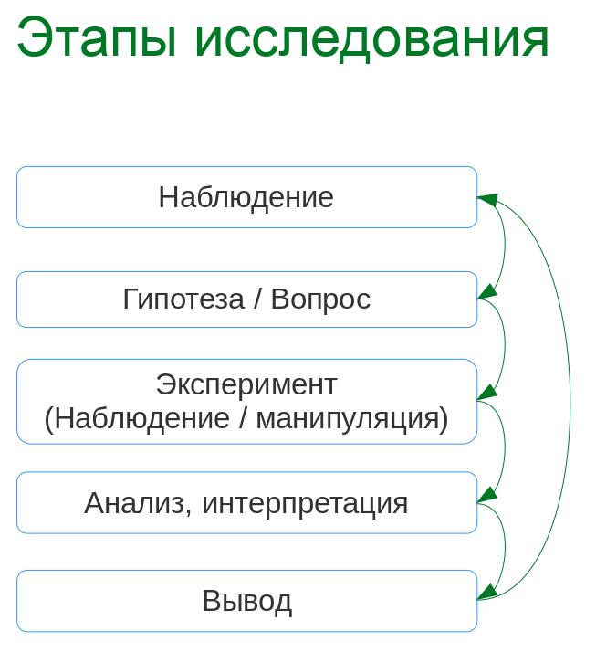
???

Многие исследования начинаются с наблюдения, с какой-то первичной информации. Если нет никаких первичных наблюдений, то не о чем формулировать гипотезу.
Далее, формулируем гипотезу (или вопрос, который потом иногда можно переработать в гипотезу, или набор гипотез).
Потом проводим исследование(описательное или экспериментальное), которое поможет нам ответить на вопрос исследования
Наконец, следует анализ данных и выводы. 
От того, как устроен эксперимент, зависит вся цепочка, и особенно успешность ее последних этапов.

---

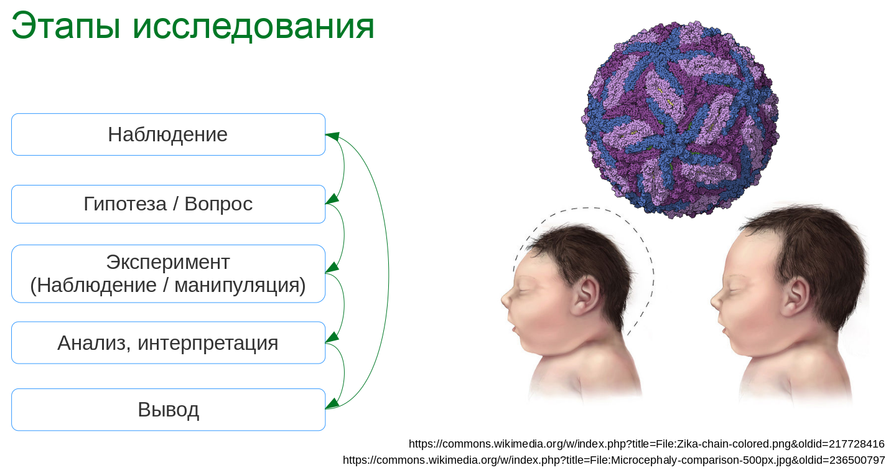

???

Допустим, нас интересует ZIKA вирус, особенно его бразильская разновидность. Это вирус из сем.Flaviviridae, переносится комарами Aedes. Симптомы заболевания: сыпь, утомление, лихорадка, головные боли и боли в суставах. Вирус описан в 1947 году, выделен из макак-резусов в лесу Зика в Уганде, появился в 20е в Африке и распространился. 
Говорят, что этот вирус может вызывать микроцефалию у плода, но мы на минуту допустим в этой учебной задаче, что еще никто этого не проверял.

Мы привыкли думать об экспериментах исключительно как о манипуляциях. Но бывают еще и коррелятивные исследования (либо когда нет возможности манипулировать, либо когда хочется, чтобы результат был непосредственно переносим на реальность).

__Предложите два варианта исследований (описательное и манипулятивное), чтобы ответить на вопрос, вызывает ли вирус ZIKA микроцефалию у плода.__

---

## Типы исследований

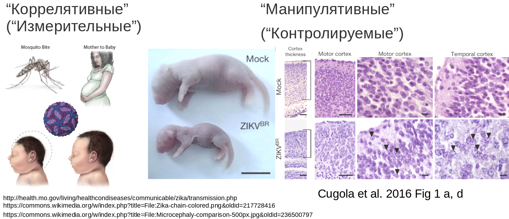

???

__Пример «коррелятивного» подхода.__  
__Собираем «полевые данные»__, информацию о беременных женщинах с диагностированным и не диагностированным вирусом зика, и смотрим __частоту развития микроцефалии у плода__.  
Такое исследование будет сложно провести, так как много факторов может влиять на развитие микроцефалии. Кроме того, легко не заметить женщин больных вирусом, но не диагностированных, и при этом со здоровыми детьми — они не обратятся к врачу сами.  
Вирус был обнаружен в плаценте и амниотической жидкости двух женщин, у плодов которых была диагностирована микроцефалия, а так же в крови, мозге и ретине новорожденных с микроцефалией.
Прямых данных о том что ZIKV^{BR} вызывает микроцефалию не было (в основном исследования африканского вируса, нет сильных эффектов, но сходство сиквенсов с бразильским вариантом лишь 87-90%, поэтому могут быть сомнения в переносимости результатов).

__Пример «манипулятивного» решения__  
На людях экспериментировать никто не даст, но можно взять мышей и посмотреть на __развитие их эмбрионов__.  
Эксперименты проведены на нескольких чистых линиях мышей.  
Эффект на мышах линии SJL (подвержены саркоме Ходжкина, миопатиям и проч.), общее замедление развития, похожие __морфологические изменения__ мозга. Вирус преодолел __плацентарный барьер__ (qPCR) __Изменения регуляции генов__ связанных с апоптозом и автофагией у SJL (qPCR array).  
Нет заметных изменений у мышей линии C57 (склонны к ожирению, диабету 2 типа, атеросклерозу, редко развиваются опухоли) и qPCR не показал наличия вируса, вирус не смог преодолеть плацентарный барьер.  
Кроме того, можно __вырастить культуры нервных клеток__, и посмотреть, что будет с ними. Когда они будут развиваться. Исследователи считали число вирусных частиц и умирающих клеток со временем, морфологические изменения. 

---

## Индивидуальная изменчивость

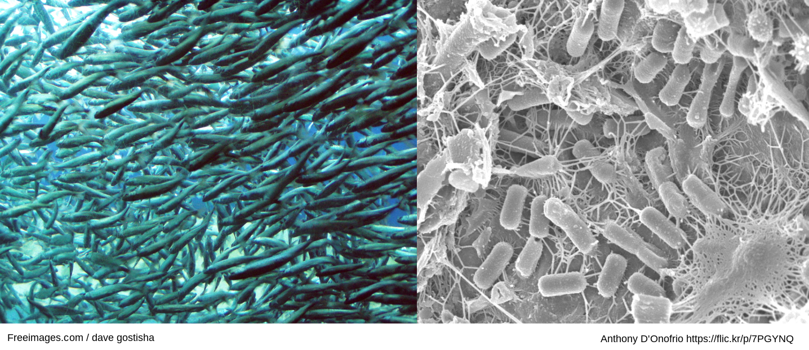
???

Мы интуитивно понимаем, что единичное наблюдение/измерение практически ничего не стоит в науке. 

Поскольку все живое изменчиво, нет двух одинаковых рыб или двух одинаковых бактерий. Все они будут реагировать по-разному на внешние условия.

Мы же заинтересованы в том, чтобы регистрировать повторяющиеся паттерны, воспроизводящиеся закономерности.

Индивидуальная изменчивость весьма затрудняет этот процесс. Не будь ее, можно было бы взять одну единственную рыбу или одну единственную бактерию и узнать все о них.

---

## Индивидуальная изменчивость

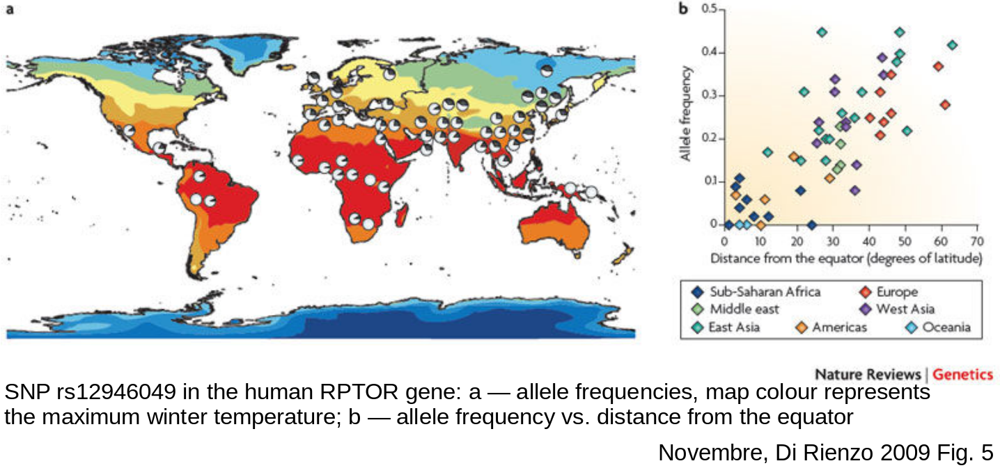
???

Индивидуальная изменчивость затрудняет исследования не только потому, что приходится использовать много объектов наблюдений, работать с выборками, а не единичными наблюдениями.

Другая сложность связана с тем, что эта индивидуальная изменчивость неравномерно распределена в пространстве или во времени. В результате мы рискуем описать закономерность характерную только для какой-то подгруппы изучаемых объектов.

На рисунке карта распростанения разных вариантов RPTOR (компонент сигнального пути регулирующего клеточный рост, выживание, автофагию), наложенная на карту температур. Виден широтный градиент изменения частот аллелей RPTOR от экватора на север. Этот градиент может объясняться действием отбора, связанного с температурой среды.

В контексте экспериментов важно, что все объекты разнородны, и с этой разнородностью надо что-то делать — элиминировать, учитывать или делать на нее поправки. Иначе __наличие скрытых факторов, структурирующих изменчивость__, может сыграть с вами злую шутку, если в вашем эксперименте их действие совпадет с вашим опытом/контролем. Например, если вы будете изучать влияние чего-то на экспрессию RPTOR, и опыт будет проводиться в северной Европе, а в качестве контроля будет использоваться экваториальная Южная Америка.

---

## Генеральная совокупность и выборка

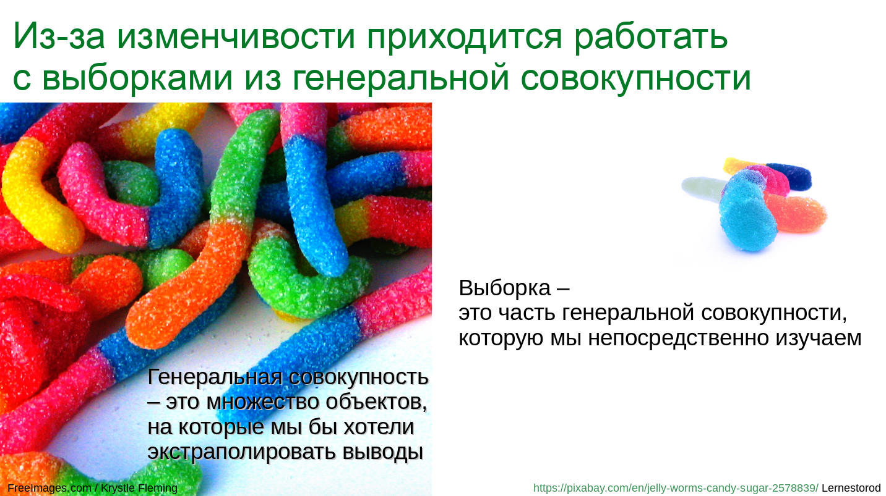


---

## Генеральная совокупность и выборка

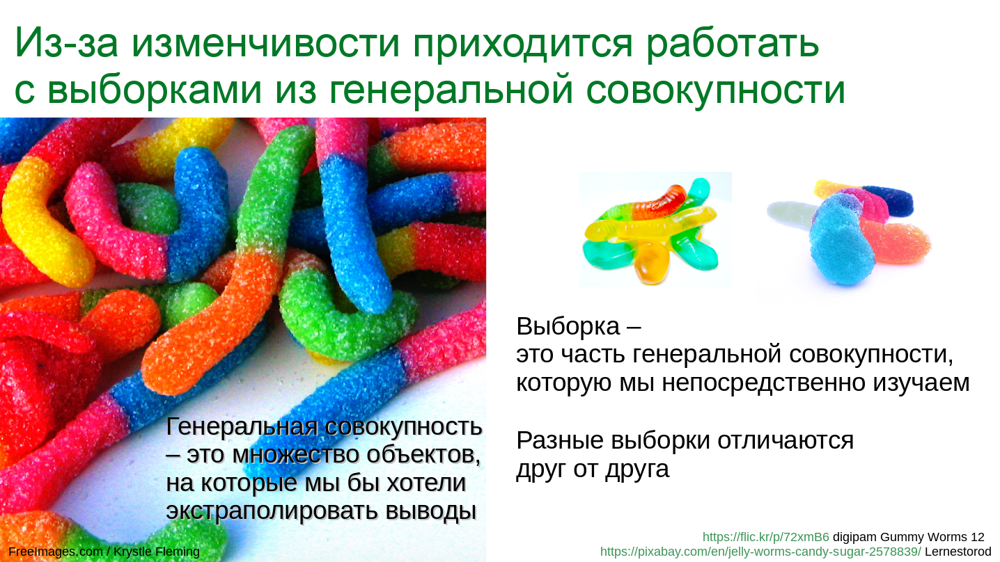
???

Если мы сделаем повторную выборку, она будет отличаться от первой. И каждая следующая будет тоже отличаться.

Тем не менее, по свойствам выборки можно с определенной долей уверенности понять, что происходит в генеральной совокупности.

---

## Статистика

изучает методы описания и измерения чего-либо с использованием выборок

<!-- 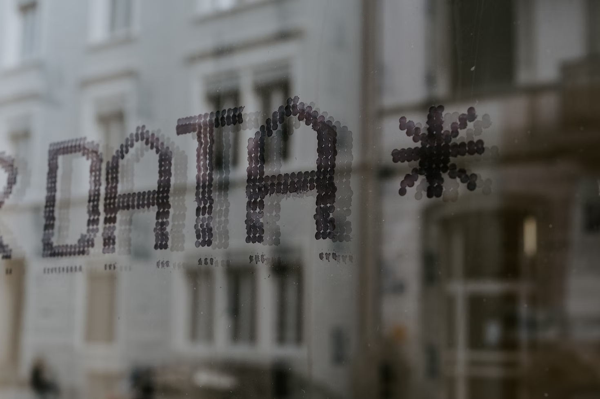 -->

<!-- .tiny[Claudio Schwarz at Unsplash.com] -->


???

Статистика изучает методы превращения живых существ в сухие цифры. Статистика занимается поиском закономерностей, описанием и измерением свойств чего-либо с использованием выборок.
При этом выводы, которые она позволяет делать, описывают происходящее в генеральной совокупности.

Методы статистики длятся на несколько категорий:
- базовая, описательная статистика (basic, descriptive statistics)
- оценивание (estimation)
- тестирование гипотез (inferential statistics, hypothesis testing)

---

background-image: url("img/statistics-estimation-question-doubt-problem-3385451-pixabay.png")
background-position: center
background-size: cover

## Оценивание

оценка значений свойств генеральной совокупности   
по данным выборки

- доля бракованных деталей в партии
- размер раковины улитки и его изменчивость
- уровень экспрессии белка

---

## Параметры и статистики

.pull-left[

__Параметры__ (_parameters_) описывают генеральную совокупность.  
<br/>

Обозначаются греческими буквами:  

- $\mu$ — среднее, 
- $\sigma$ — стандартное отклонение

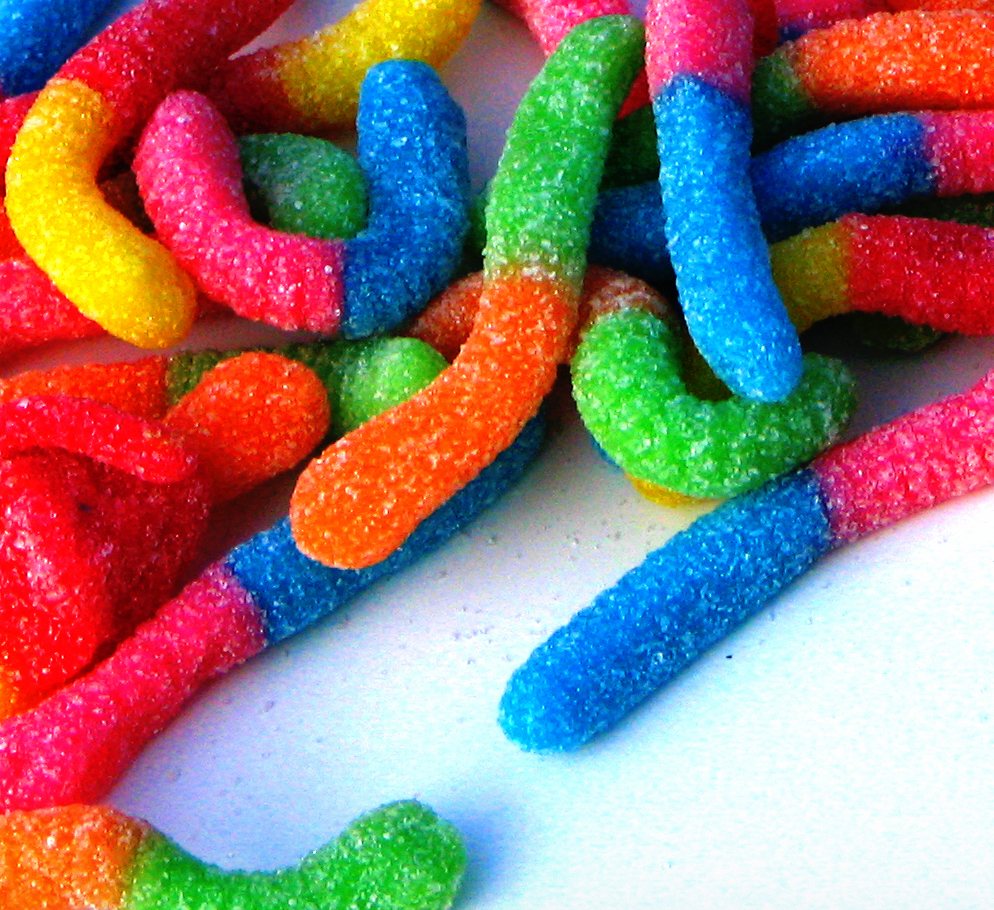
]

--

.pull-right[

__Статистики__ (_statistics_) описывают выборку и являются оценками параметров.

Обозначаются латинскими буквами:  

- $\bar x$ — среднее, 
- $s$ — стандартное отклонение

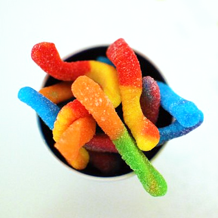
]

---

background-image: url("img/statistics-uncertainty-confused-hands-up-unsure-perplexed-2681507-pixabay-white.png")
background-position: center
background-size: cover

## Неопределенность оценок

Вследствие работы с выборками выборочные оценки параметров генеральной совокупности неточны. 

Есть статистические методы оценки этой степени неопределенности.

???

Поскольку в выборке представлены не все объекты, возникает некоторая неопределенность в оценках. Задача статистики описать эту неопределенность, и оценить, насколько оценки отступают от истинных значений.

---

## Исследование отношений между группами и между переменными

- Связь между размером самки мечехвоста и числом самцов, следующих за ней
- Энергетическая ценность икры в зависимости от возраста рыбы
- Скорость реакции у хорошо и плохо спавших людей

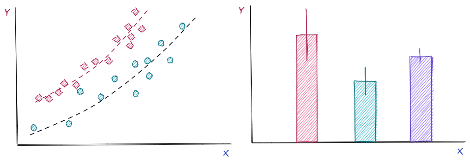

???

Поскольку свойства изучаемых объектов зависят от каких-то других свойств или внешних условий, сама эта зависимость может служить предметом исследования.

Опять же, мы оцениваем параметры, описывающие эту зависимость в генеральной совокупности, используя статистики, вычисленные по данным выборки.

Например...

---

background-image: url("img/statistics-hypothesis-testing-white.png")
background-position: center
background-size: cover

## Тестирование гипотез

Статистическая гипотеза — это какое-либо утверждение о значении параметра в генеральной совокупности

- От размера самок мечехвостов __зависит__ число самцов, следующих за ними.
- Энергетическая ценность икры __различается__ у молодых и старых рыб.
- Время реакции __более короткое__ у хорошо выспавшихся людей.

--

Выше — примеры альтернативных гипотез. Они сформулированы в виде положительных утверждений.

???

Когда мы уже оценили свойства по выборке, можем проверить свои гипотезы об их значениях или взаимосвязях.

---

## Гипотезы бывают нулевые и альтернативные

.pull-left[

Альтернативная гипотеа, $H_A$,  
утверждает наличие зависимости:

- От размера самок мечехвостов __зависит__ число самцов, следующих за ними.

- Энергетическая ценность икры __различается__ у молодых и старых рыб.

- Время реакции __более короткое__ у хорошо выспавшихся людей.

]
.pull-right[

Нулевая гипотеза, $H_0$,  
отрицает наличие зависимости:

- Число самцов, следующих за самками __не зависит__ от их размера.

- Энергетическая ценность икры __не различается__ у молодых и старых рыб.

- Хорошо выспавшиеся люди реагируют на стимул __не быстрее__, чем плохо выспавшиеся.

]

---

class: middle, center, inverse

# Выборочный метод

???

Давайте разберемся, как работает выборочный метод и что нужно сделать, чтобы он работал правильно.

---

## Почему у кошек девять жизней

.pull-left-45[

Число травм зависит от высоты падения:
чем выше этаж, тем больше травм (по данным ветклиник, Whitney, Mehloff, 1987).

__Что будет генеральной совокупностью, а что выборкой в этом исследовании?__

]
.pull-right-55[

]

.pull-down[
.tiny[Diamond, 1988]
]

---

## Почему у кошек девять жизней

.pull-left-45[

Число травм зависит от высоты падения:
чем выше этаж, тем больше травм (по данным ветклиник, Whitney, Mehloff, 1987).

__Что будет генеральной совокупностью, а что выборкой в этом исследовании?__

Исследователи хотели бы экстраполировать выводы на всех котов, выпадающих  из окон в г. Нью Йорк — это генеральная совокупность.

Выборка — коты, данные о которых доступны в ветклиниках.

]
.pull-right-55[

]

.pull-down[
.tiny[Diamond, 1988]
]

---

## Почему у кошек девять жизней

.pull-left-45[

Число травм зависит от высоты падения:
чем выше этаж, тем больше травм (по данным ветклиник, Whitney, Mehloff, 1987).

__Но почему после определенной высоты число травм снижается?__

]
.pull-right-55[

]

.pull-down[
.tiny[Diamond, 1988]
]

---

## Почему у кошек девять жизней

.pull-left-45[

Число травм зависит от высоты падения:
чем выше этаж, тем больше травм (по данным ветклиник, Whitney, Mehloff, 1987).

__Но почему после определенной высоты число травм снижается?__


Смещенная выборка:

Если шансы, что кота понесут в ветклинику сами зависят от высоты падения, то и зависимость числа повреждений от высоты будет искажена.

]
.pull-right-55[

]

.pull-down[
.tiny[Diamond, 1988]
]

---

## Что такое "хорошая выборка"?

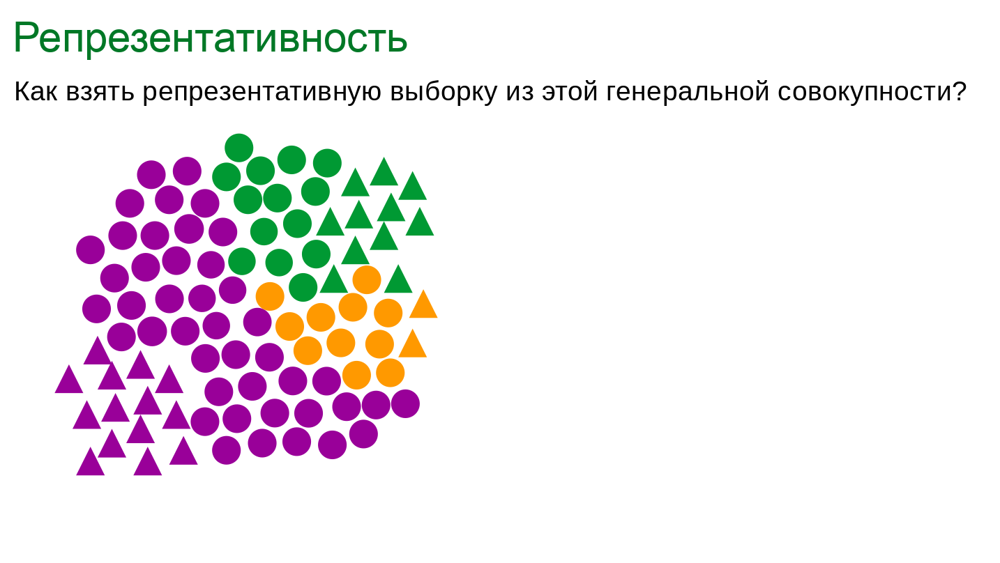

---

## Что такое "хорошая выборка"?


---

## Что такое "хорошая выборка"?

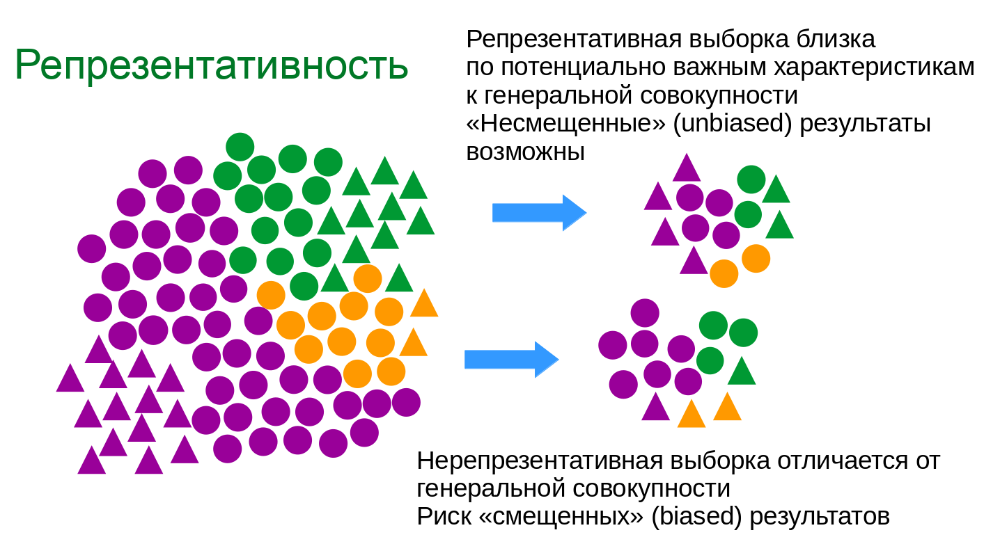

---

## Что такое "хорошая выборка"?

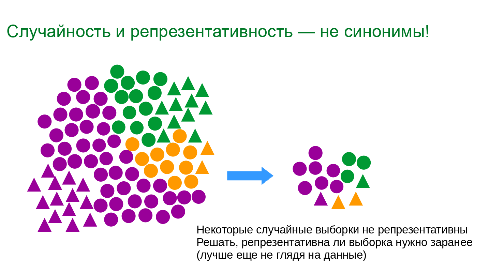

---

## Точность = правильность + воспроизводимость

- правильность (accuracy) — отсутствие погрешности (bias)
- воспроизводимость (precision) — маленький разброс значений

```{r opts.label='fig.wider.taller'}
library(ggforce)

n_reps <- 6
set.seed(9328)
dfr <- data.frame(
  x0 = rep(0, 6),
  y0 =  rep(0, 6),
  r = seq(1, 0.1, length.out = 6),
  fl = rep(1:2, 3)
)
dart <- ggplot() + geom_circle(data = dfr, aes(x0 = x0, y0 = y0, r = r, fill = fl)) +
  scale_fill_gradient(low = "#99aae1", high = "#dadbf7", guide = "none") +
  coord_equal() + theme_void() + theme(plot.title = element_text(hjust = 0.5))

HvLb <- dart +
  annotate(geom = "point", size = 3, shape = 21, colour = "black", fill = "orange",
                x = rnorm(n_reps, 0, 0.25), y = rnorm(n_reps, 0, 0.25)) +
  labs(title = "Низкая воспроизводимость, \nмаленькая погрешность")

LvHb <- dart +
  annotate(geom = "point", size = 3, shape = 21, colour = "black", fill = "orange",
                x = rnorm(n_reps, 0, 0.1), y = rnorm(n_reps, 0, 0.1)) +
labs(title = "Высокая воспроизводимость, \nмаленькая погрешность")

HvHb <- dart +
  annotate(geom = "point", size = 3, shape = 21, colour = "black", fill = "orange",
                x = rnorm(n_reps, 0.4, 0.25), y = rnorm(n_reps, 0.3, 0.25)) +
labs(title = "Низкая воспроизводимость, \nбольшая погрешность")

LvLb <- dart +
  annotate(geom = "point", size = 3, shape = 21, colour = "black", fill = "orange",
                x = rnorm(n_reps, 0.4, 0.1), y = rnorm(n_reps, 0.3, 0.1)) +
  labs(title = "Высокая воспроизводимость, \nбольшая погрешность")

plot_grid(HvLb, HvHb, LvHb, LvLb, nrow = 2)
```

---

class: middle, center, inverse

# Случайная выборка

---

## Случайная выборка

Требование многих статистических методов.

Критерии:

- __Вероятность попадания в выборку должна быть одинакова__ для всех объектов генеральной совокупности.
- Выбор объектов должен быть независим, т.е. попадание одного объекта в выборку не должно влиять на попадание других. Т.е. __наблюдения должны быть независимы друг от друга__.

???

- нарушение случайности: отбор по размеру, отказ отвечать на вопросы, встречаемость на определенной удаленной территории.
- нарушение независимости: опрос всех жителей квартиры по поводу предпочтений.


---

## Повторности и псевдоповторности

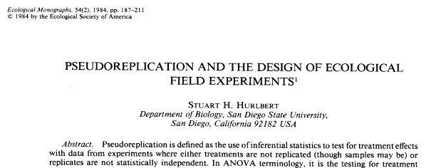

---

## Повторности и псевдоповторности

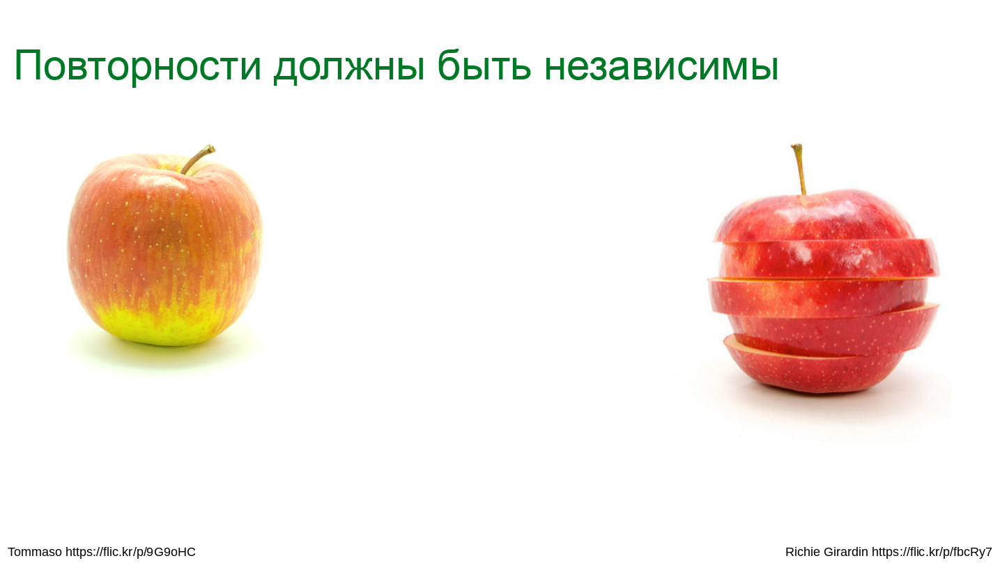

---

## Повторности и псевдоповторности

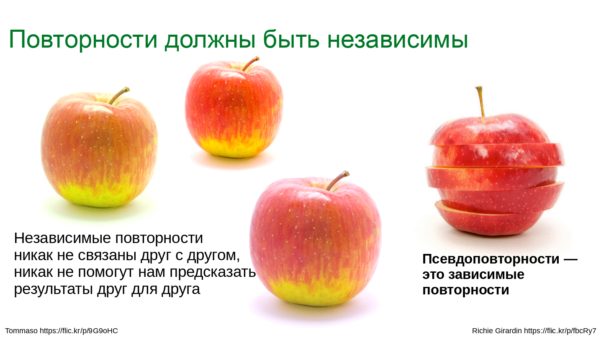

---

## Повторности и псевдоповторности

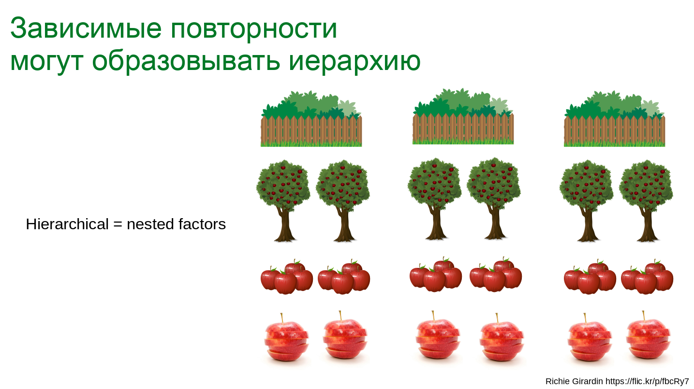

---

## Повторности и псевдоповторности

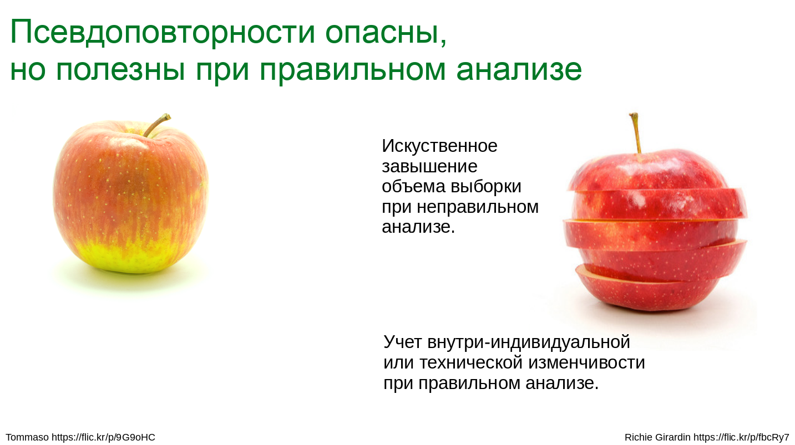

---

## Как взять случайную выборку?

Нет универсальной процедуры

.pull-left[

Если можно пронумеровать все объекты, можно выбрать, воспользовавшись генератором случайных чисел.
]
.pull-right[

Иногда проще выбрать случайные группы объектов (случайная выборка групп ≠ случайная выборка объектов).

]

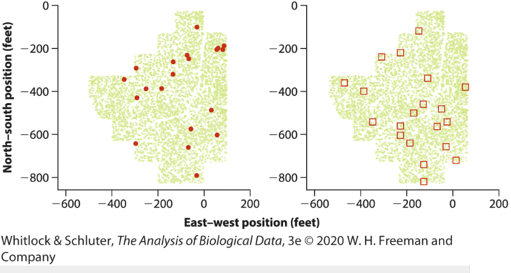

---

class: middle, center, inverse

# Проблемы при отборе выборок

---

## "Удобная выборка" (the sample of convenience)

Когда в выборку попадают только объекты, легко доступные исследователю.

Например, ближайшие, за которыми не нужно гоняться.


.tiny[Egor Myznik at unsplash.com]


---


.tiny[Leek et al. 2010 Fig.1 c, d]

Данные об экспрессии генов в мочевом пузыре у здоровых пациентов (из исследования рака мочевого пузыря Dyrskjot et al. 2004).

--

### Пакетный эффект (batch effect)

Если объекты расположены не случайно в пространстве и / или во времени, это порождает "пакетные эффекты" (batch effect).

???

Данные об экспрессии генов в мочевом пузыре у здоровых пациентов (из исследования рака мочевого пузыря Dyrskjot et al. 2004). Не смотря на нормализацию данных, все еще заметен батч-эффект. Цвет — дата анализа


---

## Погрешности выбора (selection bias)

- Cамоотбор (self-selection)
- Эффект волонтера (volunteer-effect)

.pull-down[

.tiny[publicdomainpictures.net / Karen Arnold]
]


---

background-image: url("img/placebo-effect-pawel-czerwinski-unsplash.png")
background-position: center
background-size: cover

## Плацебо эффект

ожидания человека заставляют его увериться в том, что есть эффект

.pull-down[.tiny[Alexander Grey at Usplash]]

--

- плацебо — положительный, 
- ноцебо — отрицательный.

---

## Эффект наблюдателя/экспериментатора (observer/experimenter effect)

- __Самосбывающееся пророчество__ (self-fulfilling prophecy) — подопытный ведет себя так, как подсознательно подсказывает ему экспериментатор.
- __Погрешность экспериментатора__ (experimenter bias) — экспериментатор регистрирует паттерн, который подсознательно желает увидеть.

.center[
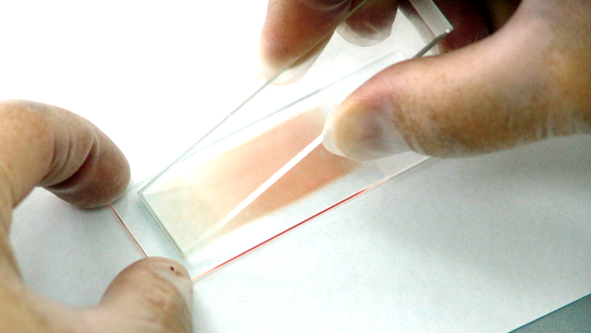
]

.tiny[Максим Кукушкин / publicdomainpictures.net]

???

Либо экспериментатор сам подсознательно подсказывает, как себя вести. Либо экспериментатор регистрирует паттерн, который подсознательно желает увидеть.

---

background-image: url("img/plan-arrow-hello-im-nick-unsplash.png")
background-position: center
background-size: cover

## Как бороться с проблемами при отборе проб?

.pull-right[

- Рандомизация
- Стратификация
- Слепые процедуры
- Двойные слепые процедуры
- Статистическое моделирование и коррекция батч-эффектов
- Стандартизация всех процедур
- Контроль экспериментального воздействия и технические контроли
]

.pull-down[
.tiny[Hello I'm Nick at Unsplash.com]
]

???

Другие проблемы
- ожидания экспериментатора и "запросы", вернее их понимание участниками (социология)
- искусственная среда не воспроизводит полностью реальность
- нестандартизованные процедуры (как инструментальные, так и обращение с экспериментальными объектами) - источники "шума" в данных


---

class: middle, center, inverse

# Типы данных и переменных

---

## Типы данных

Переменная (variable) — любое свойство или измерение.

Переменные могут относиться к разным типам данных.

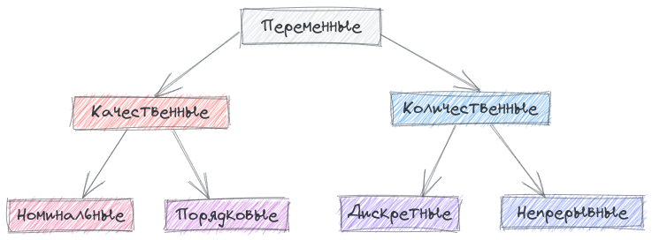

---

## Качественные / категориальные переменные

qualitative / categorical variables (иногда discrete, но см. след. слайд)

.center[
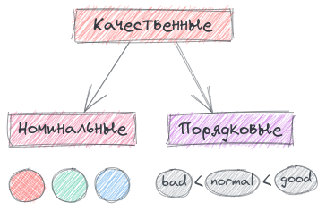
]

.pull-left[
.center[Номинальные  
(nominal)]
- цвет глаз (карие, зеленые, голубые)
- состояние (живой, мертвый)
]
.pull-right[
.center[Порядковые / ранговые  
(ordinal / rank)]
- рост (низкий, средний, высокий)
- состояние здоровья (плохое, удовлетворительное, хорошее, прекрасное)
- стадия жизненного цикла (яйцо, личинка, ювениль, взрослая особь)
]

---

## Количественные / числовые переменные

(quantitative / numerical variables)

.center[
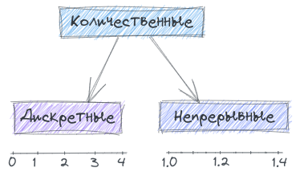
]

.pull-left[
.center[Дискретные  
(discrete)]
- состояние (1 - живой, 0 - мертвый)
- возраст (число полных лет)
- число щетинок на каком-то сегменте (шт.)
]

.pull-right[
.center[Непрерывные  
(continuous)]
- рост (см)
- возраст (например, число дней)
- цвет (длина волны)
]

Часто непрерывные данные округляются, так что становятся похожи на дискретные.

---

## Предикторы и отклики

При исследовании зависимостей принято делить переменные на предикторы и отклики в зависимости от их роли.

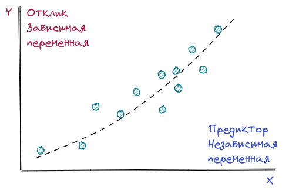

- Энергетическая ценность икры (отклик) в зависимости от возраста рыбы (предиктор)
- Длина ушей (отклик) поссумов из разных популяций (предиктор).

---

## Наличие связи между переменными <br/>не означает причинно-следственных отношений

> Correlation does not imply causation

--

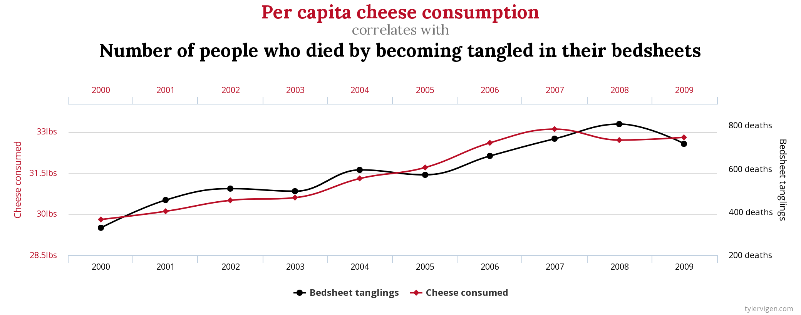
.tiny[https://www.tylervigen.com/spurious-correlations]

---

## Деление на предикторы и отклики условно


.tiny[https://xkcd.com/925]

--

Не всегда очевидно, что предиктор, а что отклик.  
В таких случаях требуется эксперимент.

---

class: middle, center, inverse

# Частоты и вероятности

```{r}
library("fishdata")
# Galaxis maculatus, 2015-2016, in the Wellington region of New Zealand
# data("adults")
# data("adult_metrics")
# ad <- adults %>% 
#   left_join(adult_metrics, 'fish_code')
# 
# gg_fisha <- ggplot(ad, aes(x = standard_length)) + labs(x = "Длина, см")
# gg_fisha + geom_histogram() + labs(y = "Количество рыб, шт.")
# gg_fisha + geom_density() + labs(y = "Плотность вероятности")
data("juveniles")
data("juvenile_metrics")
juv <- juveniles %>%
left_join(juvenile_metrics, 'fish_code') %>%
filter(month == "August")
```

---

## Вариационный ряд

Размеры мальков пятнистой галаксии (_Galaxis maculatus_), выловленных в августе 2015 г. в районе Веллингтона, Новая Зеландия. 


.pull-left[

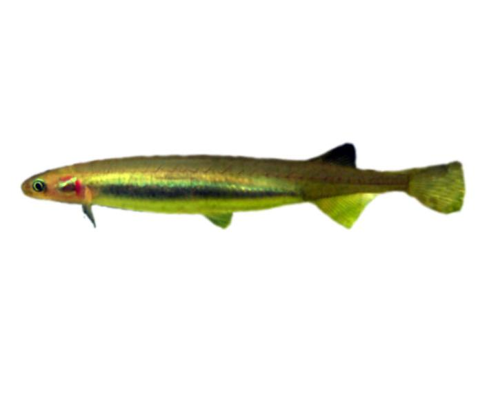

.tiny[Lycaon.cl, CC BY-SA 3.0, via Wikimedia Commons]

]

.pull-right[

`r round(head(juv$standard_length[1:5]), 1)`, ...

И т.д.

Всего `r length(juv$standard_length)` __наблюдения__ или `r length(juv$standard_length)` __варианты__.

.tiny[Данные из пакета `fishdata`]

]

---

## Частотное распределение

__Частоты__ наблюдений можно получить, подсчитав, сколько значений вариант попадает в каждый из равных интервалов.


.pull-left[


.tiny[Lycaon.cl, CC BY-SA 3.0, via Wikimedia Commons]

]

.pull-right[

```{r}
gg_fishj <- ggplot(juv, aes(x = standard_length)) + labs(x = "Длина, см")
gg_fishj + geom_histogram(fill = "darkolivegreen4", colour = "white") + labs(y = "Количество рыб, шт.")
```

.tiny[Данные из пакета `fishdata`]

]


---

## Распределение вероятностей

Распределение значений потенциально-возможных значений переменной называется __распределение вероятностей__.

Ниже — график распределения вероятностей _для выборки_ пятнистой галаксии. Это называется __эмпирическое распределение вероятностей__

.pull-left[


.tiny[Lycaon.cl, CC BY-SA 3.0, via Wikimedia Commons]

]

.pull-right[

```{r}
gg_fishj + geom_density(alpha = 0.25, fill = "darkolivegreen", colour = "darkolivegreen4") + labs(y = "Плотность вероятности")
```

.tiny[Данные из пакета `fishdata`]

]


---

## Теоретическое распределение вероятностей

Распределение вероятностей в генеральной совокупности практически никогда не известно.

__Теоретические распределения вероятностей__ можно использовать для описания реальных распределений.

.pull-left[


.tiny[Lycaon.cl, CC BY-SA 3.0, via Wikimedia Commons]

]

.pull-right[

```{r}
gg_fishj + 
  geom_density(alpha = 0.25, 
               fill = "darkolivegreen", 
               colour = "darkolivegreen4") + 
  labs(y = "Плотность вероятности") + 
  stat_function(fun = dnorm, 
                args = list(mean = mean(juv$standard_length), 
                            sd = sd(juv$standard_length)), 
                colour = 'orangered', size = 0.75)
```

.tiny[Данные из пакета `fishdata`]

]

Например, здесь можно использовать __нормальное распределение__.

---

## Примеры распределений вероятностей

Нормальное распределение, распределение Пуассона, отрицательное биномиальное распределение — за этими распределениями стоят конкретные явления.

t-, F-, $\chi^2$-распределения статистик, которые используются для тестирования гипотез


```{r opts.label='fig.wide.taller'}
t_size <- 16

gg_norm <-
  ggplot(data = data.frame(x = -5:5), aes(x = x))+
  stat_function(fun = dnorm, 
                args = list(mean = 0, sd = 1), 
                colour = 'red4', size = 0.75) +
  ggtitle("Нормальное р.") +
  annotate("text", x = Inf, y = Inf, hjust = 1.1, vjust = 1.2, 
           label = "N(mu == 0, sigma==1)", parse = TRUE) + 
  theme(title = element_text(size = t_size))

gg_pois <- data.frame(x = 0:20) %>% 
  mutate(y = dpois(x, 3)) %>% 
  ggplot(aes(x = x, y = y)) +
  geom_col(fill = 'red4', colour = "white") +
  ggtitle("Р. Пуассона") +
  annotate("text", x = Inf, y = Inf, hjust = 1.1, vjust = 1.2, 
           label = "Pois(lambda == 3)", parse = TRUE) + 
  theme(title = element_text(size = t_size))

gg_negbin <- data.frame(x = 0:20) %>% 
  mutate(y = dnbinom(x, size = 0.1, mu = 3)) %>% 
  ggplot(aes(x = x, y = y)) +
  geom_col(fill = 'red4', colour = "white")  +
  ggtitle("Отрицательное\nбиномиальное р.") +
  annotate("text", x = Inf, y = Inf, hjust = 1.1, vjust = 1.2, 
           label = "Negbin(mu == 3,~k == 0.1)", parse = TRUE) + 
  theme(title = element_text(size = t_size))

gg_t <- ggplot(data = data.frame(x = -5:5), aes(x = x))+
  stat_function(fun = dt, 
                args = list(df = 5), 
                colour = 'red4', size = 0.75)  +
  ggtitle("t-распределение") +
  annotate("text", x = Inf, y = Inf, hjust = 1.1, vjust = 1.2, 
           label = "t(df == 5)", parse = TRUE) + 
  theme(title = element_text(size = t_size))

gg_f <- ggplot(data = data.frame(x = 0:5), aes(x = x))+
  stat_function(fun = df, 
                args = list(df1 = 3, df2 = 7), 
                colour = 'red4', size = 0.75)  +
  ggtitle("F-распределение") +
  annotate("text", x = Inf, y = Inf, hjust = 1.1, vjust = 1.2, 
           label = "F(df[1] == 3,~df[2] == 7)", parse = TRUE) + 
  theme(title = element_text(size = t_size))

gg_chisq <- ggplot(data = data.frame(x = 0:20), aes(x = x))+
  stat_function(fun = dchisq, 
                args = list(df = 5), 
                colour = 'red4', size = 0.75)  +
  ggtitle(expression(chi^2~"-распределение")) +
  annotate("text", x = Inf, y = Inf, hjust = 1.1, vjust = 1.2, 
           label = "chi^2 ~ (df == 5)", parse = TRUE) + 
  theme(title = element_text(size = t_size))

plot_grid(gg_norm, gg_pois, gg_negbin, gg_t, gg_f, gg_chisq, 
          nrow = 2, axis = "tblr", align = "hv")
```


---

## Избегайте "кроличьих нор"

.pull-left[

Планируйте исследования, чтобы не потеряться во время анализа данных.

Исследовательский вопрос и гипотезы определяют выбор метода анализа.

]
.pull-right[

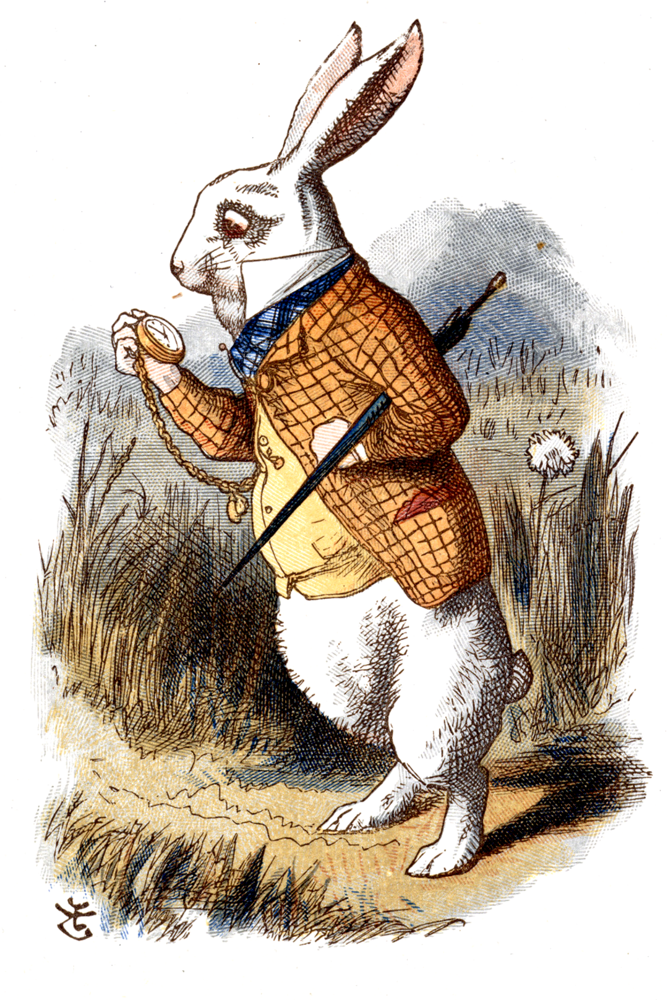

]

???


---


class: middle, center, inverse

# Summary

---

## Summary

### Статистика

- Статистика изучает методы описания и измерения параметров генеральной совокупности с использованием выборок. Статистика позволяет тестировать различные гипотезы об этих параметрах.

- Хорошая выборка должна позволять получить как можно менее смещенную и более воспроизводимую оценку параметра.

- Случайная выборка — это такая выборка, вероятность попасть в которую одинакова для всех объектов совокупности.

---

## Summary

### Работа с выборками

- Проблемы при сборе данных: 
  - "удобная" выборка
  - батч-эффект
  - погрешности выбора (самоотбор, эффект волонтера)
  - влияние экспериментатора
  - плацебо эффект
- Способы борьбы с проблемами: 
  - рандомизация
  - стратификация
  - слепые и двойные слепые процедуры
  - коррекция батч-эффектов
  - стандартизация воздействий
  - контроль

---

## Summary

### Данные на практике и в теории

- Типы данных и переменных
    - качественные
      - номинальные
      - порядковые
    - количественные
      - дискретные
      - непрерывные
- Зависимости между переменными: независимые переменные — предикторы, зависимые переменные — отклики.
- Частотные распределения описывают частоту встречи определенного значения в выборке. Теоретические распределения вероятности описывает вероятность встречи разных значений и могут использоваться для описания данных и тестирования гипотез.

- Тщательно планируйте сбор и анализ данных заранее, чтобы избежать проблем.

---

## Что почитать

- Нинбург, Е. А. (2006). Технология научного исследования. Методические рекомендации (Vol. 1). Всемирный фонд дикой природы (WWF) - Россия.
- Barnard, C. J., Gilbert, F. S., & MacGregor, P. K. (2007). Asking questions in biology: A guide to hypothesis testing, experimental design and presentation in practical work and research projects. Pearson Education.
- Glass, D. J. (2007). Experimental design for biologists. Cold Spring Harbor Laboratory Press.
- __Ruxton, G. D., & Colegrave, N. (2006). Experimental design for the life sciences. Oxford University Press Oxford.__
- Whitlock, M., & Schluter, D. (2015). The analysis of biological data (Second edition). Roberts and Company Publishers.
