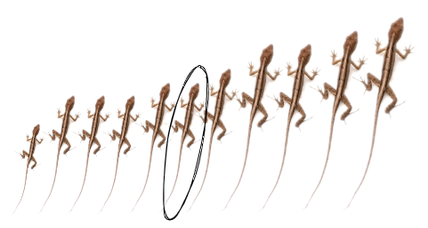

```{r setup, include = FALSE, cache = FALSE, purl = FALSE, fig.showtext = TRUE}
source("assets/setup.R")
```

```{r libs, include=FALSE, warning=FALSE}
library(tidyverse)
library(cowplot)
```

## Описательная статистика

- Описательная статистика: меры центральной тенденции и разброса
- Мода
- Медиана
- Разнообразие средних значений
- Связка среднее арифметическое и стандартное отклонение
- Медиана и межквартильное расстояние
- Коэффициент вариации
- Боксплоты
- Сопоставление свойств средней и медианы, стандартного отклонения и межквартильного расстояния
- Накопленные частоты и пропорции: квантили и перцентили, кумулята и огива, пропорции

---

class: middle, center, inverse

# Описательная статистика: <br/>меры центральной тенденции и разброса

---

## Пример: длина ящериц

```{r}
dat <- c(10, 4, 7, 8, 7, 6, 11, 6, 13, 6, 10)
```

Допустим, вы поймали несколько ящериц и измерили их длину (см).

.pull-left[


.tiny[<a href="https://commons.wikimedia.org/wiki/File:Viviparous_lizard_(Zootoca_vivipara)_in_the_Aamsveen,_The_Netherlands.jpg">Ocrdu</a>, <a href="https://creativecommons.org/licenses/by-sa/4.0">CC BY-SA 4.0</a>, via Wikimedia Commons]

]

.pull-right[


`r dat`

]

???

Представьте, что у нас есть такой датасет (пример). Было бы удобнее описать его парой чисел и не приводить все исходные данные. Кроме того, сжатое описание данных — это способ лучше в них разобраться.

TODO: найти пример, умещающийся на экран, наблюдений 7

---

## Ряд наблюдений можно изобразить <br/>на гистограмме

.pull-left[


`r dat`

]
.pull-right[

```{r gg-hist}
data.frame(`length` = dat) %>% 
  ggplot(aes(x = length)) +
  geom_histogram(binwidth = 1, colour = "white") +
  geom_rug(aes(x = length), size = 2, colour = "black", alpha = 0.5) +
  guides(colour = guide_legend(override.aes = list(size = 5))) +
  labs(colour = "", x = "Длина ящериц, см", y = "Частота") + 
  scale_x_continuous(breaks = 3:13)
```

]


--


Как можно кратко описать размеры ящериц,  
чтобы не приводить весь ряд?

---

## Описательная статистика

Описательная статистика служит для краткого количественного описания данных.

.pull-left[
- __Меры центральной тенденции__ <br/>(_measures of location_)
]
.pull-right[
- __Меры разброса__ <br/>(_measures of spread_)
]

---

## Меры центральной тенденции <br/>(_measures of location_)


Оценивают, где расположены данные

.pull-left-40[

- мода
- медиана
- среднее арифметическое, геометрическое и т.п.
]
.pull-right-60[


.tiny[by geojango_maps at Unsplash]
]


???

График из примера, отметить разные

---

## Меры разброса, показатели вариации, <br/>(_measures of spread_)

Описывают изменчивость, ширину распределения данных
.pull-left-40[
- размах, диапазон варьирования
- дисперсия
- стандартное отклонение
- коэффициент вариации
- квантили, перцентили
]
.pull-right-60[


.tiny[Картина "сеятель, разбрасывающий облигации государственного займа" из к.ф. "12 стульев"]

]


???

График из примера, отметить разные. Картина "сеятель, разбрасывающий облигации государственного займа".

---

## Традиционные связки статистик

Мера центральной тенденции обычно используется вместе с подходящей мерой разброса.

- медиана и квантили
- среднее и стандартное отклонение

???

Некоторые связки статистик традиционно используются вместе: мера центральной тенденции и подходящая для неё мера разброса. Например,…

Для моды нет традиционного компаньона.

Для начала мы разберемся с мерами центральной тенденции, а потом посмотрим на связки статистик центральной тенденции и разброса.

Максимально сжатое описание данных — это представить их в виде одного единственного числа, отображающего их самое характерное, "центральное" значение. Но что такое "характерное/типичное/центральное" будет зависеть от определения этих понятий. Разные описательные статистики будут высвечивать разные особенности данных. Т.е. чтобы выбрать правильную меру центральной тенденции, нужно представлять, что именно вы хотите показать.

---

class: middle, center, inverse
background-image: url("img/mode-umbrellas-unsplash.png")
background-position: center
background-size: cover

# Мода

.tiny[by smile_97 at Unsplash]

---

## Мода

__Мода__ — наиболее часто встречающееся значение в наборе данных.
<br/>

Данные `r sort(dat)`


---

## Мода

Мода — наиболее часто встречающееся значение в наборе данных.
<br/>

Данные `r sort(dat)`

Мода равна `r names(table(dat))[which.max(table(dat))]`

.pull-left[

```{r}
table(dat) %>% data.frame() %>% rename("значение" = dat, "частота" = Freq) %>% kable()
```

]

.pull-right[

```{r gg-measures-of-location}
data.frame(`length` = dat) %>% 
  ggplot(aes(x = length)) +
  geom_histogram(binwidth = 1, colour = "white") +
  geom_vline(aes(xintercept = as.numeric(names(table(dat))[which.max(table(dat))])), colour = "yellow2", size = 2) +
  geom_rug(aes(x = length), size = 2, colour = "black", alpha = 0.5) +
  guides(colour = guide_legend(override.aes = list(size = 5))) +
  labs(colour = "", x = "Длина ящериц, см", y = "Частота") + 
  scale_x_continuous(breaks = 3:13)
```

]


???

TODO: мода в данных из примера


---

## Мода часто используется для категориальных данных

```{r gg-mode-categorical, opts.label='fig.wide'}
data.frame(colour = c("Зеленый", "Оранжевый", "Пятнистый", "Полосатый"), count = c(2, 1, 5, 3)) %>% 
  ggplot(aes(x = colour, y = count)) +
  geom_col(aes(fill = colour), show.legend = F) +
  scale_fill_brewer(palette = "Dark2") +
  labs(fill = "", x = "Цвет ящериц", y = "Частота")
```


???

TODO: картинка с категориальными данными и частотой категорий.

Для категориальных данных бывает интересно узнать, какая категория встречается чаще всего. Например, здесь это …

---

## Мода может быть не одна

```{r gg-mode-two, opts.label='fig.wide'}
set.seed(42)
half <- round(rnorm(50, mean = 6, sd = 2), 1)
dat_bimod <- data.frame(length = c(half, half + 10)) 

dat_bimod %>% 
  ggplot(aes(x = length)) +
  geom_histogram(bins = 19, colour = "white") +
  geom_vline(aes(xintercept = 5.5), size = 2, colour = "yellow2") +
  geom_vline(aes(xintercept = 15.5), size = 2, colour = "yellow2") +
  guides(colour = guide_legend(override.aes = list(size = 5))) +
  labs(colour = "", x = "Значение", y = "Частота")
```


???

TODO: Картинка с бимодальным распределением, где две моды с равной частотой

Поскольку в данных может быть несколько частых значений, мода не очень удачна для описания центральной тенденции. Здесь на картинке две моды с одинаковой частотой. Какая из них лучше описывает данные?

## Может не быть моды вообще

```{r gg-mode-none, opts.label='fig.wide'}
set.seed(44)
dat_unif <- data.frame(length = round(rnorm(15, 170, 12), 1)) 

dat_unif %>% 
  ggplot(aes(x = length)) +
  geom_histogram(bins = 100, colour = "white") +
  labs(colour = "", x = "Значение", y = "Частота") + 
  coord_cartesian(ylim = c(0, 5))
```

???

Или представьте, что вы измеряете рост 15 человек с точностью до 1 мм. Как будет выглядеть распределение веса? Вы вряд ли получите совпадающие значения, значит никакой моды не будет (если не объединять наблюдения в группы).  (если больше людей, то будут повторы)

TODO: картинка с гистограммой веса с точностью до 100 г.

## Мода может быть не в центре распределения


```{r gg-mode-nb, opts.label='fig.wide'}
set.seed(42)
dat_nb <- data.frame(length = round(rnbinom(100, 5, 0.2) + 1, 1)) 
dat_nb$length[sample(1:100, 20)] <- 0

dat_nb %>% 
  ggplot(aes(x = length)) +
  geom_histogram(bins = 30, colour = "white") +
  geom_vline(aes(xintercept = 0, colour = "мода"), size = 1) +
  guides(colour = guide_legend(override.aes = list(size = 5))) +
  labs(colour = "", x = "Значение", y = "Частота")
```

???

В некоторых случаях мода не дает представления о положении центральной тенденции, т.к. может быть не в "центре" распределения, а "с краю".

TODO: картинка с zero inflated negative binomial с большим средним.

---

## Унимодальные и бимодальные распределения

— термины, позволяющие различать распределения с разным количеством вершин


```{r gg-mode-uni-bi, opts.label='fig.wide'}
set.seed(42)
dat_unimod <- data.frame(length = rnorm(500, mean = 4, sd = 0.7))
dat_bimod <- data.frame(length = c(rnorm(250, mean = 4, sd = 0.7), rnorm(250, mean = 8, sd = 1.2)))

gg_uni <- dat_unimod %>% 
  ggplot(aes(x = length)) +
  geom_histogram(colour = "white") +
  labs(colour = "", x = "Длина ящериц, см", y = "Частота")


gg_multi <- dat_bimod %>% 
  ggplot(aes(x = length)) +
  geom_histogram(colour = "white") +
  labs(colour = "", x = "Длина ящериц, см", y = "Частота") + 
  scale_x_continuous(breaks = 1:13)

plot_grid(gg_uni, gg_multi, nrow = 1)
```


???

TODO: картинка с унимодальным, бимодальным и полимодальным распределениями

Тем не менее, благодаря моде у нас появляются термины для распределений с разным количеством вершин.

---

class: middle, center, inverse
background-image: url("img/boats-median-unsplash.png")
background-position: center
background-size: cover

# Медиана

.tiny[by benharritt at Unsplash]

---

## Медиана

__Медиана__ — это число, которое делит пополам упорядоченный ряд наблюдений.

Чтобы ее найти, нужно отсортировать (ранжировать) наблюдения.


Данные `r sort(dat)`


???

TODO: Картинка: ранжированный ряд

---

## Медиана

Если нечетное число наблюдений, то его середина — это медиана.



Данные `r sort(dat)`, медиана `r median(dat)`

--

Если четное число наблюдений, то медиана находится между двумя центральными (их среднее арифметическое).


Данные `r c(sort(dat), 20)`, медиана `r median(c(dat, 20))`

???

---

## Медиана


```{r gg-median-hist}
data.frame(`length` = dat) %>% 
  ggplot(aes(x = length)) +
  geom_histogram(binwidth = 1, colour = "white") +
  geom_vline(aes(xintercept = median(dat)), size = 2, colour = "darkorange") +
  geom_rug(aes(x = length), size = 2, colour = "black", alpha = 0.5) +
  guides(colour = guide_legend(override.aes = list(size = 5))) +
  labs(colour = "", x = "Длина ящериц, см", y = "Частота") + 
  scale_x_continuous(breaks = 3:13)
```

Данные `r sort(dat)`, медиана `r median(dat)`

---

class: center, inverse
background-image: url("img/means-coffee-unsplash.png")
background-position: center
background-size: cover

# Разнообразие средних значений

.tiny[by pritesh557 at Unsplash]

---

## Среднее арифметическое

Обычно под термином __среднее значение__ мы подразумеваем __среднее арифметическое__.

$$\bar{x}=\frac{x_{1}+x_{2}+\cdots+x_{n}}{n}=\frac{\sum x}{n}$$

Среднее в выборке обозначается $\bar{x}$, а в генеральной совокупности μ


???

Хорошо работает если значения складываются (т.е. сумма величин имеет свой смысл), интуитивно понятно.

Не работает, если большой разброс значений в ряду.

---

## Другие средние

$$\Bigl(\frac{x_{1}^p+x_{2}^p+\cdots+x_{n}^p}{n}\Bigr)^{\frac{1}{p}}$$

Все зависит от того, чему равно $p$

- $p = 1$ — среднее арифметическое
- $p = 2$ — среднее квадратическое
- $p = 3$ — среднее кубическое
- $p = -1$ — среднее гармоническое
- $p \rightarrow 0$ — среднее геометрическое

---

## Среднее квадратическое

$$\left(\frac{{x}_{1}^{2}+{x}_{2}^{2}+\ldots+{x}_{n}^{2}}{{n}}\right)^{\frac{1}{2}}=\sqrt{\frac{{x}_{1}^{2}+{x}_{2}^{2}+\ldots+{x}_{n}^{2}}{n}}$$
.pull-left[

Можно использовать для двумерных признаков (для площадей)

- средняя площадь квадрата, вычисленная по сторонам квадратов


Дисперсия — мера разброса — так же определяется как среднеквадратичное отклонение от среднего значения в ряду.

]
.pull-right[


.tiny[by vtoesca at Unsplash]
]


--


???

Например, представьте, что вы берете пробы квадратными рамками со стороной 10, 15 и 20 см. И вы хотите изменить методику и использовать усредненную рамку. Чему равна средняя сторона рамки? Нет, не 15 см (средняя арифметическая), потому что тогда можно было бы подумать, что общая площадь рамок была бы 3 * 15^2 = 675 см^2 (а на самом деле $10^2 + 15^2 + 20^2 = 725 см^2$). Если использовать среднее квадратическое, то будет более правильно: $\sqrt{\frac{10^2 + 15^2 + 20^2} {3}}= 15.54см$ $3 * 15.54^2 = 724.47 см^2$

---

## Среднее кубическое

$$\left(\frac{{x}_{1}^{3}+{x}_{2}^{3}+\ldots+{x}_{n}^{3}}{{n}}\right)^{\frac{1}{3}}=\sqrt[3]{\frac{{x}_{1}^{3}+{x}_{2}^{3}+\ldots+{x}_{n}^{3}}{n}}$$

.pull-left[

Используется для объемных признаков:

- средний объем клеток листа по их диаметрам

]
.pull-right[


.tiny[[pxhere](https://pxhere.com/en/photo/1068793)]

]

---

## Среднее гармоническое

$$\left(\frac{x_{1}^{-1}+x_{2}^{-1}+\ldots+x_{n}^{-1}}{n}\right)^{-1}=\frac{n}{\frac{1}{x_{1}}+\frac{1}{x_{2}}+\ldots+\frac{1}{x_{n}}}$$
.pull-left[

Используется, если величины представлены отношениями в расчете на какую-то единицу.

- средняя скорость, когда известны скорости в расчете на один круг (одно расстояние)
- средняя цена, когда известны количества товара, купленные на одну и ту же сумму

]

.pull-right[


.tiny[by felixberger at Unsplash]

]


???

(= среднее субпротиворечивое(?)).

Усредняются значения величин в расчете на единицу. Например, скорости измеряют в расчете на единицу времени, например на 1 час. Тогда если известны скорости, с которой улитка преодолела определенное расстояние на разных типах поверхности (12 м/ч и 11 м/ч), то средняя скорость будет рассчитываться как средняя гармоническая (= 2 / (1/12 + 1/11) = 11.48 м/ч). Можно сказать, что среднее гармоническое __используется, когда один и тот же объем работы выполняется с разной производительностью__.

- средняя цена акций, купленных на фиксированную сумму в разные даты покупки (5 а за 1000 и 7 а за 1000).

- средняя скорость по дороге на работу/домой

- студент может читать учебник (30 стр./ час) и конспектировать его (10 стр./час). Сколько в среднем страниц он может обработать в час? = 2 / (1/30+1/10) = 15 стр. Поскольку студент будет делать и то и другое и нас интересует его средняя производительность, делим на 2 и получится 7.5 стр. Проверяем: студент потратит на чтение 7.5 страниц 7.5 / 30 = 0.25 часа, а на конспектирование 7.5 / 10 = 0.75 часа. И всего потратит 0.25 + 0.75 = 1 час. Если студент будет и читать, и конспектировать, то на обработку 7.5 страниц потребуется 1 час.

- 

---

## Среднее геометрическое

= среднее пропорциональное

$$\sqrt[n]{x_{1} \cdot x_{2} \cdot \ldots \cdot x_{n}}$$
.pull-left[

Используется если между величинами мультипликативные отношения (т.е. показывают, во сколько раз что-то изменилось) для вычисления средней скорости изменения.
- средняя скорость роста численности популяции на определенном отрезке, если известно, во сколько раз она изменилась за каждый период
- средние темпы инфляции, если известна инфляция за период

]
.pull-right[


.tiny[World Population Growth. Our World in Data; Author: Max Roser, <br/>[CC BY-SA 4.0](https://creativecommons.org/licenses/by-sa/4.0), via Wikimedia Commons]

]


???

Если величины измеряют во сколько раз что-то изменилось, т.е. между ними мультипликативные отношения.

Численность рысей увеличилась в 1.5 раза, а потом еще в 1.2 раза. Т.е. всего в 1.8 раз за два года. Среднее арифметическое не подходит, т.к. получится 1.35 раза в год и за два года 1.35 * 1.35 = 1.825. Средняя геометрическая = 1.34 раза и за два года 1.34 * 1.34 = 1.79, что гораздо ближе к истинному значению.

- скидки в %, средняя скидка
- площади, есть участок можно вычислить сторону квадрата такой же площади, но зачем?
- темпы инфляции в % за период, средняя инфляция
- средняя доходность, если известна доходность в % за каждый период

---

class: middle, center, inverse

# Связка среднее арифметическое и стандартное отклонение

???

Статистики для описания выборок всегда ходят парами. Меры центральной тенденции всегда используются вместе с мерами разброса. Сейчас мы рассмотрим одну такую связку, пожалуй, самую популярную.

TODO: фото с парой объектов или со связкой

---

## Среднее значение

$$\bar{x}=\frac{\sum{x_i}}{n}$$

```{r gg-mean-hist}
data.frame(`length` = dat) %>% 
  ggplot(aes(x = length)) +
  geom_histogram(binwidth = 1, colour = "white") +
  geom_vline(aes(xintercept = mean(dat)), colour = "red", size = 2) +
  geom_rug(aes(x = length), size = 2, colour = "black", alpha = 0.5) +
  guides(colour = guide_legend(override.aes = list(size = 5))) +
  labs(colour = "", x = "Длина ящериц, см", y = "Частота") + 
  scale_x_continuous(breaks = 3:13)
```

Данные `r sort(dat)`, среднее значение $\bar{x}=`r mean(dat)`$

--

### Как оценить разброс значений вокруг среднего?

???

Вернемся к среднему значению…

Как оценить разброс значений вокруг среднего?

TODO: добавить картинки с данными из примера.

---

## Подойдет ли девиата для оценки разброса?

__Девиата__ (отклонение) — это разность между значением вариаты (измерения) и средним:

$$x_i - \bar{x}$$

```{r gg-deviates, opts.label='fig.wide'}
dfr <- data.frame(dat, ind = seq(1,length(dat),1))

pl_dat1 <- ggplot(dfr, aes(x = ind, y = dat)) + 
  geom_hline(yintercept = mean(dat), size = 2,  color = "red") +
  geom_segment(aes(x = ind, y = dat, xend = ind, yend = mean(dat))) +
  geom_point(size = 3) + 
  scale_x_continuous(breaks = 1:11) +
  labs(x = "Порядковый номер\nнаблюдения\n(индекс)", y = "Длина ящерицы")
pl_dat1 + coord_flip()
```

Данные `r dat`, среднее значение $\bar{x}= `r mean(dat)`$

Девиаты `r dat - mean(dat)`

---

## Девиаты не годятся как мера разброса

Нельзя так просто сложить все значения девиат и поделить их на объем выборки.

__Сумма девиат всегда будет равна нулю__.

--

.pull-left-45[

$$\begin{aligned} 
\sum{(x_i - \bar{x})} &= \sum x_i - \sum \bar x = \\ 
&= \sum x_i - n \bar x = \\ 
&= \sum x_i - n \cfrac{\sum x_i}{n} = 0 
\end{aligned}$$

]

--

.pull-right-55[

Девиаты `r dat - mean(dat)`

Сумма девиат `r round(sum(dat - mean(dat)), 2)`

]


???

Мем из властелина колец про нельзя так просто

---

## Сумма квадратов (SS, Sum of Squares)

Чтобы избавиться от знака, возведем девиаты в квадрат

__Сумма квадратов отклонений__:

$$SS = \sum{{(x_i - \bar{x})}^2} \ne 0$$

```{r gg-deviates, opts.label='fig.wide'}
```

Девиаты `r dat - mean(dat)`

--

Сумма квадратов отклонений (девиат) $SS = `r sum((dat - mean(dat))^2)`$

--

Но на что разделить $SS$, чтобы получить __усредненное__ отклонение от $\bar{x}$?

---

## Как усреднить отклонения от среднего значения?

Мы не можем делить на $n$, поскольку __в выборке__ отклонения от среднего $x_i - \bar x$ не будут независимы:

Что это значит? Сумма отклонений всегда равна нулю $\sum{(x_i - \bar{x})} = 0$.  

Поэтому, если мы знаем $\bar x$ и $n - 1$ отклонений, то всегда сможем точно вычислить последнее отклонение.

<br />

$n - 1$ — это число независимых значений (__число степеней свободы__, __degrees of freedom__).

---

## Дисперсия (MS, Mean Square, Variance)

Если мы поделим сумму квадратов на объем выборки минус 1, то получим дисперсию для этой выборки.

$$s^2=\frac{\sum{(x_i - \bar{x})^2}}{n - 1}= \frac{SS}{n - 1}$$

__Дисперсия__ (средний квадрат отклонений) — характеристика разброса.  

- $s^2$ — дисперсия в выборке 
- $\sigma^2$ — дисперсия в генеральной совокупности

<br/>

В нашем примере дисперсия $s^2 = \frac{`r sum((dat - mean(dat))^2)`}{11 - 1} = `r round(var(dat), 2)`$

<br/>

Дисперсию нельзя изобразить на графике, т.к. там используются не отклонения, а их квадраты.

---

## Среднеквадратичное/стандартное отклонение = Standard Deviation

Квадратный корень из дисперсии позволит вернуться к исходным единицам измерения.

$$s = \sqrt{s^2} = \sqrt{\frac{\sum{(x_i - \bar{x})^2}}{n - 1}} = SD$$
__Стандартное (среднеквадратичное) отклонение__ — характеристика разброса (усредненное отклонение от среднего).

- $s$ — стандартное отклонение в выборке
- $\sigma$ — стандартное отклонение в генеральной совокупности

<br/>

Стандартное отклонение $s =  \sqrt{\frac{`r sum((dat - mean(dat))^2)`}{11 - 1}} =  \sqrt{ `r round(var(dat), 2)` } = `r round(sd(dat), 2)`$

Стандартное отклонение — это средняя величина отклонения, и ее уже можно изобразить на графике.


---

## Среднее и стандартное отклонение на графиках

.pull-left[

Для наглядности посмотрим на них на гистограмме.

```{r gg-mean-sd-hist}
data.frame(`length` = dat) %>% 
  ggplot(aes(x = length)) +
  geom_histogram(binwidth = 1, colour = "white") +
  geom_vline(aes(xintercept = mean(dat)), colour = "red", size = 2) +
  geom_errorbarh(aes(xmin = mean(dat) - sd(dat), xmax = mean(dat) + sd(dat), y = 0), colour = "coral1", height = 0, size = 2) +
  geom_rug(aes(x = length), size = 2, colour = "black", alpha = 0.5) +
  guides(colour = guide_legend(override.aes = list(size = 6))) +
  labs(colour = "", x = "Длина ящериц, см", y = "Частота") +
  theme(legend.position = "bottom") + 
  scale_x_continuous(breaks = 3:13)
```

]

--

.pull-right[

Но чаще их изображают в виде точки с усами.

```{r gg-mean-sd}
ggplot(data = dfr) + 
  stat_summary(geom = 'pointrange', fun.data = mean_sdl, 
               fun.args = list(mult = 1),
               aes(x = 'Выборка 1', y = dat)) +
  coord_cartesian(ylim = c(0, 12)) +
  labs(y = "Длина ящериц", x = "")
```

]

--

__Внимательно читайте подписи__ к графикам, т.к. усы могут означать:

- 1 или 2 стандартных отклонения (SD)
- стандартную ошибку среднего (SE, см. далее)
- доверительный интервал к среднему значению
- диапазон значений (минимум, максимум)

???

При вычислении не округляют промежуточные результаты. Конечный результат описательных статистик часто округляют, оставляя на один разряд больше, чем исходные величины [@whitlock2015AnalysisBiologicalData, p.70].

---

## Коэффициент вариации

__Коэффициент вариации__ — это стандартное отклонение, выраженное в процентах относительно среднего значения признака.

$$CV=\frac{s}{\bar{x}} \times 100 \%$$

Чем больше коэффициент вариации, тем сильнее выражена изменчивость признака.

--

.pull-left[


$\bar x = 7$ см, $s = 5$ см

$CV = 71.43 \%$ 

]

--

.pull-right[


$\bar x = 8$ м, $s = 1$ м

$CV = 12.5 \%$

]


???

= относительное стандартное отклонение

Земляные червяки, среднее 7 см, стандартное отклонение 5 см. Удавы, среднее 8 м, стандартное отклонение 96 см. Кто из них имеет более изменчивый размер тела? Величина стандартного отклонения здесь сама по себе не поможет. Нам нужно использовать какую-то относительную шкалу изменений, которая бы учитывала величину самого признака. Пусть средний размер земляных червяков 7 см, тогда стандартное отклонение 5 см — это очень много. CV 71,43 %. В то же время, при среднем размере удавов 8 м, тогда стандартное отклонение 96 см — это очень мало. CV = 12%

CV используется только для признаков со значениями больше нуля.

Коэффициент вариации используется для сравнения изменчивости признаков, выраженных в разных шкалах.

Приведенная выше формула — это смещенная оценка. Несмещенная для нормально-распределенных данных ${\widehat{c_{\mathrm{v}}}}^{*}=\left(1+\frac{1}{4 n}\right) \widehat{c_{\mathrm{V}}}$

---

class: middle, center, inverse

# Связка медиана и межквартильное расстояние

TODO: фото с парой объектов или со связкой

---

## Медиана

Медиана — это число, которое делит пополам упорядоченный ряд наблюдений.

Справа и слева от медианы находятся по 50% наблюдений.

<br/><br/><br/><br/><br/>

.pull-left[

```{r gg-median-hist1}
gg_median_hist <- data.frame(`length` = dat) %>% 
  ggplot(aes(x = length)) +
  geom_histogram(binwidth = 1, colour = "white") +
  geom_vline(aes(xintercept = median(dat)), size = 2, colour = "darkorange") +
  geom_rug(aes(x = length), size = 2, colour = "black", alpha = 0.5) +
  guides(colour = guide_legend(override.aes = list(size = 5))) +
  labs(colour = "", x = "Длина ящериц, см", y = "Частота") + 
  scale_x_continuous(breaks = 3:13)
gg_median_hist
```

]
.pull-right[

Данные `r sort(dat)`, медиана `r median(dat)`

]

---

## Квартили


Квартили делят распределение на __четыре__ равные части, каждая из которых включает по 25% значений.

- I квартиль отсекает первые 25%.  
- II квартиль (медиана) — 50%.   
- III квартиль отсекает 75% значений.  

<br/>

.pull-left[

```{r gg-median-hist-qq}
qq <- quantile(x = dat, probs = c(0.25, 0.5, 0.75))
gg_median_hist_qq <- gg_median_hist +
    geom_vline(aes(xintercept = qq[1]), size = 1, colour = "darkorange") +
    geom_vline(aes(xintercept = qq[3]), size = 1, colour = "darkorange")
gg_median_hist_qq
```

]
.pull-right[

Данные `r sort(dat)`, медиана `r median(dat)`

Квартили:

```{r}
quantile(x = dat, probs = c(0.25, 0.5, 0.75))
```

]


---

## 5-number summary

__5-number summary__ — минимум, квартили, максимум — удобное краткое описание данных.

<br/><br/><br/><br/><br/>

.pull-left[

```{r gg-median-hist-5num}
rr <- range(dat)
gg_median_hist_5num <- gg_median_hist_qq +
    geom_vline(aes(xintercept = rr[1]), size = 1, colour = "darkorange", linetype = 2) +
    geom_vline(aes(xintercept = rr[2]), size = 1, colour = "darkorange", linetype = 2)
gg_median_hist_5num
```
]
.pull-right[

Данные `r sort(dat)`, медиана `r median(dat)`

5-number summary:

```{r}
quantile(dat)
```

]

---

## Боксплот: 5-number summary на графике

.pull-left[

5-number summary:

```{r boxplot1, opts.label='fig.medium.tall'}
quantile(dat)
ggplot(data = dfr) + 
  geom_boxplot(aes(x = 'Выборка 1', y = dat), width = 0.25, fill = "steelblue") +
  labs(x = "", y = "Длина ящериц") +
  scale_y_continuous(breaks = 1:13) +
  coord_cartesian(ylim = c(0, 13))
```

]

.pull-right[


По оси Y отложены характеристики выборки:

- жирная линия — медиана,
- нижняя и верхняя границы "коробки" — это I и III квантили,
- усы — минимум и максимум.

__Интерквартильное расстояние__ — расстояние между I и III квартилями (высота "коробки")

Если в выборке есть выбросы (значения, отстоящие от границ "коробки" больше чем на 1.5 интерквартильных расстояния), то они будут изображены отдельными точками. 

]

???

TODO: Whitlock and Schluter 2015, p.86, ex.4

---

class: middle, center, inverse

# Сопоставляем свойства 
## среднего и медианы, 
## стандартного отклонения и межквартильного расстояния

---

## Медиана и среднее

Медиана отделяет 50% данных.


<br/>

Среднее "уравновешивает" данные.


---

## Среднее плохо работает для асимметричных распределений


---

## Среднее неустойчиво к выбросам

__Выбросы__ (outliers) — наблюдения сильно отличающиеся от большинства 


--

Стандартное отклонение еще более неустойчиво, т.к. расчитывается исходя из __квадратов__ отклонений.


???

TODO: Whitlock and Schluter 2015, p.86, ex.5

---

## Когда использовать какую из статистик?

- Категориальные данные — мода
- Ранговые данные — медиана
- Численные данные (симметричные, без выбросов)  — среднее
- Численные данные (несимметричные, без выбросов) — медиана

---

class: middle, center, inverse

# Накопленные частоты и пропорции

---

## Квантили

__Квантили__ делят ряд наблюдений на равные части.

.pull-left[

```{r gg-hist-percentiles, opts.label='fig.medium.tall'}
quant <- quantile(dat, probs = c(0.25, 0.5, 0.75)) %>% 
  as.data.frame() %>% rownames_to_column("percent") %>% rename("value" = ".")
perc <- quantile(dat, probs = seq(0.01, 0.99, by = 0.01)) %>% 
  as.data.frame() %>% rownames_to_column("percent") %>% rename("value" = ".")
gg_med_quant <- data.frame(`length` = dat) %>% 
  ggplot(aes(x = length)) +
  geom_histogram(binwidth = 1, colour = "white") +
  guides(colour = guide_legend(override.aes = list(size = 5))) +
  geom_point(data = quant, aes(x = value, y = 0, shape = factor(c(1, 2, 1))), colour = "darkorange", size = 4, show.legend = F) +
  geom_rug(aes(x = length), size = 2, colour = "black", alpha = 0.5, length = unit(0.02, "npc")) +
  labs(colour = "", x = "Длина ящериц, см", y = "Частота", title = "Медиана и квартили") + 
  scale_x_continuous(breaks = 3:13)


gg_perc <- data.frame(`length` = dat) %>% 
  ggplot(aes(x = length)) +
  geom_histogram(binwidth = 1, colour = "white") +
  guides(colour = guide_legend(override.aes = list(size = 5))) +
  geom_segment(data = perc, aes(x = value, xend = value, y = 0, yend = 0.25), size = 1, colour = "yellow3", show.legend = F) +
  geom_rug(aes(x = length), size = 2, colour = "black", alpha = 0.5, length = unit(0.02, "npc")) +
  labs(colour = "", x = "Длина ящериц, см", y = "Частота", title = "Перцентили") + 
  scale_x_continuous(breaks = 3:13)

plot_grid(gg_med_quant, gg_perc, ncol = 1, align = "v", axis = "l")
```

]
.pull-right[

Квантили называются по-разному в зависимости от числа частей.

Примеры квантилей:

- 2-квантиль ("два-квантиль") — медиана  
- 4-квантиль ("четыре-квантиль")--- квартиль  
- 100-квантиль ("сто-квантиль")--- перцентиль

]

---

## Перцентили

__Перцентиль__ — частный случай квантиля. Всего 99 перцентилей, они делят ряд наблюдений на 100 частей.

<br/>

.pull-left[

Данные `r sort(dat)`

<br/>

Какие значения отсекают 10% или 99% значений выборки?

10-й и 99-й перцентили:

```{r}
quantile(dat, probs = c(0.1, 0.99))
```

]
.pull-right[
```{r gg-hist-percentiles-1, opts.label='fig.medium.taller'}
gg_perc
```

]

---

##  Квантили и перцентили

.pull-left[

```{r gg-hist-percentiles-2, opts.label='fig.medium.tall'}
plot_grid(gg_med_quant, gg_perc, ncol = 1, align = "v", axis = "l")
```

]
.pull-right[

Квантиль показывает __какая часть__ данных меньше или равна ему:

- 1-квартиль — ¼ часть
- 2-квартиль — ½ часть
- 3-квартиль — ¾ части

Перцентиль показывает __какой процент__ данных меньше или равен ему:

- 1й перцентиль — 1%
- 2й перцентиль — 2%
- …
- 99й перцентиль — 99%

]

--

А что если нарисовать на графике эти перцентили последовательно?

---

## Кумулятивное частотное распределение

__Кумулятивное частотное распределение__ показывает, какая доля значений наблюдений меньше или равна определенному значению по оси х.

--

<br/>
Данные `r sort(dat)`

.pull-left[

```{r gg-cumulate}
gg_cumulate <- data.frame(`length` = dat) %>% 
  ggplot(aes(x = length)) +
  guides(colour = guide_legend(override.aes = list(size = 5))) +
  stat_ecdf(aes(x = length)) +
  # geom_segment(data = perc, aes(x = value, xend = value, y = 0, yend = 0.05), size = 1, colour = "yellow3", show.legend = F) +
  geom_rug(aes(x = length), size = 2, colour = "black", alpha = 0.5, length = unit(0.02, "npc")) +
  labs(colour = "", x = "Длина ящериц, см", y = "Накопленная частота") + 
  ggtitle("Кумулята") +
  scale_x_continuous(breaks = 3:13)
gg_cumulate
```

]

--


.pull-right[
```{r}
df_ecdf <- data.frame(value = sort(unique(dat))) %>% 
  mutate(ecdf = ecdf(dat)(value)) %>% rename("Значение" = "value", "Накопленная частота" = "ecdf")
df_ecdf %>% kable()
```
]


---

## Читаем кумуляту

<br/><br/><br/>

Данные `r sort(dat)`

.pull-left[

```{r gg-cumulate-median}
gg_cumulate + 
  geom_segment(data = quant, aes(x = value, y = 0, xend = value, yend = as.numeric(substr(percent, 0, 2))/100), linetype = c(2, 1, 2), colour = "darkorange2", size = 1.25)
```

]
.pull-right[

```{r}
df_ecdf %>% kable()
```

]

---

## Огива

Если "перевернуть" кумуляту, получится __огива__.
<br/><br/><br/>

Данные `r sort(dat)`

.pull-left[

```{r gg-ogive}
gg_ogive <- gg_cumulate + coord_flip() + ggtitle("Огива")
gg_ogive

```

]
.pull-right[

```{r}
df_ecdf %>% kable()
```

]

---

## Пропорции (= доли)

__Пропорция__ (доля) — часть наблюдений от общего их количества.

$$p = \frac{n_i}{n}$$

- $n_i$ — число наблюдений в определенной категории
- $n$ — общее количество наблюдений

---

## Пропорции и среднее значение

У долей и среднего значения много общего.

--

<br/>

Данные: `r sort(dat)`

Какая доля ящериц длиной меньше 8 см?

--

Можно заменить измерения на 1, если ящерица < 8 см, и на 0, если больше.

`r as.numeric(sort(dat) < 8)`

--

Тогда доля ящериц меньше 8 см будет

$p = \frac{\sum{x_i}}{n} = \frac{6}{11} = 0.545$

--

Формула напоминает среднее значение.


???

TODO: Whitlock and Schluter 2015, p.86, ex.10

---

class: middle, center, inverse

# Summary

---

## Что почитать
