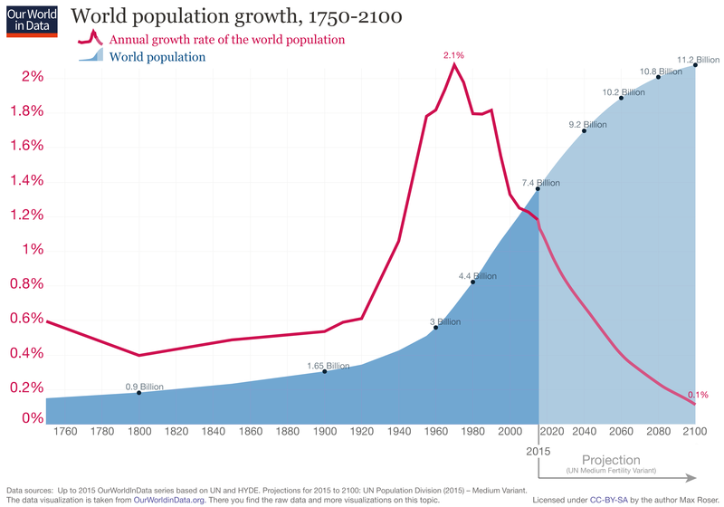

```{r setup, include = FALSE, cache = FALSE, purl = FALSE, fig.showtext = TRUE}
source("assets/setup.R")
```

```{r libs, include=FALSE, warning=FALSE}
library(tidyverse)
library(cowplot)
```


class: center, inverse
background-image: url("img/means-coffee-unsplash.png")
background-position: center
background-size: cover

# Разнообразие средних значений

.tiny[by pritesh557 at Unsplash]

---

## Среднее арифметическое

Обычно под термином __среднее значение__ мы подразумеваем __среднее арифметическое__.

$$\bar{x}=\frac{x_{1}+x_{2}+\cdots+x_{n}}{n}=\frac{\sum x}{n}$$

Среднее в выборке обозначается $\bar{x}$, а в генеральной совокупности μ


--

Хорошо работает если значения складываются (т.е. сумма величин имеет свой смысл), интуитивно понятно.

Не работает, если большой разброс значений в ряду.

---

## Другие средние

$$\Bigl(\frac{x_{1}^p+x_{2}^p+\cdots+x_{n}^p}{n}\Bigr)^{\frac{1}{p}}$$

Все зависит от того, чему равно $p$

- $p = 1$ — среднее арифметическое
- $p = 2$ — среднее квадратическое
- $p = 3$ — среднее кубическое
- $p = -1$ — среднее гармоническое
- $p \rightarrow 0$ — среднее геометрическое

---

## Среднее квадратическое

$$\left(\frac{{x}_{1}^{2}+{x}_{2}^{2}+\ldots+{x}_{n}^{2}}{{n}}\right)^{\frac{1}{2}}=\sqrt{\frac{{x}_{1}^{2}+{x}_{2}^{2}+\ldots+{x}_{n}^{2}}{n}}$$
.pull-left[

Можно использовать для двумерных признаков (для площадей)

- средняя площадь квадрата, вычисленная по сторонам квадратов


Дисперсия — мера разброса — так же определяется как среднеквадратичное отклонение от среднего значения в ряду.

]
.pull-right[


.tiny[by vtoesca at Unsplash]
]


---

## Среднее квадратическое

$$\left(\frac{{x}_{1}^{2}+{x}_{2}^{2}+\ldots+{x}_{n}^{2}}{{n}}\right)^{\frac{1}{2}}=\sqrt{\frac{{x}_{1}^{2}+{x}_{2}^{2}+\ldots+{x}_{n}^{2}}{n}}$$
.pull-left-60[

Представьте, что вы берете пробы квадратными рамками со стороной 10, 15 и 20 см. Вы хотите изменить методику и использовать усредненную рамку. Чему равна средняя сторона рамки?

Нет, не 15 см (средняя арифметическая), потому что тогда можно было бы подумать, что общая площадь рамок была бы $3 \times 15^2 = 675 см^2$ (на самом деле $10^2 + 15^2 + 20^2 = 725 см^2$).

Если использовать среднее квадратическое $\sqrt{\frac{10^2 + 15^2 + 20^2} {3}}= 15.54см$, то будет более правильно: $3 \times 15.54^2 = 724.47 см^2$

]
.pull-right-40[


.tiny[by vtoesca at Unsplash]
]


---

## Среднее кубическое

$$\left(\frac{{x}_{1}^{3}+{x}_{2}^{3}+\ldots+{x}_{n}^{3}}{{n}}\right)^{\frac{1}{3}}=\sqrt[3]{\frac{{x}_{1}^{3}+{x}_{2}^{3}+\ldots+{x}_{n}^{3}}{n}}$$

.pull-left[

Используется для объемных признаков:

- средний объем клеток листа по их диаметрам

]
.pull-right[


.tiny[[pxhere](https://pxhere.com/en/photo/1068793)]

]

---

## Среднее гармоническое

$$\left(\frac{x_{1}^{-1}+x_{2}^{-1}+\ldots+x_{n}^{-1}}{n}\right)^{-1}=\frac{n}{\frac{1}{x_{1}}+\frac{1}{x_{2}}+\ldots+\frac{1}{x_{n}}}$$
.pull-left[

Используется, если величины представлены отношениями в расчете на какую-то единицу.

Например, средняя скорость, когда известны скорости в расчете на одну единицу времени (или расстояния)

Пусть улитка преодолела определенное расстояние на разных типах поверхности со скоростью 12 м/ч и 11 м/ч. Тогда средняя скорость будет рассчитываться как средняя гармоническая (= 2 / (1/12 + 1/11) = 11.48 м/ч).


]

.pull-right[


.tiny[by felixberger at Unsplash]

]

---

## Среднее гармоническое

$$\left(\frac{x_{1}^{-1}+x_{2}^{-1}+\ldots+x_{n}^{-1}}{n}\right)^{-1}=\frac{n}{\frac{1}{x_{1}}+\frac{1}{x_{2}}+\ldots+\frac{1}{x_{n}}}$$
.pull-left-60[

Можно сказать, что среднее гармоническое __используется, когда один и тот же объем работы выполняется с разной производительностью__.

Например, студент может читать учебник (30 стр./ час) или конспектировать его (10 стр./час). Сколько в среднем страниц он обработает за час? 2 / (1/30+1/10) = 15 стр. Поскольку он делает оба действия, нас интересует его средняя производительность — делим на 2, получится 7.5 стр. 

]

.pull-right-40[


.tiny[by felixberger at Unsplash]

]

Проверяем: студент потратит на чтение 7.5 страниц 7.5 / 30 = 0.25 часа, а на конспектирование 7.5 / 10 = 0.75 часа. Всего 0.25 + 0.75 = 1 час. Т.обр., если студент будет и читать, и конспектировать, на 7.5 страниц потребуется 1 час.

???

Еще примеры

- средняя цена, когда известны количества товара, купленные на одну и ту же сумму.

- средняя цена акций, купленных на фиксированную сумму в разные даты покупки (5 а за 1000 и 7 а за 1000).

- средняя скорость по дороге на работу/домой


- 

---

## Среднее геометрическое

= среднее пропорциональное

$$\sqrt[n]{x_{1} \cdot x_{2} \cdot \ldots \cdot x_{n}}$$
.pull-left[

Используется если между величинами мультипликативные отношения (т.е. показывают, во сколько раз что-то изменилось) для вычисления средней скорости изменения.

- средняя скорость роста численности популяции на определенном отрезке, если известно, во сколько раз она изменилась за каждый период


]
.pull-right[


.tiny[World Population Growth. Our World in Data; Author: Max Roser, <br/>[CC BY-SA 4.0](https://creativecommons.org/licenses/by-sa/4.0), via Wikimedia Commons]

]

---


## Среднее геометрическое

= среднее пропорциональное

$$\sqrt[n]{x_{1} \cdot x_{2} \cdot \ldots \cdot x_{n}}$$
.pull-left[

Например, численность рысей увеличилась за год в 1.5 раза, а потом за другой год еще в 1.2 раза. Т.е. всего в 1.8 раз за два года. 

Среднее арифметическое не подходит, т.к. получится 1.35 раза в год и за два года 1.35 * 1.35 = 1.825. 

Средняя геометрическая = 1.34 раза и за два года 1.34 * 1.34 = 1.79, что гораздо ближе к истинному значению.

]
.pull-right[


.tiny[World Population Growth. Our World in Data; Author: Max Roser, <br/>[CC BY-SA 4.0](https://creativecommons.org/licenses/by-sa/4.0), via Wikimedia Commons]

]

---


## Среднее геометрическое

= среднее пропорциональное

$$\sqrt[n]{x_{1} \cdot x_{2} \cdot \ldots \cdot x_{n}}$$
.pull-left[


Другие примеры:

- скидки в %, средняя скидка
- площади, есть участок — можно вычислить сторону квадрата такой же площади
- темпы инфляции в % за период, средняя инфляция
- средняя доходность, если известна доходность в % за каждый период


]

.pull-right[


.tiny[World Population Growth. Our World in Data; Author: Max Roser, <br/>[CC BY-SA 4.0](https://creativecommons.org/licenses/by-sa/4.0), via Wikimedia Commons]

]
