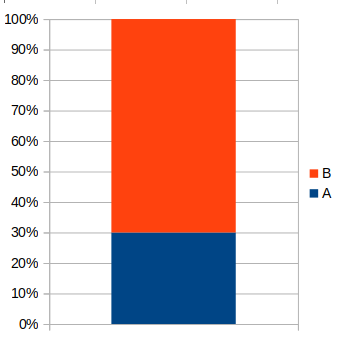

```{r setup, include = FALSE, cache = FALSE, purl = FALSE, fig.showtext = TRUE}
source("assets/setup.R")
```

```{r libs, include=FALSE, warning=FALSE}
library(tidyverse)
library(cowplot)
library(scales)
```

- Таблицы для представления и анализа данных
- Графики
- Одна переменная
- Связь между двумя категориальными переменными
- Связь между двумя численными переменными
- Связь численной и категориальой переменными
- Ряды данных во времени и пространстве
- Подготовка и визуализация данных в R
  - Опрятные данные, tidy data
  - Грамматика графиков


---

class: middle, center, inverse

# Таблицы

---

## Таблицы для представления данных

- в основном тексте статей, отчетов
- обобщают, кратко описывают данные
- форматирование выделяет важную информацию (но, увы, затрудняет машинную обработку)
- заголовки созданы для удобства людей (но, к сожалению, не машин)

.small[Table 1. Baseline clinical and demographic features of the 1305 Pima Indians (487 men, 818 women) in the study population. (From Nelson et al., 1998)]


.tiny[ [DOI: 10.1046/j.1523-1755.1998.00191.x](https://doi.org/10.1046/j.1523-1755.1998.00191.x) ]

---

## Таблицы для представления данных

- в основном тексте статей, отчетов
- обобщают, кратко описывают данные
- форматирование выделяет важную информацию (но, увы, затрудняет машинную обработку)
- заголовки созданы для удобства людей (но, к сожалению, не машин)

.small[Table 4 . Classification results on the "Pima diabetes" dataset. (From Demidova, Klyueva. 2017)]


.tiny[[DOI: 10.1051/itmconf/20171002002](http://dx.doi.org/10.1051/itmconf/20171002002)]


---

## Таблицы для анализа данных

- в приложениях к статьям
- первичные, необработанные ("сырые") данные
- форматирование минималистично или отсутствует
- заголовки краткие "машиночитаемые"
- опрятные данные, tidy data — об этом позже

.small[Pima.tr dataset in R-package MASS. Diabetes in Pima Indian Women.]


.tiny[Smith et al., 1988]

???

.tiny[Smith, J. W., Everhart, J. E., Dickson, W. C., Knowler, W. C., & Johannes, R. S. (1988, November). Using the ADAP learning algorithm to forecast the onset of diabetes mellitus. In Proceedings of the annual symposium on computer application in medical care (p. 261). American Medical Informatics Association.]

---

## Как можно улучшить эту таблицу?

.tiny[Whitlock, Schluter, 2015]

---

## Недостатки таблицы

- пары король-королева не упорядочены по значению F — не видна закономерность
- главные переменные F и выживание разделены лишними здесь колонками со второстепенной информацией
- для каждого короля пустая строка — оптически фрагментирует таблицу
- слишком много десятичных знаков

.tiny[Whitlock, Schluter, 2015]

---

## Улучшенная таблица


.tiny[Whitlock, Schluter, 2015]


---

class: middle, center, inverse

# Графики

---

## Хороший график

- Закономерности в данных легко различимы
- Величина и соотношение значений показаны честно
- Оси подписаны, указаны единицы измерения
- Графические символы и цвета легко различимы

---

## Примеры плохих графиков

.pull-left[


.tiny[[Источник](https://www.statisticshowto.com/probability-and-statistics/descriptive-statistics/misleading-graphs/)]

]

--

.pull-right[


.tiny[[Источник](https://venngage.com/blog/misleading-graphs/)]
]

--

Неправильный выбор точки отсчета искажает масштаб измерений. Старайтесь сохранять точку отсчета на графике.

---


## Примеры плохих графиков

.pull-left[

.small[Глобальная средняя температура с 1880 г.]


.tiny[[Источник](https://qz.com/580859/the-most-misleading-charts-of-2015-fixed/)]

]

--

.pull-right[


.tiny[[Источник](https://qz.com/580859/the-most-misleading-charts-of-2015-fixed/)]
]

--

Неправильно выбранный масштаб может скрывать изменчивость данных. Выбирайте подходящий масштаб осей.

---

## Примеры плохих графиков

.pull-left[

 

 

]

--

.pull-right[





]

3D графики обманчивы из-за эффекта перспективы.  
Лучше использовать плоские столбчатые графики.
---

class: middle, center, inverse

# Одна переменная

---

## Одна переменная: частоты

Если у нас есть значения одной переменной, можно изобразить таблицу частот или столбчатый график.

.pull-left-40[

```{r tbl-activity-freq}
dfr <- data.frame(Activity = c("Трава/корм", "Лесные продукты", "Рыбалка", "Скотоводство", "Поимка тигра", "Дрова/древесина", "Сон в доме", "Прогулка", "Туалет"), Frequency = c(44, 11, 8, 7, 5, 5, 5, 3, 2))

dfr %>% rename("Занятие" = "Activity", "Частота (число людей)" = Frequency) %>% kable()
```

.tiny[Данные Gurung et al. 2008, по Whitlock, Shluter, 2015]

]

.pull-right-60[

Частота разных типов активности жертв нападений тигров в национальном парке Читван в Непале в 1979-2006гг.

```{r gg-bar-n, fig.height=6}
dfr %>% mutate(Activity = factor(Activity),
              Activity = fct_reorder(Activity, Frequency, .desc = T)) %>% 
ggplot(aes(x = Activity, y = Frequency)) +
  geom_col(fill = "steelblue") +
  labs(x = "Активность", y = "Частота\n(число людей)") +
  theme(axis.text.x = element_text(angle = 50, hjust = 1))
```

]

--

Категории имеет смысл изображать в порядке важности.

---

## Одна переменная: относительные частоты

.pull-left[

```{r tbl-activity}
dfr %>% rename("Занятие" = "Activity", "Процент людей" = Frequency) %>% kable()
```

.tiny[Данные Gurung et al. 2008, по Whitlock, Shluter, 2015]

]
.pull-right[

Типы активности жертв нападений тигров (%) в национальном парке Читван в Непале в 1979-2006гг.
```{r gg-bar-percent, fig.height=6}
gg_bar_percent <- dfr %>% mutate(Frequency = Frequency / sum(dfr$Frequency),
              Activity = factor(Activity),
              Activity = fct_reorder(Activity, Frequency, .desc = T)) %>% 
  ggplot(aes(x = Activity, y = Frequency)) +
  geom_col(fill = "steelblue") +
  labs(x = "Активность", y = "Относительная частота") +
  scale_y_continuous(labels = percent) +
  theme(axis.text.x = element_text(angle = 50, hjust = 1))
gg_bar_percent
```
]

---

## Круговой график обычно хуже, чем столбчатый


```{r gg-pie-percent, opts.label='fig.large'}
gg_pie_percent <- dfr %>% mutate(Frequency = Frequency / sum(dfr$Frequency),
              activity = factor(Activity),
              activity = fct_reorder(Activity, Frequency, .desc = T)) %>% 
  ggplot(aes(x = "", y = Frequency, fill = Activity)) +
  geom_bar(stat = "identity", width = 1, colour = "white") +
  coord_polar("y", start = 0) + 
  labs(fill = "Активность") +
  theme_void(base_size = 22) +
  scale_fill_brewer(palette="Set1")

plot_grid(gg_bar_percent, gg_pie_percent, ncol = 2, axis = "l", align = "h", rel_widths = c(0.7, 1))
```


.tiny[Данные Gurung et al. 2008, по Whitlock, Shluter, 2015]

---

## Гистограмма

__Гистограмма__ показывает количество значений, попадающих в определенный интервал (__классовый интервал__).


.small[Распределение размеров двустворчатых моллюсков _Limecola baltica_, просверленных улиткой _Amauropsis islandica_ (высота раковины 12.5 мм).]

.tiny[Aristov, Varfolomeeva, 2015, Fig.5]

---

## Ширина классового интервала определяет внешний вид гистограммы

Распределение веса младенцев при рождении. Данные были собраны в медицинском центре Baystate, Спрингфилд, в 1986 г.

.pull-left[

```{r gg-hsit-narrow}
library(MASS)
data("birthwt")
gg_hist_narrow <- ggplot(data = birthwt, aes(x = bwt)) +
  geom_histogram(binwidth = 100, colour = "white") +
  labs(x= "Birth weight, g", y = "Count, individuals")
gg_hist_wide <- ggplot(data = birthwt, aes(x = bwt)) +
  geom_histogram(binwidth = 1000, colour = "white")+
  labs(x= "Birth weight, g", y = "Count, individuals")

gg_hist_narrow
```

.tiny[Данные birthwt из пакета MASS из Hosmer, Lemeshow, 1989]

]

--

.pull-right[
```{r gg-birthwt-wide}
gg_hist_wide
```

]

---

## Есть множество методов расчета ширины $h$ и количества $k$ классовых интервалов

--

.pull-left[

__Метод Стурджеса__ (Sturges, 1926), плохо работает при $n < 30$

$k_s = 1 + log_2(n)$

<br/>
```{r gg-birthwt-stur}
ggplot(data = birthwt, aes(x = bwt)) +
  geom_histogram(bins = nclass.Sturges(birthwt$bwt), colour = "white")+
  labs(x= "Birth weight, g", y = "Count, individuals")
```

$k_s = 1 + log_2(`r length(birthwt$bwt)`) = `r nclass.Sturges(birthwt$bwt)`$
<br/>
.tiny[Данные birthwt из пакета MASS из Hosmer, Lemeshow, 1989]

]


--

.pull-right[

__Метод Фридмана-Диакониса__ (Freedman, Diakonis, 1981)

$h_{fd}=2 \frac{\operatorname{IQR}(x)}{\sqrt[3]{n}}$, $k_{fd} = (max - min)/h_{fd}$

```{r gg-birthwt-fried}
ggplot(data = birthwt, aes(x = bwt)) +
  geom_histogram(bins = nclass.FD(birthwt$bwt, digits = 5), colour = "white")+
  labs(x= "Birth weight, g", y = "Count, individuals")
```

I и III квартили — `r quantile(birthwt$bwt, probs = c(0.25, 0.75))`,  
n = `r length(birthwt$bwt)`, max = `r max(birthwt$bwt)`, min = `r min(birthwt$bwt)`.

$h_{fd}=2 \frac{ `r diff(quantile(birthwt$bwt, probs = c(0.25, 0.75)))` }{\sqrt[3]{`r length(birthwt$bwt)`}}$, 
$k_{fd} = `r nclass.FD(birthwt$bwt, digits = 3)`$

]

???

Есть множество методов определения оптимального числа интервалов ([wiki](https://en.wikipedia.org/wiki/Histogram#Number_of_bins_and_width))

---

class: middle, center, inverse

# Связь между двумя категориальными переменными

---

## Таблица сопряженности

Связь между двумя категориальными переменными можно показать в виде __таблицы сопряженности__.

Частота болезней, передающихся через воду в зависимости от поставщика воды в Кисуму, Кения.

```{r tab-disease}
dfr <- data.frame(Supplier = c("Communal", "Non-communal", "Communal", "Non-communal"),
                  Disease = c("No", "No", "Yes", "Yes"),
                  Frequency = c(170, 30, 85, 32))

dfr %>% pivot_wider(id_cols = "Supplier", names_from = "Disease", values_from = "Frequency") %>% kable() %>%  add_header_above(c(" " = 1,"Disease" = 2))
```

.tiny[Ananga et al. 2017, [DOI: 10.1016/j.habitatint.2017.02.004](https://doi.org/10.1016/j.habitatint.2017.02.004
)]

---

## Связь двух переменных можно изобразить на гарфиках

.pull-left[

График с группами столбцов

```{r gg-disease-bars, fig.height=6}
gg_stacked_bars <- dfr %>% 
  ggplot(aes(x = Supplier, y = Frequency, fill = Disease)) +
  geom_col(position = position_stack()) +
  scale_fill_brewer(palette = "Set2") +
  theme(legend.position = "bottom")
gg_stacked_bars
```
]

.pull-right[

Мозаичный график

```{r gg-disease-mosaic, fig.height=6}
gg_mosaic_bars <- dfr %>% 
  group_by(Supplier) %>% 
  mutate(Frequency = prop.table(Frequency)) %>% 
  ggplot(aes(x = Supplier, y = Frequency, fill = Disease)) +
  geom_col(position = position_stack()) +
  scale_fill_brewer(palette = "Set2") +
  theme(legend.position = "bottom")
gg_mosaic_bars
```

]

.tiny[Ananga et al. 2017, [DOI: 10.1016/j.habitatint.2017.02.004](https://doi.org/10.1016/j.habitatint.2017.02.004
)]


???


---

## На мозаичном графике можно изобразить много переменных

```{r gg-mosaic-titanic, opts.label='fig.large'}
data("Titanic")
# mosaicplot(~ Sex + Class + Survived, data = Titanic, col=c("lightblue", "seagreen"), cex = 1.1, dir = c("h", "v"))

# library(vcd)
# mosaic(Titanic, main = "", 
#        labeling_args = list(offset_varnames = c(left = 2, top=0)),
#        # direction = c("v", "v", "v", "h"), shade = T,
#        gp = gpar(fill = 4:1, col = 0, fontsize = 22))

library(ggmosaic)
Titanic_df<-as.data.frame(Titanic)
ggplot(data = Titanic_df) +
  geom_mosaic(aes(weight = Freq, x = product(Survived, Age, Sex), fill=Survived), offset = 0.1, colour = "white") + facet_grid(Class~.) +
  theme_minimal(base_size = 22) +
  theme(axis.text.x = element_text(hjust = 0))
```

---

class: middle, center, inverse

# Связь между двумя численными переменными

---

## Диаграмма рассеяния (= скаттерплот)

Диаграмма рассеяния (scatterplot) позволяет показать связь между двумя непрерывными переменными.

.small[Связь массы тела и длины крыла у пингвинов трех видов (Адели, Чинстрап, Генту)]

```{r gg-penguins-scatter1, opts.label = 'fig.medium.taller'}
library(palmerpenguins)
penguins %>% 
  ggplot(aes(x = flipper_length_mm, y = body_mass_g)) +
  geom_point(size = 2) +
  scale_color_brewer(palette = "Set2") +
  theme(legend.position = "none") +
  labs(x = "Flipper length, mm", y = "Body mass, g")
```

.tiny[Данные Kristen Gorman, 2007-2009 Palmer Station Long Term Ecological Research Program]


---

## На скаттерплот можно добавить и дискретные переменные

.small[Связь массы тела и длины крыла у пингвинов трех видов (Адели, Чинстрап, Генту)]

```{r gg-penguins-scatter2, opts.label = 'fig.wider.taller'}
penguins %>% 
  ggplot(aes(x = flipper_length_mm, y = body_mass_g)) +
  geom_point(size = 2, aes(colour = species, shape = species)) +
  scale_color_brewer(palette = "Set2")+
  labs(x = "Flipper length, mm", y = "Body mass, g", colour = "Species", shape = "Species")
```

.tiny[Данные Kristen Gorman, 2007-2009 Palmer Station Long Term Ecological Research Program]


---

## На скаттерплот можно добавить и дискретные переменные

Иногда это просто обязательно, т.к. зависимости в разных группах данных могут выглядеть по-разному.

.small[Связь высоты и длины клюва у пингвинов трех видов (Адели, Чинстрап, Генту)]

```{r gg-penguins-scatter3, opts.label = 'fig.wider.taller'}
ggplot(data = penguins, aes(x = bill_length_mm, y = bill_depth_mm)) +
  geom_point(aes(color = species, shape = species), size = 2) +
  scale_color_brewer(palette = "Set2")+
  labs(x = "Bill length, mm", y = "Bill depth, mm", shape = "Species", colour = "Species")
```

.tiny[Данные Kristen Gorman, 2007-2009 Palmer Station Long Term Ecological Research Program]

---

class: middle, center, inverse

# Связь численной и категориальой переменных

---

## Точечная диаграмма (strip chart)

```{r gg-penguins-dots, opts.label = 'fig.wider.tall'}
ggplot(data = penguins, aes(x = species, y = body_mass_g)) +
  geom_jitter(aes(colour = species), width = 0.2, alpha = 0.75) +
  scale_color_brewer(palette = "Set2") +
  labs(x = "Species", y = "Body mass, g", colour = "Species")
```

---

## Боксплот (box plot)

```{r gg-penguins-box, opts.label = 'fig.wider.tall'}
ggplot(data = penguins, aes(x = species, y = body_mass_g)) +
  geom_boxplot(aes(fill = species), width = 0.2, alpha = 0.75) +
  scale_fill_brewer(palette = "Set2") +
  labs(x = "Species", y = "Body mass, g", fill = "Species")
```

---

## Множество гистограмм

```{r gg-penguins-many-hist, opts.label = 'fig.large'}
ggplot(data = penguins, aes(x = body_mass_g)) +
  geom_histogram(aes(fill = species), colour = "white") +
  facet_grid(species~.)  +
  labs(y = "Count, individuals", x = "Body mass, g", fill = "Species")
```


---

class: middle, center, inverse

# Ряды данных во времени и пространстве

---

## Закономерности во времени: Линейный график

.small[Ежегодное количество пойманных рысей в 1821–1934 гг. в Канаде.]
```{r gg-ts-lynx, opts.label='fig.wide'}
library(ggpmisc)
library(broom)
tidy(lynx) %>% 
ggplot(aes(x = index, y = value)) + geom_line() + 
  # stat_peaks(colour = "darkred") +
  # stat_peaks(geom = "text", colour = "darkred", 
  #            vjust = -0.5) +
  # stat_valleys(colour = "steelblue") +
  # stat_valleys(geom = "text", colour = "steelblue", angle = 45,
  #              vjust = 1.5, hjust = 1)+
  ylim(-500, 7300) +
  labs(x = "Time, years", y = "Lynx trappings, individuals")
```

---

## Закономерности во времени

.small[Ежемесячное число погибших или серьезно раненых водителей с января 1969 г. по декабрь 1984 г. в Великобритании. Обязательное использование ремней безопасности было введено 31 января 1983 г.]

```{r gg-ts-seatbelts, opts.label='fig.wide'}
data.frame(as.matrix(Seatbelts), Time = time(Seatbelts)) %>% 
  ggplot(aes(x = Time, y = DriversKilled, colour = law)) +
  geom_line() +
  scale_color_continuous(breaks = 0:1, labels = c("no", "yes")) +
  guides(colour = guide_colorbar(nbin = 2)) +
  labs(x = "Time, years", y = "Drivers killed, individuals", colour = "Law in effect")
```

---

## Закономерности в пространстве

.small[Количество животных погибших на автодороге БР-262 (столбцы — 10-километровые отрезки) и средняя высота в пределах каждого отрезка (пунктирная линия).]


.tiny[Desouza et al., 2014, DOI: [10.1007/s11273-014-9372-4](http://dx.doi.org/10.1007/s11273-014-9372-4)]

---

## Карты


.tiny[Exposito-Alonso, 2020, DOI: [10.1073/pnas.1921798117](https://doi.org/10.1073/pnas.1921798117)]

???

Сезонная адаптация Arabidopsis thaliana. Карта прогнозов времени цветения и старения растений, скорости прорастания, не зависящей от температуры, и весеннего прорастания, индуцированного/заблокированного холодом. Красная зона - рост осенью, размножение весной. Зеленая - зимний цикл факультативен. Фиолетовая зона быстрый весенне-летний цикл. Синяя зона - зимний цикл, позднее цветение.

Известно, какие аллели функционируют в каких частях ареала.

https://commons.wikimedia.org/wiki/File:Arabidopsis_thaliana_inflorescencias.jpg#filelinks


---

class: middle, center

# Подготовка и визуализация данных в R

---

class: middle, center, inverse

# Опрятные данные, tidy data

---

## Подготовка данных к анализу

Данные для анализа должны быть специальным образом отформатированы.

Подготовка данных занимает около 80% времени всего анализа (Dasu and Johnson 2003).

---

class: middle

## Опрятные данные, tidy data

> __Like families, tidy datasets are all alike but every messy dataset is messy in its own way.__ Tidy
datasets provide a standardized way to link the structure of a dataset (its physical layout)
with its semantics (its meaning).  
.right[— <cite>Hadley Wickham</cite>]

---

## Опрятные данные, tidy data

- В каждом столбце только одна переменная (variable)
- В каждой строке только одно наблюдение (observations)
- В каждой ячейке только одно значение (value)


.tiny[Wickham, 2016, Fig 12.1]

???

Wickham, H. (2014). Tidy Data. Journal of Statistical Software, 59(i10).

---

## Пример tidy data

Мы уже видели один пример —

<br/>
.small[Pima.tr dataset in R-package MASS. Diabetes in Pima Indian Women.]


.tiny[Smith et al., 1988]

---

## Основные ошибки форматирования таблиц <br/>для анализа данных


--

- Объединенные ячейки
- Заголовки столбцов (в порядке убывания важности ошибки)
  - отсутствуют
  - слишком длинные
  - на русском языке
  - содержат пробелы
- В одной ячейке находится несколько значений
- В одном столбце приведены разнородные данные
- Нет стандартного обозначения пропущенных значений

---

## Принципы Tidy Data

__Переменные__  
- должны иметь уникальные имена (лучше на английском без пробелов)
- должны содержать только один тип данных.
- должны быть измерены в одинаковых единицах.

--

__Наблюдения__ могут иметь уникальные имена, которые могут быть записаны в отдельном столбце.

--

__Значения__  
- каждое значение должно быть в отдельной ячейке.
- пропущенные (неизвестные) значения должны обозначаться единообразно (например, пустые ячейки, или `NA`).

--

.pull-left[

.small[
```{r}
tbl1 <- head(MASS::Pima.tr, 5) 
tbl1 %>% kable(row.names = T)
```
]
]
.pull-right[
.small[
- npreg — number of pregnancies.
- glu — plasma glucose concentration.
- bp — diastolic blood pressure (mm Hg).
- skin — triceps skin fold thickness (mm).
- bmi — body mass index (weight in kg/(height in m)<sup>2</sup>).
- ped — diabetes pedigree function.
- age — age in years.
- type — Yes or No, for diabetic (WHO).
]
]


???

---

class: middle, center, inverse

# Грамматика графиков

---

## Грамматика графиков (grammar of graphics)

.pull-left-40[


]
.pull-right-60[

Wilkinson, L. (2012). The grammar of graphics. In Handbook of computational statistics (pp. 375-414). Springer, Berlin, Heidelberg.

<br/><br/>


Wickham, H. (2010). A layered grammar of graphics. Journal of Computational and Graphical Statistics, 19(1), 3-28.

]

---

## Компоненты грамматики графиков


.tiny[Источник: [towardsdatascience.com](https://towardsdatascience.com/a-comprehensive-guide-to-the-grammar-of-graphics-for-effective-visualization-of-multi-dimensional-1f92b4ed4149)]

Т.е. графики создаются послойно.

---

## Графики при помощи пакета `ggplot2`

gg в названии пакета — это grammar of graphics.

Активируем пакет `ggplot2`

```{r gg-0, echo=TRUE, purl=TRUE}
library(ggplot2)
```

---

## Данные

.pull-left[

Данные для графика `ggplot2` должны быть в виде датафрейма.

Попробуем нарисовать данные из датасета `penguins` про пингвинов Адели, Генту и Чинстрап, который хранится в пакете `palmerpenguins`.

]

.pull-right[


.tiny[
bluegio at deviantart.com
]

]


```{r gg-dat, echo=TRUE, purl=TRUE}
library(palmerpenguins)

head(penguins, 2)

colnames(penguins)
```

---

## 1. Откуда брать данные?

```{r gg-1, echo=TRUE, purl=TRUE}
ggplot(data = penguins)
```

---

## 2. Что рисовать?

При помощи функции `aes()` задаем __эстетики__ — свойства графика, при помощи которых будут отображены данные.

Простейшие эстетики — это `x` и `y` — координаты по осям.


```{r gg-2, echo=TRUE, purl=TRUE}
ggplot(data = penguins, 
       aes(x = flipper_length_mm, y = body_mass_g))
```

---

## 3. В виде чего рисовать?

Геомы — графические объекты в виде которых будут изображены свойства данных.

Простейший геом — точки `geom_point()`

Отдельные слои графика разделяются знаком `+`. Разрыв строки можно ставить только после него, не до.

```{r gg-3, echo=TRUE, purl=TRUE}
ggplot(data = penguins, 
       aes(x = flipper_length_mm, y = body_mass_g)) +
  geom_point()
```

---

## Можно "жестко" указать свойства геома

Например, у точек есть свойства `shapе` — форма, `size` — размер, `colour` — цвет и т.д.

Изменим цвет точек на красный и зададим размер точек 3. Это не эстетики, т.к. ни цвет ни размер никак не связаны с данными, поэтому не используется функция `aes()`.

```{r gg-4, echo=TRUE, purl=TRUE}
ggplot(data = penguins, 
       aes(x = flipper_length_mm, y = body_mass_g)) +
  geom_point(colour = "red", size = 3)
```


---

## Можно задать другие эстетики

Если цвет должен отражать какое-то свойство данных — это эстетика. Пусть цвет отражает вид пингвинов. 

Размер здесь по-прежнему не эстетика.

```{r gg-5, echo=TRUE, purl=TRUE, opts.label='fig.wide'}
ggplot(data = penguins, 
       aes(x = flipper_length_mm, y = body_mass_g)) +
  geom_point(aes(color = species), size = 3)
```

---

## Шкалы `scale_*()` управляют эстетиками

Цветовой палитрой эстетики `colour` управляют шкалы `scale_color_*`.

`scale_color_brewer()` — брюйеровские цветовые палитры. У них есть имена.

```{r gg-6, echo=TRUE, purl=TRUE, opts.label='fig.wide'}
ggplot(data = penguins, 
       aes(x = flipper_length_mm, y = body_mass_g)) +
  geom_point(aes(color = species), size = 3) +
  scale_color_brewer(palette = "Set2")
```

---

## Лейблы labs() управляют подписями

```{r gg-7, echo=TRUE, purl=TRUE, opts.label='fig.wide'}
ggplot(data = penguins, 
       aes(x = flipper_length_mm, y = body_mass_g)) +
  geom_point(aes(color = species), size = 3) +
  scale_color_brewer(palette = "Set2") +
  labs(x = "Flipper length, mm", y = "Body mass, g")
```

---

## Фасетки `facet_*()` делят график на части

```{r gg-8, echo=TRUE, purl=TRUE, opts.label='fig.wide'}
ggplot(data = penguins, 
       aes(x = flipper_length_mm, y = body_mass_g)) +
  geom_point(aes(color = species), size = 3) +
  scale_color_brewer(palette = "Set2") +
  labs(x = "Flipper length, mm", y = "Body mass, g") +
  facet_wrap(~ island)
```

---

## Графики можно сохранять в переменные

```{r gg-9, echo=TRUE, purl=TRUE, opts.label='fig.wide'}
gg_peng1 <- ggplot(data = penguins, 
                   aes(x = flipper_length_mm, y = body_mass_g)) +
  geom_point(aes(color = species), size = 3) +
  scale_color_brewer(palette = "Set2") +
  labs(x = "Flipper length, mm", y = "Body mass, g") +
  facet_wrap(~ island)
gg_peng1
```

---

## Тема `theme()` настраивает оформление графика

Например, можно отключить (или переставить) легенду,

изменить положение подписей для конкретного графика.

```{r gg-10, echo=TRUE, purl=TRUE, opts.label='fig.wide.taller'}
gg_peng1 +
  theme(legend.position = "bottom", 
        axis.text.x = element_text(angle = 45, hjust = 1))
```

---

## Есть встроенные темы оформления

Встроенные темы `theme_*()` можно применить для конкретного графика, добавив их как отдельный слой.

`base_size` — задает базовый размер графических элементов и шрифтов

```{r gg-11, echo=TRUE, purl=TRUE, opts.label='fig.wide'}
gg_peng1 + theme_classic(base_size = 20)
```

---

## Темы для всех последующих графиков.

Можно установить какую-то тему для всех последующих графиков при помощи `theme_set()`

```{r gg-12, echo=TRUE, purl=TRUE, opts.label='fig.wide'}
theme_set(theme_bw(base_size = 20))
gg_peng1
```

---

## Сохранение графиков в файл

При помощи функции ggsave() можно сохранить график в векторный или растровый формат.

`filename` — путь (отн. рабочей директории) и имя файла.

```{r eval=FALSE, echo=TRUE, purl=TRUE}
# Векторный формат svg
ggsave(filename = "plot_penguins.svg", plot = gg_peng1)

# Растровый формат png
ggsave(filename = "plot_penguins.png", plot = gg_peng1)
```

---

class: middle, center, inverse

# Summary

---

## Что почитать

.left-column[


]
.right-column[

### Принципы визуализации данных

- Tufte, E. R. (1985). The visual display of quantitative information. The Journal for Healthcare Quality (JHQ), 7(3), 15.

[Сайт, посвященный работам Эдварда Тафта](https://www.edwardtufte.com/tufte/)

### Ресурсы про `ggplot2`

- Chang, W. (2018). R graphics cookbook: practical recipes for visualizing data. O'Reilly Media. 

[Сайт книги R Graphics Cookbook](https://r-graphics.org/) — книга Winston Chang про графики в ggplot2 с рецептами решений практически на все случаи жизни

- [Руководство по ggplot2](http://ggplot2.tidyverse.org/reference/)
- [Cheat-sheet по ggplot2](https://raw.githubusercontent.com/rstudio/cheatsheets/main/data-visualization.pdf)
 от [RStudio](https://www.rstudio.com)
- [ggplot2 Quick Reference: colour and fill](http://sape.inf.usi.ch/quick-reference/ggplot2/colour)
- [ggplot2 Quick reference: shape](http://sape.inf.usi.ch/quick-reference/ggplot2/shape)

]

