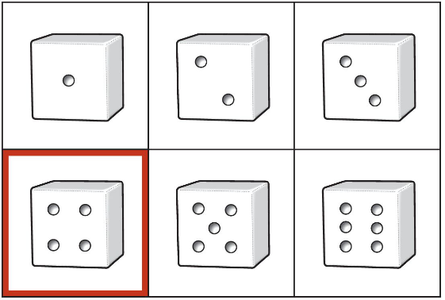
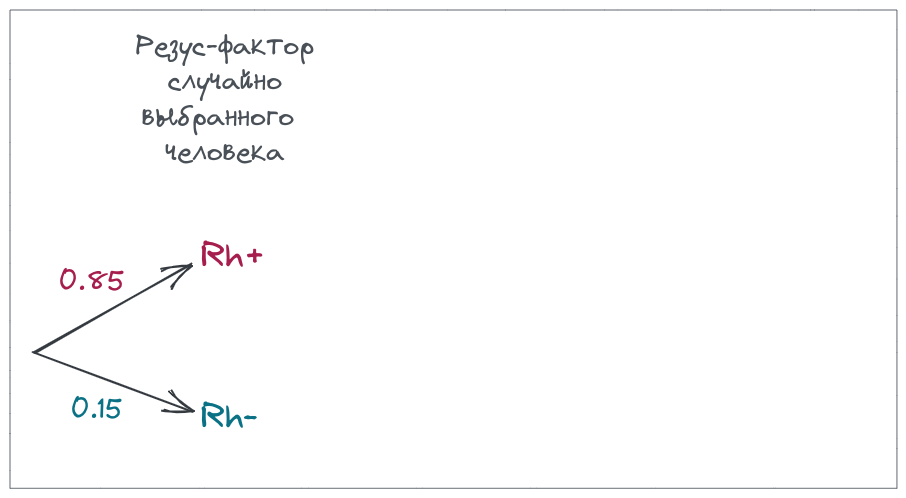
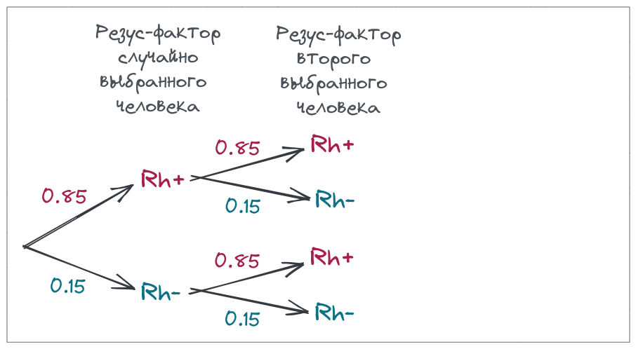
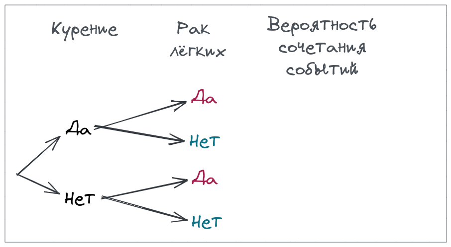

```{r setup, include = FALSE, cache = FALSE, purl = FALSE, fig.showtext = TRUE}
source("assets/setup.R")
library(xaringanExtra)
use_tile_view()
use_scribble()
use_search(show_icon = FALSE)
use_progress_bar(color = "#6d2b5e", location = "bottom", height = "10px")
use_freezeframe()
# use_webcam()
# use_panelset()
# use_extra_styles(hover_code_line = TRUE)

# http://tachyons.io/docs/
# https://roperzh.github.io/tachyons-cheatsheet/
use_tachyons()

# library(renderthis)
# to_pdf(from = "07-probabilities.Rmd",
#        to = "07-probabilities.pdf",
#        complex_slides = TRUE, partial_slides = TRUE)
```

```{r libs, include=FALSE, warning=FALSE}
library(tidyverse)
library(cowplot)
library(scales)
```

- Вероятность
- Распределения вероятностей
- Действия с вероятностями
- Деревья вероятностей
- Зависимые события
- Условная вероятность
- Нормальное распределение

---

class: middle, center, inverse

# Вероятность


???

Начинаем разговор о неопределенности оценок. Действительно, статистика позволяет (или заставляет) говорить, что ты не уверен, и в какой именно степени не уверен в своих оценках.

Вероятности чертовски важны в биологии, т.к. мы практически всегда (в 99% случаев) работаем с выборками. Свойства этих выборок во многом определяются случайностями в процессе сбора данных.


---

## Вероятность

Представьте, что ваш плейлист состоит из 1000 песен и вы нажимаете кнопку `shuffle`.

- Какова вероятность, что единственная самая любимая вами песня будет первой?
- Какова вероятность, что первой будет не самая любимая песня?

--

Представьте, что вы в лифте в 15 этажном доме, но нажали на случайную кнопку. 

- Какова вероятность, что вы приедете на нужный вам этаж с первой попытки? 
- Какова вероятность того, что вы попадете на неправильный этаж?

---

## Случайное испытание

В результате случайного __испытания__ происходит или не происходит случайное __событие__.

Случайному событию могут благоприятствовать один или несколько __элементарных исходов__.

.pull-left-40[


Испытание:  
бросок шестигранного кубика

Элементарные исходы:  
может выпасть 1, 2, 3, 4, 5, 6

Событие:  
на кубике выпало 4

]

--

.pull-right-60[

Испытание:  
нажимаем shuffle

Элементарные исходы:  
первым может оказаться любой из треков плейлиста

Событие:  
первый трек — любимая песня

<br/>


Испытание:  
нажимаем кнопку лифта 15-этажного дома

Элементарные исходы:  
лифт может приехать на любой из 15 этажей

Событие:  
попали на нужный этаж

]

???

TODO: Примеры случайных испытаний и событий:

- бросаем кубик - выпало четыре
- монетка - выпал орел

---

## Вероятность

Вероятность события — это доля случаев, когда происходит это событие в ряду испытаний.

$$0 \le P \le 1$$

--

$P(A)$ — вероятность того, что произошло некоторое событие $A$:

--

- $P(\text{на кубике выпало 4})$

--

- $P(\text{на кубике выпало четное число})$

--

- $P(\text{в семье из 3 детей все девочки})$

--

- $P(\text{в последовательности из 10 нуклеотидов только G})$

--

- в случайной выборке людей оцениваем долю рыжеволосых

--

- в случайной выборке новорожденных считаем долю детей с синдромом Дауна

???

TODO: Проверить фриквентистское определение вероятности

---

## Диаграмма Венна

__Диаграмма Венна__ (= диаграмма Эйлера-Венна) — схематическое изображение множества (= пространства) всех элементарных исходов и его подмножеств, соответствующих определенным событиям. 

.pull-left[

- На кубике выпало 4



.tiny[Whitlock, Schluter, 2015, fig.5.2-1-2]

]

--

.pull-right[

- На кубике выпало 3 или больше


]

--

Вероятность события легко оценить, посчитав долю элементарных исходов, благоприятствующих этому событию.

---

## Совместные и несовместные события

События A и B называются __несовместными__, если
$P(\text{A и B}) = 0$

.pull-left[
- Выпало 4 и выпало 2 — __несовместные__ события (mutually exclusive events).
]
.pull-right[
- Выпало 4 и выпало четное число — __совместные__ события.
]


---

class: middle, center, inverse

# Распределения вероятностей

---

## Распределение вероятностей

Все возможные исходы и их вероятности.

Дискретные и непрерывные распределения вероятностей

---

## Дикретные распределения вероятностей

.pull-left[

Для кубика вероятность каждого исхода — 1/6.

```{r opts.label='fig.medium.taller'}
data.frame(A = 1:6, P = rep(1/6, 6)) %>% 
  ggplot(aes(x = A, y = P)) +
  geom_col() +
  coord_cartesian(ylim = c(0, 1)) +
  scale_x_continuous(breaks = 1:6, labels = 1:6) +
  labs(x = "Событие:\nбросок кубика")
```

]

--

.pull-right[

Для честной монетки вероятность каждого исхода — 1/2

```{r opts.label='fig.medium.taller'}
data.frame(A = 0:1, P = rep(1/2, 2)) %>% 
  ggplot(aes(x = A, y = P)) +
  geom_col() +
  coord_cartesian(ylim = c(0, 1)) +
  scale_x_continuous(breaks = 0:1, labels = c("Решка", "Орел")) +
  labs(x = "Событие:\nбросок монетки")
```

]

--

Теоретическое распределение дискретной случайной величины $x$ описывает вероятность получения определенного значения $x$.

---

## Другие примеры дискретных распределений

.pull-left-40[

Распределение числа левшей в случайной выборке из 27 человек. Ожидаемая вероятность леворукости — 0.08.

```{r opts.label='fig.medium.taller'}
mu1 <- 0.08
N1 <- 27
pi <- data.frame(y = seq(0, 10, by = 1), mu = mu1) %>% 
  mutate(pi = dbinom(y, size = N1, prob = mu1))
ggplot(pi, aes(x = y, y = pi)) + 
  geom_bar(stat = "identity", fill = 'grey20') +
  scale_x_continuous(breaks = 0:11, labels = 0:11) +
  coord_cartesian(ylim = c(0, 1)) +
  labs(x = "Событие:\nчисло левшей\nв выборке из 27 человек",
      y = "P")
```

]

--

.pull-right-60[

Распределение числа смертей в год от удара копытом лошади или мула в корпусах Прусской армии. Ожидаемая вероятность смерти от удара копытом за год в корпусе армии — 0.486.

```{r opts.label='fig.wider', fig.height=5.2}
library(pscl)
data(prussian)
prussian %>% 
  group_by(y) %>% 
  summarise(n = n()) %>% 
  ungroup() %>% 
  mutate(observed = prop.table(n),
         predicted = dpois(x = y, lambda = (91+32+11+2)/280)) %>% 
  pivot_longer(cols = c(observed, predicted)) %>% 
  ggplot(aes(x = y)) + 
  geom_col(aes(y = value, fill = name), position = position_dodge(-0.8)) +
  scale_y_continuous(sec.axis = sec_axis(name = "Число наблюдений", 
                                         trans = function(x) x/0.00357)) +
  scale_fill_brewer(name = "Частота", palette = "Paired", labels = c("Теоретическая", "Наблюдаемая"), breaks = c("predicted", "observed")) +
  labs(x = "Событие:\nчисло смертей в год\nот удара копытом",
       y = "P") + theme_bw(base_size = 18)
```

.tiny[Данные: von Bortkiewicz, 1898; источник: пакет `pscl`]

]


---

## Непрерывные распределения вероятностей

.pull-left[

```{r g-norm, opts.label='fig.medium.taller'}
ND_curve <- ggplot(data = data.frame(x = 0:20), aes(x = x)) +
  stat_function(fun = dnorm, args = list(mean = 10, sd = 2), colour = 'darkcyan', size = 1.5) +
  labs(y = 'Плотность вероятности')
ND_curve
```

]
.pull-right[

Описывают, какие значения может принимать непрерывная случайная величина. 

]

???

Непрерывные переменные могут принимать любое значение в пределах диапазона. Т.е. между любыми двумя возможными значениями — бесконечное число других возможных значений.

---

## Относительная частота и плотность вероятности


.pull-left-55[

```{r gg-norm-hist-curve, opts.label='fig.medium.taller', fig.width=7}
set.seed(39025)
N <- 100000
binwidth <- 0.5
mu <- 10
sig <- 2
dfr <- data.frame(x = rnorm(N, mean = mu, sd = sig))
ggplot(data = dfr, aes(x = x)) +
  geom_histogram(aes(y = ..density..), fill = 'white', colour = 'black', binwidth = binwidth) +
  labs(y = 'Плотность вероятности') +
  stat_function(fun = dnorm, args = list(mean = mean(dfr$x), sd = sd(dfr$x)),
                colour = 'darkcyan', size = 1.5) +
scale_y_continuous(sec.axis = sec_axis(~.* N * binwidth, name = 'Частота')) +
  coord_cartesian(xlim = c(0, 20), ylim = c(0, 0.21))
```

]

.pull-right-45[

На "сырых" данных мы можем посчитать число наблюдений с разными значениями $x$. __Частота__ — это то, что мы бы нарисовали на гистограмме.

Теоретическое распределение непрерывной случайной величины $x$  описывает вероятность получить значение $x$ в определенном диапазоне т.е. __плотность вероятности__.

<br/> <br/>

]

__Плотность вероятности__ $f(x)$ — это способ задания вероятности непрерывной случайной величины $x$ на любом диапазоне значений.


---

## Вероятности — площади под кривой распределения

.pull-left[

```{r opts.label='fig.medium.taller'}
ND_curve + 
  stat_function(geom = 'area', fun = dnorm, args = list(mean = mu, sd = sig), 
                xlim = c(0, 20), alpha = 0.6, fill = 'darkcyan')  +
  annotate(geom = 'text', parse = TRUE, size = 7,
           x = mu, y = 0.05,
           label = "P[group('(',list(-infinity, infinity),')')] == 1")
```

]
.pull-right[

Площадь под всей кривой $= 1$.

Вероятность встречи значений $x$ из определенного промежутка можно узнать, проинтегрировав функцию распределения $f(x)$.

Вероятность конкретного значения нельзя определить, т.к. это точка, а под точкой нет площади.

]

---

class: middle, center, inverse

# Действия с вероятностями

---

## Группы крови


В среднеевропейской популяции частота встречаемости групп крови по системе AB0 представлена в таблице.

.pull-left[
<br/>
```{r tbl-blood1}
dfr_ab0 <- data.frame(blood = c("0", "A", "B", "AB"), probability = c(0.43, 0.42, 0.11, 0.04)) %>% mutate(blood = factor(blood, levels = c("0", "A", "B", "AB")))

dfr_ab0 %>% rename("Группа крови" = blood, "Вероятность" = probability) %>% kable()
```

.tiny[[http://www.almazovcentre.ru/](http://www.almazovcentre.ru/?page_id=4595), 18.08.2022]

]

.pull-right[
```{r}
pal_blood <- RColorBrewer::brewer.pal(8, "Paired")

library(ggmosaic)
ggplot(data = dfr_ab0) +
  geom_mosaic(aes(weight = probability, x = product(blood)), offset = 0.01, colour = "white", show.legend = F, fill = pal_blood[1]) + 
  labs(x = "Группа крови") +
  theme_minimal(base_size = 22) +
  theme(axis.text.x = element_text(hjust = 0), axis.text.y = element_blank())
```

]


Нельзя иметь одновременно две группы крови по системе AB0, поэтому это несовместные события.

Рассмотрим на их примере действия с вероятностями.

---

## Сложение вероятностей

.content-box-grey[
Если события A и B несовместны, то вероятность того, что произойдет одно или другое — это сумма их вероятностей.

$P(A~or~B) = P(A) + P(B)$
]
--

<br/>

Какова вероятность, что у человека кровь одной из трех групп: (A, B или AB)?

.pull-left[

<br/>

```{r tbl-blood1}
```

.tiny[[http://www.almazovcentre.ru/](http://www.almazovcentre.ru/?page_id=4595), 18.08.2022]
]

--

.pull-right[
```{r}
ggplot(data = dfr_ab0) +
  geom_mosaic(aes(weight = probability, x = product(blood)), offset = 0.01, colour = "white", show.legend = F, fill = pal_blood[c(1, 6, 6, 6)]) + 
  labs(x = "Группа крови") +
  theme_minimal(base_size = 22) +
  theme(axis.text.x = element_text(hjust = 0), axis.text.y = element_blank())
```
]

$P(A~or~B~or~AB) = P(A) + P(B) + P(AB) = 0.57$

---

## Пространство всех событий

.content-box-grey[
Сумма вероятностей всех возможных несовместных событий равна 1
]
.pull-left[

<br/>

```{r tbl-blood1}
```

.tiny[[http://www.almazovcentre.ru/](http://www.almazovcentre.ru/?page_id=4595), 18.08.2022]
]

.pull-right[

```{r}
ggplot(data = dfr_ab0) +
  geom_mosaic(aes(weight = probability, x = product(blood)), offset = 0.01, colour = "white", show.legend = F, fill = pal_blood[rep(6, 4)]) + 
  labs(x = "Группа крови") +
  theme_minimal(base_size = 22) +
  theme(axis.text.x = element_text(hjust = 0), axis.text.y = element_blank())
```
]

$P(0) + P(A) + P(B) + P(AB) = 1$

---

## Отрицание

.content-box-grey[

Вероятность того, что событие не произойдет равна 1 минус вероятность того, что оно произойдет.

$P(not A) = 1 - P(A)$

]
.pull-left[

<br/>

```{r tbl-blood1}
```

.tiny[[http://www.almazovcentre.ru/](http://www.almazovcentre.ru/?page_id=4595), 18.08.2022]

]
.pull-right[

```{r}
ggplot(data = dfr_ab0) +
  geom_mosaic(aes(weight = probability, x = product(blood)), offset = 0.01, colour = "white", show.legend = F, fill = pal_blood[c(6, 1, 6, 6)]) + 
  labs(x = "Группа крови") +
  theme_minimal(base_size = 22) +
  theme(axis.text.x = element_text(hjust = 0), axis.text.y = element_blank())
```
]

$P(not A) = 1 - P(A) = 0.58$


---

## Независимые события

События __независимы__, если то, что произошло одно из них, никак не влияет на то, что произойдет второе.

<br/>


Помимо групп крови по системе AB0 есть еще резус фактор Rh + или -.  
Эти признаки взаимно независимы. 

.pull-left[

В европейской популяции частота Rh+ 0.85.

```{r tbl-blood1}
```

]
.pull-right[

]


---

## Произведение независимых событий

.content-box-grey[

Если события A и B независимы, то вероятность того, что произошли оба события одновременно равна произведению их вероятностей. (Это справедливо для любого числа независимых событий).

$P(A~and~B) = P(A) \times P(B)$
]

<br/>

.pull-left[

В европейской популяции частота Rh+ 0.85. 

```{r tbl-blood1}
```

Каковы вероятности групп крови AB0 с учетом Rh (если предположить, что они независимы)?

]

--

.pull-right[
```{r tbl-blood2}
dfr_ab0rh <- data.frame(blood = c("0_+", "0_–", "A_+", "A_–", "B_+", "B_–", "AB_+", "AB_–"), probability = c(0.3655, 0.0645, 0.3570, 0.0630, 0.0935, 0.0165, 0.0340, 0.0060)) %>% separate(blood, into = c("AB0", "Rh"), sep = "_", remove = F) %>% mutate(AB0 = factor(AB0, levels = c("0", "A", "B", "AB")))

dfr_ab0rh %>% rename("Вероятность" = probability) %>% select(-blood) %>%  kable()
# %>% pivot_wider(id_cols = "AB0", names_from = Rh, values_from = "probability")
```
]

---

## Независимые события и их произведение

В европейской популяции частота Rh+ 0.85. Каковы вероятности групп крови AB0 с учетом Rh (если предположить, что они независимы)?

.pull-left[

```{r tbl-blood2}
```

]
.pull-right[

Поскольку Rh и AB0 независимы, то соотношение Rh+ и  Rh- будет одинаково в каждой группе AB0.

```{r}
ggplot(data = dfr_ab0rh) +
  geom_mosaic(aes(weight = probability, x = product(Rh, AB0), fill = Rh), offset = 0.01, colour = "white", show.legend = F) + 
  scale_fill_manual(values =  pal_blood) +
  theme_minimal(base_size = 22) +
  theme(axis.text.x = element_text(hjust = 0))
```

]

???

Множество независимых событий: Мендель и бобы, желтые (рецессивный признак) и зеленые (доминантный признак). Можно идентифицировать гетерозигот по потомству. 3/4 потомков должны быть зеленые. Какова вероятность того, что 10 потомков гетерозиготы будут зелеными? (3/4)^10 = 0.056. Пример из Whitlock, Schluter, 2015

---

class: middle, center, inverse

# Деревья вероятностей

---

## Деревья вероятностей (probability trees)

Дерево вероятностей — это способ изобразить вероятности сочетаний нескольких случайных событий.

<br/>

В европейской популяции частота Rh+ 0.85. 

Какова вероятность, 

- что у случайно выбранного человека будет Rh-?
- что у двух случайных людей будет Rh-?
- что у двух случайных людей будет одинаковый резус-фактор?

---

## Нарисуем дерево вероятностей


Если речь идет об одном случайно выбранном человеке — все просто.

---

## Нарисуем дерево вероятностей



Добавляем второго случайно выбранного человека.

Резус фактор второго случайно выбранного человека не зависит от первого.


---

## Нарисуем дерево вероятностей


Поскольку резус фактор второго случайно выбранного человека не зависит от первого,  

вероятность сочетаний этих двух независимых событий можно посчитать, перемножив вероятности.


---

## Теперь можно ответить на вопросы


.pull-left-60[
Какова вероятность, что
- у случайно выбранного человека Rh-?
- у двух случайных людей Rh-?
- у двух случайных людей одинаковый резус-фактор?
]

--

.pull-right-40[
<br/>
- 0.15
- 0.0225
- 0.7225 + 0.0225 = 0.745
]

---

class: middle, center, inverse

# Зависимые события

---

## Зависимые события (dependent events)

События __зависимы__, если от появления одного из них зависит вероятность появления другого.

По результатам мета-анализа исследований влияния курения на возникновение рака легких видно, что для курящих вероятность появления рака легких выше, чем для некурящих. Это зависимые события.

.pull-left[

<br/>

```{r tbl-lung}
# количество проанализированных исследований Barukčić, 2019
dfr_lung <- data.frame(
  Smoking = c("Yes", "No", "Yes", "No"),
  Lung_cancer = c("Yes", "Yes", "No", "No"),
  Frequency = c(17393, 433, 2043, 8527)
  ) %>% 
  mutate(Smoking = factor(Smoking, levels = c("Yes", "No")),
         Lung_cancer = factor(Lung_cancer, levels = c("Yes", "No")))

library("janitor")
dfr_lung %>% pivot_wider(id_cols = "Lung_cancer", names_from = Smoking, values_from = "Frequency") %>% adorn_totals(where = c("row", "col")) %>% kable() %>% row_spec(3, bold = TRUE) %>% column_spec(c(1, 4), bold = TRUE) %>%
  add_header_above(c(" ", "Smoking" = 2, " " = 1))
```

.tiny[Данные Barukčić, 2019, table 7; DOI: [10.22270/jddt.v9i1-s.2273](https://doi.org/10.22270/jddt.v9i1-s.2273)]

]

.pull-right[
```{r gg-lung-mosaic, opts.label='fig.medium.taller'}
dfr_lung <- dfr_lung %>% mutate(Probability = round(prop.table(Frequency) * 100, 1))

g <- ggplot(data = dfr_lung) +
  geom_mosaic(aes(weight = Frequency, x = product(Smoking), fill = Lung_cancer), offset = 0.01, colour = "white", show.legend = F) + 
  labs(y = "Lung cancer") +
  scale_fill_brewer(palette = "Set1") +
  theme_minimal(base_size = 22) +
  theme(axis.text.x = element_text(hjust = 0))

temp <- ggplot_build(g)$data %>%
        as.data.frame %>%
        mutate(x.position = (xmax + xmin) / 2,
               y.position = (ymax + ymin) / 2) %>%
        right_join(dfr_lung, by = c("x__Smoking" = "Smoking", "x__fill__Lung_cancer" = "Lung_cancer"))

gg_lung_mosaic <- g + 
  geom_text(x = temp$x.position, 
            y = temp$y.position,  
            label = paste0(temp$Probability, "%"),
            size = 7) 

gg_lung_mosaic_freq <- g + 
  geom_text(x = temp$x.position, 
            y = temp$y.position, 
            label = temp$Frequency, 
            size = 7) 
gg_lung_mosaic_freq
```
]

???

Barukčić, I. (2019). Smoking of tobacco is the cause of human lung cancer. Journal of Drug Delivery and Therapeutics, 9(1-s), 148-160. DOI: [10.22270/jddt.v9i1-s.2273](https://doi.org/10.22270/jddt.v9i1-s.2273)

---

## Задание

.pull-left-40[

Нарисуйте дерево вероятностей

```{r tbl-lung-prob}
ld <- dfr_lung %>% pivot_wider(id_cols = "Lung_cancer", names_from = Smoking, values_from = "Frequency") %>% adorn_totals(where = c("row", "col"))

ld %>% kable() %>% row_spec(3, bold = TRUE) %>% column_spec(c(1, 4), bold = TRUE) %>%
  add_header_above(c(" ", "Smoking" = 2, " " = 1))
```

]

--

.pull-right-60[



]

.pull-left-40[

<br/><br/><br/>
Вероятность курения/некурения среди всех:

$P_{курит = да} =$  
$P_{курит = нет} =$

]
.pull-right-60[

Вероятность рака среди курящих:

$P_{рак = да | курит = да} =$  
$P_{рак = нет | курит = да} =$

<br/>

Вероятность рака среди некурящих:

$P_{рак = да | курит = нет} =$  
$P_{рак = нет | курит = нет} =$

]


---

## Решение

.pull-left-40[

<br/>

```{r tbl-lung-prob}
```

<br/><br/><br/>
Вероятность курения/некурения среди всех:

$P_{курит = да} = `r ld[3, 2]`/`r ld[3, 4]` =  `r ld[3, 2] / ld[3, 4]`$  
$P_{курит = нет} = `r ld[3, 3]`/`r ld[3, 4]` = `r ld[3, 3] / ld[3, 4]`$

]
.pull-right-60[


Вероятность рака среди курящих:

$P_{рак = да | курит = да} = `r ld[1, 2]`/ `r ld[3, 2]` = `r ld[1, 2] / ld[3, 2]`$  
$P_{рак = нет | курит = да} = `r ld[2, 2]`/ `r ld[3, 2]` = `r ld[2, 2] / ld[3, 2]`$

<br/>

Вероятность рака среди некурящих:

$P_{рак = да | курит = нет} = `r ld[1, 3]`/ `r ld[3, 3]` = `r ld[1, 3] / ld[3, 3]`$  
$P_{рак = нет | курит = нет} = `r ld[2, 3]`/ `r ld[3, 3]` = `r ld[2, 3] / ld[3, 3]`$

]


---

## Дерево вероятностей для этих данных


.pull-left-60[


]
.pull-right-40[

```{r opts.label='fig.medium.taller'}
gg_lung_mosaic
```

]

--

<br/>

__Осторожно!__ Поскольку события "курение" и "рак легких" — зависимые, правило умножения не выполняется:

$P(курение~и~рак) \ne P(курение) \times P(рак)$

--

<br/>

На самом деле $P(курение~и~рак) = 0.612$.

А если ошибочно считать по формуле для независимых событий, то

$P(курение) \times P(рак) = 0.684 \times (0.895 + 0.0483) = 0.645$.

---

class: middle, center, inverse

# Условная вероятность

---

## Условная вероятность (conditional probability)

__Условная вероятность__ — вероятность события, при каком-то условии (например, при условии, что произошло какое-то другое событие или события).

.pull-left-60[


]
.pull-right-40[

<br/>

```{r opts.label='fig.medium'}
gg_lung_mosaic
```

]

--

$P(рак = да|курит = да) = 0.895$ —  
вероятность рака легких при условии, что человек курит

$P(рак = да |курит = нет) = 0.0483$ —  
вероятность рака легких при условии, что человек НЕ курит

---

## Формула полной вероятности <br/> (law of the total probability)

.content-box-grey[
Вероятность события $A$ можно вычислить исходя из его вероятностей при условии каждого из несовместных событий $B_i$.

$$P(A) = \sum_{i = 1}^{n} P(A|B_i) P(B_i)$$
]

.pull-left-55[


]
.pull-right-45[
```{r opts.label='fig.medium'}
gg_lung_mosaic
```
]

--

И действительно, вероятность того, что у случайно выбранного человека рак, будет складываться из площадей красных прямоугольников.
 
???

Т.е. как будто у нас получается взвешенное среднее вероятности A при всех несовместных событиях.

Иначе можно сказать, что априорная вероятность события равна среднему его апостериорной вероятности.

---

## Обобщенное правило умножения вероятностей <br/>(generel multiplication rule)

.content-box-grey[
Вероятность того, что произошли оба события, даже если они зависимы

$$P(A~and~B) = P(A) \cdot P(B|A) = \\ = P(B) \cdot P(A|B)$$
]

.pull-left-55[


]
.pull-right-45[
```{r opts.label='fig.medium'}
gg_lung_mosaic
```
]

---

## Задание

В 80-е годы в канаде 52% взрослых мужчин курили. По оценкам исследователей вероятность развития рака лежких в течение жизни у мужчин курильщиков была 17.2 %, а у некурящих 1.2 % (Villneuve and Mao, 1994). <br/>

- Какова условная вероятность нажить себе рак для канадца, если он курил в 80е годы? <br/><br/>

- Какова вероятность того, что канадец курил в 80-е годы и у него развился рак? <br/><br/>

- Какова вероятность того, что канадец не курил в 80-е годы и не получил рак? <br/><br/>

--

Используйте обобщенное правило умножения вероятностей

$$P(A~and~B) = P(A) \cdot P(B|A) = \\ = P(B) \cdot P(A|B)$$
--

Ради интереса и самопроверки, нарисуйте дерево вероятностей и сравните результаты.

---

## Решение

В 80-е годы в канаде 52% взрослых мужчин курили. По оценкам исследователей вероятность развития рака лежких в течение жизни у мужчин курильщиков была 17.2 %, а у некурящих 1.2 % (Villneuve and Mao, 1994). <br/>

- Какова условная вероятность нажить себе рак для канадца, если он курил в 80е годы?  
$P_{рак|курильщик} = 0.172$

- Какова вероятность того, что канадец курил в 80-е годы и у него развился рак?  
$P_{курильщик~и~рак} = P_{курильщик} \times P_{рак|курильщик} = 0.52 \times 0.172 = 0.089$

- Какова вероятность того, что канадец не курил в 80-е годы и не получил рак?  
$P_{курильщик~и~нет~рака} = P_{некурящий} \times P_{нет~ рака|некурящий} = 0.48 \times 0.987 = 0.474$


Обобщенное правило умножения вероятностей

$$P(A~and~B) = P(A) \cdot P(B|A) = \\ = P(B) \cdot P(A|B)$$


---

class: middle, center, inverse

# Нормальное распределение


---

## Частотные распределения мерных признаков

```{r g-hawks-hist, opts.label='fig.wide.taller'}
library(Stat2Data)
data("HawkTail")
gg_hawks_h <- HawkTail %>% filter(Species == "RT") %>% 
  ggplot(aes(x = Tail)) +
  geom_histogram(binwidth = 2, colour = "white") +
  labs(x = "Длина хвоста коршунов, мм", y = "Частота")
# gg_hawks_h

library(wooldridge)
data(bwght)
bwght <- mutate(bwght, bwght_g = bwght * 28.34952)
gg_baby_h <- bwght %>% 
  ggplot(aes(x = bwght_g)) +
  geom_histogram(binwidth = 100, colour = "white") +
  labs(x = "Вес новорожденных, г", y = "Частота")
# gg_baby_h

plot_grid(gg_hawks_h, gg_baby_h, nrow = 1)
```

Частотные распределения многих мерных признаков имеют колоколообразную форму.

---

## Нормальное распределение

```{r g-hawks-hist-curve, opts.label='fig.wide.taller'}
ht <- HawkTail$Tail[HawkTail$Species == "RT"]
mht <- mean(ht)
sht <- sd(ht) 
gg_hawks_hc <- gg_hawks_h + stat_function(fun = function(x, ...)dnorm(x, ...) * 1200, args = list(mean = mht, sd = sht), colour = "darkcyan", size = 1.5)
# gg_hawks_hc

bw <- bwght$bwght_g
mbw <- mean(bw)
sbw <- sd(bw) 
gg_baby_hc <- gg_baby_h + stat_function(fun = function(x, ...)dnorm(x, ...) * 140000, args = list(mean = mbw, sd = sbw), colour = "darkcyan", size = 1.5)
# gg_baby_hc

plot_grid(gg_hawks_hc, gg_baby_hc, nrow = 1)
```

Теоретическое распределение, которое описывает многие из таких колоколообразных кривых, называется __нормальное распределение__.

---

## Нормальное распределение

.pull-left[

```{r g-norm, opts.label='fig.medium.taller'}
```

]
.pull-right[

Нормальное распределение

- Симметричное
- Унимодальное
- Непрерывное
- Наибольшая плотность вероятности — там, где среднее значение
- $-\infty \le x \le \infty$
]

---

## Формула нормального распределения

.pull-left[

```{r g-norm, opts.label='fig.medium.taller'}
```

]
.pull-right[


$$f(x) = \cfrac {1}{\sigma \sqrt{2 \pi}} \; e^{- \: \cfrac{(x-\mu)^2}{2\sigma^2}}$$

Параметры:<br/>

- $\mu$ --- среднее значение

<br/> <br/>
- $\sigma$ --- стандартное отклонение

]

Случайная величина $x$ подчиняется нормальному распределению со средним $\mu$ и стандартным отклонением $\sigma$.

Это кратко записывается как $x \sim N(\mu, \sigma)$.


---

## Параметры нормального распределения

.pull-left[

```{r g-norm-param, opts.label='fig.medium.taller'}
mu1 <- 15; sd1 <- 5
mu2 <- 25; sd2 <- 2
tsz <- 8
ggplot(data = data.frame(x = seq(0, 33, by = 0.01)), aes(x = x)) +
  stat_function(fun = dnorm, args = list(mean = mu1, sd = sd1),
                colour = 'darkcyan', size = 1.5) +
  geom_segment(x = mu1, y = 0, 
               xend = mu1, yend = dnorm(mu1, mu1, sd1),
              colour = 'darkcyan') +
  geom_segment(x = mu1, y = dnorm(mu1 - sd1, mu1, sd1), 
               xend = mu1 + sd1, yend = dnorm(mu1 + sd1, mu1, sd1),
              colour = 'darkcyan', linetype = 'dashed') +
  
  annotate('text', x = mu1, y = dnorm(mu1, mu1, sd1),
           label = 'mu[1]', parse = T,
           colour = 'darkcyan', vjust = -0.2, size = tsz) +
  annotate('text', x = mu1 + sd1/2, y = dnorm(mu1 + sd1, mu1, sd1),
           label = 'sigma[1]', parse = T,
           colour = 'darkcyan', vjust = 1.5, size = tsz) +
  labs(y = 'Плотность вероятности') +
  stat_function(fun = dnorm, args = list(mean = mu2, sd = sd2),
                colour = 'orangered', size = 1.5) +
  geom_segment(x = mu2, y = 0, 
               xend = mu2,  yend = dnorm(mu2, mu2, sd2),
              colour = 'orangered') +
  geom_segment(x = mu2, y = dnorm(mu2 + sd2, mu2, sd2), 
               xend = mu2 + sd2, yend = dnorm(mu2 + sd2, mu2, sd2),
               colour = 'orangered', linetype = 'dashed') +
  annotate('text', x = mu2, y = dnorm(mu2, mu2, sd2),
           label = 'mu[2]', parse = T,
           colour = 'orangered', vjust = -0.2, size = tsz) +
  annotate('text', x = mu2 + sd2/2, y = dnorm(mu2 + sd2, mu2, sd2),
           label = 'sigma[2]', parse = T,
           colour = 'orangered', vjust = 1.5, size = tsz) +
  coord_cartesian(ylim = c(0, 0.21))

```


]
.pull-right[


$$f(x) = \cfrac {1}{\sigma \sqrt{2 \pi}} \; e^{- \: \cfrac{(x-\mu)^2}{2\sigma^2}}$$

Параметры:<br/>

- $\mu$ --- среднее значение — задает положение вершины по оси Х

<br/>
- $\sigma$ --- стандартное отклонение — задает размах кривой распределения

]

--

.pull-left[

На рисунке распределения:
- $x_1 \sim N(\mu_1, \sigma_1)$
- $x_2 \sim N(\mu_2, \sigma_2)$

]

.pull-right[

Параметры этих распределений:
- $\mu_1 < \mu_2$
- $\sigma_1 > \sigma_2$

]


---

## Кривые распределений можно использовать <br/>для оценки вероятностей

```{r purl=FALSE, echo=FALSE, opts.label='fig.medium.taller'}
mu <- 0; sig <- 1; X1 <- -2; X2 <- 2
dfr <- data.frame(z = seq(-4, 4, length.out = 1000))

gg_part <- ggplot(dfr, aes(x = z)) +
  scale_x_continuous(name = 'z', breaks = -3:3) +
  labs(y = 'Плотность вероятности') +
  geom_vline(xintercept = c(-0.5, 1.25), linetype = 'dashed', colour = 'red') +
  stat_function(geom = 'area', fun = dnorm, args = list(mean = mu, sd = sig), 
                size = 1.5, fill = 'darkcyan', alpha = 0.5, xlim = c(-0.5, 1.25)) +
  stat_function(geom = 'line', fun = dnorm, args = list(mean = mu, sd = sig), 
                size = 1.5, colour = 'darkcyan')

gg_part +
annotate(geom = 'text', parse = TRUE,
           x = mu, y = 0.15, size = 8,
           label = "P")
```

---

## Площадь под всей кривой распределения равна 1 <br/><br/>


```{r purl=FALSE, echo=FALSE, opts.label='fig.medium.taller'}
mu <- 0; sig <- 1; X1 <- -1; X2 <- 1.5
dfr <- data.frame(z = seq(-4, 4, length.out = 1000))

gg_all <- ggplot(dfr, aes(x = z)) +
  scale_x_continuous(name = 'z', breaks = -3:3) +
  labs(y = 'Плотность вероятности') + 
  stat_function(geom = 'area', fun = dnorm, args = list(mean = mu, sd = sig), 
                size = 1.5, fill = 'darkcyan', alpha = 0.5) +
  stat_function(geom = 'line', fun = dnorm, args = list(mean = mu, sd = sig), 
                size = 1.5, colour = 'darkcyan')

gg_all +
annotate(geom = 'text', parse = TRUE,
           x = mu, y = 0.15, size = 8,
           label = "P[group('(',list(-infinity, infinity),')')] == 1")
```

---

## Вероятность конкретного значения нельзя определить <br/><br/>

```{r purl=FALSE, echo=FALSE, opts.label='fig.medium.taller'}
gg_X1 <- ggplot(dfr, aes(x = z)) +
  scale_x_continuous(name = 'z', breaks = -3:3) +
  labs(y = 'Плотность вероятности') + 
    stat_function(geom = 'line', fun = dnorm, args = list(mean = mu, sd = sig), 
                  size = 1.5, colour = 'darkcyan') +
  geom_vline(xintercept = X1, linetype = 'dashed', colour = 'red') +
  annotate('point', x = X1, y = dnorm(X1, mean = mu, sd = sig), 
           colour = 'darkcyan', fill = 'lightblue', shape = 21, size = 3) +
    annotate(geom = 'text', parse = TRUE, 
             x = X1, y = dnorm(X1, mean = mu, sd = sig), 
             label = paste0("P[(x == ", X1, ")] == 0"), 
             hjust = 1.1, size = 8)
gg_X1


```

---

## Можно определить вероятность того, <br/>что значение будет меньше заданного

```{r purl=FALSE, echo=FALSE, opts.label='fig.medium.taller'}
gg_less_X2 <- ggplot(data = dfr, aes(x = z)) +
  geom_vline(xintercept = X2, linetype = 'dashed', colour = 'red') +
  scale_x_continuous(name = 'z', breaks = -3:3) +
  stat_function(fun = dnorm, args = list(mean = mu, sd = sig), 
                colour = 'darkcyan', size = 1.5) +
  labs(x = 'Значение', y = 'Плотность вероятности') +
  stat_function(geom = 'area', fun = dnorm, args = list(mean = mu, sd = sig), 
                xlim = c(min(dfr$z), X2), alpha = 0.6, fill = 'darkcyan')

gg_less_X2 +
    annotate(geom = 'text', parse = TRUE, 
           x = X2, y = dnorm(X2, mean = mu, sd = sig), 
           label = paste0("P[(x <= ", X2, ")]"), 
           hjust = 1.1,  size = 8)
```

---

## Остальные площади можно найти <br/>при помощи арифметических действий

```{r purl=FALSE, echo=FALSE, opts.label='fig.medium'}
gg_greater_X2 <- ggplot(data = dfr, aes(x = z)) +
  geom_vline(xintercept = X2, linetype = 'dashed', colour = 'red') +
  scale_x_continuous(name = 'z', breaks = -3:3) +
  stat_function(fun = dnorm, args = list(mean = mu, sd = sig), 
                colour = 'darkcyan', size = 1.5) +
  labs(x = 'Значение', y = 'Плотность вероятности') +
  stat_function(geom = 'area', fun = dnorm, args = list(mean = mu, sd = sig), 
                xlim = c(X2, max(dfr$z)), alpha = 0.6, fill = 'darkcyan')

gg_greater <- plot_grid(gg_greater_X2 + theme_void(), 
          gg_all + theme_void(), 
          gg_less_X2 + theme_void(), 
          nrow = 1)

gg_greater <- ggdraw(gg_greater) + 
  draw_label(label = '=', size = 20, x = 0.33, y = 0.5) +
  draw_label(label = '–', size = 20, x = 0.66, y = 0.5)

gg_between_X1X2 <- ggplot(data = dfr, aes(x = z)) +
  geom_vline(xintercept = X1, linetype = 'dashed', colour = 'red') +
  geom_vline(xintercept = X2, linetype = 'dashed', colour = 'red') +
  scale_x_continuous(name = 'z', breaks = -3:3) +
  stat_function(fun = dnorm, args = list(mean = mu, sd = sig), 
                colour = 'darkcyan', size = 1.5) +
  labs(x = 'Значение', y = 'Плотность вероятности') +
  stat_function(geom = 'area', fun = dnorm, args = list(mean = mu, sd = sig), 
                xlim = c(X1, X2), alpha = 0.6, fill = 'darkcyan')
gg_less_X1 <- ggplot(data = dfr, aes(x = z)) +
  geom_vline(xintercept = X1, linetype = 'dashed', colour = 'red') +
  scale_x_continuous(name = 'z', breaks = -3:3) +
  stat_function(fun = dnorm, args = list(mean = mu, sd = sig), 
                colour = 'darkcyan', size = 1.5) +
  labs(x = 'Значение', y = 'Плотность вероятности') +
  stat_function(geom = 'area', fun = dnorm, args = list(mean = mu, sd = sig), 
                xlim = c(min(dfr$z), X1), alpha = 0.6, fill = 'darkcyan')

gg_between <- plot_grid(gg_between_X1X2 + theme_void(),
                        gg_less_X2 + theme_void(), 
                        gg_less_X1 + theme_void(), 
                        nrow = 1)

gg_between <- ggdraw(gg_between) + 
  draw_label(label = '=', size = 20, x = 0.33, y = 0.5) +
  draw_label(label = '–', size = 20, x = 0.66, y = 0.5)

plot_grid(gg_greater, gg_between, nrow = 2)
```


---

## Задание

.pull-left-60[

Распределение диаметра колоний бактерий


]
.pull-right-40[

Какова вероятность, что диаметр случайно выбранной колонии будет лежать в заданных пределах?

- между 4 и 6 мм

- между 8 и 12 мм <br/> <br/>

- больше 10 мм <br/> <br/>

- между 8 и 10 мм <br/> <br/>

- меньше 6 мм <br/> <br/>

- меньше 4 или больше 12 мм

]


.pull-down[.tiny[Whitlock and Shluter 2015, p.146]]

---

## Решение

.pull-left-60[

Распределение диаметра колоний бактерий


]
.pull-right-40[

Какова вероятность, что диаметр случайно выбранной колонии будет лежать в заданных пределах?

- между 4 и 6 мм  $P = 0.14$

- между 8 и 12 мм  $P = 0.48$ <br/> <br/>

- больше 10 мм   
$P = 0.14 + 0.02 = 0.16$

- между 8 и 10 мм  
$P = 0.48 - 0.14 = 0.34$

- меньше 6 мм  
$P = 0.14 + 0.02 = 0.16$

- меньше 4 или больше 12 мм  
$P = 0.02 + 0.02$

]


.pull-down[.tiny[Whitlock and Shluter 2015, p.146]]


---

## Площади под кривой нормального распределения


.pull-left[

```{r gg-three-sigmas, opts.label='fig.medium.taller'}
tsz <- 8
tmp <- c(expression(mu*'- 3'*sigma),
         expression(mu*'- 2'*sigma),
         expression(mu*'-'*sigma),
         expression(mu),
         expression(mu*'+'*sigma),
         expression(mu*'+ 2'*sigma),
         expression(mu*'+ 3'*sigma))

dfr <- data.frame(x = seq(-3.75, 3.75, by = .01))

# ar <- arrow(type = 'closed', length = unit(0.15,'cm'))
arb <- arrow(type = 'closed', angle = 10, length = unit(0.5,'cm'), ends = 'both')

gg_norm_area <- ggplot(dfr, aes(x = x)) +
  stat_function(fun = dnorm, args = list(mean = 0, sd = 1),
                colour = 'darkcyan', size = 1.5) +
  stat_function(geom = 'area', fun = dnorm,
                xlim = c(-1, 1), alpha = 0.2, fill = 'darkcyan') +
  stat_function(geom = 'area', fun = dnorm,
                xlim = c(1, 2), alpha = 0.4, fill = 'darkcyan') +
  stat_function(geom = 'area', fun = dnorm,
                xlim = c(-2, -1), alpha = 0.4, fill = 'darkcyan') +
  stat_function(geom = 'area', fun = dnorm,
                xlim = c(-3, -2), alpha = 0.6, fill = 'darkcyan') +
  stat_function(geom = 'area', fun = dnorm,
                xlim = c(2, 3), alpha = 0.6, fill = 'darkcyan') +
  scale_y_continuous(breaks = NULL) +
  scale_x_continuous(breaks = -3:3, labels = tmp) +
  labs(x = expression(sigma), y = 'Плотность вероятности') +
  geom_segment(x = - 1, y = dnorm(-1), xend = 1, yend = dnorm(-1),
               arrow = arb, size = 0.1, linetype = "dotted") +
  geom_segment(x = - 3, y = 0.001, xend = 3, yend = 0.001,
               arrow = arb, size = 0.1, linetype = "dotted") +
  geom_segment(x = - 2, y = dnorm(-2), xend = 2, yend = dnorm(-2),
               arrow = arb, size = 0.1, linetype = "dotted") +
  annotate(geom = 'text', label = '68%', x = 0, y = dnorm(1),
           vjust = -0.5, size = tsz)+
  annotate(geom = 'text', label = '95%', x = 0, y = dnorm(2),
           vjust = -0.5, size = tsz)+
  annotate(geom = 'text', label = '99.7%', x = 0, y = dnorm(3),
           vjust = -0.3, size = tsz)
gg_norm_area
```


]
.pull-right[

Правило 68--95--99.7 %

Если по оси $x$ отложить стандартные отклонения от среднего значения, то окажется, что приблизительно

- $\sim$ 68% значений в пределах $1\;\sigma$
- $\sim$ 95% --- в пределах $2\;\sigma$
- $\sim$ 99.7% --- в пределах $3\;\sigma$

]


---

class: middle, center, inverse

# Summary

---

## Summary: основные действия с вероятностями

- Вероятность события это доля случаев, когда это событие происходит в ряду повторных испытаний.
- Распредедение вероятностей описывает вероятности различных исходов случайного испытания.
- События называются несовместными, если не могут произойти одновременно.
- Суммарная вероятность всех несовместных событий равна 1.
- Вероятность того, что произойдет хотя бы одно из двух несовместных событий, равна сумме их вероятностей.
- Вероятность того, что произойдет одно из двух необязательно несовместных событий равна сумме их вероятностей за вычетом вероятности того, что они произошли оба.

---

## Summary: зависимые и независимые события

- Деревья вероятностей помогают записать и вычислить вероятности цепочек событий.
- Условная вероятность события - это вероятность события, при условии, что уже произошло какое-то другое событие.
- Вероятность того, что произошли одновременно два независимых события, равна произведению их вероятностей.
- Вероятность того, что произошли два зависимых события, равна произведению полной вероятности одного из них на вероятность другого при условии, что первое произошло.
- Формула полной вероятности гласит, что вероятность события можно вычислить как сумму его вероятностей при условии каждого из несовместных событий.

---

## Summary: нормальное распределение

- Нормальное распределение имеют многие мерные величины.
- Параметры нормального распределения задают положение его центра (среднее) и разброс (стандартное отклонение).
- Площади под кривой нормального распределения можно использовать для вычисления вероятности того, что значение нормально распределенной величины попадает в определенный диапазон, если известны параметры распределения этой величины в генеральной совокупности.

---

## Что почитать

- Bluman, A. G. (2005). Probability Demystified (Vol. 1). McGraw-Hill Professional.
- Whitlock, M., & Schluter, D. (2015). The analysis of biological data (Second edition)**. Roberts and Company Publishers.
