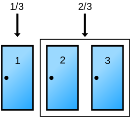

```{r setup, include = FALSE, cache = FALSE, purl = FALSE, fig.showtext = TRUE}
# Read presentation and ggplot setup parameters
source("assets/setup.R")
```

```{r libs, include=FALSE, warning=FALSE}
library(tidyverse)
library(cowplot)
library(scales)
```

Это кусочки исключительно для самостоятельного освоения, т.к. на занятиях для этого не будет времени.

Сейчас здесь только один такой кусочек — про парадокс Монти Холла. Чтобы в нем разобраться, хорошо бы представлять, что такое условная вероятность и знать теорему Байеса.

---

class: middle, center, inverse

# Парадокс Монти Холла

---

## Парадокс Монти Холла

.pull-left-60[

Представьте, что вы участвуете в телешоу. Перед вами три двери. За одной — автомобиль, за двумя другими — коза.  

Вы выбираете дверь. Ведущий открывает еще одну, за которой коза, и предлагает вам изменить свой выбор.

<br/>

__Что выгоднее, менять или сохранять первоначальный выбор?__

  
.tiny[Cepheus, Public domain, via Wikimedia Commons]

]

.pull-right-40[


.tiny[[Источник](http://www.singsnap.com/karaoke/member/kandie), accessed янв 29, 2015]

]

--

Что за чушь! Должно быть без разницы, ведь вероятность того, что за какой-либо дверью машина — 1/3!

--

Но не все так просто...


---

## Возможные начальные конфигурации

.pull-left-60[


.tiny[Cepheus, Public domain, via Wikimedia Commons]

]

--

.pull-right-40[

В двух случаях из трех возможных игрок выигрывает, изменив свой первоначальный выбор. 

Т.е. если вы __меняете свой выбор__, то вероятность выигрыша 2/3 (66%).

А если вы __не меняете свой выбор__, то вероятность выигрыша 1/3 (33%).

]

---

## Если после открытия двери с козой вы заново случайным образом выбираете из двух дверей

.pull-left-60[


.tiny[Cepheus, Public domain, via Wikimedia Commons]

]

--

.pull-right-40[

Т.е. если вы делаете __новый выбор из двух возможностей__, вероятность выигрыша при любом раскладе будет 50%.

]


---

## На самом деле, с вероятностями не происходит ничего странного

.pull-left-45[

 

.tiny[Cepheus, Public domain, via Wikimedia Commons]

<br/>

До того, как ведущий открыл дверь, вероятности, что выигрыш

- за выбранной дверью 1/3
- за двумя другими 2/3

]

--

.pull-right-55[

  

После того, как ведущий открыл дверь с козой, вероятности, что выигрыш

- за выбранной дверью 1/3
- за двумя другими 2/3 (но только за закрытой дверью, т.к. за отрытой дверью — уже точно 0)

]

---

## Дерево возможных событий, если выбрана дверь 1


.pull-left-40[

(можно построить аналогичные при другом выборе)

Посчитаем условную вероятность "в лоб", сверяясь с картинкой.
<br/><br/>

]

--

.pull-right-60[


.tiny[Rick Block, Public domain, via Wikimedia Commons]

]

--

Пусть вы вначале выбрали дверь 1, а ведущий открыл дверь 3 и вы изменили свое решение, выбрав дверь 2. 

<br/>

Тогда условная вероятность выигрыша будет равна вероятности того, что ведущий открыл дверь 3 и машина за дверью 2, деленной на вероятность того, что ведущий открыл дверь 3.
$P(M = 2|X = 3) = \frac{1/3}{1/3 + 1/6} = 2/3$


---

## Более формальное решение

.pull-left-55[


.tiny[Rick Block, Public domain, via Wikimedia Commons]

]

--

.pull-right-45[

Пусть игрок выбрал дверь 1

$M = 1, 2, 3$ — за какой дверью машина?

$X = 1, 2, 3$ — какую дверь открывает Монти Холл? (предположим, 3)

$P(X = 3|M = 1) = 1/2$  
$P(X = 3|M = 2) = 1$  
$P(X = 3|M = 3) = 0$

<br/>

]

--

Мы хотим узнать и сравнить две вероятности

$P(M = 1|X = 3)$  — т.е. игрок не меняет свой выбор

$P(M = 2|X = 3)$ — т.е. игрок изменяет выбор

---

## Применим теорему Байеса (1)

.pull-left-55[


.tiny[Rick Block, Public domain, via Wikimedia Commons]

]

.pull-right-45[

Пусть игрок выбрал дверь 1

$M = 1, 2, 3$ — за какой дверью машина?

$X = 1, 2, 3$ — какую дверь открывает Монти Холл? (предположим, 3)

$\color{blue}{P(X = 3|M = 1)} = 1/2$  
$\color{red}{P(X = 3|M = 2)} = 1$  
$\color{purple}{P(X = 3|M = 3)} = 0$

$\color{green}{P(M = 1, 2, 3)} = 1/3$

]

--

Если игрок __не меняет__ свой выбор

.large[
$P(M = 1|X = 3) = \frac{\color{blue}{P(X=3,M=1)}}{P(X=3)}=$
]

--

.large[
$= \frac{\color{blue}{P(X=3|M=1)}\color{green}{P(M=1)}}{\sum^{3}_{i = 1} P(X=3|M=i)\color{green}{P(M=i)}} =$
]

--

.large[
$= \frac{\color{blue}{P(X=3|M=1)}\color{green}{P(M=1)}}{\color{blue}{P(X=3|M=1)}\color{green}{P(M=1)}\;+\;\color{red}{P(X=3|M=2)}\color{green}{P(M=2)}\;+\;\color{purple}{P(X=3|M=3)}\color{green}{P(M=3)}} =$
]

--

.large[
$=\frac{\color{blue}{1/2} \cdot \color{green}{1/3}}{\color{blue}{1/2} \cdot \color{green}{1/3} + \color{red}{1} \cdot \color{green}{1/3} + \color{purple}{0} \cdot \color{green}{1/3}} = \frac{1/6}{1/2} = 1/3$
]

---

## Применим теорему Байеса (2)

.pull-left-55[


.tiny[Rick Block, Public domain, via Wikimedia Commons]

]

.pull-right-45[

Пусть игрок выбрал дверь 1

M = 1, 2, 3 — за какой дверью машина?

X = 1, 2, 3 — какую дверь открывает Монти Холл? (предположим, 3)

$\color{blue}{P(X = 3|M = 1)} = 1/2$  
$\color{red}{P(X = 3|M = 2)} = 1$  
$\color{purple}{P(X = 3|M = 3)} = 0$

$\color{green}{P(M = 1, 2, 3)} = 1/3$

]

--

Если игрок __изменяет__ свой выбор

$P(M = 2|X = 3) = \frac{\color{red}{P(X=3,M=2)}}{P(X=3)}=$

--

$= \frac{\color{red}{P(X=3|M=2)}\color{green}{P(M=1)}}{\sum^{3}_{i = 1} P(X=3|M=i)\color{green}{P(M=i)}} =$

--

$= \frac{\color{red}{P(X=3|M=2)}\color{green}{P(M=1)}}{\color{blue}{P(X=3|M=1)}\color{green}{P(M=1)}\;+\;\color{red}{P(X=3|M=2)}\color{green}{P(M=2)}\;+\;\color{purple}{P(X=3|M=3)}\color{green}{P(M=3)}} =$

--

$=\frac{\color{red}{1} \cdot \color{green}{1/3}}{\color{blue}{1/2} \cdot \color{green}{1/3} + \color{red}{1} \cdot \color{green}{1/3} + \color{purple}{0} \cdot \color{green}{1/3}} = \frac{1/3}{1/2} = 2/3$

???

Геометрическая интерпретация теоремы Байеса https://www.youtube.com/watch?v=HZGCoVF3YvM

Там же пересказана чудесная история из Канемана про Стива-фермера/библиотекаря, которую, при случае, можно было бы рассказать во время практики.

