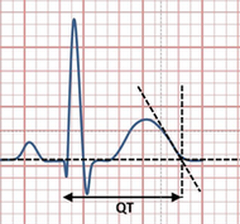
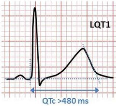

```{r setup, include = FALSE, cache = FALSE, purl = FALSE, fig.showtext = TRUE}
source("assets/setup.R")
library(xaringanExtra)
use_tile_view()
use_scribble()
use_search(show_icon = FALSE)
use_progress_bar(color = "#6d2b5e", location = "bottom", height = "10px")
use_freezeframe()
# use_webcam()
# use_panelset()
# use_extra_styles(hover_code_line = TRUE)

# http://tachyons.io/docs/
# https://roperzh.github.io/tachyons-cheatsheet/
use_tachyons()

# library(renderthis)
# to_pdf(from = "09-confidence-intervals-and-hypothesis-testing.Rmd", to = "09-confidence-intervals-and-hypothesis-testing.pdf", complex_slides = TRUE, partial_slides = TRUE)
```

```{r libs, include=FALSE, warning=FALSE}
library(tidyverse)
library(cowplot)
library(scales)
```

## Доверительные интервалы. Основы тестирования гипотез.

- Выборочное распределение и распределение выборочных средних
- Центральная предельная теорема (ЦПТ)
- Стандартная ошибка среднего
- Стандартизация
- Стандартное нормальное распределение
- Доверительный интервал для среднего из нормального и _t_-распределения
- Как устроено тестирование гипотез
- Одновыборочный t-тест
- Ошибки при тестировании гипотез

---

class: middle, center, inverse

# Выборочная оценка среднего

???

Что мы можем сказать о среднем значении в генеральной совокупности, если у нас есть всего одна выборка? Центральная предельная теорема говорит, что если мы возьмем достаточно большую выборку из генеральной совокупности, то среднее значение будет нормально распределено. Особенно важно, что это правда даже если признак в совокупности имеет другое распределение. Повторные выборки. Зависимость точности оценки от объема выборки. Ошибка среднего SE (это иллюстрация теоремы центрального предела)

---

## Как можно судить о свойствах генеральной совокупности по выборке?

__Центральная предельная теорема__ (ЦПТ) говорит, что если мы возьмем достаточно большую выборку из генеральной совокупности, то среднее значение будет нормально распределено с параметрами $\mu_{\bar x}$ и $\sigma _{\bar{x}}$:

$$\bar X \sim N (\mu_{\bar x}, \sigma_{\bar x})$$

При чем $\sigma_{\bar x} = \sigma/\sqrt{n}$.

<br/>

Но самое важное, что при больших объемах выборки ( $N > 30$, или даже $N > 100$) это так, даже если $x$ в генеральной совокупности не подчиняется нормальному распределению.

???

Давайте проверим на опыте, так ли это.

---

## Продолжительность сухой погоды

В аэропорту Виннипега (Канада) в течение нескольких лет регистрировали продолжительность периодов погоды без осадков (в днях). Представим, что данные из датасета `droughts` (пакет `DAAG`) --- это генеральная совокупность.

Перед вами распределение продолжительности периодов без осадков (число дней).

Мы хотим оценить среднюю продолжительность сухой погоды.

Давайте будем брать из нашей "генеральной совокупности" выборки и оценивать по ним среднее значение.

.pull-left[
```{r echo=FALSE, purl=FALSE}
library(DAAG)
data("droughts")

X <- na.omit(droughts$length)
sig <- sd(X)
mu <- mean(X)

lab <- paste('bar(x) ==', format(mu, nsmall = 0, digits = 1), '~~~sd ==', format(sig, nsmall = 0, digits = 1))

gg_population <- ggplot(data = data.frame(x = X), aes(x = x)) + 
  geom_histogram(fill = 'lightskyblue1', colour = 'black') + 
  geom_vline(xintercept = mu, colour = 'red', size = 2) +
  annotate('text', x = Inf, y = Inf, hjust = 1.1, vjust = 1.5, 
             label = lab, parse = T, size = 7) +
  labs(x = 'Сухая погода, число дней', y = "Частота")
gg_population
```
]
.pull-right[


.tiny[old winnipeg airport by twostoutmonks on Flickr]
]

<!-- https://flic.kr/p/eRNcR -->

---

## Средние в выборках

.pull-left-60[
```{r gg-sample, echo=FALSE, purl=FALSE, fig.height=8.5}
set.seed(8331497)
gg_sample_hist <- function(x, size) {
  id <- sample(x = length(x), size = size)
  my_mean <- mean(x[id])
  xlims <- range(x)
  binwidth <- diff(range(x))/length(x)
  ggplot(data = data.frame(x = x[id]), aes(x = x)) + 
    geom_histogram(binwidth = binwidth, fill = 'black', colour = 'black') + 
    geom_vline(xintercept = mu, colour = 'red', size = 2) +
    geom_vline(xintercept = my_mean, colour = 'yellow3', size = 2) + 
    coord_cartesian(xlim = xlims)+ 
    annotate('text', x = Inf, y = Inf, hjust = 3.1, vjust = 1.5, 
             label = paste('n ==', size), 
             parse = T, size = 7) +
        annotate('text', x = Inf, y = Inf, hjust = 1.1, vjust = 1.5, 
             label = paste('bar(x) ==', format(my_mean, nsmall = 2, digits = 2)), 
             parse = T, size = 7) 
}

gg_void <- ggplot() + theme_void()

n <- 20
# gg_sample_hist(X, n, xlim = c(30, 70))
plot_grid(gg_population + theme(axis.title.x = element_blank()),
          gg_sample_hist(X, n) + theme(axis.title.x = element_blank()) + labs(y = ""), 
          gg_sample_hist(X, n) + theme(axis.title.x = element_blank())+ labs(y = ""), 
          gg_sample_hist(X, n) + theme(axis.title.x = element_blank())+ labs(y = ""), 
          gg_sample_hist(X, n) + labs(x = 'Сухая погода, число дней', y = ""), 
          ncol = 1, align = 'v', rel_heights = c(1.1, 1, 1, 1, 1.2))
```


]
.pull-right-40[
Средние в выборках отличаются от среднего в генеральной совокупности.

Если взять много выборок определенного размера, можно построить распределение выборочных средних.

<br/>

Давайте посмотрим, как меняется форма распределения выборочных средних при изменении объема выборки.

]

---

## Распределение выборочных средних

.pull-left-60[
```{r gg-many-sampling-distr, echo=FALSE, purl=FALSE, fig.height=8.5}
# Функция, которая берет выборку объемом sample_size из вектора x и возвращает ее среднее значение
sample_mean <- function(x, size){
  id <- sample(x = length(x), size)
  my_mean <- mean(x[id])
  return(my_mean)
}

gg_sample_means <- function(x, n_samples, size){
  # Считаем средние значения для большого числа выборок
  my_means <- replicate(n = n_samples, expr = sample_mean(x, size))
  mean_of_means <- mean(my_means)
  sd_of_means <- sd(my_means)
  binwidth <- diff(range(x))/length(x)
  xlims <- range(x)
  ggplot(data = data.frame(means = my_means), aes(x = means)) + 
    geom_histogram(binwidth = binwidth, fill = 'black', colour = 'black') + 
    geom_vline(xintercept = mu, colour = 'red', size = 4) +
    geom_vline(xintercept = mean_of_means, colour = 'gold1', size = 1.75)  + 
    coord_cartesian(xlim = xlims) + 
    annotate('text', x = Inf, y = Inf, hjust = 1.1, vjust = 1.5, 
             label = paste(
               'n ==', size, 
               '~~~bar(x) ==', format(mean_of_means, nsmall = 2, digits = 2),
               '~~~sd ==', format(sd_of_means, nsmall = 2, digits = 2)), 
             parse = T, size = 7)
}
n_samples <- 500

plot_grid(gg_population + theme(axis.title.x = element_blank()),
          gg_sample_means(x = X, n_samples = n_samples, size = 2) + 
            theme(axis.title.x = element_blank())+ labs(y = ""), 
          gg_sample_means(x = X, n_samples = n_samples, size = 4) + 
            theme(axis.title.x = element_blank()) + labs(y = ""), 
          gg_sample_means(x = X, n_samples = n_samples, size = 10) + 
            theme(axis.title.x = element_blank()) + labs(y = ""), 
          gg_sample_means(x = X, n_samples = n_samples, size = 30) + 
            labs(x = 'Выборочное среднее', y = ""), 
          ncol = 1, align = 'v', rel_heights = c(1.1, 1, 1, 1, 1.2))
```

]
.pull-right-40[
$$\bar X \sim N (\mu_{\bar x}, \sigma_{\bar x})$$

$\mu_{\bar x} = \mu$ --- среднее значение выборочных средних стремится к среднему в генеральной совокупности.

$\sigma_{\bar x} =  \sigma / \sqrt{n}$ --- стандартное отклонение в $\sqrt{n}$ раз меньше стандартного отклонения в генеральной совокупности.

<br/>

$\sigma_{\bar x}$ называется __стандартная ошибка среднего__ и обозначается $SE _{\bar{x}}$.

]

---

## Центральная предельная теорема <br/>очень важна в статистике

```{r echo=FALSE, purl=FALSE, opts.label='fig.wide'}
gg_sample_means(x = X, n_samples = n_samples, size = 100) + labs(x = 'Выборочное среднее', y = 'Частота')
```

$$\bar X \sim N (\mu, \sigma / \sqrt{n})$$

Пользуясь ее выводами, мы сможем:

- строить доверительные интервалы
- тестировать гипотезы

---

class: middle, center, inverse

# Стандартизация

---

## Стандартное <br/>нормальное распределение

.pull-left[

```{r echo=FALSE, purl=FALSE}
ggplot(data = data.frame(x = -3.5:3.5), aes(x = x)) +
  stat_function(fun = dnorm, args = list(mean = 0, sd = 1),
                colour = 'darkcyan', size = 1) +
  scale_x_continuous(breaks = -3:3) +
  labs(x = 'z', y = 'Плотность вероятности')
```

]
.pull-right[

$$N(0, 1)$$

Нормальное распределение со средним значением $\mu = 0$ и стандартным отклонением $\sigma = 1$ называется __стандартное нормальное распределение__.

Ось $X$ на графике такого распределения фактически измерена в стандартных отклонениях.

]

---

## Стандартизация <br/>(Z-преобразование)

.pull-left[

```{r echo=FALSE, purl=FALSE, opts.label='fig.medium.tall'}
gg_sample <- ggplot(data = data.frame(x = 0:20), aes(x = x)) +
  stat_function(fun = dnorm, args = list(mean = 10, sd = 2.5),
                colour = 'darkgreen', size = 1) +
  labs(y = ' ', title = "До стандартизации") + 
  theme(title = element_text(size = 16))

gg_z <- ggplot(data = data.frame(x = -4:4), aes(x = x)) +
  stat_function(fun = dnorm, args = list(mean = 0, sd = 1),
                colour = 'darkcyan', size = 1) +
  scale_x_continuous(breaks = -4:4) +
  labs(x = 'z', y = ' ', title = "После стандартизации")+ 
  theme(title = element_text(size = 16))

gg_sample_z <- plot_grid(gg_sample, gg_z, ncol = 1, align = 'v')
ggdraw(gg_sample_z) + draw_label('Плотность вероятности', angle = 90, x = 0.015, y = 0.5, size = 18, fontfamily = 'GT Eesti Pro Display')
```

]
.pull-right[

$$z = \frac{x - \mu}{\sigma}$$

После стандартизации любое нормальное распределение $X \sim N(\mu, \sigma)$ превращается в стандартное $Z \sim N(0, 1)$.

Для стандартного нормального распределения легко можно посчитать вероятность (площадь под кривой). Раньше для него составляли статистические таблицы.

]

---

## Стандартизацию можно применять <br/>не только к нормально-распределенным величинам

.pull-left[

```{r echo=FALSE, purl=FALSE, opts.label='fig.medium.tall'}
set.seed(11230)

Xi <- round(rnorm(n = 10, mean = 10, sd = 2), 0)
Mu <- mean(Xi)
Sd <- sd(Xi)
Zi <- (Xi - Mu) / Sd
Z <- data.frame(Xi, Zi)

lab_sample <- substitute(paste('До стандартизации', ~bar(x)==Mu, ',  ', s==Sd),
                         list(Mu = format(Mu, digits = 1, nsmall = 0),
                              Sd = format(Sd, digits = 1, nsmall = 2)))
lab_z <- expression(paste('После стандартизации', ~bar(z)==0, ',  ', s[z]==1))

gg_sample <- ggplot(data = Z, aes(x = Xi)) +
  geom_dotplot(fill = 'darkgreen', alpha = 0.5) +
  scale_x_continuous(breaks = seq(0, 20, 1)) +
  geom_vline(xintercept = mean(Xi),
             colour = 'darkgreen') +
  geom_vline(xintercept = mean(Xi) + sd(Xi) * c(-1, 1),
             colour = 'darkgreen', linetype = 'dashed') +
  labs(title = lab_sample, x = 'x', y = "Частота") + 
  theme(title = element_text(size = 16))


gg_z <- ggplot(data = Z, aes(x = Zi)) +
  geom_dotplot(fill = 'darkcyan') +
  geom_vline(xintercept = mean(Zi),
             colour = 'darkcyan') +
  geom_vline(xintercept = mean(Zi) + sd(Zi) * c(-1, 1),
             colour = 'darkcyan', linetype = 'dashed') +
    labs(title = lab_z, x = 'z', y = "Частота") + 
  theme(title = element_text(size = 16))

plot_grid(gg_sample, gg_z, ncol = 1)
```

]
.pull-right[
$$z_i=\frac{x_i - \bar{x}}{s}$$

Стандартизованная величина (Z-оценка) показывает, на сколько стандартных отклонений значение отличается от среднего

**После стандартизации всегда**:

- среднее $\bar{z} = 0$
- стандартное отклонение $s_{z} = 1$


]


---

## Стандартизация позволяет уравнять шкалы, <br/>в которых измерены переменные

```{r echo=FALSE, purl=FALSE, opts.label='fig.wide'}
data('birthwt', package = 'MASS')
gg_unscaled <- birthwt %>%
  dplyr::select(age, bwt) %>%
  gather(variable, value) %>%
  ggplot(aes(x = variable, y = value)) +
  geom_hline(yintercept = 0, colour = 'darkgrey') +
  geom_boxplot(fill = 'darkgreen', alpha = 0.5, width = 0.2) +
  scale_x_discrete(labels = c('Возраст\nматери,\nгоды', 'Вес\nноворожденного, \nграммы')) +
  labs(title = 'До стандартизации', x = ' ', y = 'Значение переменной') + 
  theme(title = element_text(size = 16))

gg_scaled <- birthwt %>%
  dplyr::select(age, bwt) %>%
  scale() %>% data.frame() %>%
  gather(variable, value) %>%
  ggplot(aes(x = variable, y = value)) +
  geom_hline(yintercept = 0, colour = 'darkgrey') +
  geom_boxplot(fill = 'darkcyan', width = 0.2) +
  scale_x_discrete(labels = c('Возраст\nматери,\nгоды', 'Вес\nноворожденного, \nграммы')) +
  labs(title = 'После стандартизации', x = ' ', y = 'Стандартные отклонения\nот среднего') + 
  theme(title = element_text(size = 16))

plot_grid(gg_unscaled, gg_scaled, ncol = 2)
```

Стандартизованные данные используются

- для сопоставления величин, изначально измеренных в разных шкалах
- для уменьшения абсолютной величины значений в сложных вычислениях


---

class: middle, center, inverse

# Доверительный интервал

---

## Если выполняется центральная предельная теорема, то

.pull-left-60[
```{r echo=FALSE, purl=FALSE, opts.label='fig.wider.tall'}
labs_x <- c(expression(-3*sigma / sqrt(n)), expression(-2*sigma / sqrt(n)), expression(-sigma / sqrt(n)), expression(bar(x)), expression(sigma / sqrt(n)), expression(2*sigma / sqrt(n)), expression(3*sigma / sqrt(n)))

gg_conf_0 <- ggplot(data = data.frame(z = -4:4), aes(x = z)) +
  stat_function(fun = dnorm, colour = 'darkcyan', size = 1) + 
  scale_x_continuous(breaks = -3:3, sec.axis = sec_axis(~., breaks = -3:3, labels = labs_x, name = 'Выборочное распределение средних')) +
  scale_y_continuous('Плотность вероятности') +
  coord_cartesian(ylim = c(0, 0.47), xlim = c(-3.6, 3.6))

gg_conf_0
```
]
.pull-right-40[

$$\bar X \sim N(\mu, \sigma/ \sqrt{n})$$

<br/>

__После стандартизации__:

$$\frac{\bar X - \mu}{\sigma / \sqrt{n}} \sim N(0, 1)$$

Т.е. __стандартизованное распределение выборочных средних__ будет подчинятся _стандартному нормальному распределению_.

]

---

##  Доверительный интервал

.pull-left-60[

```{r echo=FALSE, purl=FALSE, opts.label='fig.wider.tall'}
gg_conf_1 <- gg_conf_0 +
  stat_function(geom = 'area', fun = dnorm, xlim = c(-1.96, 1.96),
                fill = 'darkcyan', alpha = 0.25) +
  annotate('text', label = 'P == 0.95', parse = T,
           x = 0, y = 0.1, size = 7) +
  annotate('text', label = '0.025', parse = T, size = 6,
           x = c(-2.3, 2.3), y = 0.01)
gg_conf_1
```

]
.pull-right-40[
__Доверительный интервал__--- это интервал, в который попадает заданный процент выборочных средних.

<br/>

В 95% повторных выборок выборочное среднее попадет в 95% доверительный интервал.

]

---

## Смысл 95% доверительного интервала

.pull-left[

```{r gg-many-lims, echo=FALSE, purl=FALSE, opts.label='fig.medium.tall'}
library(dplyr)
set.seed(14934)
# Генеральная совокупность для симуляции
x <- rnorm(10000, mean = 10, sd = 5)
mu <- mean(x)
# Функция, которая берет выборку объемом sample_size из вектора x и возвращает ее среднее значение и доверительный интервал (по t)
sample_mean_ci <- function(x, size){
  id <- sample(x = length(x), size)
  my_mean <- mean(x[id])
  ci <- my_mean + qt(p = c(0.025, 0.975), df = size - 1)
  res <- c(my_mean, ci)
  names(res) <- c('sample_mean', 'lower', 'upper')
  return(res)
}


n_samples <- 100
sample_size <- 20
means_ci <- replicate(n = n_samples, expr = sample_mean_ci(x, size = sample_size))
dfr_means <- data.frame(t(means_ci)) %>%
  mutate(interval = 1:n_samples,
         inside = mu >= lower & mu <= upper,
         inside = factor(inside, levels = c(TRUE, FALSE), labels = c('Да', 'Нет')))
perc <- round(mean(dfr_means$inside == 'Да') * 100, 1)

gg_many_lims <- ggplot(data = dfr_means) +
  geom_segment(aes(x = interval, y = lower, xend = interval, yend = upper, colour = inside), size = 1) +
  geom_hline(yintercept = mean(x), colour = 'red', size = 1) +
  scale_y_continuous('', breaks = mu, labels = expression(bar(x))) +
  labs(x = 'Порядковый номер интервала в симуляции', y = 'x',
       color = 'Включает ли\nинтервал\nистинное\nсреднее \nзначение?') +
  coord_flip() +
    scale_x_reverse()
gg_many_lims
```


]
.pull-right[

- Красная вертикальная линия — среднее в генеральной совокупности. Это фиксированная величина (она либо попала в интервал, либо нет.

- Горизонтальные линии — доверительные интервалы в 100 случайных выборок из одной и той же генеральной совокупности.

В $\approx 95\%$ повторных выборках (того же размера) доверительные интервалы "накроют" истинное среднее значение.
]

---

class: middle, center, inverse

# Способы расчета доверительного интервала

---

##  Доверительный интервал <br/>из нормального распределения

.pull-left-60[


```{r echo=FALSE, purl=FALSE, opts.label='fig.wider.tall'}
gg_conf_2 <- gg_conf_1 + 
  geom_vline(xintercept = c(-1.96, 1.96), linetype = 'dashed') +
  annotate(geom = 'text', label = c('-z[0.025]==-1.96', 'z[0.975]==1.96'), hjust = c(1.03, -0.03),
           x = c(-1.96, 1.96), y = 0.1, parse = TRUE, size = 7)

gg_conf_2
```

]
.pull-right-40[

$$\bar {x} \pm z_{\alpha} \cdot \sigma / \sqrt{n}$$

Границы 95% доверительного интервала — это квантили стандартного нормального распределения, соответствующие вероятностям 0.025 и 0.975

$z_{0.025} = -1.96$, $z_{0.975} = 1.96$

<br/>

В 95% повторных выборок их выборочные средние будут лежать в пределах $\pm 1.96$ стандартных ошибок вокруг истинного среднего значения.

]

---

## Условия применимости нормального распределения <br/>для доверительного интервала

1.Должна быть известна $\sigma$ в генеральной совокупности.

2.Должны выполняться условия, при которых справедлива ЦПТ:

- Наблюдения в выборке должны быть независимы друг от друга.

- Большой объем выборки **или** нормальное распределение $x$

---

## Если $\pmb \sigma$ не известна

Если $\sigma$ в генеральной совокупности не известна, ее можно оценить по выборочному стандартному отклонению $s$.

$$\sigma / \sqrt{n} \approx s/\sqrt{n}$$

<br/>

Тогда, после стандартизации:

$$\frac{\bar X - \mu}{SE_{\bar x}} = \frac{\bar X - \mu}{s / \sqrt{n}} \sim t_{df = n - 1}$$


То есть, если $\sigma$ в генеральной совокупности не известна, то стандартизованное распределение выборочных средних подчиняется _t_-распределению с числом степеней свободы $df = n - 1$

---

## _t_-распределение

.pull-left-60[

```{r echo=FALSE, purl=FALSE, opts.label='fig.wider.tall'}
ggplot(data = data.frame(t = -4 : 4), aes(x = t)) +
  stat_function(aes(color = 't, df = 3', linetype = 't, df = 3'), 
                fun = dt, args = list(df = 3), size = 1) +
  stat_function(aes(color = 't, df = 10', linetype = 't, df = 10'), 
                fun = dt, args = list(df = 10), size = 1) +
  stat_function(aes(color = 'Z', linetype = 'Z'), 
                fun = dnorm, size = 0.9) +
  scale_color_manual(
    'Распределение',
    values = c('t, df = 3' = 'red' , 
               'Z' = 'darkcyan', 
               't, df = 10' = 'orange')) + 
  scale_linetype_manual(
    'Распределение', 
    values = c('t, df = 3' = 1, 'Z' = 2, 't, df = 10' = 1)) + 
  labs(y = 'Плотность вероятности') +
  theme(legend.position = c(0.8, 0.75), 
        legend.box.background = element_blank(),
        legend.background = element_blank())
```

]
.pull-right-40[
- Симметричное колоколообразное распределение с толстыми хвостами. 

- Единственный параметр --- число степеней свободы (для доверительного интервала $df = n - 1$).

- При увеличении объема выборки $t$-распределение приближается к нормальному.
]

---

## Доверительный интервал из _t_-распределения

.pull-left-60[

```{r echo=FALSE, purl=FALSE, opts.label='fig.wider.tall'}
n <- 10
arb <- arrow(angle = 10, ends = "both", type = "closed", length = unit(3, "mm"))
ar <- arrow(angle = 10, ends = "last", type = "closed", length = unit(3, "mm"))
lims <- qt(p = c(0.025, 0.975), df = n - 1)
labs <- format(lims, digits = 2, nsmall = 2)
labs_x <- c(expression(-3*s / sqrt(n)), expression(-2*s / sqrt(n)), expression(-s / sqrt(n)), expression(bar(x)), expression(s / sqrt(n)), expression(2*s / sqrt(n)), expression(3*s / sqrt(n)))

gg_conf_0 <- ggplot(data = data.frame(t = -5:5), aes(x = t)) +
  stat_function(fun = dt, args = list(df = n - 1), colour = 'red', size = 1) +
  scale_x_continuous(breaks = -5:5, sec.axis = sec_axis(~., breaks = -3:3, labels = labs_x, name = 'Выборочное распределение средних')) +
  scale_y_continuous('Плотность вероятности') +
  coord_cartesian(ylim = c(0, 0.47))
gg_conf_1 <- gg_conf_0 +
  stat_function(geom = 'area', fun = dt, args = list(df = n - 1), xlim = lims,
                fill = 'red', alpha = 0.25) +
  annotate('text', label = 'P == 0.95', parse = T,
           x = 0, y = 0.1, size = 7) +
  annotate('text', label = '0.025', parse = T, size = 6,
           x = lims, y = 0.01, hjust = c(1.03, -0.03))
gg_conf_2 <- gg_conf_1 +
  geom_vline(xintercept = lims, linetype = 'dashed') +
  annotate(geom = 'text', label = c(paste('-t[0.025, 9]==', labs[1]), paste('t[0.975, 0]==', labs[2])), hjust = c(1.03, -0.03),
           x = lims, y = 0.1, parse = TRUE, size = 7)
gg_conf_2 +
  annotate('path', x = lims, y = rep(0.42, 2), arrow = arb) +
  annotate('text', label = paste('Для~n==10~~~~~~~bar(x)%+-%', labs[2], '*~sigma / sqrt(n)'), vjust = -0.5, x = 0, y = 0.42, parse = TRUE, size = 7)
```

]
.pull-right-40[
Обязательно используется, если:

- Объем выборки мал.
- $\sigma$ не известна.

$$\bar {x} \pm t_{\alpha, df} \cdot s / \sqrt{n}$$

$df = n - 1$

]

---

## Условия применимости _t_-распределения <br/>для доверительного интервала

~~1.Должна быть известна $\sigma$ в генеральной совокупности.~~

2.Должны выполняться условия, при которых справедлива ЦПТ:

- Наблюдения в выборке должны быть независимы друг от друга.

- Большой объем выборки и нет "выбросов" **или** нормальное распределение $x$


---

class: middle, center, inverse

# Графическая проверка <br/>на соответствие данных нормальному распределению

---

## Почему именно графическая проверка?

Не стоит злоупотреблять формальными тестами для проверки на нормальность, т.к. у них тоже есть свои требования, а для больших выборок они склонны быть слишком чувствительными.

В большинстве случаев нам достаточно определить, разумно ли
аппроксимировать наблюдаемое распределение нормальным.

Для ответа на этот вопрос вполне подойдет графическая проверка
при помощи квантильного графика.

---

## Квантильный график (Quantile-Quantile plot, QQ plot)

```{r echo=FALSE, purl=FALSE, opts.label='fig.wide.taller'}

library(car)
set.seed(124913)
# x из нормального распределения
x <- rnorm(n = 200, mean = 10, sd = 3)


par(mfrow = c(1, 2))
hist(x, nclass = 30, col = 'darkcyan', main = '', xlab = 'x', ylab = 'Частота')
qqPlot(x, xlab = 'Квантили нормального распределения', ylab = 'Наблюдаемое значение', main = 'Квантильный график (QQ plot)', id = FALSE)
par(mfrow = c(1, 1))
```

По оси $X$ отложены квантили стандартного нормального распределения.

По оси $Y$ --- квантили данных.

Если $x$ --- нормально-распределенная величина, то точки лягут приблизительно по прямой линии.

---

## Квантильный график (Quantile-Quantile plot, QQ plot)

```{r echo=FALSE, purl=FALSE, opts.label='fig.wide.taller'}
library(car)
set.seed(13441)
# x из нормального распределения
x <- rnorm(n = 30, mean = 10, sd = 3)

par(mfrow = c(1, 2))
hist(x, nclass = 30, col = 'darkcyan', main = '', xlab = 'x', ylab = 'Частота')
qqPlot(x, xlab = 'Квантили нормального распределения', ylab = 'Наблюдаемое значение', main = 'Квантильный график (QQ plot)', id = FALSE)
par(mfrow = c(1, 1))
```

При малых выборках не такая красивая картинка.

--

Как выглядят некоторые отклонения от нормального распределения?

---

## Бимодальное (двувершинное) распределение

```{r echo=FALSE, purl=FALSE, opts.label='fig.wide.taller'}
library(car)
set.seed(32847)
# x из бимодального распределения
x_bimodal <-c(rnorm(n = 50, mean = 10, sd = 3), rnorm(n = 50, mean = 25, sd = 5))

par(mfrow = c(1, 2))
hist(x_bimodal, nclass = 30, col = 'darkcyan', main = '', xlab = 'x', ylab = 'Частота')
qqPlot(x_bimodal, ylab = 'x', xlab = 'Квантили нормального распределения', id = FALSE)
par(mfrow = c(1, 1))
```

Бимодальное распределение --- это, в данном случае, смесь двух нормальных распределений.

Квантильный график с перегибом.

---

## Дискретное распределение с длинным правым хвостом


```{r echo=FALSE, purl=FALSE, opts.label='fig.wide.taller'}
set.seed(947348)
# x из распределения Пуассона
x_pois <- rpois(n = 100, lambda = 3)
par(mfrow = c(1, 2))
hist(x_pois , nclass = 40, col = 'darkcyan', main = '', xlab = 'x', ylab = 'Частота')
qqPlot(x_pois, ylab = 'x', xlab = 'Квантили нормального распределения', id = FALSE)
par(mfrow = c(1, 1))
```

Видно, что $x$ --- это дискретная переменная.

Маленьких значений больше, чем можно ожидать при нормальном распределении.

Длинный правый хвост.

---

class: segue-yellow

# Основы тестирования гипотез

---

## Пример: Интервал QT

Длительность интервала QT на кардиограмме считается предиктором внезапной остановки сердца. 

.pull-left[



.tiny[PeaBrainC, [CC BY-SA 4.0](https://creativecommons.org/licenses/by-sa/4.0), via Wikimedia Commons]

]
.pull-right[



.tiny[PeaBrainC, [CC BY-SA 4.0](https://creativecommons.org/licenses/by-sa/4.0), via Wikimedia Commons]

]

Некоторые лекарства способны вызывать удлинение интервала QT.


---

## Нулевая и альтернативная гипотезы

- __Нулевая гипотеза__ $H_0$ чаще всего формулируется как **отсутствие различий** между сравниваемыми объектами.

Например: Использование лекарства не влияет на интервал QT.

--

- __Альтернативная гипотеза__ $H_A$ формулируется как **присутствие различий**, она обратна нулевой гипотезе, т.е. включает все остальные случаи.

Например: Длительность интервала QT различается у людей использующих и не использующих лекарство.

--

В некоторых случаях допустимо формулировать __двустороннюю альтернативную гипотезу__, т.е. с учетом различий в каком-то одном направлении. 

Например: Использование лекарства увеличивает QT.

---

## Нулевая и альтернативная гипотезы — это "два мира"

Реальность может находиться в одном из двух состояний:

.pull-left[
$H_0$ верна, длина QT не зависит <br/>от применения препарата 


.tiny[PeaBrainC, [CC BY-SA 4.0](https://creativecommons.org/licenses/by-sa/4.0), via Wikimedia Commons]

]
.pull-right[
$H_0$ неверна, QT разный у использующих и не использующих препарат


.tiny[PeaBrainC, [CC BY-SA 4.0](https://creativecommons.org/licenses/by-sa/4.0), via Wikimedia Commons]
]

--

После статистического теста мы принимаем решение принять или отвергнуть $H_0$, но оно не обязательно верно.

---

## Верные и неверные решения

Реальность может находиться в одном из двух состояний:

.pull-left[
$H_0$ верна, длина QT не зависит <br/>от применения препарата 


.tiny[PeaBrainC, [CC BY-SA 4.0](https://creativecommons.org/licenses/by-sa/4.0), via Wikimedia Commons]

]
.pull-right[
$H_0$ неверна, QT разный у использующих и не использующих препарат


.tiny[PeaBrainC, [CC BY-SA 4.0](https://creativecommons.org/licenses/by-sa/4.0), via Wikimedia Commons]
]

После статистического теста возможно 4 исхода:

| 	| $H_0$ верна |	$H_0$ неверна |
|:-----:|:-----:|:-----:|
| Отклонить $H_0$ | **Ошибка I рода: нашли то, чего нет**, с вероятностью <span class="orange">&alpha;</span></br>Ложно-положительный результат | 	Верно |
| Сохранить $H_0$ | Верно | **Ошибка II рода: не нашли то, что было**, с вероятностью <span class= "blue">&beta;</span> </br> Ложно-отрицательный результат |

---

## Тестирование гипотез: Тестовые статистики

#### 1. Формулируем нулевую и альтернативную гипотезы.

Гипотезы выражаются математически в виде тестовых статистик. На этом этапе мы делаем определенные допущения.

--

#### 2. Проверяем __условия применимости__ тестовой статистики.

--

#### 3. По реальным данным вычисляем __эмпирическое значение тестовой статистики__.

--

Дальше мы должны ответить на вопрос:

**Насколько вероятно получить _такое или более экстремальное_ эмпирическое значение, если верна нулевая гипотеза  $H_0$?**

#### 4. Строим теоретическое распределение тестовой статистики для случая, когда верна $H_0$, и оцениваем по нему уровень значимости.

--

#### 5. Решаем сохранить или отвергнуть $H_0$.

Увы, мы не сможем узнать, какая гипотеза верна, но поймем, насколько с ней согласуются исходные данные.

---

class: middle, center, inverse

# Одновыборочный $t$-тест

---

## Пример для одновыборочного _t_-теста 

Разберемся с одновыборочным $t$-тестом на вымышленном примере*.

.pull-left-40[

]
.pull-right-60[

```{r echo=FALSE, purl=FALSE}
n <- 35
x <- 463
s <- 32
mu <- 450
```

Длительность интервала QT на кардиограмме считается предиктором внезапной остановки сердца. Некоторые лекарства способны вызывать удлинение интервала QT

Нормой считается скорректированный QTc  $<`r mu`$ мс (для мужчин).

После терапии неким лекарством в выборке из $`r n`$ мужчин оказалось, что средний QTc $\bar x = `r x`$ мс и $s = `r s`$ мс.

]

Давайте проверим, есть ли статистически значимые отличия длины интервала QTc после применения лекарства от нормы.


???

Идея для этого примера взята из работы Chorin et al. 2020

---

## Одновыборочный t-тест

- $H_0: \mu = \mu_0$ — Наблюдаемая средняя длина QTc такая же как в норме.
- $H_A: \mu \ne \mu_0$ — Средняя длина QTc отличается от нормы.

$\mu_0$ — это какое-то конкретное значение. В нашей задаче это — `r mu` мс.

<br/>

$$t = \cfrac{\bar x - \mu}{ s / \sqrt{n} }$$

Если выполняется ЦПТ, то одновыборочная $t$-статистика подчиняется $t$-распределению  
с числом степеней свободы $df = n - 1$.

Условия применимости:

- Наблюдения в выборке должны быть независимы друг от друга.
- Объем выборки достаточно велик **или** величины нормально распределены.

--

В нашем случае объем выборки достаточно велик, если бы людей было меньше, нужно было бы проверить на нормальность распределения.

---

## Вычислим наблюдаемое значение _t_-статистики

$$t = \cfrac{\bar x - \mu}{ s / \sqrt{n} }$$

Наши данные: в норме QTc  $< `r mu`$ мс, а после терапии в выборке из $`r n`$ мужчин оказалось, что средний QTc $\bar x = `r x`$ мс и $s = `r s`$ мс.


```{r echo=FALSE}
t_val <- round((x - mu) / (s / sqrt(n)), 2)
p_val <- format(2*pt(-t_val, df = n - 1), digits = 1, nsmall = 3)
```

Вычислим t-статистику по этим данным:

$$t = \cfrac{`r x` - `r mu`}{ `r s` / \sqrt{`r n`} } = `r t_val`$$

---

## Насколько это значение согласуется с $H_0$?

.pull-left[

```{r echo=FALSE, purl=FALSE, opts.label='fig.medium.taller'}
cols <- c('yellow2', 'red')
labs <- c(paste('p =', p_val), expression(alpha ==0.05))
mappings <- factor(c('p', 'alpha'), levels = c('p', 'alpha'), labels = labs)
names(cols) <- labs

gg_test_0 <- ggplot(data = data.frame(t = -5:5), aes(x = t)) + 
  stat_function(fun = dt, args = list(df = n - 1), colour = 'darkcyan', size = 1) +
  scale_x_continuous(breaks = -4:4, 
                     sec.axis = sec_axis(~.  * (s / sqrt(n))+ mu, 
                                         name = 'Наблюдаемое значение',
                                         breaks = seq(2, 18, 1))) +
  coord_cartesian(ylim = c(0, 0.4), xlim = c(-3.8, 3.8)) +
  labs(y = 'Плотность вероятности')

gg_test_t <- gg_test_0 +
  # Выноски для t
  annotate(geom = 'segment', 
           x = c(-t_val, t_val), 
           y = dt(c(-t_val, t_val), df = n - 1) + 0.15,
           xend = c(-t_val, t_val), 
           yend = c(0, 0), 
           arrow = ar) +
    # Подпись t
  annotate(geom = 'text', label = c(paste('-t =', -t_val), paste('t =', t_val)),
           x = c(-t_val, t_val), 
           y = dt(c(-t_val, t_val), df = n - 1) + 0.15,
           vjust = -0.3, size = 5)

gg_test_p <- gg_test_t +
    # Площадь под кривой
  stat_function(geom = 'area', fun = dt, args = list(df = n - 1), 
                aes(fill = mappings[1]), xlim = c(-5, -t_val), alpha = 0.7) +
  stat_function(geom = 'area', fun = dt, args = list(df = n - 1), 
               aes(fill = mappings[1]), xlim = c(t_val, 5), alpha = 0.7) +
  scale_fill_manual('', values = cols[1], labels = labs[1]) +
  theme(legend.position = c(0, 1), legend.background = element_blank(), legend.justification = c(0, 1))
# gg_test_p

gg_test_alpha <- gg_test_0 + 
  geom_vline(xintercept = qt(c(0.025, 0.975), df = n - 1), linetype = 2) +
        # Уровень значимости
  stat_function(geom = 'area', fun = dt, args = list(df = n - 1), 
                aes(fill = mappings[2]), xlim = c(-4, qt(0.025, df = n - 1)), alpha = 0.3) +
  stat_function(geom = 'area', fun = dt, args = list(df = n - 1), 
                aes(fill = mappings[2]), xlim = c(qt(0.975, df = n - 1), 4), alpha = 0.3) +
   scale_fill_manual('', values = cols[2], labels = labs[2])+
  guides(fill = guide_legend(override.aes = list(alpha = 0.4))) +
  theme(legend.position = c(0, 1), legend.background = element_blank(), legend.justification = c(0, 1))
# gg_test_alpha

gg_test_alpha_p <- gg_test_t + 
  # Критический уровень значимости
  stat_function(geom = 'area', fun = dt, args = list(df = n - 1), 
                aes(fill = mappings[2]), xlim = c(-4, qt(0.025, df = n - 1)), alpha = 0.3) +
  stat_function(geom = 'area', fun = dt, args = list(df = n - 1), 
                aes(fill = mappings[2]), xlim = c(qt(0.975, df = n - 1), 4), alpha = 0.3) +
  # Значение p, уровень значимости
  stat_function(geom = 'area', fun = dt, args = list(df = n - 1), 
                aes(fill = mappings[1]), xlim = c(-4, -t_val), alpha = 0.9) +
  stat_function(geom = 'area', fun = dt, args = list(df = n - 1), 
                aes(fill = mappings[1]), xlim = c(t_val, 4), alpha = 0.9) +
  scale_fill_manual('', values = cols, labels = labs) +
  guides(fill = guide_legend(override.aes = list(alpha = 0.25)))+
  theme(legend.position = c(0, 1), legend.background = element_blank(), legend.justification = c(0, 1))

gg_test_t # реальное t
# gg_test_p # уровень значимости
# gg_test_alpha # критический уровень значимости
# gg_test_alpha_p # сравнение с уровнем значимости
```

]
.pull-right[

При $H_0$ значение $t$ будет близко к нулю.

Насколько необычны значения t меньше или больше $\pm `r t_val`$?

]

---

## Уровень значимости (_p_-value)

.pull-left[

```{r echo=FALSE, purl=FALSE, opts.label='fig.medium.taller'}
gg_test_p # Значение p
```

]
.pull-right[

__Уровень значимости__ — это вероятность получить такое же или более экстремальное значение статистики при условии, что $H_0$ была бы справедлива. (Определение для двустороннего теста).


]

???

В данном случае это можно записать как $P(\left| t \right| \ge \left|t_{эмпирич.}\right| \lvert H_0$)


---

## Уровень значимости (_p_-value)

.pull-left[

```{r echo=FALSE, purl=FALSE, opts.label='fig.medium.taller'}
gg_test_p # Значение p
```

]
.pull-right[

Можно вычислить значение $p$

Если бы длительность интервала QTc не отличалось нормы, получить $t$ меньше или больше $`r t_val`$ можно было бы с вероятностью $p = `r p_val`$. 

]

---

## Критический уровень значимости

.pull-left[

```{r echo=FALSE, purl=FALSE, opts.label='fig.medium.taller'}
gg_test_alpha +  geom_vline(xintercept = qt(c(0.025, 0.975), df = n - 1), linetype = 2)
```

]
.pull-right[

Критический уровень значимости $\alpha$ — это порог для принятия решений.

Обычно используют $\alpha = 0.05$.

Если $p \le \alpha$ — отвергаем $H_0$  и принимаем $H_A$.

Если $p > \alpha$ — сохраняем $H_0$,  не можем ее отвергнуть.

]

---

## Принимаем решение

.pull-left[

```{r echo=FALSE, purl=FALSE, opts.label='fig.medium.taller'}
gg_test_alpha_p +  geom_vline(xintercept = qt(c(0.025, 0.975), df = n - 1), linetype = 2)
```

]
.pull-right[

Мы получили $p < \alpha$, поэтому отвергаем $H_0$ и принимаем $H_A$.

Фактическая длительность интервала QTc _статистически значимо отличается_ от нормы.

]

---

## Заблуждения о _p_-values

--

#### Правда ли, что $p$ — вероятность того, что верна сама $H_0$?  

--

Нет! Значение $p$ всегда считается __при условии, что $H_0$ верна__. 

Но $H_0$ может быть неверна (вне зависимости от значения $p$  
или от нашего решения по поводу судьбы $H_0$).

--

#### Правда ли, что $p$ — это вероятность получить такое значение статистики при справедливой $H_0$?

--

Нет! Вероятность вычисляется как площадь под участком кривой.  

Конкретное значение статистики — это точка и под ней нет площади.


--

#### Правда ли, что если $p > 0.05$, то различий между группами на самом деле нет? 
--

Нет! Это всего лишь значит, что  
_наблюдаемый эффект согласуется с нулевой гипотезой_. 

Но мы могли совершить ошибку II рода,   
и на самом деле различия вполне могли бы быть.

---

class: middle, center, inverse

# Статистические ошибки при проверке гипотез

---

## Статистические ошибки при проверке гипотез

.pull-left[
**Ошибка I рода: нашли то, чего нет**
]
.pull-right[
**Ошибка II рода: не нашли то, что было**
]

| 	| $H_0$ верна |	$H_0$ неверна |
|:-----:|:-----:|:-----:|
| Отклонить H0 | Ошибка I рода с вероятностью <span class="orange">&alpha;</span></br>Ложно-положительный результат | 	Верно |
| Сохранить H0 | Верно | Ошибка II рода с вероятностью <span class= "blue">&beta;</span> </br> Ложно-отрицательный результат |

<br/>

Как эти ошибки выглядят на графике? Как они взаимосвязаны?


```{r power_alpha, echo = FALSE, purl = FALSE}
cols <- c('red', 'darkcyan', 'green')
br <- c('alpha', 'beta', '1 - beta')
labs <- list(bquote(alpha), bquote(beta), bquote(1 - beta))
mappings <- factor(c('alpha', 'beta', 'power'), levels = c('alpha', 'beta', 'power'), labels = labs)
names(cols) <- labs

# Только нулевая
gg_H0 <- ggplot(data = data.frame(t = -8:8), aes(x = t)) +
  stat_function(fun = dt, args = list(df = n - 1), colour = 'darkcyan', size = 1) +
  scale_x_continuous(breaks = -8:8) +
  coord_cartesian(ylim = c(0, 0.45), xlim = c(-4, 7)) +
  labs(y = 'Плотность вероятности') +
  theme(legend.position = c(1, 1), legend.background = element_blank(), legend.justification = c(1, 1))

# Нулевая и альтернативная
nc <- (x - mu)/(s/sqrt(n))
gg_H0A <- gg_H0 + stat_function(fun = dt, 
                args = list(df = n - 1, ncp = nc), 
                geom = "line", colour = 'darkcyan', size = 1, linetype = 2) +
  annotate('text', label = 'H[0]', parse = TRUE, vjust = -.5, size = 7, 
           x = 0, y = dt(0, df = n-1)) +
  annotate('text', label = 'H[A]', parse = TRUE, vjust = -.5, size = 7, 
           x = nc, y = dt(nc, df = n-1, ncp = nc))
# gg_H0A

# Альфа
gg_alpha <- gg_H0 +
  geom_vline(xintercept = qt(c(0.025, 0.975), df = n - 1), linetype = 2) +
  # Уровень значимости
  stat_function(geom = 'area', fun = dt, args = list(df = n - 1), 
                aes(fill = 'alpha'), xlim = c(-5, qt(0.025, df = n - 1)), alpha = 0.5) +
  stat_function(geom = 'area', fun = dt, args = list(df = n - 1), 
                aes(fill = 'alpha'), xlim = c(qt(0.975, df = n - 1), 5), alpha = 0.5) +
  scale_fill_manual('', values = cols, labels = labs)
# gg_alpha

# Нулевая с альфой и альтернативная
gg_nc <- gg_alpha +
  stat_function(fun = dt, 
                args = list(df = n - 1, ncp = nc), 
                geom = "line", colour = 'darkcyan', size = 1, linetype = 2)
# gg_nc

# Нулевая с альфой и альтернативная + бета
gg_beta <-   gg_nc +
  # beta
  stat_function(fun = dt, 
                args = list(df = n - 1, ncp = nc), 
                geom = "area", aes(fill = 'beta'), alpha = 0.7, 
                xlim = qt(p = c(0.0275, 0.975), df = n - 1))
# gg_beta

# С меньшим уровнем значимости
gg_beta_1 <- gg_H0 +
  geom_vline(xintercept = qt(c(0.005, 0.995), df = n - 1), linetype = 2) +
    # Уровень значимости
  stat_function(geom = 'area', fun = dt, args = list(df = n - 1), 
                aes(fill = 'alpha'), xlim = c(-5, qt(0.005, df = n - 1)), alpha = 0.5) +
  stat_function(geom = 'area', fun = dt, args = list(df = n - 1), 
                aes(fill = 'alpha'), xlim = c(qt(0.995, df = n - 1), 5), alpha = 0.5) +
  scale_fill_manual('', values = cols, labels = labs) + 
    # beta
  stat_function(fun = dt, 
                args = list(df = n - 1, ncp = nc), 
                geom = "area", aes(fill = 'beta'), alpha = 0.7, 
                xlim = qt(p = c(0.005, 0.995), df = n - 1)) +
  # H_A curve
  stat_function(fun = dt, 
                args = list(df = n - 1, ncp = nc), 
                geom = "line", colour = "darkcyan", size = 1, linetype = 2) +
  scale_fill_manual('', values = cols, labels = labs)
  # gg_beta_1

# Нулевая с альфой и альтернативная + бета + мощность
p_nc <- pt(qt(p = c(0.0275, 0.975), df = n - 1), df = n - 1, ncp = nc)
lims_nc <- qt(p = p_nc, df = n - 1, ncp = nc)
gg_power <- gg_beta +
  # power - upper
  stat_function(fun = dt, 
                args = list(df = n - 1, ncp = nc), 
                 geom = "area", aes(fill = '1 - beta'), alpha = 0.7,
                xlim = c(lims_nc[2], 6)) +
  # power- lower
  stat_function(fun = dt, 
                args = list(df = n - 1, ncp = nc), 
                geom = "area", aes(fill = '1 - beta'), alpha = 0.7,
                xlim = c(-6, lims_nc[1])) +
  scale_fill_manual('', values = cols, breaks = br, labels = labs)
# gg_power

x_1 <- 470
nc_1 <- (x_1 - mu)/(s/sqrt(n))
p_nc_1 <- pt(qt(p = c(0.0275, 0.975), df = n - 1), df = n - 1, ncp = nc_1)
lims_nc_1 <- qt(p = p_nc_1, df = n - 1, ncp = nc_1)

gg_power_1 <- gg_alpha + 
  # beta
  stat_function(fun = dt, 
                args = list(df = n - 1, ncp = nc_1), 
                geom = "area", aes(fill = 'beta'), alpha = 0.7, 
                xlim = qt(p = c(0.0275, 0.975), df = n - 1)) +
  # H_A curve
  stat_function(fun = dt, 
                args = list(df = n - 1, ncp = nc_1), 
                geom = "line", colour = "darkcyan", size = 1, linetype = 2) +
  scale_fill_manual('', values = cols, labels = labs) +
  # power - upper
  stat_function(fun = dt, 
                args = list(df = n - 1, ncp = nc_1), 
                 geom = "area", aes(fill = '1 - beta'), alpha = 0.7,
                xlim = c(lims_nc_1[2], 7)) +
  # power- lower
  stat_function(fun = dt, 
                args = list(df = n - 1, ncp = nc_1), 
                geom = "area", aes(fill = '1 - beta'), alpha = 0.7,
                xlim = c(-7, lims_nc_1[1])) +
  scale_fill_manual('', values = cols, breaks = br, labels = labs) +
  annotate('segment', x = 0, y = 0.42, xend = nc_1, yend = 0.42, arrow = arb) +
  annotate('text', x = nc_1/2, y = 0.42, label = 'Эффект', vjust = -0.4, size = 5)
# gg_power_1

# S и M ошибки при маленькой величине эффекта
x_2 <- 452
nc_2 <- (x_2 - mu)/(s/sqrt(n))
p_nc_2 <- pt(qt(p = c(0.0275, 0.975), df = n - 1), df = n - 1, ncp = nc_2)
lims_nc_2 <- qt(p = p_nc_2, df = n - 1, ncp = nc_2)

gg_sm <- gg_H0 +
  geom_vline(xintercept = qt(c(0.025, 0.975), df = n - 1), linetype = 2) +
  # H_A curve
  stat_function(fun = dt, 
                args = list(df = n - 1, ncp = nc_2), 
                geom = "line", colour = "darkcyan", size = 1, linetype = 2) +
  # power - upper
  stat_function(fun = dt, 
                args = list(df = n - 1, ncp = nc_2), 
                geom = "area", aes(fill = '1 - beta'), alpha = 0.7,
                xlim = c(lims_nc_2[2], 7)) +
  # power- lower
  stat_function(fun = dt, 
                args = list(df = n - 1, ncp = nc_2), 
                geom = "area", aes(fill = '1 - beta'), alpha = 0.7,
                xlim = c(-7, lims_nc_2[1])) +
  scale_fill_manual('', values = cols, breaks = br, labels = labs) +
  geom_vline(xintercept = 0) +
  geom_vline(xintercept = nc_2, linetype = 'dotted') +
  annotate('segment', x = 0, y = 0.42, xend = nc_2, yend = 0.42, size = 2, colour = 'red') +
  annotate('segment', x = 0, y = 0.45, xend = qt(p = 0.975, df = n - 1), yend = 0.45, size = 2, colour = 'orange') +
  annotate('text', x = qt(p = 0.975, df = n - 1) / 2, y = 0.45, label = 'M', vjust = -0.4) +
  annotate('text', x = -3, y = 0.01, label = 'S', vjust = -0.4)  +
  coord_cartesian(ylim = c(0, 0.5), xlim = c(-3.6, 3.6))
# gg_sm
```

---

## Можно построить теоретические распределения <br/>при $H_0$ и $H_A$

```{r echo = FALSE, purl = FALSE, opts.label='fig.wide'}
gg_H0A
```

Распределение статистики, когда справедлива $H_0$, нам уже знакомо — его мы используем в тестах.

Но может быть справедлива $H_A$ и ее тоже можно описать своим распределением.

При помощи этих распределений можно определить вероятность ошибок различных типов.

---

## Ошибка I рода — <br/>найти различия там, где их нет

```{r echo = FALSE, purl = FALSE, opts.label='fig.wide'}
gg_nc
```

$\alpha$ (критический уровень значимости) — это вероятность ошибки I рода.

Если $H_0$ справедлива, то при $\alpha = 0.05$ мы отвергаем ее с 5% вероятностью.

Чтобы снизить вероятность таких ошибок, можно уменьшить $\alpha$.

---

## Ошибка II рода — <br/>не найти различий, где они есть

```{r echo = FALSE, purl = FALSE, opts.label='fig.wide'}
gg_beta
```

$\beta$ — вероятность ошибки II рода.

Считается, что допустимо $\beta \le 0.2$, но часто про нее забывают.

---

## Величина ошибок I и II рода взаимосвязана

.pull-left-55[

```{r echo = FALSE, purl = FALSE, opts.label='fig.medium.tall'}
plot_grid(gg_beta, gg_beta_1, ncol = 1)
```

]
.pull-right-45[

Если мы уменьшаем $\alpha$ (нижний график), то возрастает $\beta$.

Т.е. при более жестко выбранном уровне значимости возрастает вероятность не найти различия там, где они есть.

]


---

## Мощность теста — <br/>вероятность найти различия, если они есть

```{r echo = FALSE, purl = FALSE, opts.label='fig.wide'}
gg_power
```

$Power = 1 - \beta$ — мощность теста.

Хорошо, когда мощность не меньше $0.8$.

---

## Мощность теста зависит от величины различий

.pull-left-60[

```{r echo = FALSE, purl = FALSE, opts.label='fig.medium.tall'}
plot_grid(gg_power, gg_power_1, ncol = 1)
```
]
.pull-right-40[

Мощность теста зависит от величины наблюдаемого эффекта (от величины различий).

Если различия велики (график внизу), легче обнаружить их статистическую значимость.

]


---

## С увеличением объема выборки <br/>растет мощность теста

```{r echo=FALSE, purl=FALSE, opts.label='fig.wide.taller'}
# Plots of power vs. sample size etc.
# Modified after http://imdevsoftware.wordpress.com/2013/01/17/255/

# Need pwr, reshape2, ggplot2 packages
gen_pwr_vs_n <- function(d = c(0.2, 0.5, 0.8), a = c(0.05, 0.01), n = 150){
  if(!require(pwr)){install.packages("pwr");library("pwr")}
  # t-TEST
  #---------------------------------
  n <- 1:n
  t.test.power.effect<-
    as.data.frame(do.call("cbind", lapply(1:length(d),function(i){
    sapply(1:length(a),function(k){
      sapply(1:length(n), function(j){
        #       paste(d[i], n[j], a[k])
        power.t.test(n = n[j],d = d[i],sig.level = a[k],power = NULL,
                     type = "two.sample")$power
      })
    })
  })))
  t.test.power.effect[is.na(t.test.power.effect)]<-0 # some powers couldn't be calculated, set these to zero
  # melt the data
  if(!require(reshape2)){install.packages("reshape2");library("reshape2")}
  measured <- length(d)*length(a)
  t.test.power.effect <- melt(t.test.power.effect, measure.vars = 1:measured)
  # fill the levels of n, a, and d
  nms <- expand.grid(size = n, sig.level = a, effect = d)
  t.test.power.effect <- cbind(t.test.power.effect, nms)
  # do-not need variable column
  t.test.power.effect <- t.test.power.effect[, -1]
  return(t.test.power.effect)
}

dat <-gen_pwr_vs_n(n = 700)
# factors
dat$sig.level <- factor(dat$sig.level, levels = c(0.01, 0.05),
                        labels = c("alpha == 0.01", "alpha == 0.05"))
dat$effect <- factor(dat$effect, levels = c(0.2, 0.5, 0.8),
                     labels = c("Слабый эффект", "Умеренный эффект", "Сильный эффект"))

# pwr_size <-
#   ggplot(data = dat[(dat$effect == "d = 0.5" & dat$sig.level == "p = 0.05"), ],
#          aes(x = size, y = value, color = sig.level)) +
#   geom_line(size = 1.5) +
#   scale_colour_discrete(name = "Уровень\nзначимости") +
#   labs(x = "Объем выборки", y = "Мощность") +
#   ggtitle("t-тест, d = 0.5") +
#   theme_minimal(base_size = 18) +
#   theme(legend.key = element_blank(),
#         axis.line = element_line(colour = "black"))
# pwr_size
# 
# pwr_size_apha <- ggplot(data = dat[dat$effect == "d = 0.5", ],
#                         aes(x = size, y = value, color = sig.level)) +
#   geom_line(size = 1.5) +
#   scale_colour_discrete(name = "Уровень\nзначимости",
#                         limits = c("alpha == 0.05", "alpha == 0.01")) +
#   labs(x = "Объем выборки", y = "Мощность") +
#   ggtitle("t-тест, d = 0.5") +
#   theme(legend.key = element_blank(),
#         axis.line = element_line(colour = "black"))
# pwr_size_apha

pwr_size_alpha_d <- dat %>% 
  filter(effect == "Слабый эффект" | (effect == "Умеренный эффект" & size < 300)| (effect == "Сильный эффект" & size < 250)) %>% 
  ggplot(aes(x = size, y = value, color = sig.level)) +
    geom_line(size = 1) + 
  # facet_wrap(~effect, scales = "free_x") +
  facet_grid(. ~ effect, scales = "free", space='free') +
  scale_colour_manual(name = "Уровень значимости",
                        limits = c("alpha == 0.05", "alpha == 0.01"), values = c('darkcyan', 'red'), labels = c(bquote(alpha==0.05), bquote(alpha==0.01))) +
  labs(x = "Объем выборки", y = "Мощность") +
  scale_y_continuous(breaks = seq(0, 1, 0.2)) +
  scale_x_continuous(breaks = seq(0, 700, 100)) +
  geom_hline(yintercept = 0.8, linetype = 2) +
  ggtitle("Мощность двухвыборочного t-теста") +
  theme(legend.key = element_blank(),
        axis.line = element_line(colour = "black"),
        legend.position = "bottom")
pwr_size_alpha_d
```

То есть, если различия очень малы, то хорошей мощности теста 80% сложно достичь, т.к. нужны очень большие объемы выборок.

---

class: middle, center, inverse

# Summary

---

## Summary: 

- Благодаря центральной предельной теореме мы можем строить доверительные интервалы к оценкам различных статистик и тестировать гипотезы.

- Стандартизация — трансформация данных, позволяющая привести их к единой шкале измерений, выраженной в стандартных отклонениях.


---


## Summary: 

- Доверительный интервал --- это интервал, в который попадает заданный процент выборочных средних.

- Для построения доверительного интервала можно использовать нормальное распределение только тогда, когда известна $\sigma$ в генеральной совокупности. 

- Если же нам приходится оценивать $\sigma$  по данным как выборочное стандартное отклонение $s$, то для доверительного интервала будет использоваться $t$-распределение. Кроме того:
  - Наблюдения в выборке должны быть независимы друг от друга.
  - Большой объем выборки и нет "выбросов" **или** нормальное распределение $x$

---

## Summary: 

- При тестировании гипотез формулируются две гипотезы: нулевая и альтернативная (двусторонняя или односторонняя).

- Уровень значимости — это вероятность получить такое же или более экстремальное значение статистики при условии, что $H_0$ была бы справедлива. 

- При тестировании гипотез возможны ошибки I (ложноположительный результат) или II рода (ложноотрицательный результат).

- Мощность теста — это способность выявлять различия, когда они есть. Она зависит от объема выборки и выбранного порогового уровня значимости для принятия решений по поводу $H_0$.

---

## Что почитать

- **Quinn, G.G.P., Keough, M.J., 2002. Experimental design and data analysis for biologists. Cambridge University Press.**
- Sokal, R.R., Rohlf, F.J., 1995. Biometry (3rd edn). WH Freeman and company: New York.
- Zar, J.H., 2010. Biostatistical Analysis. Prentice Hall: New York.
