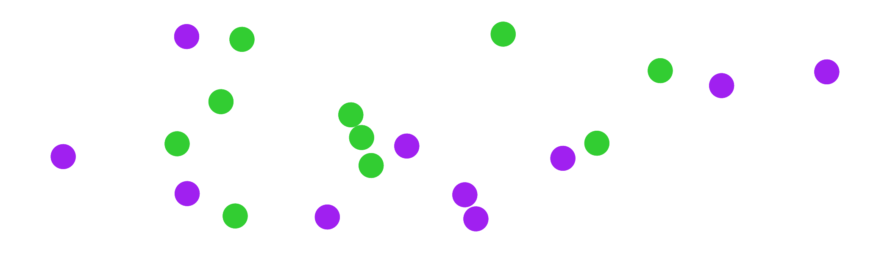
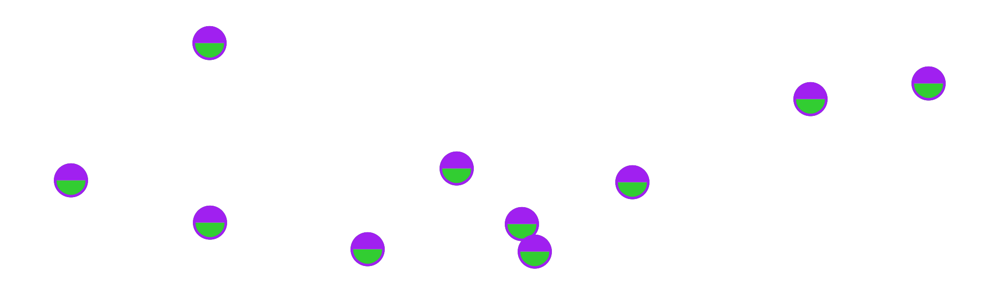
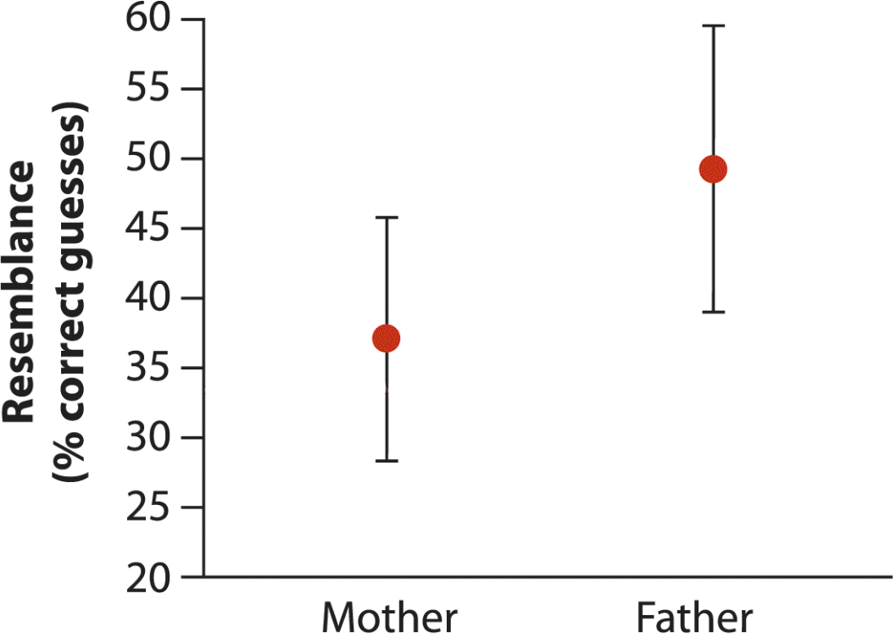
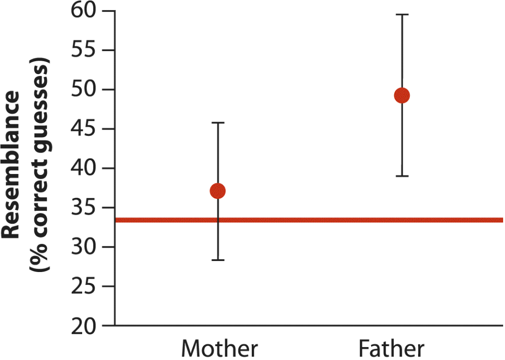
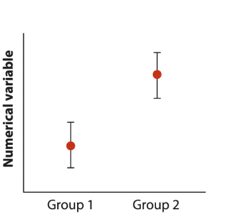
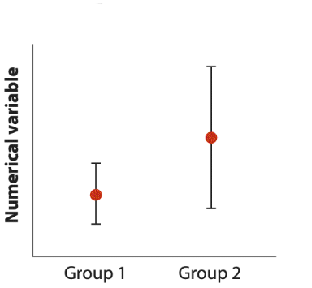
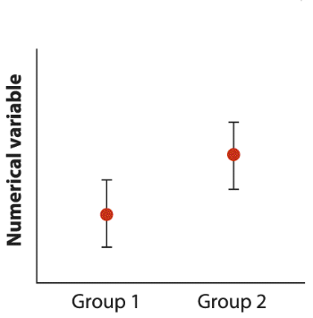
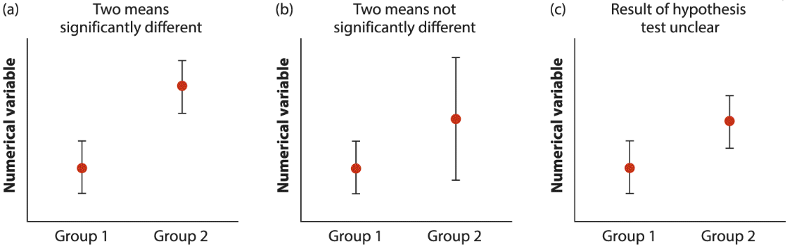

```{r setup, include = FALSE, cache = FALSE, purl = FALSE, fig.showtext = TRUE}
source("assets/setup.R")
knitr::opts_chunk$set(dev.args = list(png  = list(type = "cairo")))
library(xaringanExtra)
use_tile_view()
use_scribble()
use_search(show_icon = FALSE)
use_progress_bar(color = "#6d2b5e", location = "bottom", height = "10px")
use_freezeframe()
# use_webcam()
# use_panelset()
# use_extra_styles(hover_code_line = TRUE)

# http://tachyons.io/docs/
# https://roperzh.github.io/tachyons-cheatsheet/
use_tachyons()

# library(renderthis)
# to_pdf(from = "07-probabilities.Rmd",
#        to = "07-probabilities.pdf",
#        complex_slides = TRUE, partial_slides = TRUE)
```

```{r libs, include=FALSE, warning=FALSE}
library(tidyverse)
library(cowplot)
library(scales)
```

## Cравнение двух групп

- Независимые выборки и парные наблюдения
- Парные наблюдения: два вида снотворного
  - Доверительный интервал к средней разнице значений
  - Парный t-тест
- Независимые выборки: гормоны и артериальная гипертензия
  - Доверительный интервал к разнице средних
  - Двухвыборочный t-тест
    - t-тест Стьюдента
    - t-тест Уэлча (разные SD)
- Множественное тестирование гипотез
- Интерпретация доверительных интервалов на графиках
- Сравнение дисперсий

---

class: middle, center, inverse

# Независимые выборки или парные наблюдения?


```{r sim-paired}
library(MASS)
th_void_frame <- theme_void() + 
  theme(legend.position = "none", 
        # panel.background = element_rect(colour = "black"),
        plot.margin = unit(c(5, 5, 5, 5), "mm")) 

set.seed(6)
n <- 20
n2 <- n/2
dat <- data.frame(mvrnorm(n, c(10, 8), 
                          matrix(c(10,3,4,12),2,2)), 
                  group = rep(c("A", "B"), n))

gg_ind <- ggplot(dat, aes(x = X1, y = X2, colour = group)) +
  geom_point(size = 6) + 
  scale_colour_manual(values = c("limegreen", "purple")) +
  coord_cartesian(clip = 'off') +
  th_void_frame

gg_paired <- dat %>% 
  dplyr::filter(group == "B") %>%
  ggplot(aes(x = X1, y = X2)) +
  geom_text(label ="\u25D2", colour="limegreen", size = 8, family = "DejaVu Sans") +
  geom_text(label = "\u25D3", colour = "purple", size = 8, family = "DejaVu Sans") +
  coord_cartesian(clip = 'off') +
  theme_void() + th_void_frame

ggsave("img/paired-samples.png", gg_paired, device = 'png', bg = "white", width = unit(7, "cm"), height = unit(2, "cm"))
ggsave("img/independent-samples.png", gg_ind, device = 'png', bg = "white", width = unit(7, "cm"), height = unit(2, "cm"))
# plot_grid(gg_ind, gg_paired, nrow = 1)
```

---

## Независимые выборки или парные наблюдения

Два варианта снотворных. Какой из них лучше?

Различается ли изменение продолжительности сна (в часах) при применении этих двух снотворных?

--

Ответить на вопрос могут два варианта эксперимента.

--

.pull-left-45[

__Независимые выборки__



- Наблюдения сделаны на независимых объектах.

- `r n` человек случайным образом разделили на две группы (снотворное 1 или 2).

- __Разница средних значений__ изменения продолжительности сна в двух группах — это разница влияния этих двух снотворных.

]

--

.pull-right-55[

__Парные наблюдения__



- Наблюдения взаимозависимые  
(парные). 

- `r n2` человек, с каждым последовательно провели оба варианта эксперимента (снотворное 1 или 2).

- __Средняя разница__ изменения продолжительности сна человека со снотворным 1 и со снотворным 2 — это разница влияния этих двух снотворных.

]

---

class: middle, center, inverse

# Парные наблюдения

## Пример: Два вида снотворного

---

## Пример: Два вида снотворного


В датасете `sleep` содержатся данные об увеличении продолжительности сна по сравнению с контролем после применения двух снотворных препаратов (Cushny, Peebles, 1905, Student, 1908).

Одинаково ли два снотворных влияют на увеличение продолжительности сна?

.pull-left-40[

```{r sleep-data}
data(sleep)
sl_wide <- sleep %>% pivot_wider(id_cols = ID, names_from = group, names_prefix = "pill_", values_from = extra)

sl_wide %>% kable()
```

]

--

.pull-right-60[

```{r opts.label='fig.medium.taller'}
sleep %>% 
  mutate(pill = ifelse(group == 1, "pill_1", "pill_2")) %>% 
ggplot(data = ., aes(x = pill, y = extra, colour = ID)) + geom_point(size = 3) + geom_line(aes(group = ID), size = 1) + labs(y = "Изменение\nпродолжительности\nсна, час") + theme(axis.title.x = element_blank(), legend.position = "bottom")

```

]

---

## Средняя разница в парах значений

Если посчитать разницу между значениями для одного и того же объекта, то можно превратить парные данные в данные одной единственной выборки.


.pull-left[
```{r sleep-data}
```
]

.pull-right[

```{r sl-diff}
sl_diff <- sl_wide %>% mutate(d = pill_2 - pill_1) %>% dplyr::select(ID, d)
sl_diff %>% kable()
```
]

---

## Средняя разница в парах значений

Две возможных задачи:

.pull-left[

1. Можно _оценить среднюю разницу_  между изменением продолжительности сна после первого и второго снотворного (т.е. $\mu_d$).

2. Можно проверить, _отличается ли эта средняя разница от нуля_ (т.е. $H_0: \mu_d = 0$).

]

.pull-right[

```{r sl-diff}
```
]

---

class: middle, center, inverse

## Доверительный интервал к средней разнице значений

---

## Средняя разница значений

.pull-left-40[

```{r sl-diff-full}
sl_wide %>% mutate(d = pill_2 - pill_1) %>% kable()
```

]

.pull-right-60[

```{r echo=FALSE, results='hide'}
m <- mean(sl_diff$d, na.rm = TRUE)
s <- sd(sl_diff$d, na.rm = TRUE)
n <- length(na.omit(sl_diff$d))
semdiff <- s / sqrt(n)
dfmdiff <- n - 1
tval <- qt(p = 0.975,df = dfmdiff)
```

разница (между эффектом снотворных 2 и 1)  
$d_i = pill_{2i} - pill_{1i}$

средняя разница   
$\bar d = `r m`$

выборочное стандартное отклонение разницы   
$s_d = \sqrt{\frac{\sum(d_i - \bar d)^2}{n - 1}} = `r s`$

размер выборки   
$n = `r n`$

]

---

## Доверительный интервал к средней разнице

.pull-left-55[

```{r echo=FALSE, purl=FALSE, opts.label='fig.column'}
arb <- arrow(angle = 10, ends = "both", type = "closed", length = unit(3, "mm"))
ar <- arrow(angle = 10, ends = "last", type = "closed", length = unit(3, "mm"))

df_plot <- dfmdiff

lims <- qt(p = c(0.025, 0.975), df = df_plot)
labs <- format(lims, digits = 2, nsmall = 3)
ggplot(data = data.frame(t = -5.5:5.5), aes(x = t)) +
  stat_function(fun = dt, args = list(df = df_plot), colour = 'red', size = 1) +
  scale_x_continuous(breaks = -5:5) +
  scale_y_continuous('Плотность вероятности') +
  coord_cartesian(ylim = c(0, 0.47)) +
  stat_function(geom = 'area', fun = dt, args = list(df = df_plot), xlim = lims,
                fill = 'red', alpha = 0.25) +
  annotate('text', label = 'P == 0.95', parse = T,
           x = 0, y = 0.1, size = 7) +
  annotate('text', label = '0.025', parse = T, size = 6,
           x = lims, y = 0.01, hjust = c(1.03, -0.03)) +
  geom_vline(xintercept = lims, linetype = 'dashed') +
  annotate(geom = 'text', label = c(paste('-t[0.025, 9]==', labs[1]), paste('t[0.975, 0]==', labs[2])), hjust = c(1.03, -0.03),
           x = lims, y = 0.1, parse = TRUE, size = 7) +
  annotate('path', x = lims, y = rep(0.42, 2), arrow = arb) +
  annotate('text', label = paste('Для~df==', df_plot, '~~~~~~~bar(d)%+-%', labs[2], '*~s[bar(d)] / sqrt(n)'), vjust = -0.5, x = 0, y = 0.42, parse = TRUE, size = 7)
```

$\bar d \pm |t_{\alpha, df}|\cdot SE_{\bar d}$

$df = n - 1$

$SE_{\bar d} = \frac{s_d}{\sqrt{n}}$

]

--

.pull-right-45[
В нашем примере

$SE_{\bar d} = \frac{`r s`}{\sqrt{`r n`}} = `r semdiff`$

$df = `r n` - 1 = `r dfmdiff`$

<br/>

Таким образом, 95% доверительный интервал для средней разницы эффектов двух снотворных

$\bar d \pm |t_{\alpha, df}|\cdot SE_{\bar d}$

$`r m` \pm `r round(tval, 3)` \cdot `r semdiff`$

то есть

$`r m` \pm `r round(tval * semdiff, 3)`$

]


---

class: middle, center, inverse

## Парный _t_-тест

---

## Гипотезы в парном _t_-тесте

На человеческом языке:

$H_0:$ эффективность снотворных не различается.

$H_A:$ у снотворных разная эффективность.

--

<br/>

На языке статистики:

$H_0: \mu_d = 0$ — средняя разница значений в парах равна нулю

$H_A: \mu_d \ne 0$ — средняя разница значений в парах не равна нулю

---

## Парный _t_-тест

$H_0: \mu_d = 0$ — средняя разница значений в парах равна нулю

$H_A: \mu_d \ne 0$ — средняя разница значений в парах не равна нулю

--

_t_-тест в общем виде: 

--

$$t=\frac{\text{Наблюдаемая величина - Ожидаемое значение при }H_0}{\text{Стандартная ошибка}}$$

<br/>

--

$$t = \frac{\bar d - \mu_d}{SE_{\bar d}} \sim t(df)$$

$df = n - 1$

--

Парный _t_-тест — это всего лишь одновыборочный _t_-тест для средней разницы значений в парах.

---

## Парный _t_-тест в нашем примере

.pull-left[

```{r echo=FALSE}
t_val <- round((m - 0) / (s / sqrt(n)), 3)
p_val <- format(2*(1 - pt(abs(t_val), df = n - 1)), digits = 1, nsmall = 3)
```


```{r echo=FALSE, purl=FALSE, opts.label='fig.column'}
cols <- c('yellow2', 'red')
labs <- c(paste('p =', p_val), expression(alpha ==0.05))
mappings <- factor(c('p', 'alpha'), levels = c('p', 'alpha'), labels = labs)
names(cols) <- labs

gg_test_alpha_p <- 
  ggplot(data = data.frame(t = -6:6), aes(x = t)) + 
  stat_function(fun = dt, args = list(df = dfmdiff), 
                colour = 'darkcyan', size = 1) +
  scale_x_continuous(breaks = -6:6) +
  coord_cartesian(ylim = c(0, 0.4), xlim = c(-5, 5)) +
  labs(y = 'Плотность вероятности') +
  # Выноски для t
  annotate(geom = 'segment', 
           x = c(-t_val, t_val), 
           y = dt(c(-t_val, t_val), df = dfmdiff) + 0.15,
           xend = c(-t_val, t_val), 
           yend = c(0, 0), 
           arrow = ar) +
  # Подпись t
  annotate(geom = 'text', label = c(paste('-t =', -t_val), paste('t =', t_val)),
           x = c(-t_val, t_val), 
           y = dt(c(-t_val, t_val), df = n - 1) + 0.15,
           vjust = -0.3, size = 8) + 
  # Критический уровень значимости
  stat_function(geom = 'area', fun = dt, args = list(df = n - 1), 
                aes(fill = mappings[2]), xlim = c(-4, qt(0.025, df = n - 1)), alpha = 0.3) +
  stat_function(geom = 'area', fun = dt, args = list(df = n - 1), 
                aes(fill = mappings[2]), xlim = c(qt(0.975, df = n - 1), 4), alpha = 0.3) +
  # Значение p, уровень значимости
  stat_function(geom = 'area', fun = dt, args = list(df = n - 1), 
                aes(fill = mappings[1]), xlim = c(-4, -t_val), alpha = 0.9) +
  stat_function(geom = 'area', fun = dt, args = list(df = n - 1), 
                aes(fill = mappings[1]), xlim = c(t_val, 4), alpha = 0.9) +
  scale_fill_manual('', values = cols, labels = labs) +
  guides(fill = guide_legend(override.aes = list(alpha = 0.25)))+
  theme(legend.position = c(0, 1), legend.background = element_blank(), legend.justification = c(0, 1))

gg_test_alpha_p # сравнение с уровнем значимости
```

$$t = \frac{\bar d - \mu_d}{SE_{\bar d}}$$

$df = n - 1$

$SE_{\bar d} = \frac{s_d}{\sqrt{n}}$

]

--

.pull-right[

В нашем примере

$SE_{\bar d} = \frac{`r s`}{\sqrt{`r n`}} = `r (se <- s / sqrt(n))`$

$df = `r n` - 1 = `r n - 1`$

<br/>

Таким образом, наблюдаемое значение t-статистики 

$t = \frac{\bar d - \mu_d}{SE_{\bar d}} = \frac{`r m` - 0}{`r se`} = `r m/se`$

Ему соответствует $p = `r p_val`$

`r ifelse(p_val <=0.05, "Oтвергаем", "Cохраняем")` $H_0$

]

---

## Опишем результаты

.pull-left-40[

```{r echo=FALSE, results='hide'}
tt <- t.test(formula = extra ~ group, data = sleep, paired = TRUE)
tt
```

Различия изменения продолжительности сна при применении двух препаратов были статистически значимы ( $t_{`r round(tt$parameter, 2)`} = `r round(tt$statistic, 2)`$, $p = `r format.pval(tt$p.value, eps = 0.01)`$)

]

.pull-right-60[

```{r opts.label='fig.medium.taller'}
sleep %>% 
  mutate(pill = ifelse(group == 1, "pill_1", "pill_2")) %>% 
  ggplot(data = ., aes(x = pill, y = extra, colour = pill)) + stat_summary(fun.data = mean_cl_boot) + 
  scale_x_discrete(labels = c("снотворное 1", "снотворное 2")) +
  labs(y = "Изменение\nпродолжительности\nсна, час") +
  theme(axis.title.x = element_blank(), 
        legend.position = "none")

```

]

--

<br/>

**Осторожно!** Если бы мы не учли зависимость между группами, то пришли бы к неверному выводу.

--

<br/>

Кроме того, прежде чем описывать результаты, хорошо бы проверить выполнение условий применимости теста.


---

## Условия применимости одновыборочного _t_-теста

Прежде чем описывать результаты, нужно проверить выполнение условий применимости теста.

<br/>

--

1.Объекты исследования независимы друг от друга?

--

- Да, независимы. Это случайная выборка людей.

--

2.Наблюдения зависимы друг от друга?

--

- Да, одни и те же люди участвуют в обоих вариантах исследования (10 человек, каждый пил оба снотворных). Эти данные подходят для парного t-теста.

--

3.Объем выборки достаточно велик или разницы значений $d$ нормально распределены?

--

- Объем выборки мал, $n = `r n`$

Нужно проверить форму распределения разницы значений.

---

## Нормально ли распределена разница значений?


.pull-left[

```{r echo=FALSE, opts.label='fig.medium.taller'}
library(car)
par(cex = 1.4)
qqPlot(sl_diff$d, id = FALSE, ylab = "d")
```

]

--

.pull-right[

Могло бы быть и лучше. Одно наблюдение сильно отклоняется от ожиданий для нормального распределения.

Для этих данных хорошо бы использовать другой, непараметрический тест, у которого нет таких жестких требований к данным. Позже мы с такими тестами познакомимся.

]


---

class: middle, center, inverse

# Независимые выборки

## Пример: Гормоны и артериальная гипертензия

---

## Пример: Гормоны и артериальная гипертензия

Синдром Кушинга --- это нарушения уровня артериального давления, вызванные гиперсекрецией кортизола надпочечниками.

В датасете `Cushings` (пакет `MASS`) записаны данные о секреции его метаболита тетрагидрокортизона с мочой (мг/сут.) при разных типах синдрома Кушинга (данные из кн. Aitchison, Dunsmore, 1975):

- `a` --- аденома
- `b` --- двусторонняя гиперплазия
- `c` --- карцинома
- `u` --- другие патологии (без уточнения)

Пусть нас интересует только две из этих групп: аденома и двусторонняя гиперплазия надпочечников.

--

Две возможных задачи:

1. Можно оценить разницу среднего уровня секреции гидрокортизона при этих двух патологиях (т.е. $\mu_1 - \mu_2$).

2. Можно проверить, отличается ли эта разница от нуля (т.е. $H_0: \mu_1 - \mu_2 = 0$).

---

class: middle, center, inverse

# Доверительный интервал к разнице средних

---

## Разница выборочных средних

Чему равна $\mu_1 - \mu_2$ разница среднего уровня секреции гидрокортизона при аденоме и двусторонней гиперплазии надпочечников в генеральной совокупности?

Это можно оценить по разнице средних в выборках 

```{r echo=FALSE, results='hide'}
library(MASS)
data("Cushings")
# выборка 1
X1 <- Cushings$Tetrahydrocortisone[Cushings$Type == "a"]
# выборка 2
X2 <- Cushings$Tetrahydrocortisone[Cushings$Type == "b"]
x1 <- mean(X1, na.rm = TRUE)
x2 <- mean(X2, na.rm = TRUE)
```

$\bar x_1 - \bar x_2 = `r x1` - `r x2` = `r x1 - x2`$

<br/>

Чтобы построить к ней доверительный интервал, нужно понять, как она распределена.

---

## Распределение разницы выборочных средних

Если $x_1 \sim N(\mu_1, \sigma_1)$ и $x_2 \sim N(\mu_2, \sigma_2)$ или размер выборки достаточно велик,

то __согласно ЦПТ__ мы можем сказать, что их средние значения...

--

$\bar x_1 \sim N(\mu_1, \sigma_1/\sqrt{n_1})$ и $\bar x_2 \sim N(\mu_2, \sigma_2/\sqrt{n_2})$

--

<br/>

Тогда разница выборочных средних (двух нормально распределенных величин)  
будет нормально распределена

$$\bar x_1 - \bar x_2 \sim N(\mu_1 - \mu_2, SE_{\bar x_1 - \bar x_2})$$

со стандартной ошибкой

$$SE_{\bar{x}_1 - \bar{x}_2} = \sqrt{ \frac{\sigma_1^2}{n_{1}} + \frac{\sigma_2^2}{n_{2}}}$$

Стандартную ошибку придется оценить по данным выборок.

---

## Оценка стандартной ошибки разницы средних

Стандартная ошибка разницы средних:  
$$SE_{\bar{x}_1 - \bar{x}_2} = \sqrt{ \frac{\sigma_1^2}{n_{1}} + \frac{\sigma_2^2}{n_{2}}}$$

--

__Если предположить, что дисперсии в группах равны__  
(вернее, в генеральных совокупностях, откуда были сделаны выборки), то

$$SE_{\bar{x}_1 - \bar{x}_2} = \sqrt{\sigma^2 \big( \frac{1}{n_{1}} + \frac{1}{n_{2}}\big)}$$

--

Тогда $\sigma^2$ можно оценить как $s_p^2 = \cfrac{(n_1 - 1)s^2_1 + (n_2 - 1)s^2_2}{(n_1 - 1) + (n_2 - 1)}$

$s_p^2$ — это __обобщенная дисперсия__ (pooled variance), т.е. усредненная дисперсия в двух выборках, взвешенная по их числу степеней свободы.

--

Т.е. $$SE_{\bar{x}_1 - \bar{x}_2} \approx \sqrt{s_p^2 \big( \frac{1}{n_{1}} + \frac{1}{n_{2}}\big)}$$

---

## Распределение выборочных средних <br/>для построения доверительного интервала <br/>разницы средних

Распределение разницы выборочных средних  

$$\bar x_1 - \bar x_2 \sim N(\mu_1 - \mu_2, SE_{\bar x_1 - \bar x_2})$$

После стандартизации превращается в

$$t = \frac{(\bar x_1 - \bar x_2) - (\mu_1 - \mu_2)}{SE_{\bar x_1 - \bar x_2}} \sim t(df)$$

Т.е. стандартизованная разница средних подчиняется _t_-распределению с числом степеней свободы $df = n_1 + n_2 - 2$. (Это справедливо с учетом сделанных ранее предположений, т.е. если выполняется ЦПТ и дисперсии в выборках равны).

И это распределение как раз можно использовать для построения доверительного интервала.

---

## Доверительный интервал к разнице средних

```{r echo=FALSE, results='hide'}
n1 <- length(na.omit(X1))
n2 <- length(na.omit(X2))
sd1 <- sd(X1, na.rm = TRUE)
sd2 <- sd(X2, na.rm = TRUE)
df1 <- n1 - 1
df2 <- n2 - 1
df12 <- n1 + n2 - 2
s2p <- (df1*sd1^2 + df2*sd2^2)/df12
sedif <- sqrt(s2p * (1/n1 + 1/n2))
tval <- qt(p = 0.975, df = df12)
```


.pull-left[

```{r echo=FALSE, purl=FALSE, opts.label='fig.column'}
arb <- arrow(angle = 10, ends = "both", type = "closed", length = unit(3, "mm"))
ar <- arrow(angle = 10, ends = "last", type = "closed", length = unit(3, "mm"))
lims <- qt(p = c(0.025, 0.975), df = df12)
labs <- format(lims, digits = 2, nsmall = 3)

gg_conf_0 <- ggplot(data = data.frame(t = -5:5), aes(x = t)) +
  stat_function(fun = dt, args = list(df = n - 1), colour = 'red', size = 1) +
  scale_x_continuous(breaks = -5:5) +
  scale_y_continuous('Плотность вероятности') +
  coord_cartesian(ylim = c(0, 0.47))
gg_conf_1 <- gg_conf_0 +
  stat_function(geom = 'area', fun = dt, args = list(df = n - 1), xlim = lims,
                fill = 'red', alpha = 0.25) +
  annotate('text', label = 'P == 0.95', parse = T,
           x = 0, y = 0.1, size = 7) +
  annotate('text', label = '0.025', parse = T, size = 6,
           x = lims, y = 0.01, hjust = c(1.03, -0.03))
gg_conf_2 <- gg_conf_1 +
  geom_vline(xintercept = lims, linetype = 'dashed') +
  annotate(geom = 'text', label = c(paste('-t[0.025, 9]==', labs[1]), paste('t[0.975, 0]==', labs[2])), hjust = c(1.03, -0.03),
           x = lims, y = 0.1, parse = TRUE, size = 7)
gg_conf_2 +
  annotate('path', x = lims, y = rep(0.42, 2), arrow = arb) +
  annotate('text', label = paste('Для~df==', df12, '~~~~~~~bar(x)[1] - bar(x)[2]%+-%', labs[2], '*~SE[bar(x)[1] - bar(x)[2]]'), vjust = -0.5, x = 0, y = 0.42, parse = TRUE, size = 7)
```

$\bar x_1 - \bar x_2 \pm t(\alpha,df) \cdot SE_{\bar x_1 - \bar x_2 }$

$df = n_1 + n_2 - 2$

$SE_{\bar{x}_1 - \bar{x}_2} = \sqrt{s_p^2 \big( \frac{1}{n_{1}} + \frac{1}{n_{2}}\big)}$

$s_p^2 = \cfrac{(n_1 - 1)s^2_1 + (n_2 - 1)s^2_2}{(n_1 - 1) + (n_2 - 1)}$
]

--

.pull-right[
В нашем примере

$x_1 = `r x1`$, $x_2 = `r x2`$  
$n_1 = `r n1`$, $n_2 = `r n2`$  
$sd_1 = `r round(sd1, 3)`$, $sd_2 = `r round(sd2, 3)`$

$s_p^2 = \cfrac{(`r n1` - 1) `r sd1`^2 + (`r n2` - 1) `r sd2`^2}{(`r n1` - 1) + (`r n2` - 1)} = \\ \frac{`r ((n1-1)*sd1^2 + (n2-1)*sd2^2)`}{`r (n1 + n2 - 2)`} = `r round(s2p, 3)`$

$SE_{\bar d} = \sqrt{`r s2p` \big( \frac{1}{`r n1`} + \frac{1}{`r n2`}\big)} = `r round(sedif, 3)`$

$df = `r n1` + `r n2` - 2 = `r df12`$

95% доверительный интервал для разницы среднего уровня секреции тетрагидрокортизона (мг/сут.) при аденоме и двусторонней гиперплазии надпочечников  
$`r x1` - `r x2` \pm `r round(tval, 3)` \cdot `r sedif`$

то есть

$`r x1 - x2` \pm `r round(tval * sedif, 3)`$

]

---

class: middle, center, inverse

# Двухвыборочный t-тест

---

## Гипотезы в двухвыборочном $t$-тесте

На человеческом языке:

$H_0:$ средний уровень секреции тетрагидрокортизона одинаков при аденоме и двусторонней гиперплазии надпочечников.

$H_A:$ при этих двух патологиях средний уровень секреции тетрагидрокортизона разный.

--

<br/>

На языке статистики:

$H_0: \mu_1 - \mu_2 = 0$ --- разность между средними в двух группах равна нулю.

$H_A: \mu_1 - \mu_2 \ne 0$ --- между средними в группах есть ненулевая разница.


---

## Двухвыборочный _t_-тест

$H_0: \mu_1 - \mu_2 = 0$ --- разность между средними в двух группах равна нулю.

$H_A: \mu_1 - \mu_2 \ne 0$ --- между средними в группах есть ненулевая разница.

<br/>

_t_-тест в общем виде: 

$$t=\frac{\text{Наблюдаемая величина - Ожидаемое значение}}{\text{Стандартная ошибка}}$$

--

$$t=\frac{(\bar{x}_1 - \bar{x}_2) - (\mu_1 - \mu_2)}{SE_{\bar{x}_1 - \bar{x}_2}} \; = \; \frac{\bar{x}_1 - \bar{x}_2}{SE_{\bar{x}_1 - \bar{x}_2}} \sim t(df)$$

--

$SE_{\bar{x}_1 - \bar{x}_2}$ --- стандартная ошибка разности двух средних, может рассчитываться по-разному

- t-тест Стьюдента --- если считать, что дисперсии в группах равны (как мы это только что делали для расчета доверительного интервала)
- t-тест Уэлча --- если считать, что дисперсии могут быть разными

---

## Стандартная ошибка разности средних в t-тесте Стьюдента

Student 1908

Если группы независимы и дисперсии в них равны, то по центральной предельной теореме

$$SE_{\bar{x}_1 - \bar{x}_2} = \sqrt{ \frac{\sigma^2}{n_{1}} + \frac{\sigma^2}{n_{2}}} \approx \sqrt{ \frac{s_p^2}{n_{1}} + \frac{s_p^2}{n_{2}}}$$

где $s_p^2 = \cfrac{(n_1 - 1)s^2_1 + (n_2 - 1)s^2_2}{(n_1 - 1) + (n_2 - 1)}$ --- это __обобщенная дисперсия__ по двум выборкам.

Результирующая $t$-статистика подчиняется $t$-распределению с  $df = n_1 + n_2 - 2$.

--

<br/>

__Осторожно!__ Равенство дисперсий в группах --- это часто нереалистичное предположение!

---

## Cтандартная ошибка разности средних в t-тесте Уэлча

Если группы независимы и дисперсии в них неизвестны, то получается

$$SE_{\bar{x}_1 - \bar{x}_2} = \sqrt{ \frac{\sigma^2_{1}}{n_{1}} + \frac{\sigma^2_{2}}{n_{2}}} \approx \sqrt{ \frac{s^2_{1}}{n_{1}} + \frac{s^2_{2}}{n_{2}}}$$

--

Проблема в том, что эта величина __лишь приблизительно следует t-распределению__, если считать его степени свободы как обычно для двух групп $df = n_1 + n_2 - 2$.

Это из-за того, что мы оцениваем __две__ дисперсии  
при помощи их стандартных отклонений. 

--

__Приблизительное число степеней свободы__ можно рассчитать по уравнению Уэлча-Саттеруэйта (Welch-Satterthwaite). Это решит проблему. 

$$df_{WS} \approx \cfrac {\bigg(\cfrac{s^2_{1}}{n_{1}} + \cfrac{s^2_{2}}{n_{2}}\bigg)^2}
{\cfrac{1}{n_{1} - 1}\bigg(\cfrac {s_{1}^2} {n_{1}}\bigg)^2 + \cfrac{1}{n_{2} - 1}\bigg(\cfrac {s_{2}^2} {n_{2}}\bigg)^2}$$

--

t-тестом Уэлча можно пользоваться, даже если дисперсии равны.

Он немного консервативнее, чем тест Стьюдента.

---

## Условия применимости двухвыборочного t-теста

Почти такие же, как условия справедливости ЦПТ

--

- Наблюдения независимы друг от друга.
- Выборки независимы друг от друга (новое условие).
- Объем выборки достаточно велик или величины нормально распределены.

- Для теста Стьюдента требуется равенство дисперсий в выборках.  
Для теста Уэлча это не требуется.

---

## Проверяем условия применимости...

1.Наблюдения независимы друг от друга?

--

- Да, независимы. Это случайная выборка.

<br/>

--

2.Выборки независимы друг от друга?

--

- Да, независимы. В группах разные люди (естественно, т.к. тип синдрома у человека может быть только какой-то один).

<br/>

--

3.Объем выборки достаточно велик или величины нормально распределены?

--

- Объем выборки мал

Пациентов с аденомой всего $n_1 = `r n1`$,  
а с двусторонней гиперплазией надпочечников — $n_2 = `r n2`$.

Нужно проверить форму распределения в обеих группах.

---

## Нормально ли распределены концентрации тетрагидрокортизона в группах?

```{r echo=FALSE, opts.label='fig.wide.taller'}
library(car)
par(mfrow = c(1, 2), cex = 1.3)
qqPlot(X1, id = FALSE, ylab = "Тетрагидрокортизон, мг./сут.", main = "Аденома")
qqPlot(X2, id = FALSE, ylab = "Тетрагидрокортизон, мг./сут.", main = "Двусторонняя\nгиперплазия")
par(mfrow = c(1, 1))
```

--

В одной из групп несколько значений выбиваются. Но при таких ничтожно малых объемах выборки сложно ожидать лучшего. 

В этом учебном примере будем считать, что можно аппроксимировать концентрацию тетрагидрокортизона нормальным распределением.

---

## Двухвыборочный _t_-тест в нашем примере

.pull-left-45[

```{r echo=FALSE, results='hide'}
sews <- sqrt((sd1^2) /n1 + (sd2^2)/n2)
dfws <- (((sd1^2)/n1 + (sd2^2)/n2)^2)/((1/df1) * ((sd1^2)/n1)^2 + (1/df2) * ((sd2^2)/n2)^2)

t_val <- (x1 - x2) / sews
p_val <- format(2*(1 - pt(abs(t_val), df = dfws)), digits = 1, nsmall = 3)

tt <- t.test(formula = Tetrahydrocortisone ~ Type, data = Cushings, subset = Cushings$Type %in% c('a', 'b'))
# tt$statistic
# tt$parameter
# tt$p.value
```


```{r echo=FALSE, purl=FALSE, opts.label='fig.column'}
cols <- c('yellow2', 'red')
labs <- c(paste('p =', p_val), expression(alpha ==0.05))
mappings <- factor(c('p', 'alpha'), levels = c('p', 'alpha'), labels = labs)
names(cols) <- labs

df_plot <- round(dfws, 1)
tval_plot <- abs(round(t_val, 2))
gg_test_alpha_p <- 
  ggplot(data = data.frame(t = -6:6), aes(x = t)) + 
  stat_function(fun = dt, args = list(df = df_plot), 
                colour = 'darkcyan', size = 1) +
  scale_x_continuous(breaks = -6:6) +
  coord_cartesian(ylim = c(0, 0.4), xlim = c(-5, 5)) +
  labs(y = 'Плотность вероятности') +
  # Выноски для t
  annotate(geom = 'segment', 
           x = c(-tval_plot, tval_plot), 
           y = dt(c(-tval_plot, tval_plot), df = df_plot) + 0.15,
           xend = c(-tval_plot, tval_plot), 
           yend = c(0, 0), 
           arrow = ar) +
  # Подпись t
  annotate(geom = 'text', label = c(paste('-t =', -tval_plot), paste('t =', tval_plot)),
           x = c(-tval_plot, tval_plot), 
           y = dt(c(-tval_plot, tval_plot), df = n - 1) + 0.15,
           vjust = -0.3, size = 8) + 
  # Критический уровень значимости
  stat_function(geom = 'area', fun = dt, args = list(df = n - 1), 
                aes(fill = mappings[2]), xlim = c(-5, qt(0.025, df = n - 1)), alpha = 0.3) +
  stat_function(geom = 'area', fun = dt, args = list(df = n - 1), 
                aes(fill = mappings[2]), xlim = c(qt(0.975, df = n - 1), 4), alpha = 0.3) +
  # Значение p, уровень значимости
  stat_function(geom = 'area', fun = dt, args = list(df = df_plot),
                aes(fill = mappings[1]), xlim = c(-5, -tval_plot), alpha = 0.9) +
  stat_function(geom = 'area', fun = dt, args = list(df = df_plot),
                aes(fill = mappings[1]), xlim = c(tval_plot, 5), alpha = 0.9) +
  scale_fill_manual('', values = cols, labels = labs) +
  guides(fill = guide_legend(override.aes = list(alpha = 0.25)))+
  theme(legend.position = c(0, 1), legend.background = element_blank(), legend.justification = c(0, 1))

gg_test_alpha_p # сравнение с уровнем значимости
```

$$t= \; \frac{\bar{x}_1 - \bar{x}_2}{SE_{\bar{x}_1 - \bar{x}_2}}$$

$SE_{\bar{x}_1 - \bar{x}_2} = \sqrt{ \frac{s^2_{1}}{n_{1}} + \frac{s^2_{2}}{n_{2}}}$

$df_{ WS} \approx \cfrac {\big(\frac{s^2_{1}}{n_{1}} + \frac{s^2_{2}}{n_{2}}\big)^2} {\frac{1}{n_{1} - 1}\big(\frac {s_{1}^2} {n_{1}}\big)^2 + \frac{1}{n_{2} - 1}\big(\frac {s_{2}^2} {n_{2}}\big)^2}$

]

--

.pull-right-55[

В нашем примере

$SE_{\bar{x}_1 - \bar{x}_2} = \sqrt{ \frac{`r sd1`^2}{`r n1`} + \frac{`r sd2`^2}{`r n2`}} = `r round(sews, 3)`$

$df_{ WS} \approx \frac {\big({\frac{`r sd1`^2}{`r n1`} + \frac{`r sd2`^2}{`r n2`}}\big)^2} {\frac{1}{`r n1` - 1}\big(\frac {`r sd1`^2} {`r n1`}\big)^2 + \frac{1}{`r n2` - 1}\big(\frac {`r sd2`^2} {`r n2`}\big)^2} = \\ = `r dfws`$

<br/>

Таким образом, значение t-статистики 

$$t= \; \frac{`r x1` - `r x2`}{`r round(sews, 3)`} = `r round(t_val, 3)`$$

Ему соответствует $p = `r p_val`$

`r ifelse(p_val <=0.05, "Oтвергаем", "Cохраняем")` $H_0$

]


---

## Опишем результаты

.pull-left[

Уровень секреции тетрагидрокортизона статистически значимо отличается у пациентов с аденомой и двусторонней гиперплазией надпочечников  
( $t_{`r round(tt$parameter, 2)`} = `r round(tt$statistic, 2)`$, $p = `r format.pval(tt$p.value, eps = 0.05)`$).

]
.pull-right[

```{r}
ggplot(data = Cushings[Cushings$Type %in% c('a', 'b'), ],
       aes(x = Type, y = Tetrahydrocortisone)) +
  stat_summary(fun.data = mean_cl_normal) +
  scale_x_discrete(labels = c("аденома", "двусторонняя\nгиперплазия"))+
  coord_cartesian(ylim = c(0, 11)) +
  labs(x = "Тип патологии", y = "Тетрагидрокортизон\nмг./сут.")
```

]

--

Можно указать в скобках не сравнение с $\alpha$, а само значение $p$:  
( $t_{`r round(tt$parameter, 2)`} = `r round(tt$statistic, 2)`$, $p = `r format.pval(tt$p.value, digits = 2, eps = 0.001)`$).

Только не надо безумствовать и указывать слишком много знаков...

---

class: middle, center, inverse

# Множественное тестирование гипотез

---

## Есть ли взаимосвязь <br/>между поведением бабочек в Швейцарии <br/>и дождем в Париже?

Inaudi et al. 1995. Chaos: evidence for the butterfly effect. Annals of Improbable research 1 (6).

--

Если проверить много-много взаимосвязей, то сколько-то из них окажутся статистически значимыми.

Чем больше тестов, тем больше вероятность ошибочно обнаружить различия.

---

## Множественное тестирование гипотез

В датасете `Cushings` (пакет `MASS`) есть информация о секреции тетрагидрокортизона с мочой (мг/сут.) при синдроме Кушинга (данные из кн. Aitchison, Dunsmore, 1975). Всего 4 типа патологии:

- `a` --- аденома
- `b` --- двусторонняя гиперплазия
- `c` --- карцинома
- `u` --- другие патологии (без уточнения)


Мы сравнили уровень секреции только при двух из них. 

А что, если мы хотим сравнить все друг с другом?  

Сколько всего нужно будет сделать сравнений?

--

$m$ — количество попарных сравнений $k$ групп между собой:

$m = \frac{k^2 - k}{2}$, т.е. в нашем случае $m = \frac{4^2 - 4}{2} = 6$

---

## Тестируем множество гипотез

Сравним уровень секреции тетрагидрокортизона при разных типах патологий при помощи двухвыборочного _t_-теста.

.pull-left[

```{r}
ptt <- with(Cushings, pairwise.t.test(x = Tetrahydrocortisone, g = Type, p.adjust.method = "none"))

pdfr <- ptt$p.value %>% 
  as.data.frame() %>% 
  rownames_to_column("Группа 1") %>% 
  pivot_longer(cols = c("a", "b", "c"), 
               names_to = "Группа 2", 
               values_to = "p в t-тесте") %>% 
  na.omit()

kable(pdfr)
```
]
.pull-right[

Представим, что мы проводим каждый из тестов при $\alpha = 0.05$, желая зафиксировать вероятность ошибок I рода  на уровне 5%.

В этом случае количество тестов, где различия оказались статистически значимыми: `r sum(pdfr$"p в t-тесте" <= 0.05)`

]

--

<br/>

Но вот вероятность ошибок I рода в итоге вовсе не 5%.


---

## При множественных тестах увеличивается вероятность ошибочно найти различия

$\alpha$ --- это вероятность совершить хотя бы одну ошибку I рода (найти различия там, где их нет).

Если сделать $n$ тестов, то вероятность совершить хотя бы одну ошибку I рода во всем семействе тестов (family-wise error rate, FWER) значительно возрастает.

$$1 - (1 - \alpha)^m$$

--

Например, если мы проведем 6 тестов на уровне значимости 0.05, то c вероятностью 26.5 мы совершим хотя бы одну ошибку I рода, т.е. практически в 1/4 всех тестов.

---

## Поправка Бонферрони

Простой, но очень жесткий способ коррекции. Зная общее число тестов, можно вычислить скорректированный уровень значимости и использовать его.

$$\alpha^* = \frac{\alpha}{m}$$

--

<br/>

Например, чтобы сохранить в группе из 6 тестов вероятность ошибки I рода 0.05, 
нужно проводить каждый тест при $\alpha^* = 0.00833$.

--

А если бы нужно было сделать 10 тестов, то при $\alpha^* = 0.005$, и т.д.

--

При проведении множества тестов (не обязательно попарных)  
резко возрастает вероятность ошибки II рода,   
т.е. не найти различий там, где они есть.

---

## Применим поправку Бонферрони

Bonferroni, 1936

Каждый из 6 тестов проводим при $\alpha^* = 0.00833$.

```{r}
pdfr_bonf <- pdfr %>% mutate("C поправкой Бонферрони" = ifelse(`p в t-тесте` <= 0.05/nrow(pdfr), "Отвергаем $H_0$", "Сохраняем $H_0$")) 

kable(pdfr_bonf)
```

После поправки Бонферрони мы сохранили для всего семейства сравнений вероятность ошибки I рода на уровне 5%. Но при этом не осталось значимых различий — такая это жесткая поправка.

---

## Метод Хольма-Бонферрони

Holm, 1979

--

Чтобы зафиксировать $FWER \le \alpha$:

1.Сортируем в порядке возрастания $m$ значений $p$, полученные в тестах, и присваиваем им ранги $j$ от 1 до $m$   
$p_{1} \le p_{2} \le \cdots \le p_{m - 1} \le p_{m}$

--

2.Вводим поправку для значений $p$  
${p^*_{j}} = min{\{(m - j + 1) \cdot p_{j},\;1\}}$

--

3.Если на каком-то шаге получилось ${p^*_{j+1}}$ меньше, чем предыдущее ${p^*_{j}}$, то записываем большее из них.

--

4.Сравниваем с $\alpha$

--

```{r}
pthb <- with(Cushings, pairwise.t.test(x = Tetrahydrocortisone, g = Type, p.adjust.method = "holm"))

# pdfr_holm <- pthb$p.value %>%
#   as.data.frame() %>%
#   rownames_to_column("Группа 1") %>%
#   pivot_longer(cols = c("a", "b", "c"),
#                names_to = "Группа 2",
#                values_to = "p в t-тесте") %>%
#   na.omit()
# pdfr_holm

ntests <- nrow(pdfr)
pdfr %>% arrange(`p в t-тесте`) %>% 
  mutate(`Ранг $j$` = 1:ntests, 
         `$p^*$` = pmin(1, cummax((ntests + 1L - `Ранг $j$`) * `p в t-тесте`)),
         "C поправкой Хольма-Бонферрони" = ifelse(`$p^*$` <= 0.05/nrow(pdfr), "Отвергаем $H_0$", "Сохраняем $H_0$")) %>% kable()
```


---

## Бонферрони, Хольм или что-то другое?

Поправку Борферрони имеет смысл использовать, если тестов не больше 5. Иначе она становится слишком жесткой.

Поправку Хольма-Бонферрони можно делать, если тестов несколько. М.б. пара десятков.

--

Если тестов еще больше — десятки или сотни, как это бывает для молекулярных данных, то придется использовать принципиально иной способ коррекции.   
Не Family-Wise Error Rate (FWER), а False Discovery Rate (FDR).

---

## Поправки False Discovery Rate

__False Discovery Rate__ corrections — поправки, которые фиксируют долю ложно-положительных срабатываний теста не из всех тестов, а только из всех срабатываний. 

Эти поправки мягче, чем традиционные FWER.

--

<br/>

Поправки FDR:

- Метод Беньямини-Хохберга (Benjamini, Hochberg, 1995)
- Метод Беньямини-Йекутили (Benjamini, Yekutieli, 2001)

---

class: middle, center, inverse

# Интерпретация доверительных интервалов на графиках

---

## Опасности косвенных сравнений

Участникам эксперимента (Christenfeld, Hill, 1995) показывали фото младенцев и предлагали выбрать наиболее похожее из 3 фото их матерей и 3 фото отцов.

На кого больше похожи дети: на отцов или на матерей?

.pull-left[



.tiny[Whitlock, Schluter, 2015, fig.12.5-1]

]

.pull-right[

Какой процент правильных догадок можно было бы ожидать при случайном выборе фото?

]

---

## Опасности косвенных сравнений

Участникам эксперимента (Christenfeld, Hill, 1995) показывали фото младенцев и предлагали выбрать наиболее похожее из 3 фото их матерей и 3 фото отцов.

На кого больше похожи дети: на отцов или на матерей?

.pull-left[



.tiny[Whitlock, Schluter, 2015, fig.12.5-1]

]

--

.pull-right[

Процент правильных догадок о матерях не значимо отличался от случайного, а правильные фото отцов выбирали значимо чаще, чем при случайном выборе.

]

--

Однако нельзя заключить, что отцов правильные фото отцов выбирали чаще, чем матерей, т.к. частота правильных угадываний не различается.

Из того, что A не значимо отличается от С,  
а B значимо отличается от C,  
не следует, что А значимо отличается от B.

---

## Интерпретация перекрывания <br/>доверительных интервалов



.tiny[Whitlock, Schluter, 2015, fig.12.6-1]

---

## Интерпретация перекрывания <br/>доверительных интервалов



.tiny[Whitlock, Schluter, 2015, fig.12.6-1]

---

## Интерпретация перекрывания <br/>доверительных интервалов



.tiny[Whitlock, Schluter, 2015, fig.12.6-1]

---

## Интерпретация перекрывания <br/>доверительных интервалов



.tiny[Whitlock, Schluter, 2015, fig.12.6-1]

---

class: middle, center, inverse

# Сравнение дисперсий

---

## Тесты для сравнения дисперсий

--

.pull-left-45[

__F-тест равенства дисперсий__

(F-test of equal variances)

<br/>

Предложен Р.Фишером в 20е годы  
(назван в честь Фишера в работе Snedecor, Cochran, 1989)

- Сравнение двух дисперсий друг с другом.


]

--

.pull-right-55[

__Тест Левина на гомогенность дисперсий__

(Levene's test for homogeneity of variances)

<br/>

Levene, Howard, 1960

<br/><br/>

- Сравнение сразу нескольких дисперсий друг с другом.

]

---

## Гипотезы в F-тесте равенства дисперсий

На человеческом языке:

$H_0:$ — дисперсии в двух сравниваемых группах равны

$H_A:$ — дисперсии в двух сравниваемых группах не равны

--

<br/>

На языке статистики:

$H_0: \sigma_1^2 = \sigma_2^2$ — дисперсии в двух сравниваемых группах равны


$H_A: \sigma_1^2 \ne \sigma_2^2$ — дисперсии в двух сравниваемых группах не равны

---

## F-тест равенства дисперсий

.pull-left[

$H_0: \sigma_1^2 = \sigma_2^2$ — дисперсии в двух сравниваемых группах равны

$H_A: \sigma_1^2 \ne \sigma_2^2$ — дисперсии в двух сравниваемых группах не равны


$$F = \cfrac{s_1^2}{s_2^2}$$

При $H_0$ F-статистика подчиняется F-распределению с двумя параметрами: $df_1 = n_1 - 1$ и $df_2 = n_2 - 1$.

]

--

.pull-right[

F-распределение при $df_1 = `r df1`$ и $df_2 = `r df2`$

```{r}
data.frame(x = seq(0, 6, length.out = 100)) %>% 
  ggplot(aes(x = x)) +
    stat_function(fun = df, args = list(df1 = df1, df2 = df2), 
                colour = 'darkcyan', size = 1) +
  scale_x_continuous(breaks = 0:6) +
  labs(y = "Плотность вероятности", x = "F")
```

]

--

__Условие применимости теста__: нормальное распределение в обеих группах.

--

F-тест равенства дисперсий крайне чувствителен к отклонениям от нормального распределения. Если в одной из групп переменная не подчиняется нормальному распределению, резко возрастает вероятность ошибки I рода.


---

## Гипотезы в тесте Левина на гомогенность дисперсий

На человеческом языке:

$H_0:$ — дисперсии во всех сравниваемых группах равны

$H_A:$ --- __хотя бы одна дисперсия отличается__

--

<br/>

На языке статистики:

$H_0: \sigma_1^2 = \sigma_2^2 = \ldots = \sigma_k^2$ — дисперсии во всех группах равны.

$H_A: \exists\; i, j: \sigma_i^2 \ne \sigma_j^2$ --- среди всех выбранных групп существуют такие две группы $i$ и $j$, дисперсии в которых не равны.


---

## Тест Левина на гомогенность дисперсий

Levene, Howard, 1960

$H_0: \sigma_1^2 = \sigma_2^2 = \ldots = \sigma_k^2$

$H_A: \exists\; i, j: \sigma_i^2 \ne \sigma_j^2$ --- __хотя бы одна__ дисперсия отличается

$$W=\frac{(N-k)}{(k-1)} \cdot \frac{\sum_{i=1}^k N_i\left(\bar Z_{i}-\bar Z\right)^2}{\sum_{i=1}^k \sum_{j=1}^{N_i}\left(Z_{i j}-\bar Z_{i}\right)^2}$$

- $k$ — число групп
- $N = n_1 + n_2$ — общий объем выборки
- $Z_{i j} = | x_{ij} - \bar x_{i}|$ — модуль отклонения значения $x_{ij}$ от среднего в своей $i$-той группе $\bar x_{i}$
- $\bar Z_{i}$ — среднее $Z_{i j}$ в $i$-той группе
- $\bar Z$ — общее среднее $Z_{i j}$ (без учета группы)

При $H_0$ $W$-статистика подчиняется $F$-распределению с двумя параметрами: $df_1 = k - 1$ и $df_2 = N - k$.

--

__Условие применимости__: распределение значений во всех группах приблизительно симметрично. 

Тест Левина более устойчив к отклонениям от условий применимости.

---

class: middle, center, inverse

# Summary

---

## Summary: 

- При сравнении значений статистик в группах важно обращать внимание, зависимы ли наблюдения.

- Для сравнения средних в двух зависимых группах используется парный t-тест. Он оценивает статистическую значимость средней разницы значений измерения у одного и того же объекта.

- Для сравнения средних в двух независимых группах используется двухвыборочный t-тест. Он оценивает статистическую значимость разницы средних в каждой из двух групп.

---

## Summary: 

- Двухвыборочный t-тест бывает двух разновидностей:

  - классический t-тест Стьюдента подразумевает, что дисперсии в группах одинаковы, что часто нереалистично.
  
  - t-тест Велча позволяет разные дисперсии в группах. Приближенное число степеней свободы для получившейся t-статистики приходится расчитывать по сложной формуле. Но зато этот тест можно использовать даже, когда дисперсии в группах равны.

---

## Summary: 

Если приходится делать множество тестов, то увеличивается вероятность допустить хотябы одну ошибку I рода. (Например, если 6 сравнений, то ошибка I рода будет в 26.5% случаев).

Для снижения вероятности ошибки I рода в группе сравнений p-значения считают с поправкой.

Поправки на множественное тестирование бывают двух типов:

- family-wise error rate, FWER
- false discovery rate, FDR

---

## Summary: 

Доверительные интервалы на графиках нужно интерпретировать с осторожностью:

- Избегайте косвенных сравнений

- Перекрывание доверительных интервалов однозначно говорит о значимости различий средних только, если интервалы сравниваемых групп захватывают средние из другой группы.

---

## Summary: 

Можно сравнивать не только средние значения в группах, но и дисперсии.

F-тест равенства дисперсий сравнивает дисперсии в двух группах.

Тест Левина на гомогенность дисперсий позволяет сравнить сразу несколько дисперсий и выяснить, что хотя бы одна из них отличается от других.


Статистики в обоих этих тестах подчиняются F-распределению с двумя параметрами.


---

## Что почитать

- **Quinn, G.G.P., Keough, M.J., 2002. Experimental design and data analysis for biologists. Cambridge University Press.**
- Sokal, R.R., Rohlf, F.J., 1995. Biometry (3rd edn). WH Freeman and company: New York.
- Zar, J.H., 2010. Biostatistical Analysis. Prentice Hall: New York.
