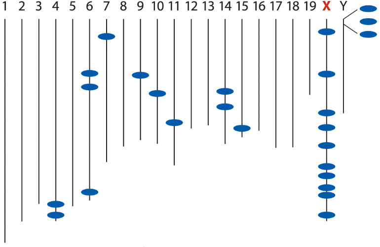

```{r setup, include = FALSE, cache = FALSE, purl = FALSE, fig.showtext = TRUE}
source("assets/setup.R")
knitr::opts_chunk$set(dev.args = list(png  = list(type = "cairo")))
library(xaringanExtra)
use_tile_view()
use_scribble()
use_search(show_icon = FALSE)
use_progress_bar(color = "#6d2b5e", location = "bottom", height = "10px")
use_freezeframe()
# use_webcam()
# use_panelset()
# use_extra_styles(hover_code_line = TRUE)

# http://tachyons.io/docs/
# https://roperzh.github.io/tachyons-cheatsheet/
use_tachyons()

# library(renderthis)
# to_pdf(from = "13-proportions-and-frequencies.html",
#        to = "13-proportions-and-frequencies.pdf",
#        complex_slides = TRUE, partial_slides = TRUE)
```

```{r libs, include=FALSE, warning=FALSE}
library(tidyverse)
library(cowplot)
library(scales)
```


## Пропорции и относительные частоты (доли)

- Биномиальное распределение
- Формула биномиального распределения
- Выборочное распределение доли
- Биномиальный тест для долей
- Доверительные интервалы для долей

---

class: middle, center, inverse

# Биномиальное распределение

---

## Биномиальное распределение

Случайные события с двумя исходами:

- Бросок монетки:
  - орел
  - решка
- Использование рук
  - правша
  - левша
- Заболевание
  - заболел
  - остался здоров
- Сложная операция, тяжелая болезнь или катастрофа
  - выжил
  - умер

Условно одно из событий в паре называют "успех", а другое — "неудача".

__Биномиальное распределение__ описывает вероятность того, сколько раз будет наблюдаться "успех" при определенном числе испытаний, когда вероятность успеха одинакова во всех испытаниях.

---

## Следует ли X биномиальному распределению? (1)

У вас есть "нечестная" монетка. Вероятность, что выпадет орёл — 80%. Вы подбрасываете монетку совершенно одинаковым способом ровно 10 раз. 

X — число выпавших орлов

Является ли X биномиально распределенной величиной?

--

Да, потому что:

- В результате каждого броска монетки происходит выпадает орел или решка (__два события: "успех" или "неудача"__).

--

- Монетку подбрасывают 10 раз совершенно одинаково (__испытания проходят одинаково__).

--

- Результат броска не влияет на результат других бросков (__испытания независимы друг от друга__).

--

- Вероятность выпадения орла одинакова во всех бросках  (__вероятность "успеха" одинакова__).

--

- X — число орлов (__число "успехов"__)

--

.content-box[
В этом примере перечислены все основные признаки биномиально-распределенной случайной величины.
]

---

## Следует ли Х биномиальному распределению? (2)

Университетский администратор обзванивает случайным образом выбранных выпускников до тех пор пока не найдет 5 человек, которые работают по специальности.

X — число выпускников, которых пришлось обзвонить

Является ли X биномиально распределенной величиной?

--

Нет, потому что:

- Общее число звонков (испытаний) не было заранее зафиксировано.
- Х не равен числу выпускников, работающих по специальности.

---

## Следует ли Х биномиальному распределению? (3)

В пенале лежит 10 ручек. Человек последовательно выкладывает на стол случайные 4 из них.

X — число ручек, которые пишут, из всех выложенных на стол.

Является ли X биномиально распределенной величиной?

--

Нет, потому что:

- Вероятность выбрать пишущую ручку не постоянна. 

--

Допустим 6 из 10 ручек пишут. 

--

Тогда для 1й ручки $P(\text{1я ручка пишет}) = 6/10$

--

Для 2й ручки возможно два варианта:

--

- $P(\text{2я ручка пишет | 1я пишет}) = 5/9$

--

- $P(\text{2я ручка пишет | 1я не пишет}) = 6/9$.

<br/>

--

.content-box[
Такая величина X подчиняется гипергеометрическому распределению.
]

---

## Следует ли Х биномиальному распределению? (4)

В университете опросили случайную выборку 1000 студентов.

X — число студентов из этой выборки, которые добираются до университета на велосипеде.

Является ли X биномиально распределенной величиной?

--

Нет, потому что:

- Вероятность того, что студент велосипедист тоже не постоянна. Х подчиняется гипергеометрическому распределению.

--

Допустим всего 10000 студентов и 1000 из них велосипедисты, $P(\text{велосипедист}) = 0.1$. 

--

$P(\text{1й велосипедист}) = 1000/10000 = 0.1$

--

$P(\text{2й велосипедист | 1й велосипедист}) = 999/9999 = 0.099909991$

--

$P(\text{2й велосипедист | 1й пешеход}) = 1000/9999 = 0.100010001$

и т.д.

--

Однако эти величины мало отличаются от 0.1.

--

.content-box[
Если объем выборки $n$ мал в сравнении с объемом генеральной совокупности $N$, гипергеометрическое распределение можно аппроксимировать биномиальным.
]


---

class: middle, center, inverse

# Формула биномиального распределения

---

## Формула биномиального распределения

$$P(X~'успехов') = \binom{n}{X} \pi^X (1 - \pi)^{n-X} = \frac{n!}{X! (n-X)!} \pi^X (1 - \pi)^{n-X}$$

.pull-left[

```{r binomial-distr, echo=FALSE, purl=FALSE, opts.label='fig.medium.taller'}
mu1 <- 0.1
mu2 <- 0.5
N1 <- 10
N2 <- 50
y <-seq(0, 35, by = 1)
dfr <- data.frame(y = rep(y, 4), p = c(dbinom(y, size = N1, prob = mu1), dbinom(y,  size = N2, prob = mu1), dbinom(y,  size = N1, prob = mu2), dbinom(y,  size = N2, prob = mu2)),  pi = rep(c(mu1, mu2), each = 2*length(y)), n = rep(c(N1, N2, N1, N2), each = length(y)))

ggplot(dfr, aes(x = y, y = p)) + 
  geom_bar(stat = "identity", fill = 'grey20') + facet_grid(n ~ pi,  labeller = label_bquote(rows = n==.(n), cols = pi==.(pi))) + 
  # ggtitle("Биномиальное распределение \nпри разных параметрах") + 
  labs(x = "Число 'успехов'", y = "Вероятность")
```

]

.pull-right[

Параметры:

- $n$ — число испытаний (фиксированное), испытания независимы друг от друга
- $\pi$ — вероятность успеха одинакова во всех испытаниях.

<br/>

Биномиальный коэффициент описывает **число сочетаний из $n$ по $X$**

$$\binom{n}{X} = C_n^X = \frac{n!}{X! \cdot (n-X)!}$$ 
]

---

## Смысл биномиального коэффициента (1)

Пусть перед нами 5 улиток: 3 .red[заражены трематодами (i)], а 2 .blue[здоровы (h)]. Сколькими возможными способами могут быть расположены эти улитки?

-----

( - )   ( - )   ( - )   ( - )   ( - )

--

1-я зараженная улитка может быть расположена 5-ю способами. Допустим, так:

( - )   .red[(i-1)]   ( - )   ( - )   ( - )

--

2-я — 4-мя способами, допустим так:

( - )   .red[(i-1)]   ( - )   ( - )   .red[(i-2)]

--

Третья — 3-мя способами, допустим так:

.red[(i-3)]   .red[(i-1)]   ( - )   ( - )   .red[(i-2)]

Общее число способов, которыми могут располагаться эти зараженные улитки, _если бы они были различимы_: $5 \cdot 4 \cdot 3$

--

Но нам не важен порядок, поэтому разные варианты расположения трех зараженных улиток эквивалентны. Например вот эти два (а всего их $3 \cdot 2 \cdot 1$):

.red[(i-1)]   .red[(i-2)]   ( - )   ( - )   .red[(i-3)]  
.red[(i-3)]   .red[(i-2)]   ( - )   ( - )   .red[(i-1)] 

Поэтому число способов, которыми могут располагаться зараженные улитки, _если они не различимы_ (т.е. если нам не важен их порядок):  
$\cfrac{5 \cdot 4 \cdot 3}{3 \cdot 2 \cdot 1} = 10$

???

- $P_n = n!$ — перестановки (permutations). Из $n$ выбираем $n$, порядок важен, без повторений.
- $A^k_n = P^k_n= \cfrac{n!}{(n - k)!}$ — размещения (permutations). Из $n$ выбираем $k$, порядок важен.
- $C^k_n = \cfrac{n!}{k! \cdot (n - k)!}$ — сочетания (combinations). Из $n$ выбираем $k$, порядок НЕ важен.


---

## Смысл биномиального коэффициента (2)

Пусть перед нами 5 улиток: 3 .red[заражены трематодами (i)], а 2 .blue[здоровы (h)]. Сколькими возможными способами могут быть расположены эти улитки?

-----

( - )   ( - )   ( - )   ( - )   ( - )

--

1-я здоровая улитка может быть расположена 5-ю способами. Допустим, так:

( - )   ( - )   ( - )   .blue[(h-1)]   ( - )

--

2-я здоровая — 4-мя способами, допустим так:

.blue[(h-2)]   ( - )   ( - )   .blue[(h-1)]   ( - )

<br/>

Общее число способов, которыми могут располагаться эти 2 здоровые улитки, _если бы они были различимы_: $5 \cdot 4$

--

Но нам не важен порядок, поэтому разные варианты расположения 2 здоровых улиток эквивалентны (и всего их $2 \cdot 1$):

.blue[(h-2)]   ( - )   ( - )   .blue[(h-1)]   ( - )  
.blue[(h-1)]   ( - )   ( - )   .blue[(h-2)]   ( - )

Поэтому число способов, которыми могут располагаться 2 здоровые улитки, _если они не различимы_ (т.е. если нам не важен их порядок):  
$\cfrac{5 \cdot 4}{2 \cdot 1} = 10$, так же, как в прошлый раз, но формула другая. Непорядок!

---

## Смысл биномиального коэффициента (3)

Пусть перед нами 5 улиток: 3 .red[заражены трематодами (i)], а 2 .blue[здоровы (h)]. Сколькими возможными способами могут быть расположены эти улитки?

-----

Как из этих двух формул сделать одну, чтобы было все равно с кого начинать — со здоровы или зараженных улиток?

$\cfrac{5 \cdot 4 \cdot 3}{3 \cdot 2 \cdot 1} = 10$, 
$\cfrac{5 \cdot 4}{2 \cdot 1} = 10$

--

Домножим числитель и знаменатель на одно и то же число:

$\cfrac{(5 \cdot 4 \cdot 3)\cdot (2 \cdot 1)}{(3 \cdot 2 \cdot 1)\cdot (2 \cdot 1)} = \cfrac{5!}{\color{red}{3}! \color{blue}{2}!}$

--

Легко заметить, что в числителе факториал общего числа улиток, а в знаменателе факториалы каждой из категорий.

$$\binom{n}{X} = C_n^X = \frac{n!}{X! \cdot (n-X)!}$$ 

---

## Вычисляем вероятность <br/>с использованием биномиального распределения

Вы собираете улиток для эксперимента.  
Вероятность того, что случайно выбранная улитка  
окажется зараженной трематодами 0.2.  

Какова вероятность того, что из 5 собранных улиток 3 заражены?

-----

--

- $\color{red}{0.2^3}\color{blue}{(1 - 0.2)^2}$ — вероятность того, что из 5 улиток .red[3 заражены], а .blue[2 здоровы]

- $\cfrac{5!}{\color{red}{3}! \color{blue}{2}!}$ — число возможных сочетаний здоровых и зараженных улиток

--

Можно воспользоваться биномиальным распределением:

$$P(X~'успехов') = \frac{n!}{X! (n-X)!} \pi^X (1 - \pi)^{n-X}$$

$$P(3) = \cfrac{5!}{\color{red}{3}! \color{blue}{2}!} \color{red}{0.2^3} \color{blue}{(1 - 0.2)^2} = 10 \cdot 0.008 \cdot 0.64 = 0.0512$$

---

## Биномиальное распределение (количества "успехов")

Пользуясь формулой биномиального распределения можно рассчитать $p$ — вероятность получить любое количество успехов $X$ в $n$ испытаниях.

$$P(X~'успехов') = \frac{n!}{X! (n-X)!} \pi^X (1 - \pi)^{n-X}$$

<br/>

--

------

.pull-left[

Т.е. для нашего примера $p$ — вероятность получить определенное количество зараженных моллюсков в выборке из 5 особей.
```{r binomial-n-p-table}
pi <- 0.2
n <- 5
x <-seq(0, n, by = 1)
probTable <- data.frame(x = x, p = dbinom(x, size = n, prob = pi) )
probTable %>% kable()
```

]
.pull-right[

```{r binomial-n-p-plot, echo=FALSE, purl=FALSE, opts.label='fig.medium.taller'}
pi <- 0.2
n <- 5
x <-seq(0, n, by = 1)
dfr <- data.frame(x = x, p = c(dbinom(x, size = n, prob = pi)))

ggplot(dfr, aes(x = x, y = p)) + 
  geom_col(fill = 'darkcyan', colour = "white") + 
  labs(x = "Число 'успехов'", y = "Вероятность") +
  scale_x_continuous(breaks = y)
```
]


???

TODO: добавить кусок про среднее и дисперсию биномиально распределенной величины.

---

class: middle, center, inverse

# Выборочное распределение доли

---

## Доля "успехов"

Для любой выборки можно оценить $p$ — долю "успехов" $X$ среди всех $n$ испытаний:

$$p = \cfrac{X}{n}$$

<br/>

--

------

В примере с улитками была выборка из 5 улиток, 3 из которых были заражены.

Доля зараженных улиток $p = \cfrac{3}{5} = 0.6$

В другой выборке была бы другая доля.

---

## Выборочное распределение доли

Если взять множество выборок размером $n$ и в каждой оценить долю "успехов", то получится __выборочное распределение доли__.

<br/>

--

Например, вот распределение доли зараженных моллюсков из нашего примера (выборки по 5 улиток, при вероятности заражения 0.2).

```{r binomial-prop-sampling-dist-1, echo=FALSE, purl=FALSE}
pi <- 0.2
Ns <- 5
nrep <- 10000
set.seed(394)
dfr <- data.frame(
  pi = pi,
  n = rep(Ns, each = nrep),
  p = unlist(lapply(Ns, FUN = function(x) rbinom(nrep, size = x, prob = pi)/x))) 
dfr %>% 
  ggplot(aes(x = p)) + 
  stat_bin(aes(y=..count../sum(..count..)), fill = "darkcyan", colour = "white", binwidth = 0.2) +
  scale_x_continuous(breaks = seq(0, 1, 0.2)) +
  labs(x = "Доля 'успехов'", y = "Вероятность") + 
  # coord_cartesian(xlim = c(0, 1)) +
  facet_grid(n ~., labeller = label_both)
```

---

## Параметры выборочного распределения доли

.pull-left-45[

```{r binomial-prop-sampling-dist, echo=FALSE, purl=FALSE, opts.label='fig.medium.tall'}
pi <- 0.2
Ns <- c(10, 30, 100, 500)
nrep <- 10000
set.seed(394)
dfr <- data.frame(
  pi = pi,
  n = rep(Ns, each = nrep),
  p = unlist(lapply(Ns, FUN = function(x) rbinom(nrep, size = x, prob = pi)/x))) 

ggplot(data = dfr, aes(x = p)) + 
    stat_bin(aes(y=..count../sum(..count..)), fill = "darkcyan", colour = "white", binwidth = 0.02) +
    labs(x = "Доля 'успехов'", y = "Вероятность") + 
    coord_cartesian(xlim = c(0, 1)) +
  facet_grid(n ~., labeller = label_both)
```

]

.pull-right-55[

Форма выборочного распределения доли зависит от объема выборки

Параметры выборочного распределения доли:

- __среднее__:

$$\mu_p = \pi$$

- __стандартное отклонение__  
(стандартная ошибка доли):

$$\sigma_p=\sqrt{\frac{\pi(1-\pi)}{n}}$$

]

--

Т.е. точность оценки доли по выборке будет зависеть от объема выборки.

---

## Параметры выборочного распределения доли

.pull-left-45[

```{r binomial-prop-sampling-dist, echo=FALSE, purl=FALSE, opts.label='fig.medium.tall'}
```

]

.pull-right-55[

Форма выборочного распределения доли зависит от объема выборки

Параметры выборочного распределения доли:

- __среднее__:

$$\mu_p = \pi$$

- __стандартное отклонение__  
(стандартная ошибка доли):

$$\sigma_p=\sqrt{\frac{\pi(1-\pi)}{n}}$$

Стандартную ошибку оценивают по выборке:

$$SE_p = \sqrt{\frac{p(1 - p)}{n}}$$


]

Выборочное распределение доли используют для построения доверительных интервалов к долям.


---

class: middle, center, inverse

# Биномиальный тест для долей

---

## Пример: гены сперматогенеза на Х хромосоме мышей

Из 25 генов сперматогенеза у мышей 10 (40%) расположены на Х хромосоме (Wang et al. 2001).

Х хромосома мышей содержит 6.1% всех генов. 

Поэтому, если бы гены были распределены по хромосомам случайно, только 6.1% были бы на Х хромосоме.

.pull-left-55[


.tiny[рис. 7.2 из Whitlock and Schluter, 2015]
]

.pull-right-45[
Свидетельствуют ли эти данные, что гены сперматогенеза у мышей непропорционально часто встречаются на Х хромосоме? 
]

---

## Биномиальный тест для долей


Биномиальный тест использует биномиальное распределение, чтобы проверить значимость отличия доли "успехов" в серии из $n$ испытаний от какой-то величины.

$$P(X~'успехов') = \frac{n!}{X! (n-X)!} \pi^X (1 - \pi)^{n-X}$$

$H_0: \pi = p_0$ — доля "успехов" в генеральной совокупности равна $p_0$  
$H_A: \pi \ne p_0$ — доля "успехов" в генеральной совокупности не равна $p_0$   
$0 \le p_0 \le 1$

Тестовая статистика — наблюдаемое число "успехов"

<br/>

--

-------

В примере про гены мышей

Испытание: "попал" ген сперматогенеза на Х хромосому (= "успех") или нет.  
Всего 25 генов (испытаний).

$H_0: \pi = 0.061$ — на Х хромосоме расположено 6.1% генов сперматогенеза  
$H_A: \pi \ne 0.061$ — на Х хромосоме другой процент генов сперматогенеза

Тестовая статистика — наблюдаемое число генов сперматогенеза на Х хромосоме

--

Как выглядит биномиальное распределение для ситуации, когда верна $H_0$?

---

## Биномиальное распределение для $H_0$

$H_0: \pi = 0.061$ — на Х хромосоме расположено 6.1% генов сперматогенеза  
$H_A: \pi \ne 0.061$ — на Х хромосоме другой процент генов сперматогенеза

<br/>

Если $H_0$ справедлива, то число генов, попавших на Х хромосому из 25 генов сперматогенеза описывается биномиальным распределением с параметрами $n = 25$ и $\pi = 0.061$

$$P(X~генов~сперматогенеза~на~Х~хр.) = \frac{25!}{X! (25-X)!} 0.061^X (1 - 0.061)^{25-X}$$


```{r binom-genes, echo=FALSE, purl=FALSE, opts.label='fig.wide'}
pi <- 0.061
n <- 25
x <-seq(0, n, by = 1)
statist <- 10
dstatis <- dbinom(statist, n, pi)
dfr <- data.frame(x = x, p = c(dbinom(x, size = n, prob = pi)))

gg_binom_genes <- ggplot(dfr, aes(x = x, y = p)) + 
  geom_col(fill = 'darkcyan', colour = "white") + 
  labs(x = "Число генов сперматогенеза на Х хромосоме", y = "Вероятность")  +
  coord_cartesian(xlim = c(0, n-1)) +
  scale_x_continuous(breaks = y)

gg_binom_genes_p <- gg_binom_genes +
  annotate(geom = "text", x = statist, y = mean(range(dfr$p)), label = paste(statist, " - наблюдаемое значение"), size = 7, hjust = 0) +
  annotate(geom = "point", x = statist, y = 0, colour = "orangered", size = 3) +
  annotate(geom = "segment", x = statist, y = 0, xend = statist, yend = mean(range(dfr$p)), linetype = "dashed") + 
  annotate(geom = "segment", x = statist, y = dstatis, xend = n, yend = dstatis, size = 1, colour = "orangered") +
  annotate(geom = "text", x = mean(c(n, statist)), y = dstatis, 
           vjust = -0.5, size = 7,
           label = "В двустороннем тесте\np = 2 P(X≥10)")

gg_binom_genes
```

---

## _P_-значение в двустороннем биномиальном тесте

$H_0: \pi = 0.061$ — на Х хромосоме расположено 6.1% генов сперматогенеза  
$H_A: \pi \ne 0.061$ — на Х хромосоме другой процент генов сперматогенеза

<br/>

Наш тест двусторонний (см $H_A$), поэтому p-значение — это 
- $P(x \ge 10)$ — вероятность получить при $H_0$ 10 или более генов сперматогенеза на Х хромосоме (правый хвост)
- плюс такая же вероятность получить слишком малое количество генов (на другом конце распределения)

```{r binom-genes-p, echo=FALSE, purl=FALSE, opts.label='fig.wide'}
gg_binom_genes_p
```

---

## _P_-значение в двустороннем биномиальном тесте

$H_0: \pi = 0.061$ — на Х хромосоме расположено 6.1% генов сперматогенеза  
$H_A: \pi \ne 0.061$ — на Х хромосоме другой процент генов сперматогенеза

Чтобы вычислить p-значение, суммируем и удвоим вероятности $P(x \ge 10)$ :

.small[
```{r, R.options=list(scipen = 1)}
dfr_full <- data.frame(X = x, p = dbinom(x, size = n, prob = pi))
dfr_p <- dfr_full[dfr_full$X >= statist, ] %>% 
  mutate(p = as.character(signif(p, 3)))
bind_cols(dfr_p[1:4, ], dfr_p[5:8, ], dfr_p[9:12, ], dfr_p[13:16, ]) %>% kable(col.names = rep(c("X", "p"), 4))

pval1 <- sum(dfr_full[dfr_full$X >= statist, "p"])
pval_ch <- as.character(signif(pval1 * 2, 3))
```
]

```{r binom-genes-p, echo=FALSE, purl=FALSE, opts.label='fig.wide'}
```

---

## _P_-значение в двустороннем биномиальном тесте

$H_0: \pi = 0.061$ — на Х хромосоме расположено 6.1% генов сперматогенеза  
$H_A: \pi \ne 0.061$ — на Х хромосоме другой процент генов сперматогенеза


<br/>
Если суммировать и удвоить вероятности $P(x \ge 10)$ получится `r pval_ch` < 0.05, т.е. $H_0$ придется отвергнуть.

На Х хромосоме находится непропорционально большая доля генов сперматогенеза (0.40, SE = 0.10; биномиальный тест, n = 25, p < 0.001).

<br/>
Это один из нескольких способов расчета p-значений в двустороннем биномиальном тесте. Они дают сходные, но немного различающиеся значения.

```{r binom-genes-p, echo=FALSE, purl=FALSE, opts.label='fig.wide'}
```

---

## Аппроксимации биномиального теста

Биномиальный тест дает точные значения p, но вычисления лучше делать не в ручную.

В те времена, когда компьютеры были редкостью, разработали более быстрые приближенные варианты этого теста, которые вы можете встретить:

- $\chi^2$ тест качества подгонки ( $\chi^2$ goodness of fit test)
- Нормальная аппроксимация биномиального теста


???

Нормальное приближение биномиального теста гл. 10 WS 2015

---

class: middle, center, inverse

# Доверительный интервал для долей

---

## Оценка доли

$$p = \cfrac{X}{n}$$

<br/>

--

------

В нашем примере

$p = \cfrac{10}{25} = 0.4$

То есть 40% генов сперматогенеза у мышей лежат на Х хромосоме.

Это точечная оценка. Давайте попробуем построить к ней доверительный интервал.

---

## Стандартная ошибка доли

Когда обсуждали выборочное распределение доли, упоминали, что __стандартное отклонение выборочного распределения доли__):

$$\sigma_p = \sqrt{\cfrac{\pi(1-\pi)}{n}}$$

Ее выборочная оценка — это __стандартная ошибка доли__ $SE_p =\sqrt{\cfrac{p(1-p)}{n}}$

<br/>

--

------
В нашем примере $SE_p =\sqrt{\cfrac{0.4(1-0.4)}{25}} = 0.098$

Эта величина характеризует степень точности нашей оценки доли генов на Х хромосоме в генеральной совокупности.

???

WS отмечают (p.179 Whitlock, Schluter, 2015), что в некоторых учебниках делят на (n - 1). Если делить на n - 1, получается менее смещенная оценка, но если делить на n, то оценка будет ближе к $\sigma$.

---

## Доверительный интервал для долей

Существует много методов построения приблизительных доверительных интервалов для долей.

---

## Метод Вальда (Wald, 1939)

Предложен П.С. Лапласом в 1812г.

$p \pm 1.96 SE_p$

<br/>

--

__Ограничения и недостатки__:

- Плохо работает при малых объемах выборок
- Когда $p$ близко к 0 или 1 получаются интервалы с выходом за пределы интервала [0, 1])
- Невозможен для $p$ 0 и 1
- Когда $n p < 5$ или $n(1 – p) < 5$ не правильная оценка $SE_p$ т.к. не работает аппроксимация нормальным распределением (Motulsky, 1995)

<br/>

--

-------

В нашем примере $p = 0.4$, $SE_p = 0.098$, тогда предел погрешности $1.96 \cdot 0.098 = 0.192$.

Таким образом, на Х хромосоме  $40 \pm 19.2$ % генов сперматогенеза (дов. инт. методом Вальда).

---

## Метод Агрести-Коулл (Agresti, Coull, 1998)

Это модифицированный метод Вальда.

1.Считаем $p$ с поправкой $p^\prime =\cfrac{X + 2}{n + 4}$ 

2.Считаем стандартную ошибку доли с поправкой $SE_p^\prime = \sqrt{\cfrac{p^\prime(1-p^\prime)}{n + 4}}$

3.Вычисляем границы доверительного интервала доли

$$p^\prime - 1.96 \cdot SE_p^\prime < p < p^\prime + 1.96 \cdot SE_p^\prime$$

<br/>

__Метод Агрести-Коулл предпочтительнее, чем метод Вальда.__

<br/>

--

--------

В нашем примере $n = 25$, $X = 10$, значит $p^\prime =\cfrac{10 + 2}{25 + 4} = 0.414$.

Стандартная ошибка с поправкой $SE_p^\prime = \sqrt{\cfrac{0.414(1-0.414)}{25 + 4}} = 0.0915$
тогда предел погрешности $1.96 \cdot 0.0915 = 0.179$.

Таким образом, на Х хромосоме $40 \pm 17.9$ % генов сперматогенеза (дов. инт. методом Агрести-Коулл).


???

Иначе называется скорректированный метод Вальда. Вводится поправка: как будто мы добавили 2 "успеха"  2 "неудачи". Почему это работает? Потому что если маленькое p, то выборочное распределение доли будет несимменрично. Ввод поправки сдвигает центр распределения к доле 0.5

---

## Метод Вилсона (Wilson, 1927)

.pull-left[
$н.гр.=\frac{p+\frac{z_{\text{н.}}^2}{2 n}+z_{\text{н.}} \sqrt{\frac{p(1-p)}{n}+\frac{z_{\text{н.}}^2}{4 n^2}}}{1+\frac{z_{\text{н.}}^2}{n}}$
]
.pull-right[
$в.гр.=\frac{p+\frac{z_{\text{в.}}^2}{2 n}+z_{\text{в.}} \sqrt{\frac{p(1-p)}{n}+\frac{z_{\text{в.}}^2}{4 n^2}}}{1+\frac{z_{\text{в.}}^2}{n}}$
]

Для 95% доверительного интервала $z_{\text{н.}} = -1.96$, $z_{\text{в.}} = 1.96$

__Особенности__:

- Не сильно зависит от $n$ или $p$
- Асиметричный
- Нижняя граница доверительного интервала не бывает отрицательной (!)

Рекомендован к использованию (Agresti, Coull, 1998).

<br/>

--

-------

В нашем примере $n = 25$, $p = 0.4$, $\frac{p(1-p)}{n} = 0.0096$, значит

.pull-left[
$н.гр.=\frac{0.4+\frac{(-1.96)^2}{2 \cdot 25} -1.96 \sqrt{0.0096+\frac{(-1.96)^2}{4 \cdot 25^2}}}{1+\frac{(-1.96)^2}{25}} = 0.234$
]
.pull-right[
$в.гр.=\frac{0.4+\frac{1.96^2}{2 \cdot 25} + 1.96 \sqrt{0.0096+\frac{1.96^2}{4 \cdot 25^2}}}{1+\frac{1.96^2}{25}} = 0.593$
]

Т. обр., на Х хромосоме $40$% генов сперматогенеза (дов. инт. методом Вилсона $[23.4, 59.3]$ %).

???

Сами Агрести и Коул (1998) рекомендовали использовать доверительный интервал по методу Вилсона (Wilson, 1927). Хорошее описание можно прочитать здесь:
https://www.itl.nist.gov/div898/handbook/prc/section2/prc241.htm

---

## Сравнение доверительных интервалов, <br/>полученных разными методами

```{r conf-lims, echo=FALSE, purl=FALSE, opts.label='fig.wider'}
lims <- c("Wald, 1937", "Agresti-Coull, 1998", "Wilson, 1927")
dfr <- data.frame(Type = factor(lims, levels = lims),
                  Mean = 0.4 * 100,
                  Lwr = c(0.4 - 0.192, 0.4 - 0.179, 0.234) * 100,
                  Upr = c(0.4 + 0.192, 0.4 + 0.179, 0.593) * 100,
                  Recom = c("No", "No", "Yes"))
ggplot(dfr, aes(x = Type, y = Mean, ymin = Lwr, ymax = Upr, colour = Recom)) +
  geom_errorbar(width = 0.1, size = 1) +
  geom_point(size = 4) +
  scale_colour_manual(values = c("No" = "black", "Yes" = "red")) +
  labs(x = "Доверительный интервал", y = "% генов сперматогенеза\nна Х хромосоме") +
  theme(legend.position = "none", panel.grid.major = element_line(colour = "grey75"))
```


---

class: middle, center, inverse

# Summary

---

## Summary

Биномиальное распределение описывает вероятность того, сколько раз будет наблюдаться “успех” при определенном числе испытаний, когда вероятность успеха одинакова во всех испытаниях.

В формуле биномиального распределения биномиальный коэффициент описывает число возможных сочетаний заданного числа "успехов" и "неудач" при данном числе испытаний.

---

## Summary

Выборочное распределение доли описывает, чему будет равна доля "успехов" в повторных выборках заданного размера при заданной вероятности "успеха".

Стандартное отклонение выборочного распределения доли называют стандартной ошибкой доли. Она описывает точность оценки доли по данным выборки.

Биномиальный тест позволяет при помощи биномиального распределения тестировать гипотезы о том, что доля "успехов" в серии испытаний равна какой-то величине.

---

## Summary

Доверительные интервалы к доле можно получить разными способами. 

Метод Вальда самый простой в расчетах, но дает невозможные значения для очень малых и очень больших долей.

Метод Агрести-Коул лучше, чем метод Вальда, потому что включает поправку.

Метод Вилсона — это рекомендуемый метод построения доверительного интервала — дает асимметричные интервалы, не выходящие за пределы возможных значений долей.

---

## Что почитать

Agresti, A., Franklin, C. A., & Klingenberg, B. (2017). Statistics: The art and science of learning from data (Fourth edition). Pearson. — глава __6.3 Probabilities When Each Observation Has Two Possible Outcomes__

Whitlock, M., & Schluter, D. (2015). The analysis of biological data (Second edition). Roberts and Company Publishers.


