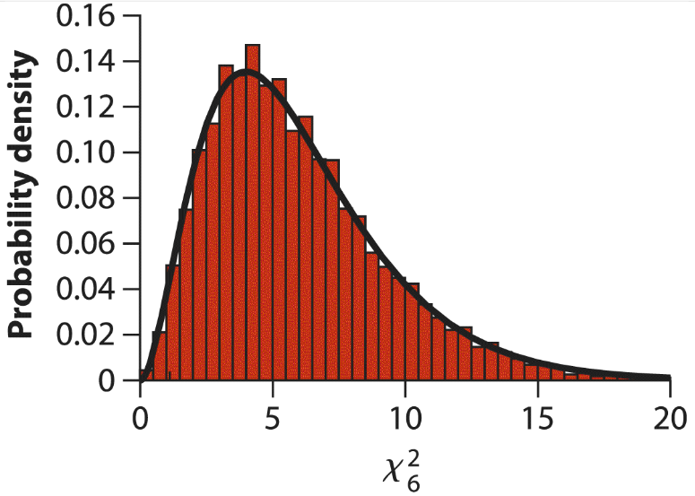

```{r setup, include = FALSE, cache = FALSE, purl = FALSE, fig.showtext = TRUE}
source("assets/setup.R")
knitr::opts_chunk$set(dev.args = list(png  = list(type = "cairo")))
library(xaringanExtra)
use_tile_view()
use_scribble()
use_search(show_icon = FALSE)
use_progress_bar(color = "#6d2b5e", location = "bottom", height = "10px")
use_freezeframe()
# use_webcam()
# use_panelset()
# use_extra_styles(hover_code_line = TRUE)

options(htmltools.preserve.raw = FALSE)

# http://tachyons.io/docs/
# https://roperzh.github.io/tachyons-cheatsheet/
use_tachyons()

# library(renderthis)
# to_pdf(from = "15-randomness-in-space-and-time.html",
#        to = "15-randomness-in-space-and-time.pdf",
#        complex_slides = TRUE, partial_slides = TRUE)
```

```{r libs, include=FALSE, warning=FALSE}
library(tidyverse)
library(cowplot)
library(scales)
```

- Пропорциональная модель. Хи-квадрат статистика
- Распределение Пуассона. Проверка соответствия распределению Пуассона
- Расположение в пространстве. Сравнение дисперсии и среднего

???

Хорошо бы более подробно

Закономерности распределения (размещения) особей в пространстве: случайное, регулярное, агрегированное. Индекс структурности. Причины неслучайности в распределении биологических признаков и объектов. Оценка достоверности характера распределения особей (d-статистика).

---

## Вероятностные модели

__Вероятностные модели__ (probabilistic models) описывают вероятности событий.

__Тесты адекватности модели__ (goodness-of-fit tests) — описывают, насколько наблюдаемые значения соответствуют теоретическому распределению.

<br/>

Биномиальный тест — тест адекватности только для бинарных величин.

Сегодня другие тесты.

---

class: middle, center, inverse

# Пропорциональная модель

## Хи-квадрат статистика

---

## Пропорциональная модель

__Пропорциональная модель__ (proportional model) — вероятностная модель, в которой вероятность события пропорциональна числу возможностей его возникновения.

- гены сперматогенеза на Х хромосоме

---

## Пример: дни рождения

Дни недели, на которые пришлось рождение, в случайной выборке из 180 младенцев 2016 году (данные the U.S. National Center for Health Statistics; Martin et al. 2018).

```{r}
birthDay <- read.csv("data/DayOfBirth2016.csv", stringsAsFactors = FALSE)
days_en <- c("Monday", "Tuesday", "Wednesday", "Thursday", "Friday", "Saturday", "Sunday")
days_ru <- c("Пн", "Вт", "Ср", "Чт", "Пт", "Сб", "Вс")

b_tbl <- birthDay %>% 
  mutate(day = factor(day, levels = days_en, labels = days_ru)) %>% 
  group_by(day) %>% 
  summarise("N_births" = n())

N <- sum(b_tbl$N_births)
```

.pull-left[

```{r}
b_tbl %>% kable(col.names = c("День недели", "Число рождений"))
```
]
.pull-right[
```{r}
b_tbl %>% 
  ggplot(aes(x = day, y = N_births)) +
  geom_col(fill = "darkcyan") +
  labs(x = "День недели", y = "Число рождений")
```
]


Согласно пропорциональной модели вероятность рождения в разные дни недели д.б. пропорциональна их числу в году.

Так ли это?

---

## &chi;<sup>2</sup> -тест

Гипотезы в общем виде:

$\chi^2$-тест оценивает соответствие наблюдаемого частотного распределения теоретическому (нулевой вероятностной модели).

$H_0:$ — вероятности (или частоты) в генеральной совокупности соответствуют нулевой модели  
$H_A:$ — вероятности (или частоты) в генеральной совокупности какие-то другие.

---

## Ожидаемые частоты

```{r}
library(janitor)

days2016 <- c(52,52,52,52,53,53,52)

exp_freq <- data.frame(
  day = days_ru,
  n_days = days2016, 
  prop_days = paste(days2016, "/ 366"),
  expected_frequency = days2016/366 * N)

exp_freq %>% adorn_totals(where = "row", name = "Сумма") %>% mutate(prop_days = ifelse(day == "Сумма", 1, prop_days)) %>% kable(col.names = c("День недели", "Число дней в 2016", "Доля в 2016", "Ожидаемая частота рождений"))
```

Ожидаемая частота

$Expected = N \cdot p_{expected}$

Сумма ожидаемых частот д.б. равна объему выборки N.

---

## &chi;<sup>2</sup> -статистика

$\chi^2$ измеряет, насколько наблюдаемые частоты соответствуют ожидаемым

$\chi^2=\sum_i \frac{\left(\text { Observed }_i-\text { Expected }_i\right)^2}{\text { Expected }_i}$

$\chi^2 = 0$, когда данные соответсвуют ожиданиям при $H_0$

$\chi^2 > 0$, если данные отклоняются от ожиданий при $H_0$

<br/>

--

Гипотезы в $\chi^2$-тесте:

$H_0:$ —  вероятности (или частоты) в генеральной совокупности соответствуют нулевой модели   
$H_A:$ — вероятности (или частоты) в генеральной совокупности какие-то другие.

--

<br/>

$H_0:\chi^2 = 0$  
$H_A:\chi^2 > 0$

Односторонний тест.

---

## Считаем &chi;<sup>2</sup>

```{r}
b_chi <- b_tbl %>% bind_cols(expected_frequency = days2016/366 * N) %>% 
  mutate(chisq = (N_births - expected_frequency)^2/expected_frequency) 

b_chi %>%
  adorn_totals(where = "row", name = "Сумма") %>% 
  kable(col.names = c("День недели", "Число рождений", "Ожидаемое число рождений", "Хи-квадрат"))

```

--

$\chi^2 = `r sum(b_chi$chisq)`$

Но с чем нам сравнивать эту величину?

---

## Выборочное распределение  &chi;<sup>2</sup> -статистики при <i>H<sub>0</sub></i>

Во множестве повторных выборок значение $\chi^2$ будет подчиняться распределению $\chi^2$ с числом степеней свободы $df$ 

$df = m - 1 - p$

- $m$ число категорий 
- $p$ число параметров, оцененных по данным (здесь 0)



.tiny[Whitlock, Schluter, 2015]

--

------

В примере $df = 7 - 1 - 0 = 6$


---

## &chi;<sup>2</sup> -тест

$H_0:\chi^2 = 0$ —  вероятности (или частоты) в генеральной совокупности соответствуют нулевой модели  
$H_A:\chi^2 > 0$ — вероятности (или частоты) в генеральной совокупности какие-то другие.

$\chi^2=\sum_i \frac{\left(\text { Observed }_i-\text { Expected }_i\right)^2}{\text { Expected }_i}$


```{r}
df <- 6
x <- seq(0, 25, length.out = 100)
statist <- sum(b_chi$chisq)
dfr <- data.frame(x = x, p = c(dchisq(x, df = df)))

chtest <- chisq.test(b_tbl$N_births, p = days2016/366)
pval <- chtest$p.value

dfr %>% 
  ggplot(aes(x = x, y = p)) +
  geom_line(size = 1, colour = "darkcyan") +
  labs(x = "Хи-квадрат, df = 6", y = "Плотность вероятности") +
  annotate(geom = "segment", x = statist, y = 0, xend = statist, yend = mean(range(dfr$p)), linetype = "dashed") +
  annotate(geom = "text", x = statist, y = mean(range(dfr$p)), label = paste("наблюдаемый\nхи-квадрат", round(statist, 2)), size = 6, hjust = 0.5, vjust = 0) +
  geom_area(data = dfr[dfr$x > statist, ], fill = "red", alpha = 0.5)+
  annotate(geom = "text", x = statist, y = mean(range(dfr$p))/2, label = paste("p =", round(pval, 3)), size = 6, hjust = -0.2, vjust = 0)

```


---

## Условия примеримости &chi;<sup>2</sup> -теста

- наблюдения независимы друг от друга

$\chi^2$-статистика приблизительно следует $\chi^2$-распределению, если:

- нет _ожидаемых_ частот $< 1$
- $\le 20%$ _ожидаемых_ частот $< 5$

--

<br/>

Если условия нарушены:

- можно объединить редкие категории, если они имеют биологический смысл
- использовать непараметрическую статистику или компьютерную симуляцию

---

## Тесты для двух категорий

&chi;<sup>2</sup> -тест работает для двух категорий (при тех же условиях).

Т.е. &chi;<sup>2</sup>-тест может заменять биномиальный тест:

- &chi;<sup>2</sup> быстрее считать
- он менее точен
- более требователен к данным


---

class: middle, center, inverse

# Распределение Пуассона

## Случайное распределение во времени и пространстве

---

## Распределение Пуассона

"Счетные" данные:

- Число орлов, выпадающих за 1 минуту
- Число левшей в выборках из 100 человек
- Число заболевших в день (с оговорками)


__Распределение Пуассона__ описывает вероятность определенного числа "успехов" за единицу времени или на единицу пространства, _если_ 

- (1) испытания независимы
- (2) вероятность успеха постоянна


---

## Распределение Пуассона в пространстве 

```{r sym-pois}
# Poisson on a grid
# Modified from source https://hpaulkeeler.com/poisson-point-process-simulation/
# Simulation window parameters
xMin <- 0
xMax <- 10
yMin <- 0
yMax <- 10
binwd <- 1
xDelta <- xMax - xMin
yDelta <- yMax - yMin
areaTotal <- xDelta * yDelta # rectangle dimensions
# Point process parameters
lambda <- 3 # mean
# Simulate Poisson point process
# Poisson number of points
set.seed(374818)
numbPoints <- rpois(1, areaTotal * lambda)
dfr <- data.frame(x = xDelta * runif(numbPoints) + xMin,
                  y = yDelta * runif(numbPoints) + yMin)

gg_pois_grid <- ggplot(dfr, aes(x = x, y = y)) +
  geom_bin2d(binwidth = binwd) +
  geom_point(size = 2, alpha = 0.5) +
  coord_equal(xlim = c(xMin, xMax), ylim = c(yMin, yMax), expand = 0) + 
  scale_x_continuous(breaks = (xMin + binwd):xMax) +
  scale_y_continuous(breaks = (yMin + binwd):yMax, labels = rev(LETTERS[(yMin + binwd):yMax])) +
  scale_fill_gradient("Число\n'успехов'", low = "#dcebeb", high = "darkcyan") +
  theme(panel.grid.minor = element_blank(),
        panel.grid.major = element_line(size = 0.25, colour = "black"), axis.text.x = element_text(hjust = 1.3, size = 25), axis.text.y = element_text(vjust = 1.3, size = 25), axis.ticks = element_blank()) +
  labs(x = "Координата X", y = "Координата Y")

gg_pois_grid_distr <- data.frame(
  x = seq(0, xMax, 1)
) %>% 
  ggplot(aes(x = x)) +
  stat_function(geom = "col", fun = dpois, args = list(lambda = lambda), width = 0.5, fill = "darkcyan") + 
  scale_x_continuous(breaks = seq(0, xMax, 1)) +
  labs(x = "Число 'успехов'", y = "Плотность\nвероятности") +
  theme(panel.grid.minor = element_blank())

# Poisson in time or along a transect
# Modified from source
# https://hpaulkeeler.com/poisson-point-process-simulation/
# Simulation window parameters
xMin <- 0
xMax <- 20
binwd <- 1
xDelta <- xMax - xMin
lenTotal <- xDelta # segment dimensions
# Point process parameters
lambda <- 0.5 # mean
# Simulate Poisson point process
# Poisson number of points
set.seed(4291)
numbPoints <- rpois(1, lenTotal * lambda)
dfr <- data.frame(x = xDelta * runif(numbPoints) + xMin) 
gg_pois_line <- ggplot(dfr, aes(x = x)) +
  geom_histogram(binwidth = binwd, colour = "white", fill = "darkcyan", alpha = 0.75) +
  geom_dotplot() +
  # scale_x_continuous(breaks = xMin:xMax) +
  scale_x_continuous(breaks = (xMin + binwd):xMax) +
  scale_y_continuous(breaks = xMin:xMax) +
  coord_cartesian(xlim = c(xMin, xMax + 1), ylim = c(0, 4.5), expand = 0) +
  theme(panel.grid.minor.y = element_blank(), panel.grid.major.x = element_blank(), axis.ticks.x = element_blank()) +
  labs(x = "Единица пространства / времени", y = "Число 'успехов'")

gg_pois_line_distr <- data.frame(
  x = seq(0, 10, 1)
) %>% 
  ggplot(aes(x = x)) +
  stat_function(geom = "col", fun = dpois, args = list(lambda = lambda), width = 0.5, fill = "darkcyan") + 
  scale_x_continuous(breaks = seq(0, xMax, 1)) +
  labs(x = "Число 'успехов'", y = "Плотность\nвероятности") +
  theme(panel.grid.minor = element_blank())
```

```{r gg-pois-grid-1, opts.label='fig.wider'}
gg_pois_grid
```

--

.pull-left-60[

```{r gg-pois-grid-2, opts.label='fig.wider'}
gg_pois_grid_distr
```
]

.pull-right-40[

- число деревьев на единицу площади
- число пыльцевых зерен на единицу площади
- число моллюсков на единицу площади

]

---

## Распределение Пуассона в пространстве / времени

```{r gg-pois-line-1}
gg_pois_line
```

--

.pull-left-60[

```{r gg-pois-line-2, opts.label='fig.wider'}
gg_pois_line_distr
```
]

.pull-right-40[

- число пчел, посещающих цветок за 15 минут
- число рождений / госпитализаций / смертей в день
- число сиквенсов, пришедшихся на один ген

]

---

## Распределение Пуассона

.pull-left[

```{r poisson-distr, echo=FALSE, purl=FALSE, fig.width=5.5, fig.height=6}
# library(ggplot2)
# theme_set(theme_bw(base_size = 14))

mu1 <- 1
mu2 <- 5
mu3 <- 10
mu4 <- 20
y <- seq(0, 35, by = 1)

pi <- data.frame(
  y = rep(y, 4),  
  pi = c(dpois(y, mu1), dpois(y, mu2), dpois(y, mu3), dpois(y, mu4)), 
  mu = rep(c(mu1, mu2, mu3, mu4), each = length(y))
)

ggplot(pi, aes(x = y, y = pi)) + 
  geom_bar(stat = "identity", fill = 'grey20') + 
  facet_wrap(~ mu, nrow = 2, labeller = label_both) + 
  # ggtitle("Распределение Пуассона \nпри разных параметрах") + 
  ylab("f(y)")
```

]

.pull-right[

$$P(X{\text{ 'успехов'}})=\cfrac{\mathrm{e}^{-\mu} \mu^X}{X !}$$

Параметр $\mu$ — определяет и среднее, и дисперсию числа "успехов"

<br/>

Возможные значения: 

$0 \le X \le +\infty$, $X \in \mathbb{N}$

]

Чем больше среднее, тем больше дисперсия.

---

class: middle, center, inverse

# Тестируем случайность при помощи распределения Пуассона

---

## Пример: Вымирания видов в истории Земли

Данные о вымирании семейств морских беспозвоночных за 76 отрезков времени (Raup, Sepkoski, 1982).

Случаются ли вымирания "равномерно" или бывают периоды массовых вымираний? 

.pull-left[
.small[
```{r dt}
# library(DT)
# library(rmarkdown)

ex_data <- read.csv("data/RaupSepkoski1982MassExtinctions.csv", stringsAsFactors = FALSE)

ex_mean <- mean(ex_data$numberOfExtinctions)
N <- nrow(ex_data)

ex_data$nExtinctCategory <- factor(ex_data$numberOfExtinctions,
    levels = c(0:20))                                          
ex_tbl <- data.frame(table(ex_data$nExtinctCategory))
colnames(ex_tbl) <- c("n_extinctions", "observed_frequency")
ex_tbl$n_extinctions <- as.numeric(as.character(ex_tbl$n_extinctions))

ex_tbl %>% 
  rename("Число вымираний (Х)" = "n_extinctions", 
         "Частота" = "observed_frequency") %>% 
  adorn_totals(where = "row", name = "Сумма") %>% 
  kable() %>%
  scroll_box(width = "100%", height = "450px")
  # rmarkdown::paged_table()
# datatable(options = list(dom = 'tip', pageLength = 6), rownames= FALSE) %>%
#   formatStyle(colnames(.),
#               background = 'lightblue', angle = -90,
#               backgroundSize = '98% 88%',
#               backgroundRepeat = 'no-repeat',
#               backgroundPosition = 'center')


```
]

]
.pull-right[
Если вымирания случайно распределены — то они подчиняются распределению Пуассона. 

Если нет, то
- массовые вымирания
- равномерное распределение
]

---

## Наблюдаемые частоты


```{r ex-distribution-observed, opts.label='fig.wide'}
ggplot(ex_tbl, aes(x = n_extinctions, y = observed_frequency)) +
  geom_col(aes(fill = "наблюдаемая")) +
  # geom_col(aes(y = expected_frequency, fill = "ожидаемая"), width = 0.2) +
  scale_fill_manual(name = "Частота", values = c("darkcyan", "black")) +
  labs(x = "Число вымираний за единицу времени", y = "Частота")
```

---

## Проверяем соответствие распределению Пуассона <br/>при помощи $\chi^2$


$H_0: \chi^2 = 0$ число вымираний подчиняется распределению Пуассона  
$H_A: \chi^2 > 0$ число вымираний не соответствует распределению Пуассона

$\chi^2=\sum_i \frac{\left(\text { Observed }_i-\text { Expected }_i\right)^2}{\text { Expected }_i}$

--

<br/>

Чтобы посчитать ожидаемые нужно знать...

--

среднее число вымираний $\bar{X}=\frac{(0 \times 0)+(13 \times 1)+(15 \times 2)+\ldots}{76}=`r ex_mean`$

Поэтому ожидаемая частота

$$P(X{\text{ вымираний}})=\cfrac{\mathrm{e}^{-`r ex_mean`} `r ex_mean`^X}{X !}$$

```{r ex-expected}
ex_chi <- ex_tbl %>% 
  mutate(
    expected_proportion = dpois(0:20, lambda = ex_mean),
    expected_frequency = expected_proportion * N
    )
```

---

## Наблюдаемые и ожидаемые частоты

.small[
```{r ex-expected-table}
ex_chi %>% 
  rename("Число вымираний (Х)" = "n_extinctions", 
         "Наблюдаемая частота" = "observed_frequency", 
         "Ожидаемая доля" = "expected_proportion",
         "Ожидаемая частота" = "expected_frequency") %>% 
  adorn_totals(where = "row", name = "Сумма") %>% 
  kable() %>%  scroll_box(width = "100%", height = "530px")

```
]

---

## Проверяем условия применимости $\chi^2$

```{r ex-distribution, opts.label='fig.wide'}
ggplot(ex_chi, aes(x = n_extinctions, y = observed_frequency)) +
  geom_col(aes(fill = "наблюдаемая")) +
  geom_col(aes(y = expected_frequency, fill = "ожидаемая"), width = 0.2) +
  scale_fill_manual(name = "Частота", values = c("darkcyan", "black")) +
  labs(x = "Число вымираний за единицу времени", y = "Частота")
```

--

Данные не соответствуют условиям применимости критерия $\chi^2$:  
- одна ожидаемая частота < 1,
- более 20% ожидаемых частот < 5

--

Выход - объединить категории:  
- $X = 0$ и $X = 1$
- $X\ge 8$


```{r}
ex_chi$group <- cut(ex_chi$n_extinctions, 
    breaks = c(0, 2:8, 21), right = FALSE,
    labels = c("0 или 1","2","3","4","5","6","7",">8"))
# ex_chi

# Суммируем наблюдаемые и ожидаемые частоты для новых категорий
ex_poisson <- ex_chi %>% 
  group_by(group) %>% 
  summarise(
    observed_frequency = sum(observed_frequency),
    expected_frequency = sum(expected_frequency)
    )
```

---

## Данные после объединения категорий

.pull-left[

```{r ex-poisson}
ex_poisson %>% 
  rename("Число вымираний (Х)" = "group", 
         "Наблюдаемая частота" = "observed_frequency", 
         "Ожидаемая частота" = "expected_frequency") %>% 
  adorn_totals(where = "row", name = "Сумма") %>% 
  kable() #%>%  scroll_box(width = "40%", height = "500px")
```

]

--

.pull-right[
```{r gg-ex-poisson, opts.label='fig.medium.tall'}
ggplot(ex_poisson, aes(x = group, y = observed_frequency)) +
  geom_col(aes(fill = "наблюдаемая")) +
  geom_col(aes(y = expected_frequency, fill = "ожидаемая"), width = 0.2) +
  scale_fill_manual(name = "Частота", values = c("darkcyan", "black")) +
  labs(x = "Число вымираний\nза единицу времени", y = "Частота") +
  theme(axis.text.x = element_text(angle = 45, hjust = 1), legend.position = "bottom")
```

]

---

## Считаем хи-квадрат

.pull-left[

```{r ex-poisson-chi-table}
ex_poisson %>% 
  mutate(chisq = (observed_frequency - expected_frequency)^2/expected_frequency) %>% 
  rename("Число вымираний (Х)" = "group", 
         "Наблюдаемая частота" = "observed_frequency", 
         "Ожидаемая частота" = "expected_frequency",
         "Хи-квадрат" = "chisq") %>% 
  adorn_totals(where = "row", name = "Сумма") %>% 
  kable() #%>%  scroll_box(width = "40%", height = "500px")
```

]

.pull-right[

```{r}
chisq_wrong_df <- chisq.test(ex_poisson$observed_frequency, p = ex_poisson$expected_frequency/N)
ex_chi_val <- sum((ex_poisson$observed_frequency - ex_poisson$expected_frequency)^2/ex_poisson$expected_frequency)
# Число степеней свободы
# -1 как обычно и -1 за то, что оценили среднее
chisq_df <- nrow(ex_poisson) - 1 - 1 
p_val <- 1 - pchisq(ex_chi_val, df = chisq_df)
```

]

--

$\chi^2 = `r ex_chi_val`$

---

## &chi;<sup>2</sup> -тест

$H_0:\chi^2 = 0$ —  частоты в генеральной совокупности соответствуют распределению Пуассона  
$H_A:\chi^2 > 0$ — частоты в генеральной совокупности не подчиняются распределению Пуассона.

$\chi^2=\sum_i \frac{\left(\text { Observed }_i-\text { Expected }_i\right)^2}{\text { Expected }_i}$


```{r opts.label='fig.wider.taller'}
df <- chisq_df
x <- seq(0, 30, length.out = 100)
statist <- ex_chi_val
dfr <- data.frame(x = x, p = c(dchisq(x, df = df)))
pval <- p_val

dfr %>% 
  ggplot(aes(x = x, y = p)) +
  geom_line(size = 1, colour = "darkcyan") +
  labs(x = paste0("Хи-квадрат, df = ", df), y = "Плотность вероятности") +
  annotate(geom = "segment", x = statist, y = 0, xend = statist, yend = mean(range(dfr$p)), linetype = "dashed") +
  annotate(geom = "text", x = statist, y = mean(range(dfr$p)), label = paste("наблюдаемый\nхи-квадрат", round(statist, 2)), size = 6, hjust = 0.5, vjust = 0) +
  stat_function(geom = "area", fun = dchisq, args = list(df = df), xlim = c(statist, 30), fill = "red", alpha = 0.5)+
  annotate(geom = "text", x = statist, y = mean(range(dfr$p))/2, label = paste("p =", round(pval, 3)), size = 6, hjust = -0.05, vjust = 0)
```


---

class: middle, center, inverse

# Расположение в пространстве

## Сравнение дисперсии и среднего

---
layout: true
class: split-60

.row.bg-main1[.content[

## Расположение в пространстве

```{r spat-distr, opts.label='fig.wide'}
library(spatstat.random)
# each cluster consist of 10 points in a disc of radius 0.2
nclust <- function(x0, y0, radius, n) {
  return(runifdisc(n, radius, centre=c(x0, y0)))
}

set.seed(928380)
op <- par(mfrow = c(1, 3), cex = 1.5, mar = c(0, 0, 5, 0))
plot(runifpoint(50, giveup=10^20), main = "Регулярное\nDispersed")
plot(rpoispp(50), main = "Случайное\nRandom")
plot(rPoissonCluster(10, 0.1, nclust, radius = 0.1, n=5), main  = "Агрегированное\nClumped")
par(op)
```
  
]]

.row[.content[
.split-three[
.column[.content.center[


.tiny[Liam Quinn from Canada, CC BY-SA 2.0 <https://creativecommons.org/licenses/by-sa/2.0>, via Wikimedia Commons]

]]
.column[.content.center[


.tiny[Dwight Burdette, CC BY 3.0 <https://creativecommons.org/licenses/by/3.0>, via Wikimedia Commons]

]]

.column[.content.center[


.tiny[Benh Lieu Song on Flickr]
<br/><br/><br/>

]]
]
]]

---

class: hide-row2-col1 hide-row2-col2 hide-row2-col3

---

class: hide-row2-col2 hide-row2-col3
count: false

---

class: hide-row2-col3
count: false

---

count: false

---
layout: false

## Расположение в пространстве

```{r spat-distr, opts.label='fig.wide'}
```

__Индекс дисперсии__ (__отношение дисперсии к среднему__) — показывает, насколько расположение наблюдений в пространстве (или во времени) соответствует Пуассоновскому.

$$I_s = \cfrac{s^2}{\bar x}$$

- $I_s < 1$ — регулярное, равномерное
- $I_s = 1$ — случайное (распределение Пуассона)
- $I_s > 1$ — агрегированное

---

## Сравнение дисперсии и среднего

$$I_s = \cfrac{s^2}{\bar x}$$

Для тестирования значимости индекса дисперсии используют хи-квадрат распределение:

$$I_s \cdot (n - 1) \sim \chi^2, \\ df = n - 1$$

--

$H_0: I_s = 1$ — распределение в пространстве случайно  
(дисперсия равна среднему)  
$H_0: I_s \ne 1$ — распределение в пространстве неслучайно  
(дисперсия не равна среднему)

--

Двусторонний тест (!)

---
layout:true
class: split-25

.row[.content[

## Определяем пространственное расположение

```{r}
# Poisson on a grid
# Modified from source https://hpaulkeeler.com/poisson-point-process-simulation/
# Simulation window parameters
xMin <- 0
xMax <- 5
yMin <- 0
yMax <- 5
binwd <- 1
xDelta <- xMax - xMin
yDelta <- yMax - yMin
areaTotal <- xDelta * yDelta # rectangle dimensions
# Point process parameters
lambda <- 0.7 # mean
# Simulate Poisson point process
# Poisson number of points
set.seed(1282)
numbPoints <- rpois(1, areaTotal * lambda)
dfr <- data.frame(x = xDelta * runif(numbPoints) + xMin, y = yDelta * runif(numbPoints) + yMin)

gg_pois_grid_task <- ggplot(dfr, aes(x = x, y = y)) +
  geom_point(aes(x = x, y = y-binwd*0.09), shape = "T", size = 8, colour = "sienna1") +
  geom_point(shape = 17, size = 5, colour = "green4") +
    geom_point(aes(x = x, y = y+binwd*0.1), shape = 17, size = 5, colour = "green4") +
  coord_equal(xlim = c(xMin-0.01, xMax+0.), ylim = c(yMin-0., yMax+0.), expand = 0, clip = 'off') + 
  scale_x_continuous(breaks = (xMin + binwd):xMax) +
  scale_y_continuous(breaks = (yMin + binwd):yMax, labels = rev(LETTERS[(yMin + binwd):yMax])) +
  theme(panel.grid.minor = element_blank(),
        panel.grid.major = element_line(size = 0.25, colour = "black"), axis.text.x = element_text(hjust = 1.3, size = 25), axis.text.y = element_text(vjust = 1.3, size = 25), axis.ticks = element_blank()) +
  labs(x = "Координата X", y = "Координата Y")
# gg_pois_grid_task

# Случайная выборка квадратов
set.seed(938147)
n_quad <- 6
to_sample <- "D-1, C-2, A-4, E-3, B-1, D-4, E-5, C-3"

trees <- c(0, 1, 0, 0, 1, 1, 2, 6)
trees_m <- mean(trees)
trees_var <- var(trees)
Is <- trees_var/trees_m
df <- n_quad - 1
chi_val <- Is * df
# trees_var;trees_m;Is

p_right <- 1 - pchisq(chi_val, df = df)
p_val <- p_right * 2
chi_val2 <- qchisq(p_right, df = df)
p_left <- pchisq(chi_val2, df = df)

dfr <- data.frame(x = seq(0, 25, length.out = 100)) %>% 
  mutate(p = dchisq(x, df = df))

gg_chisq <-  dfr %>% 
  ggplot(aes(x = x, y = p)) +
  geom_line(colour = "darkcyan", size = 1) +

  labs(x = paste0("Хи-квадрат, df = ", df), y = "Плотность вероятности") +
  annotate(geom = "segment", x = chi_val, y = 0, xend = chi_val, yend = mean(range(dfr$p)), linetype = "dashed") +
  annotate(geom = "text", x = chi_val, y = mean(range(dfr$p)), label = paste0("хи-квадрат =", round(chi_val, 2)), size = 6, hjust = 0.5, vjust = 0) +
  stat_function(geom = "area", fun = dchisq, args = list(df = df), xlim = c(0, chi_val2), fill = "red", alpha = 0.5) +
    stat_function(geom = "area", fun = dchisq, args = list(df = df), xlim = c(chi_val, 25), fill = "red", alpha = 0.5) +
  annotate(geom = "text", x = chi_val, y = mean(range(dfr$p))*1.5, label = paste("p =", round(p_val, 3)), size = 6, hjust = 1.2, vjust = 0) +
  # хвосты
  annotate(geom = "text", x = chi_val2, y = mean(range(dfr$p))*0.5, label = paste("p/2 =", round(p_left, 3)), size = 6, hjust = 1.1, vjust = 0) +
  annotate(geom = "text", x = chi_val, y = mean(range(dfr$p))*0.5, label = paste("p/2 =", round(p_right, 3)), size = 6, hjust = -0.01, vjust = 0) +
  coord_cartesian(xlim = c(-5.5, 20))

# gg_chisq
```


Лес разделен на `r xDelta * yDelta` квадратов.
Генератор случайных чисел предлагает посчитать деревья в квадратах `r to_sample`

Посчитайте индекс дисперсии, чтобы определить, как располагаются деревья в лесу.
]]

.row[.content[

.split-two[

.column[.content[

Количество деревьев:  
`r paste(trees, collapse = ", ")`

Среднее `r round(trees_m, 1)`, дисперсия `r round(trees_var, 1)`

Индекс структурности $I_s = \cfrac{ `r round(trees_var, 1)` }{ `r round(trees_m,1)` } = `r round(Is, 2)`$

$\chi^2 = `r round(Is, 2)` \cdot (`r n_quad`- 1) = `r round(chi_val, 2)`$, $df = `r n_quad`- 1 = `r df`$

```{r opts.label='fig.small', fig.width=6.5}
gg_chisq
```

]]

.column[.cotent[

```{r gg-grid-pois-task, opts.label='fig.medium.taller'}
gg_pois_grid_task
```
]]

]

]]

---

class: hide-row2-col1

---
count: false

---
layout: false
class: middle, center, inverse

# Summary

---

## Summary

- Вероятностные модели (probabilistic models) описывают вероятности событий.

- Тесты адекватности модели (goodness-of-fit tests) — описывают, насколько наблюдаемые значения соответствуют теоретическому распределению (вероятностной модели).

- Пропорциональная модель (proportional model) — вероятностная модель, в которой вероятность события пропорциональна числу возможностей его возникновения.

---

## Summary

- $\chi^2$-тест оценивает соответствие наблюдаемого частотного распределения теоретическому (нулевой вероятностной модели).

- Для применения требуется, чтобы
  - наблюдения независимы друг от друга
  - не было _ожидаемых_ частот $< 1$
  - $\le 20%$ _ожидаемых_ частот $< 5$

---

## Summary

- Распределение Пуассона описывает вероятность определенного числа "успехов" за единицу времени или на единицу пространства, если (1) испытания независимы и (2) вероятность успеха постоянна.

- Дисперсия Пуассоновской случайной величины равна среднему.

- Индекс дисперсии (отношение дисперсии к среднему) показывает, насколько расположение наблюдений в пространстве или во времени соответствует Пуассоновскому и позволяет отличить регулярное, случайное и агрегированное распределения

---

## Что почитать

Agresti, A., Franklin, C. A., & Klingenberg, B. (2017). Statistics: The art and science of learning from data (Fourth edition). Pearson. — глава __6.3 Probabilities When Each Observation Has Two Possible Outcomes__

Whitlock, M., & Schluter, D. (2015). The analysis of biological data (Second edition). Roberts and Company Publishers.

