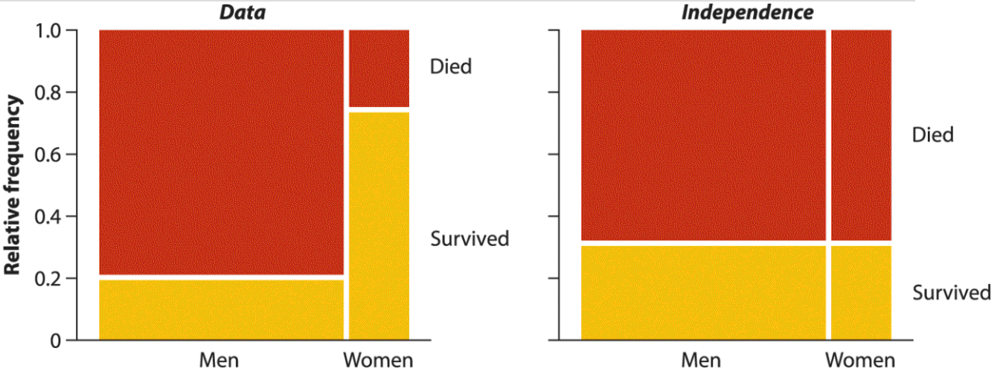
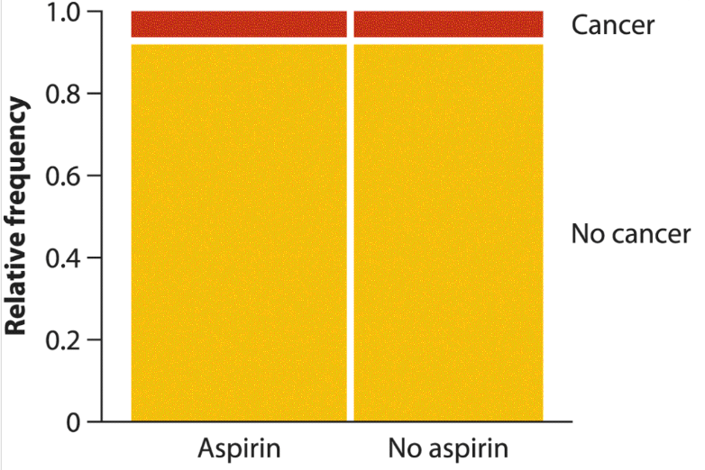
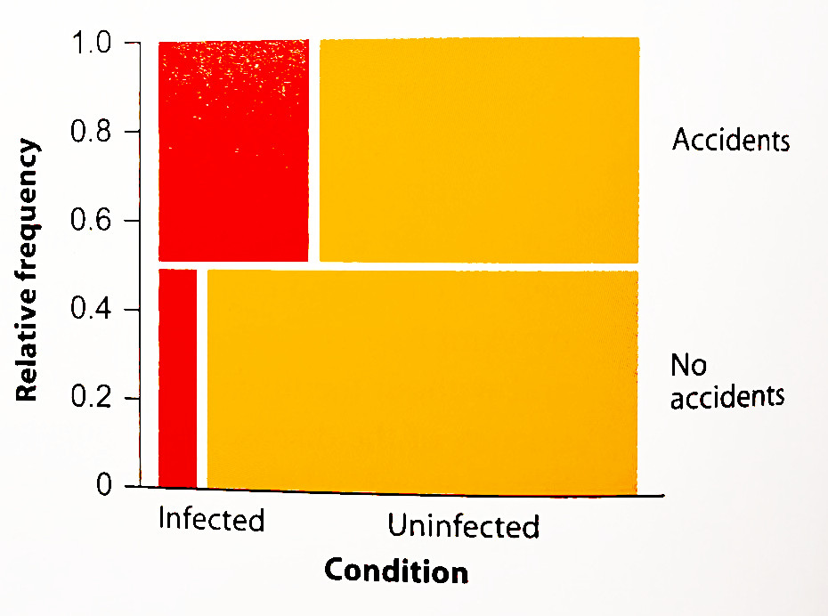
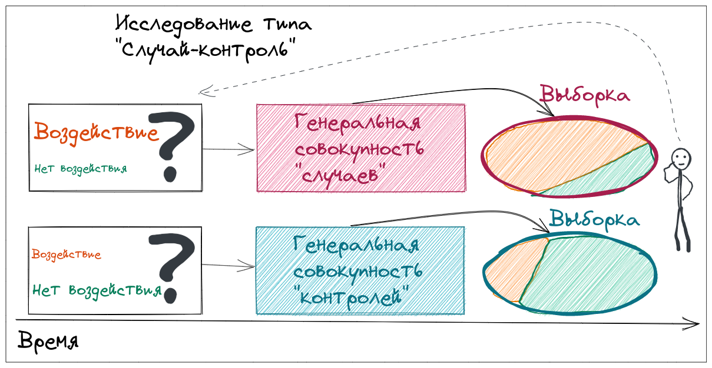
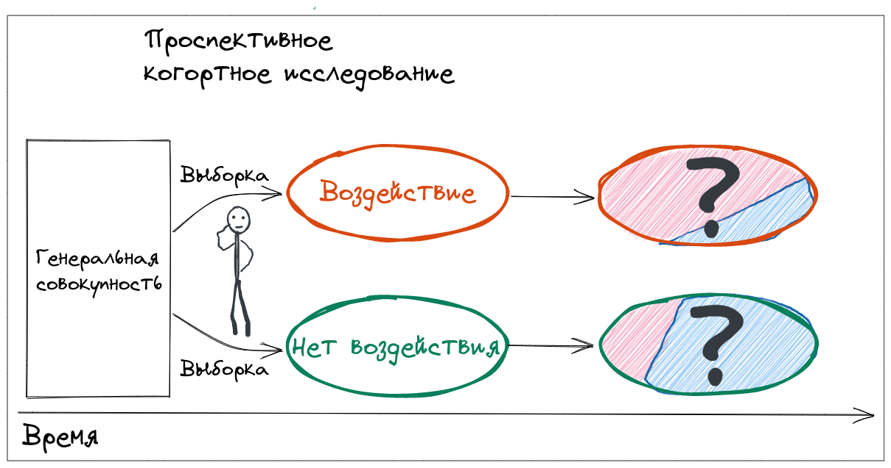
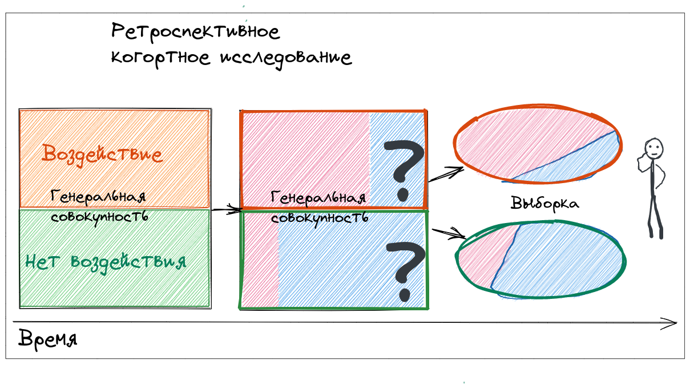
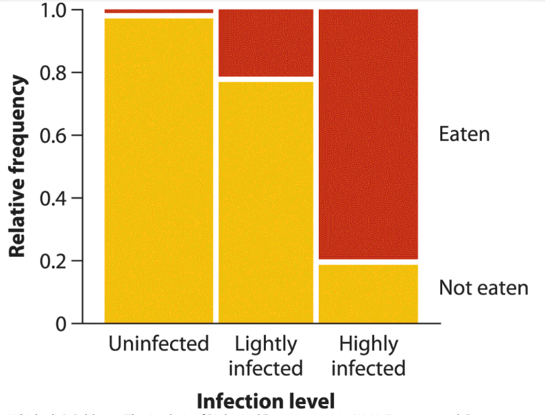
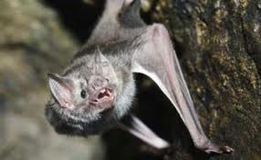
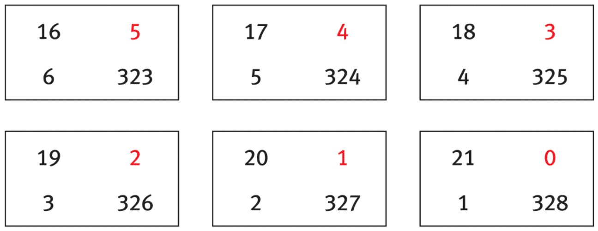

```{r setup, include = FALSE, cache = FALSE, purl = FALSE, fig.showtext = TRUE}
source("assets/setup.R")
knitr::opts_chunk$set(dev.args = list(png  = list(type = "cairo")))
library(xaringanExtra)
use_tile_view()
use_scribble()
use_search(show_icon = FALSE)
use_progress_bar(color = "#6d2b5e", location = "bottom", height = "10px")
use_freezeframe()
# use_webcam()
# use_panelset()
# use_extra_styles(hover_code_line = TRUE)

options(htmltools.preserve.raw = FALSE)

# http://tachyons.io/docs/
# https://roperzh.github.io/tachyons-cheatsheet/
use_tachyons()

# library(renderthis)
# to_pdf(from = "17-assotiation-between-categorical-data.html",
#        to = "17-assotiation-between-categorical-data.pdf",
#        complex_slides = TRUE, partial_slides = TRUE)
```

```{r libs, include=FALSE, warning=FALSE}
library(tidyverse)
library(cowplot)
library(scales)
```

- Описание связи между категориальными переменными
- Риск
- Шансы
- Шансы или риск?
- Тест сопряженности хи-квадрат
- Точный критерий Фишера
- G-тест


---

class: middle, center, inverse

# Описание связи между категориальными переменными

---

## Таблицы сопряженности

__Таблицы сопряженности__ (contingency tables) показывают, как частоты категорий по одной переменной зависят от значения другой категориальной переменной.

Можно узнать:

- Различается ли вероятность быть съеденной птицей у ярких и темных улиток?
- Насколько более вероятно развитие рака легких у курильщиков по сравнению с некурящими?
- Будет ли ниже вероятность инфаркта у людей, принимающих аспирин?

<br/>

--

Можно оценить 

- относительный риск 
- соотношение шансов

Можно протестировать гипотезы о разнице вероятностей

---

## Анализ сопряженности 

__Анализ сопряженности__ позволяет оценить, насколько связаны ("сопряжены") друг с другом категориальные переменные.

Если переменные независимы, то значение одной из переменных не дает информации о вероятностях категорий другой переменной.

<br/>

Слева — смерти среди 2092 пассажиров Титаника (данные из Dawson, 1995).

Справа — тот же график, если бы вероятность гибели не зависела от пола.



.tiny[рис. 9.1-1 из Whitlock, Schluter, 2015]

---

## Аспирин и рак

Аспирин используется для лечения головной боли, простуды, профилактики инфаркта и инсульта. В некоторых описательных исследованиях предположили, что он может снижать риск рака.

Экспериментальное слепое исследование (Cook et al. 2005):

- опыт: 19934 женщины — аспирин 100 мг/день
- контроль: 19942 женщины — плацебо

.pull-left[

Через 10 лет наблюдений у некоторых развился рак.

|          | Аспирин | Плацебо |   
|----------|---------|---------|
| Рак      | 1 438   | 1 427   |
| Нет рака | 18 496  | 18 515  |
| Сумма    | 19 934  | 19 942  |

]

--

.pull-right[



.tiny[рис 9.2-1 из Whitlock, Schluter, 2015]

]

--

Можно вычислить вероятности возникновения рака в двух группах.
Но хочется описать данные __одним числом__: риск или шансы.


---

class: middle, center, inverse

# Риск

---

## Риск

__Риск__ (risk) — другое название вероятности определенного исхода.

<br/>

--

------

### В примере про аспирин

|          | Аспирин | Плацебо |   
|----------|---------|---------|
| Рак      | 1 438   | 1 427   |
| Нет рака | 18 496  | 18 515  |
| Сумма    | 19 934  | 19 942  |

--

#### Риск

Aспирин:  $p_1 = 1438/19934 = 0.0721$

Плацебо:  $p_2 = 1427/19942 = 0.0716$


---

## Отностительный риск

__Отностительный риск__ (relative risk) — способ сравнения вероятности (риска) определенного исхода ("успеха") между двумя группами. Отношение выборочных оценок вероятностей этого исхода в сравниваемых группах.

$$RR=\frac{p_1}{p_2}$$

--

$0 \le RR < \infty$

Если $RR = 1$, то риск одинаков в обеих группах.

---

## В примере про аспирин

|          | Аспирин | Плацебо |   
|----------|---------|---------|
| Рак      | 1 438   | 1 427   |
| Нет рака | 18 496  | 18 515  |
| Сумма    | 19 934  | 19 942  |

--

#### Риск

Aспирин:  $p_1 = 1438/19934 = 0.0721$

Плацебо:  $p_2 = 1427/19942 = 0.0716$

--

#### Относительный риск

$RR=\frac{0.0721}{0.0716} = 1.007$

--

Т.е. при приеме аспирина относительный риск развития рака даже немного возрастает по сравнению с плацебо.

--

Хотелось бы доверительный интервал.

---

## Стандартная ошибка и доверительный интервал для относительного риска

.pull-left-40[

|           | опыт | контроль |
|:--------- |:----:|:--------:|
| "успех"   | a    | b        |
| "неудача" | c    | d        |
| Сумма     | a + c| b + d    |
]

--

.pull-right-60[

Относительный риск $RR=\frac{p_1}{p_2}$ несимметричен $0 \le RR < \infty$

Его логарифм $\ln(RR)=\ln\big(\frac{p_1}{p_2}\big)$ симметричен $-\infty \le ln(RR) < \infty$
]

--

<br/>

Поэтому сначала делают вычисления в логарифмической шкале:

$$SE_{\ln(RR)}=\sqrt{\frac{1}{a}+\frac{1}{b}+\frac{1}{a + c}+\frac{1}{b + d}}$$

$$\ln(RR) -|z| \cdot SE_{\ln(RR)} \le \ln(RR) \le \ln(RR) +|z| \cdot SE_{\ln(RR)}$$

Для 95% доверительного интервала $|z_{\text{н.}}| = 1.96$

--

Потом границы интервала трансформируют обратно в шкалу относительного риска:

$$e^{\ln(RR) -|z| \cdot SE_{\ln(RR)}} \le RR \le e^{\ln(RR) +|z| \cdot SE_{\ln(RR)}}$$


---

## Доверительный интервал к риску в примере

|          | Аспирин | Плацебо |   
|----------|---------|---------|
| Рак      | 1 438   | 1 427   |
| Нет рака | 18 496  | 18 515  |
| Сумма    | 19 934  | 19 942  |


Относительный риск:  
$$RR=1.007$$

--

Стандартная ошибка:  
$$SE_{\ln(RR)}=\sqrt{\frac{1}{1438}+\frac{1}{1427}+\frac{1}{19934}+\frac{1}{19942}} = 0.0387$$

Границы 95% доверительного интервала:  

$$e^{\ln(1.007) - 1.96 \cdot 0.0387} \le RR \le e^{\ln(1.007) + 1.96 \cdot 0.0387} \\ 
0.933 \le RR \le 1.09$$

--

Доверительный интервал включает 1. Скорее всего влияние аспирина на риск возникновения рака очень невелико.

---

## Изменение риска

--

.pull-left[
__Снижение относительного риска__ (reduction in relative risk) — насколько снижается риск определенного исхода в одной группе по сравнению с другой (с контролем).

$$1 - RR$$
]

--

.pull-right[
__Снижение абсолютного риска__ (reduction in absolute risk) — разница абсолютного риска в одной группе (в контроле) по сравнению с другой.

$$p_2 - p_1$$

]

<br/>

--

Иногда бывает, что относительный риск сильно меняется,  
а абсолютный - ничтожно мало (т.к. очень редкий исход)

<br/>

--

-----

При приеме аспирина

.pull-left[
Относительное:  
$1 - 1.007 = -0.007$

Риск развития рака возрастает на 0.007
]

--

.pull-right[
Абсолютное:  
$0.0716 - 0.0721 = -0.0005$

Вероятность развития рака возрастает на  0.0005
]


---

class: middle, center, inverse

# Шансы

---

## Шансы

__Шансы__ (odds) — это иной способ записи вероятностей: вероятность "успеха", делённая на вероятность "неудачи".

--

$$O=\frac{p}{1-p}$$

$0 \le O < \infty$

--

<br/>

| Вероятность p |    Шансы O  |                     |
| ------------- | ----------- | ------------------- |
| 0.5           | 1:1 = 1     | 1 успех : 1 неудача |
| 0.1           | 1:9 = 0.111 | 1 успех : 9 неудач  |
| 0.0909        | 1:10 = 0.1  | 1 успех : 10 неудач |

<br/>

.pull-left[

Вероятность

- 0.75

- 0.25

- 0.8

- 0.2

]

--

.pull-right[

Шансы

- 3:1

- 1:3

- 4:1

- 1:4

]

---

## Отношение шансов

__Отношение шансов__ (odds ratio) — используется для сравнения шансов определенного исхода между двумя группами (например, опытом и контролем).

$${OR}=\frac{O_1}{O_2} = \cfrac{p_1/(1-p_1)} {p_2/(1-p_2)}$$

--

$0 \le OR < \infty$

Если $OR = 1$, то шансы "успеха" одинаковы в обеих группах.

<br/>

--

Частоты категорий в двух группах:

|           | опыт | контроль |
|:--------- |:----:|:--------:|
| "успех"   | a    | b        |
| "неудача" | c    | d        |

--

Краткая формула:

$${OR}= \cfrac{a/c}{b/d} = \cfrac{ad}{bc}$$

---

class: split-30
.row[.content[.split-two[
.column[.content[
## В примере про аспирин

|          | Аспирин | Плацебо |   
|----------|---------|---------|
| Рак      | 1 438   | 1 427   |
| Нет рака | 18 496  | 18 515  |
| Сумма    | 19 934  | 19 942  |
]]
.column[.content[
<br/>
частоты категорий

|           | опыт | контроль |
|:--------- |:----:|:--------:|
| "успех"   | a    | b        |
| "неудача" | c    | d        |
]]
]]]

.row[.content[.split-two[

.column[.content[.split-three[
.row[.content[
### Риск
Aспирин:  
$p_1 = 1438/19934 = 0.0721$
]]
.row[.content[
Плацебо:  
$p_2 = 1427/19942 = 0.0716$
]]
.row[.content[
Относительный риск:  
$RR=\frac{0.0721}{0.0716} = 1.007$
]]
]]]

.column[.content[.split-three[
.row[.content[
### Шансы
Аспирин:  
$O_1 = \cfrac{0.0721}{1- 0.0721} = 0.0777$
]]
.row[.content[
Плацебо:  
$O_2 = \cfrac{0.0716}{1- 0.0716} = 0.0771$
]]
.row[.content[
Отношение шансов:  
$OR = 0.0777/0.0771 = 1.008$

или $OR = \cfrac{1 438 \cdot 18 515}{1 427 \cdot 18 496} = 1.009$,  
т.к. уменьшилась ошибка округления
]]
]]]

]]]

---

## Стандартная ошибка и доверительный интервал для отношения шансов

.pull-left-40[

|           | опыт | контроль |
|:--------- |:----:|:--------:|
| "успех"   | a    | b        |
| "неудача" | c    | d        |
| Сумма     | a + c| b + d    |
]

--

.pull-right-60[
Отношение шансов ${OR}=\frac{O_1}{O_2}$ несимметрично $0 \le OR < \infty$

Его логарифм $\ln(OR)=\ln\big(\frac{O_1}{O_2}\big)$ симметричен $-\infty \le ln(OR) < \infty$
]

--

Поэтому сначала делают вычисления в логарифмической шкале:

$$SE_{\ln(OR)}=\sqrt{\frac{1}{a}+\frac{1}{b}+\frac{1}{c}+\frac{1}{d}}$$

$$\ln(OR) -|z| \cdot SE_{\ln(OR)} \le \ln(OR) \le \ln(OR) +|z| \cdot SE_{\ln(OR)}$$

Для 95% доверительного интервала $|z_{\text{н.}}| = 1.96$

--

Потом границы интервала трансформируют обратно в шкалу шансов:

$$e^{\ln(OR) -|z| \cdot SE_{\ln(OR)}} \le OR \le e^{\ln(OR) +|z| \cdot SE_{\ln(OR)}}$$

---

## Доверительный интервал к отношению шансов в примере

|          | Аспирин | Плацебо |   
|----------|---------|---------|
| Рак      | 1 438   | 1 427   |
| Нет рака | 18 496  | 18 515  |

Относительный риск:  
$$OR=1.009$$

--

Стандартная ошибка:  
$$SE_{\ln(RR)}=\sqrt{\frac{1}{1438}+\frac{1}{1427}+\frac{1}{18 496}+\frac{1}{18 515}} = 0.0388$$

Границы 95% доверительного интервала:  

$$e^{\ln(1.009) - 1.96 \cdot 0.0388} \le RR \le e^{\ln(1.009) + 1.96 \cdot 0.0388} \\ 
0.935 \le RR \le 1.09$$

--

Доверительный интервал включает 1. Скорее всего влияние аспирина на шансы возникновения рака крайне невелико.


---

class: middle, center, inverse

## Шансы или риск?

---

## Шансы или риск?

Обе меры используются в биологии 

Говорят, что $RR$ более интуитивно-понятен

$OR \approx RR$ когда вероятность "успеха" в целом низка

<br/>

__Выбор зависит от дизайна исследования!__  

---

## Токсоплазма и автомобильные аварии

_Toxoplasma gondii_ — это паразитический протист, заражающий мозг птиц и млекопитающих и влияющий на их поведение. 25% людей инфицированы токсоплазмой. 

Зараженность токсоплазмой в выборках водителей 21-40 лет, попадавших в автомобильные аварии и без истории аварий.
(Yereli et al., 2006)

Связан ли токсоплазмоз на вероятность попадания в аварию?


.pull-left[

|                     | Инфекция | Нет инфекции |   
|---------------------|----------|--------------|
| Водители с авариями | 61       | 124          |
| Водители без аварий | 16       | 169          |


]

--

.pull-right[



.tiny[рис.9.3-1 из Whitlock, Schluter, 2015]

]


---

class: split-30
.row[.content[.split-two[
.column[.content[
## Пример про токсоплазму

.small[
|                     | Инфекция | Нет инфекции |   
|---------------------|----------|--------------|
| Водители с авариями | 61       | 124          |
| Водители без аварий | 16       | 169          |

]
]]
.column[.content[
частоты категорий
.small[
|           | группа 1 | группа 2 |
|:--------- |:--------:|:--------:|
| "успех"   | a        | b        |
| "неудача" | c        | d        |
]
]]
]]]

.row[.content[.split-two[

.column[.content[
### Риск

Вероятность аварии нельзя сосчитать

Относительный риск не оценить

]]

.column[.content[
### Шансы

Отношение шансов можно оценить
$OR = \cfrac{61 \cdot 169}{16 \cdot 124} = 5.2$
]]

]]]

---

## Исследования типа случай-контроль 
(case-control studies)

- спланированные описательные исследования
- случайная выборка "случаев" сравнивается с выборкой "контролей"
- оценивают долю субъектов под воздействием среди "случаев" и "контролей"
- хорошо для исследования редких болезней
- нельзя считать $RR$, т.к. соотношение случай:контроль задано исследователем
- можно считать $OR$



--

Пример про токсоплазму

---

## Проспективные когортные исследования

(prospective cohort studies)

- спланированные описательные исследования
- информация о субъектах (и о воздействии) собрана в начале исследования
- судьбу субъектов прослеживают до наступления "исхода"
- оценивают вероятность наступления "исхода" в зависимости от наличия воздействия
- используются, например, для тестирования новых лекарств и методов лечения
- можно считать и $RR$, и $OR$



--

Пример про аспирин

---

## Ретроспективные когортные исследования

(retrospective cohort studies)

- __не__ запланированные описательные исследования
- информацию о субъектах (и о воздействии) на них собирают уже после того, как наступил (или нет) "исход"
- оценивают вероятность наступления "исхода" в зависимости от воздействия
- используются, например, для поиска и оценки потенциальных факторов риска
- можно считать и $RR$, и $OR$



---

class: middle, center, inverse

# Тест сопряженности хи-квадрат

---

## Паразиты рыб: "передай другому"

У трематод _Euhaplorchis californiensis_ три хозяина в жизненном цикле: улитка, рыба и птица. Инфицированные рыбы проводят много времени у поверхности воды могут стать добычей птиц (Lafferty, Morris, 1996). 

Влияет ли уровень заражения трематодами на вероятность поедания птицами?

.pull-left[

.small[
|            | Нет заражения | Низкое | Высокое | Сумма |
| ---------- | ------------- | ------ | ------- | ----- |
| Съедены    | 1             | 10     | 37      | 48    |
| Не съедены | 49            | 35     | 9       | 93    |
| Сумма      | 50            | 45     | 46      | 141   |
]
]
.pull-right[



.tiny[рис. 9.4-1 из Whitlock, Schluter, 2015]

]


---


## Тест сопряженности хи-квадрат

$\chi^2$-тест позволяет протестировать гипотезу о независимости двух категориальных переменных.

$H_0:$ — категориальные переменные независимы друг от друга

$H_A:$ — категориальные переменные зависимы

<br/>

--

-----

В примере:

$H_0:$ — будет ли съедена улитка птицей не зависит от уровня заражения улитки трематодами

$H_A:$ — поедание улитки птицей зависит от уровня заражения улитки трематодами

---

## Ожидаемые частоты в тесте сопряженности хи-квадрат

Если переменные независимы (при $H_0$), вероятность попадания в какую-то категорию по каждой из переменных равна произведению вероятностей этих категорий. 

$P(row, col) = P(row) \cdot P(col) = \cfrac{N_{row}}{N} \cdot \cfrac{N_{col}}{N}$

Чтобы получить частоты, умножаем на общее число наблюдений. Т.е. коротко:

$Expected(row, col) = \cfrac{N_{row} N_{col}}{N}$

--

-------

.pull-left[

Наблюдаемые частоты
.small[
|            | Нет заражения | Низкое | Высокое | Сумма |
| ---------- | ------------- | ------ | ------- | ----- |
| Съедены    | 1             | 10     | 37      | 48    |
| Не съедены | 49            | 35     | 9       | 93    |
| Сумма      | 50            | 45     | 46      | 141   |
]
]
.pull-right[

Ожидаемые частоты

.small[
|            | Нет заражения | Низкое | Высокое | Сумма |
| ---------- | ------------- | ------ | ------- | ----- |
| Съедены    | 17.0          | 15.3   | 15.7    | 48    |
| Не съедены | 33.0          | 29.7   | 30.3    | 93    |
| Сумма      | 50            | 45     | 46      | 141   |
]

]


---

## Хи-квадрат статистика для таблиц сопряженности

$$\chi^2 = \sum^r_{row = 1}\sum^с_{col = 1} \cfrac{(Observed_{(row, col)} - Expected_{(row, col)})^2}{Expected_{(row, col)}}$$

$df = (r - 1)(c - 1)$  
Односторонний тест 

-------

.pull-left[

Наблюдаемые частоты
.small[
|            | Нет заражения | Низкое | Высокое | Сумма |
| ---------- | ------------- | ------ | ------- | ----- |
| Съедены    | 1             | 10     | 37      | 48    |
| Не съедены | 49            | 35     | 9       | 93    |
| Сумма      | 50            | 45     | 46      | 141   |
]
]

.pull-right[

Ожидаемые частоты

.small[
|            | Нет заражения | Низкое | Высокое | Сумма |
| ---------- | ------------- | ------ | ------- | ----- |
| Съедены    | 17.0          | 15.3   | 15.7    | 48    |
| Не съедены | 33.0          | 29.7   | 30.3    | 93    |
| Сумма      | 50            | 45     | 46      | 141   |
]

]
<br/>

$\chi^2 = \frac{(1-17.9)^2}{17.0} + \frac{(49 - 33.0)^2}{33.0} + \ldots = 69.5$  

$df = (2 - 1)(3 - 1) = 2$  

$p = 7.77e-16$

--

Вероятность поедания птицей статистически значимо зависит от уровня заражения улитки трематодами.

---

### Условия применимости хи-квадрат теста сопряженности

$\chi^2$-тест для таблиц сопряженности — это частный случай $\chi^2$-теста адекватности модели, поэтому условия применимости такие же.

- наблюдения независимы друг от друга

$\chi^2$-статистика приблизительно следует $\chi^2$-распределению, если:

- нет _ожидаемых_ частот $< 1$
- $\le 20$ % _ожидаемых_ частот $< 5$

--

<br/>

Если условия нарушены:

- Если таблица больше чем 2х2, можно __объединить редкие категории__, если они имеют биологический смысл
- Если таблица 2х2, можно использовать __точный тест Фишера__
- Можно использовать __пермутационный тест__

---

## Поправка на непрерывность

__Поправка Йейтса на непрерывность__ (Yates correction for continuity) — используется в анализе таблиц сопряженности 2х2. Корректирует ошибку в результате аппроксимации дискретных вероятностей категорий непрерывным распределением $\chi^2$.

$$\chi^2 = \sum^r_{row = 1}\sum^с_{col = 1} \cfrac{\bigg(|Observed_{(row, col)} - Expected_{(row, col)}| - \cfrac{1}{2}\bigg)^2}{Expected_{(row, col)}}$$

Не рекомендуется.

$\chi^2$-тест сопряженности с поправкой Йейтса становится слишком консервативным (Maxwell, 1976):  значения p завышены.


---

class: middle, center, inverse

# Точный критерий Фишера

---

## Точный критерий Фишера

__Точный критерий Фишера__ (Fisher's exact test) — тест для таблиц сопряженности 2х2


$H_0:$ — категориальные переменные независимы друг от друга

$H_A:$ — категориальные переменные зависимы

<br/>

- даёт точное значение p
- работает и с малыми ожидаемыми частотами

Вручную считать сложно.


???

Muriel Bristol - the lady tasting tea

---

## Питание вампиров

Летучие мыши-вампиры _Desmodus rotundus_ в Коста Рике часто питаются кровью крупного рогатого скота. Кажется, они предпочитают коров быкам, и возможно, реагируют на гормоны. 

Влияет ли эструс коров на вероятность быть укушенной вампиром (Turner, 1975)?

.pull-left[
|            | Эструс | Нет эструса | Сумма |
|------------|--------|-------------|-------|
| Укушена    | 15     | 6           | 21    |
| Не укушена | 7      | 322         | 329   |
| Сумма      | 22     | 328         | 350   |

]
.pull-right[


.tiny[blog.seniorennet.be, CC0, via Wikimedia Commons]

]

---

## Хи-квадрат не подходит для этих данных

.pull-left[

Наблюдаемые частоты

|            | Эструс | Нет эструса | Сумма |
|------------|--------|-------------|-------|
| Укушена    | 15     | 6           | 21    |
| Не укушена | 7      | 322         | 329   |
| Сумма      | 22     | 328         | 350   |

]
.pull-right[

Ожидаемые частоты

|            | Эструс | Нет эструса | Сумма |
|------------|--------|-------------|-------|
| Укушена    | 1.3    | 19.7        | 21    |
| Не укушена | 20.7   | 308.3       | 329   |
| Сумма      | 22     | 328         | 350   |

]

--

<br/>

Данные не подходят для анализа при помощи хи-квадрат  т.к. $\sim 1/4 > 20\%$ ожидаемых частот $<5$

---

## Точный критерий Фишера

.pull-left[

Наблюдаемые частоты

|            | Эструс | Нет эструса |
|------------|--------|-------------|
| Укушена    | 15     | 6           |
| Не укушена | 7      | 322         |

]
.pull-right[


]

<br/>

Сколько возможно еще более "экстремальных" (менее вероятных) таблиц?

Суммы по строкам и столбцам не должны при этом меняться.

--

.pull-left-66[

]
.pull-right-33[
Точный критерий Фишера учтёт вероятности __всех__ возможных более экстремальных таблиц.
<br/><br/><br/><br/><br/>
.tiny[Whitlock, Schluter, 2015]
]

В нашем примере $p < 10^{-10}$.

--

У коров вероятность быть укушенной вампиром статистически-значимо связана с эструсом.

???

Предполагается, что вампиры минимизируют потребление коровьих гормонов, которые могут влиять на размножение летучих мышей (во время эструса минимальная концентрация).

---

## Особенности точного критерия Фишера

- Чрезмерно консервативен (альтернатива - тест Бошлу, Boschloo's test)
- Не так уж и "точен", т.к. используются вероятности таблиц при зафиксированных значениях сумм по строкам и столбцам (а они могут меняться в выборках).
- Не подходит для стратифицированных данных (тест Кокрана-Мантела-Хензела, Cochran–Mantel–Haenszel test)

---

class: middle, center, inverse

# G-тест

---

## G-тест

__G-тест__ основан на вычислении правдоподобий, но может применяться как тест для таблиц сопряженности.

$H_0:$ — категориальные переменные независимы друг от друга

$H_A:$ — категориальные переменные зависимы

$$G = 2 \sum^r_{row = 1} \sum^c_{col = 1} Observed_{(row, col)} \cdot \ln \big(\cfrac{Observed_{(row, col)} }{Expected_{(row, col)} }\big)$$

При $H_0$ распределение $G \sim \chi^2$  
с числом степеней свободы $df = (r - 1)(c - 1)$  

Односторонний тест 

---

## Особенности G-теста

- При малых объемах выборок менее точен, чем другие (Agresti, 2002). Лучше использовать точный критерий Фишера.
- Подходит для данных со множеством переменных-предикторов (Sokal, Rholf, 1995; Agresti, 2002)

---

class: middle, center, inverse

# Summary

---

## Summary

Таблицы сопряженности (contingency tables) показывают, как частоты категорий по одной переменной зависят от значения другой категориальной переменной.

Анализ сопряженности позволяет по таблице частот оценить, насколько связаны ("сопряжены") друг с другом категориальные переменные.

---

## Summary

- Риск - вероятность определенного исхода.

- Шансы - вероятность наступления определенного исхода, делённая на вероятность его не наступления

- Для описания связи между переменными используются
  - относительный риск - отношение выборочных оценок вероятностей исхода в сравниваемых группах
  - отношение шансов
  
- В исследованиях типа случай-контроль нельзя рассчитывать относительный риск, т.к. вероятности некоторых категорий заданы исследователем, а не свойствами выборки. 

---

## Summary

- Для анализа таблиц сопряженности используется тест сопряженности $\chi^2$, который позволяет протестировать гипотезу о независимости двух категориальных переменных.

- При нарушении условий применимости $\chi^2$-теста для тестирования гипотезы о независимости используют точный критерий Фишера.

- Для тестирования гипотезы о независимости категориальных переменных часто используют G-тест, но он плохо работает на малых выборках, по-этому предпочтительнее использовать точный критерий Фишера или обычный тест сопряженности $\chi^2$.

---

## Что почитать

Agresti, A., Franklin, C. A., & Klingenberg, B. (2017). Statistics: The art and science of learning from data (Fourth edition). Pearson.

Whitlock, M., & Schluter, D. (2015). The analysis of biological data (Second edition). Roberts and Company Publishers.
