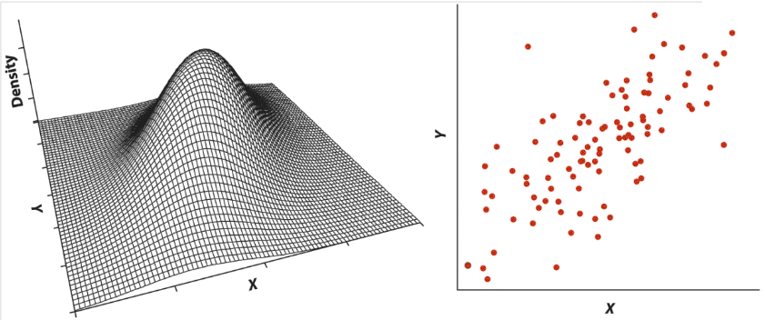
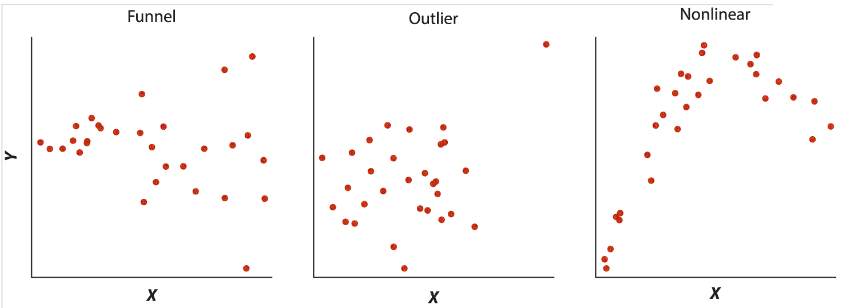
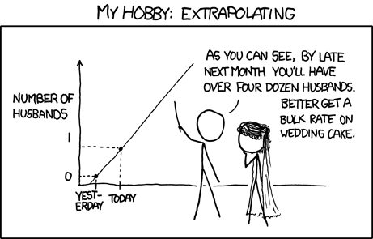
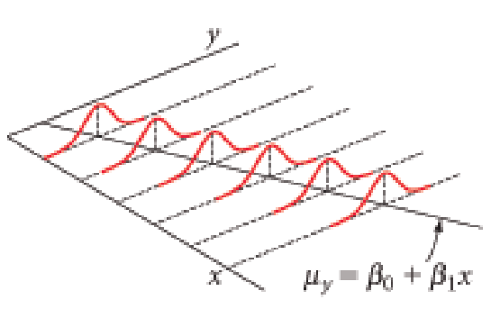
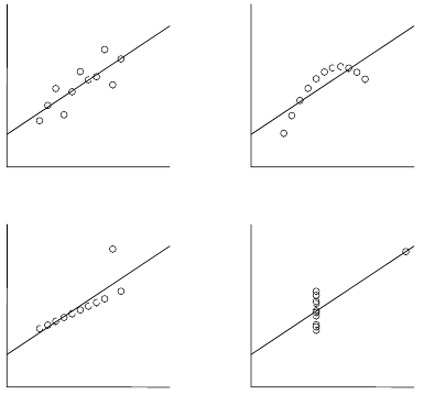

```{r setup, include = FALSE, cache = FALSE, purl = FALSE, fig.showtext = TRUE}
source("assets/setup.R")
knitr::opts_chunk$set(dev.args = list(png  = list(type = "cairo")))
library(xaringanExtra)
use_tile_view()
use_scribble()
use_search(show_icon = FALSE)
use_progress_bar(color = "#6d2b5e", location = "bottom", height = "10px")
use_freezeframe()
# use_webcam()
# use_panelset()
# use_extra_styles(hover_code_line = TRUE)

options(htmltools.preserve.raw = FALSE)

# http://tachyons.io/docs/
# https://roperzh.github.io/tachyons-cheatsheet/
use_tachyons()

# library(renderthis)
# to_pdf(from = "21-correlation-and-regression.html",
#        to = "21-correlation-and-regression.pdf",
#        complex_slides = TRUE, partial_slides = TRUE)
```

```{r libs, include=FALSE, warning=FALSE}
library(tidyverse)
library(cowplot)
library(scales)
```

- Корреляция
- Простая линейная регрессия
- Условия применимости линейной регрессии

---

class: middle, center, inverse

# Корреляция

---

## Пример: львиные носы

Определение возраста львов на расстоянии важно, чтобы решить, на кого можно охотиться. 

Есть ли связь между степенью пигментации львиного носа и возрастом льва? (данные Whitman et al., 2004)

```{r gg-lions}
lion <- read.csv("data/lions_Whitman_etal_2004.csv", stringsAsFactors = FALSE)
gg_lions <- ggplot(data = lion, aes(x = proportionBlack, y = ageInYears)) + geom_point() +
  labs(x = "Доля черного цвета", y = "Возраст, лет")
gg_lions
```

---

## Пример: инбридинг у волков

В 70-80 волки в Норвегии и Швеции прошли через бутылочное горлышко. Популяция восстановилась всего от пары особей, поэтому можно ожидаемо наблюдать последствия инбридинга. 

Связан ли коэффициент инбридинга и число волчат в выводке, переживших свою первую зиму? (данные Liberg et al, 2005)

```{r gg-wolves}
wolf <- read.csv("data/wolves_inbreeding_Liberg_etal_2005.csv", stringsAsFactors = FALSE)
gg_wolves <- ggplot(data = wolf, aes(x = inbreedCoef, y = nPups)) + geom_point() +
  labs(x = "Коэффициент инбридинга", y = "Число волчат, шт.")
gg_wolves
```


---

## Корреляция

Когда переменные взаимосвязаны друг с другом, говорят, что между ними есть корреляция.

.pull-left[

```{r gg-lions}
```

]
.pull-right[

```{r gg-wolves}
```

]

---

## Корреляция

Когда переменные взаимосвязаны друг с другом, говорят, что между ними есть корреляция.

.pull-left[

```{r gg-lions}
```

Положительная корреляция — чем больше одна величина, тем больше другая.

]

.pull-right[
```{r gg-wolves}
```

Отрицательная корреляция — чем больше одна величина, тем меньше другая.
]


---

## Коэффициент корреляции Пирсона

— оценивает силу и направление связи между численными величинами.

$$r=\cfrac{\sum_i\left(x_i-\bar{x}\right)\left(y_i-\bar{y}\right)}{\sqrt{\sum_i\left(x_i-\bar{x}\right)^2} \sqrt{\sum_i\left(y_i-\bar{y}\right)^2}}$$

--

В числителе — сумма произведений __отклонений__ переменных от их средних.


```{r corr-pearson-deviations, echo=FALSE, purl=FALSE, opts.label='fig.wide', fig.height=4}
set.seed(24895)
X_back <- rnorm(20, 5, 4)
Y_back <- 5 + 0.1 * X_back + rnorm(20, 0, 2)

XY <- data.frame(x = X_back, y = Y_back)

meanX <- mean(X_back)
meanY <- mean(Y_back)
Xmin <- min(X_back)
Xmax <- max(X_back)
Ymin <- min(Y_back)
Ymax <- max(Y_back)

X <- meanX + (Xmax - meanX)/2
Y <- meanY + (Ymax - meanY)/2
X1 <- meanX + (Xmin - meanX)/2
Y1 <- meanY + (Ymin - meanY)/2
X2 <- meanX + (Xmax - meanX)/2
Y2 <- meanY + (Ymin - meanY)/2

X3 <- meanX + (Xmin - meanX)/2
Y3 <- meanY + (Ymax - meanY)/2

ar <- arrow(type = 'closed', length = unit(0.4,'cm'), angle = 15)

Pl_positiv1 <- 
  ggplot() + 
  geom_point(data = XY, aes(x = x, y = y), colour = "grey") + 
  # xlim(Xmin, Xmax) + ylim(Ymin, Ymax) + guides(size = 'none') + 
  geom_segment(aes(x = meanX, y = meanY, xend = X, yend = Y), arrow = ar) +
  geom_segment(aes(x = meanX, y = meanY, xend = meanX, yend = Ymin), linetype = 2) +
  geom_segment(aes(x = meanX, y = meanY, xend = Xmin, yend = meanY), linetype = 2) +
  geom_segment(aes(x = X, y = Y, xend = Xmin, yend = Y), linetype = 2) +
  geom_segment(aes(x = X, y = Y, xend = X, yend = Ymin), linetype = 2) +
  geom_segment(aes(x = meanX, y = Ymin, xend = X, yend = Ymin), arrow = ar, colour ="red", size = 1) + 
  labs(x = 'x', y = 'y') +
  geom_segment(aes(x = Xmin, y = meanY, xend = Xmin, yend = Y), arrow = ar, colour = "red", size = 1) + 
    geom_point(aes(x = c(meanX, X), y = c(meanY, Y)), colour = "darkcyan") +
  ggtitle('Положительные\nотклонения') 


Pl_positiv2 <- 
  ggplot() + 
  geom_point(data = XY, aes(x = x, y = y), colour = "grey") + 
  # xlim(Xmin, Xmax) + ylim(Ymin, Ymax) + guides(size = 'none') + 
  geom_segment(aes(x = meanX, y = meanY, xend = X1, yend = Y1), arrow = ar) +
  geom_segment(aes(x = meanX, y = meanY, xend = meanX, yend = Ymin), linetype = 2) +
  geom_segment(aes(x = meanX, y = meanY, xend = Xmin, yend = meanY), linetype = 2) +
  geom_segment(aes(x = X1, y = Y1, xend = Xmin, yend = Y1), linetype = 2) +
  geom_segment(aes(x = X1, y = Y1, xend = X1, yend = Ymin), linetype = 2) +
  geom_segment(aes(x = meanX, y = Ymin, xend = X1, yend = Ymin), arrow = ar, colour = "blue", size = 1) + 
  geom_segment(aes(x = Xmin, y = meanY, xend = Xmin, yend = Y1), arrow = ar, colour = "blue", size = 1) + 
    geom_point(aes(x = c(meanX, X1), y = c(meanY, Y1)), colour = "darkcyan") +
  labs(x = 'x', y = 'y') +
  ggtitle('Отрицательные\nотклонения') 

Pl_negative <- 
  ggplot() + 
  geom_point(data = XY, aes(x = x, y = y), colour = "grey") + 
  geom_point(aes(x = c(meanX, X2), y = c(meanY, Y2))) +
  # xlim(Xmin, Xmax) + ylim(Ymin, Ymax) + guides(size = 'none') + 
  geom_segment(aes(x = meanX, y = meanY, xend = X2, yend = Y2), arrow = ar) +
  geom_segment(aes(x = meanX, y = meanY, xend = meanX, yend = Ymin), linetype = 2) +
  geom_segment(aes(x = meanX, y = meanY, xend = Xmin, yend = meanY), linetype = 2) +
  geom_segment(aes(x = X2, y = Y2, xend = Xmin, yend = Y2), linetype = 2) +
  geom_segment(aes(x = X2, y = Y2, xend = X2, yend = Ymin), linetype = 2) +
  geom_segment(aes(x = meanX, y = Ymin, xend = X2, yend = Ymin), arrow = ar, colour = "red", size = 1)+ 
  geom_segment(aes(x = Xmin, y = meanY, xend = Xmin, yend = Y2), arrow = ar, colour = "blue", size = 1) + 
  geom_point(aes(x = c(meanX, X2), y = c(meanY, Y2)), colour = "darkcyan") +
  labs(x = 'x', y = 'y') +
  ggtitle('Разнонаправленные\nотклонения') 

Pl_negative2 <- 
  ggplot() + 
  geom_point(data = XY, aes(x = x, y = y), colour = "grey") + 
  # xlim(Xmin, Xmax) + ylim(Ymin, Ymax) + guides(size = 'none') +
  geom_segment(aes(x = meanX, y = meanY, xend = X3, yend = Y3), arrow = ar) +
  geom_segment(aes(x = meanX, y = meanY, xend = meanX, yend = Ymin), linetype = 2) +
  geom_segment(aes(x = meanX, y = meanY, xend = Xmin, yend = meanY), linetype = 2) +
  geom_segment(aes(x = X3, y = Y3, xend = Xmin, yend = Y3), linetype = 2) +
  geom_segment(aes(x = X3, y = Y3, xend = X3, yend = Ymin), linetype = 2) +
  geom_segment(aes(x = meanX, y = Ymin, xend = X3, yend = Ymin), arrow = ar, colour = "blue", size = 1)+ 
  geom_segment(aes(x = Xmin, y = meanY, xend = Xmin, yend = Y3), arrow = ar, colour = "red", size = 1) + 
  geom_point(aes(x = c(meanX, X3), y = c(meanY, Y3)), colour = "darkcyan") +
  labs(x = 'x', y = 'y') +
  ggtitle('Разнонаправленные\nотклонения') 

th_gg_facet <- theme(axis.title.y = element_blank(), 
                     axis.text.y = element_blank())
plot_grid(Pl_positiv1, 
          Pl_positiv2 + th_gg_facet,
          Pl_negative + th_gg_facet,
          Pl_negative2 + th_gg_facet, 
          ncol = 4, rel_widths = c(1.2, 1, 1, 1))
```

--

$-1 < r < 1$  
- $|r| = 1$ --- сильная связь
--
: $r > 0$ — положительная, $r < 0$ — отрицательная

--
- $r = 0$ --- нет связи

---

## Корреляция на графике

  
```{r corr-plot, echo=FALSE, purl=FALSE, opts.label='fig.large'}
#Title: An example of the correlation of x and y for various distributions of (x,y) pairs
#Tags: Mathematics; Statistics; Correlation
#Author: Denis Boigelot
#Packets needed : mvtnorm (rmvnorm), RSVGTipsDevice (devSVGTips)
#How to use: output()
#
#This is an translated version in R of an Matematica 6 code by Imagecreator.

library(mvtnorm)
# library(RSVGTipsDevice)

MyPlot <- function(xy, xlim = c(-4, 4), ylim = c(-4, 4), eps = 1e-15) {
   title = round(cor(xy[,1], xy[,2]), 1)
   if (sd(xy[,2]) < eps) title = '' # corr. coeff. is undefined
   plot(xy, main = title, xlab = '', ylab = '',
        col = 'darkblue', pch = 16, cex = 0.5,
        xaxt = 'n', yaxt = 'n', bty = 'n',
        xlim = xlim, ylim = ylim)
}

MvNormal <- function(n = 1000, cor = 0.8) {
   for (i in cor) {
      sd = matrix(c(1, i, i, 1), ncol = 2)
      x = rmvnorm(n, c(0, 0), sd)
      MyPlot(x)
   }
}

rotation <- function(t, X) return(X %*% matrix(c(cos(t), sin(t), -sin(t), cos(t)), ncol = 2))

RotNormal <- function(n = 1000, t = pi/2) {
   sd = matrix(c(1, 1, 1, 1), ncol = 2)
   x = rmvnorm(n, c(0, 0), sd)
   for (i in t)
      MyPlot(rotation(i, x))
}

Others <- function(n = 1000) {
   x = runif(n, -1, 1)
   y = 4 * (x^2 - 1/2)^2 + runif(n, -1, 1)/3
   MyPlot(cbind(x,y), xlim = c(-1, 1), ylim = c(-1/3, 1+1/3))

   y = runif(n, -1, 1)
   xy = rotation(-pi/8, cbind(x,y))
   lim = sqrt(2+sqrt(2)) / sqrt(2)
   MyPlot(xy, xlim = c(-lim, lim), ylim = c(-lim, lim))

   xy = rotation(-pi/8, xy)
   MyPlot(xy, xlim = c(-sqrt(2), sqrt(2)), ylim = c(-sqrt(2), sqrt(2)))
   
   y = 2*x^2 + runif(n, -1, 1)
   MyPlot(cbind(x,y), xlim = c(-1, 1), ylim = c(-1, 3))

   y = (x^2 + runif(n, 0, 1/2)) * sample(seq(-1, 1, 2), n, replace = TRUE)
   MyPlot(cbind(x,y), xlim = c(-1.5, 1.5), ylim = c(-1.5, 1.5))

   y = cos(x*pi) + rnorm(n, 0, 1/8)
   x = sin(x*pi) + rnorm(n, 0, 1/8)
   MyPlot(cbind(x,y), xlim = c(-1.5, 1.5), ylim = c(-1.5, 1.5))

   xy1 = rmvnorm(n/4, c( 3,  3))
   xy2 = rmvnorm(n/4, c(-3,  3))
   xy3 = rmvnorm(n/4, c(-3, -3))
   xy4 = rmvnorm(n/4, c( 3, -3))
   MyPlot(rbind(xy1, xy2, xy3, xy4), xlim = c(-3-4, 3+4), ylim = c(-3-4, 3+4))
}

output <- function() {
   # devSVGTips(width = 7, height = 3.2) # remove first and last line for no svg exporting
   par(mfrow = c(3, 7), oma = c(0,0,0,0), mar=c(2,2,2,0))
   MvNormal(800, c(1.0, 0.8, 0.4, 0.0, -0.4, -0.8, -1.0));
   RotNormal(200, c(0, pi/12, pi/6, pi/4, pi/2-pi/6, pi/2-pi/12, pi/2));
   Others(800)
   # dev.off() # remove first and last line for no svg exporting
}
output()
```

---

## Стандартная ошибка коэффициента корреляции

$r$ — корреляция, расчитаная по данным, это оценка истинного значения корреляции $\rho$ в генеральной совокупности.

Стандартная ошибка этой оценки:

$$\mathrm{SE}_r=\sqrt{\frac{1-r^2}{n-2}}$$

Ее не получится использовать для доверительного интервала, т.к. ее выборочное распределение не нормально.

Но ее можно использовать для тестов.

---

## Приблизительный доверительный интервал

Z-преобразование Фишера:

$z = 0.5 \ln \left(\cfrac{1+ r}{1-r}\right)$

--

Стандартная ошибка выборочного распределения $z$

$SE_z=\sqrt{\frac{1}{n-3}}$

--

Доверительный интервал для Z-преобразованного значения корреляции

$z - 1.96 \cdot SE_z < z < z + 1.96 \cdot SE_z$

--

Границы нужно трансформировать обратно из $z$ шкалы в $r$, чтобы получить доверительный интервал для $r$

$r = \cfrac{\mathrm{e}^{2 z}-1}{\mathrm{e}^{2 z}+1}$


---

## Тестирование значимости коэффициента корреляции

$H_0: \rho = 0$ — нет связи между переменными (в генеральной совокупности корреляция $\rho$ между ними равна нулю)

$H_A: \rho \ne 0$ — между переменными есть связь

$$t=\cfrac{r - 0}{\mathrm{SE}_r}$$

$df = n - 2$

---

## Условия применимости коэффициента корреляции Пирсона

(1) Двумерное нормальное распределение переменных (требуется для работы тестов значимости)



---

## Условия применимости коэффициента корреляции Пирсона

(2) Не должно быть гетерогенности дисперсий 

(3) В данных не должно быть выбросов (= outliers)

(4) Связь должна быть линейной. Если связь нелинейна, то коэффициент корреляции Пирсона оценит только ее линейную составляющую.




---

## Если нарушены условия применимости

Что можно сделать:

- выбросы можно удалить, если есть аргументы в пользу этого
- трансформация данных может помочь:
  - для линеаризации зависимости
  - для нормализации формы распределения

--

В других случаях ранговые коэффициенты корреляции:

- кор. Кендалла
- кор. Спирмена,  
и т.д.


---

class: middle, center, inverse

# Линейная регрессия

---

## Линейная регрессия

- позволяет описать зависимость между количественными величинами
- позволяет предсказать значение одной величины, зная значения других

.center[
```{r gg-lions-lm, echo=FALSE, purl=FALSE}
gg_lions + geom_smooth(method = 'lm')
```
]

---

## Уравнение линейной регрессии

<br/><br/>

.center[
```{r gg-lions-lm, echo=FALSE, purl=FALSE}
```
]

--

.pull-left[

В выборке

$$y _i = b _0 + b _1 x _i + e_i$$

]

--

.pull-right[

В генеральной совокупности

$$y _i = \beta _0 + \beta _1 x _{1i} + \varepsilon_i$$

]

---

## Линейная регрессия бывает простая и множественная

- простая

$$y _i = \beta _0 + \beta _1 x _i + \varepsilon _i$$

- множественная

$$y _i = \beta _0 + \beta _1 x _{1 i} + \beta _2 x _{2 i} + ... + \varepsilon _i$$


---

## Коэффициенты линейной регрессии

.pull-left[

```{r echo=FALSE, opts.label='fig.column'}
dfr <- data.frame(x = c(-1,  -0.5, 0.8, 2.5, 3, 4), 
                  y = c(-0.5, 1.5, 1,   5,   2, 3.5))
mod <- lm(y ~ x, data = dfr)
cf <- coef(mod)

gg_coefs <- ggplot(data = dfr, aes(x = x, y = y)) +
  geom_point(colour = 'darkcyan') +
  coord_equal(xlim = c(-2, 5), ylim = c(-1, 6), expand = FALSE) +
  scale_x_continuous(breaks = -1:5) + scale_y_continuous(breaks = -1:6) + 
  geom_hline(yintercept = 0) + geom_vline(xintercept = 0) +
  geom_smooth(method = 'lm', se = FALSE) +
  # остаток
  annotate('segment', x = 2.5, y = 5, xend = 2.5, yend = predict(mod, data.frame(x = 2.5)), linetype = 'dashed', size = 0.8) + 
  annotate('text', label = 'e[i] == y[i] - hat(y)[i]', x = 2.7, y = 4.5, parse = T, size = 6, hjust = 0) +
  # предсказанное
  annotate('text', label = 'y[i]', x = 2, y = 5, parse = T, size = 6) +
  annotate('point', x = 2.5, y = 5, size = 3, colour = 'red3') +
  # наблюдаемое
  annotate('text', label = 'hat(y)[i]', x = 2, y = 3, parse = T, size = 6) +
  # x_i
  annotate('segment', x = 2.5, y = 0, xend = 2.5, yend = predict(mod, data.frame(x = 2.5)), linetype = 'dotted') +
  annotate('text', label = 'x[i]', x = 2.5, y = -0.4, parse = T, size = 6) +
  # отрезок
  annotate('segment', x = 0, y = cf[1], xend = 0, yend = 0, size = 2, colour = 'red3')  +
  annotate('text', label = 'b[0]', x = -0.4, y = 0.3, parse = T, size = 6) +
  # угол наклона
  annotate('segment', x = 1, y = 0, xend = 1, yend = predict(mod, data.frame(x = 1)), linetype = 'dotted') +
  annotate('segment', x = 2, y = 0, xend = 2, yend = predict(mod, data.frame(x = 2)), linetype = 'dotted') +
  annotate('segment', x = 1, y = predict(mod, data.frame(x = 1)), xend = 0, yend = predict(mod, data.frame(x = 1)), linetype = 'dotted') +
  annotate('segment', x = 2, y = predict(mod, data.frame(x = 2)), xend = 0, yend = predict(mod, data.frame(x = 2)), linetype = 'dotted') +
  annotate('segment', x = 0, y = predict(mod, data.frame(x = 1)), xend = 0, yend = predict(mod, data.frame(x = 2)), size = 2, colour = 'orange2') +
  annotate('text', label = 'b[1]', x = -0.4, y = 2, parse = T, size = 6) +
  annotate('segment', x = 1, y = 0, xend = 2, yend = 0, size = 1) +
  annotate('text', label = '1', x = 1.5, y = -0.4, size = 6) 
  
gg_coefs
```

]
.pull-right[

$$y _i = b _0 + b _1 x _i + e_i$$

- $y_i$ — наблюдаемое значение (= observed) зависимой переменной, отклик
- $x_i$ — значение независимой переменной, предиктор (=predictor)
- $\hat y_i$ — предсказанное значение (= fitted, predicted) зависимой переменной
- $e_i$ — остатки (= residuals), отклонения наблюдаемых от предсказанных значений

]

- $b_0$ — свободный член линейной модели, отрезок (intercept), отсекаемый регрессионной прямой на оси $y$
- $b_1$ — коэффициент угла наклона (slope) регрессионной прямой

---

## Как провести линию регрессии?

.pull-left[

```{r echo=FALSE, opts.label='fig.medium.taller'}
lion_lm <-lm(ageInYears ~ proportionBlack, data = lion)

int1 <- 3; sl1 <- 6
int2 <--1; sl2 <- 17

gg_lions + 
  geom_abline(slope = coef(lion_lm)[2], 
              intercept = coef(lion_lm)[1], 
              colour = 'steelblue3', size = 1) +
  geom_abline(slope = sl1, intercept = int1, 
              colour = 'orange3', size = 1) +
  geom_abline(slope = sl2, intercept = int2,
              colour = 'green4', size = 1)

gg_ls1 <- gg_lions + 
  geom_abline(slope = sl1, intercept = int1, 
              colour = 'orange3', size = 1) +
  geom_segment(aes(xend = proportionBlack , yend = int1 + sl1*proportionBlack), linetype = 'dashed')

gg_ls2 <- gg_lions + 
   geom_abline(slope = sl2, intercept = int2,
              colour = 'green4', size = 1) +
  geom_segment(aes(xend = proportionBlack , yend = int2 + sl2*proportionBlack), linetype = 'dashed')

gg_ls <- gg_lions + 
  geom_abline(slope = coef(lion_lm)[2], 
              intercept = coef(lion_lm)[1], 
              colour = 'steelblue3', size = 1) +
  geom_segment(aes(xend = proportionBlack , yend = predict(lion_lm)), linetype = 'dashed')

```

]
.pull-right[

$$\hat y _i = b _0 + b _1 x _i$$

Нужно получить $b_0$ и $b_1$ — оценки истинных параметров линейной модели $\beta _0$ и $\beta _1$.

]

---
layout: true
class: split-30
.row[.content[

## Линия должна проходить как можно ближе к точкам

]]

.row[.content[.split-three[
.column[.content[
```{r opts.label='fig.column3'}
gg_ls1
```

]]
.column[.content[
```{r opts.label='fig.column3'}
gg_ls2
```

]]
.column[.content[
```{r opts.label='fig.column3'}
gg_ls
```

]]
]]]


---

class: hide-row2-col1 hide-row2-col2 hide-row2-col3

---

class: hide-row2-col2 hide-row2-col3
count: false

---

class: hide-row2-col3
count: false

---

count: false

---
layout: false

## Метод наименьших квадратов

$$\hat y _i = b _0 + b _1 x _i$$

Значения коэффициентов $b_0$ и $b_1$ подбирают так, чтобы минимизировать __сумму квадратов остатков__  $\sum{e^2_i}$, т.е. $MS_e = \sum{(y _i - \hat y _i)^2}$.


```{r echo=FALSE, opts.label='fig.medium.taller'}
gg_ls
```

---

## Оценки параметров линейной регрессии


|Параметр   |  Оценка  |  Стандартная ошибка |
|----|----|----|
| $\beta_0$  |  $b_0 = \bar y - b_1 \bar{x}$   |  $SE _{b _0} = \sqrt{MS _e [\cfrac{1}{n} + \cfrac{\bar x}{\sum {(x _i - \bar x)^2}}]}$|
| $\beta_1$  |  $b _1 = \cfrac {\sum {[(x _i - \bar {x})(y _i - \bar {y})]}}{\sum {(x _i - \bar x)^2}}$  |  $SE _{b _1} = \sqrt{\cfrac{MS _e}{\sum {(x _i - \bar {x})^2}}}$ |
| $\varepsilon _i$  |  $e_i = y_i - \hat {y}_i$  |  $\approx \sqrt{MS_e}$ |

.tiny[Таблица из кн. Quinn, Keough, 2002, стр. 86, табл. 5.2]

Оценки коэффициентов 

  - позволяют получить предсказанные значения

Стандартные ошибки коэффициентов

  - используются для построения доверительных интервалов
  - нужны для статистических тестов

---

## Линейная регрессия в примере про львов

В общем виде линейная регрессия:

$$\hat y _i = b _0 + b _1 x _i$$

--

В примере про львов:

$$\widehat{Возраст}_i = b _0 + b _1 \cdot \text{Доля черного}_i$$

--

Мы подобрали коэффициенты модели методом наименьших квадратов:

```{r}
coef(lion_lm) %>% data.frame() %>% rename("Значение коэффициента" = ".") %>% `rownames<-`(c("$b_0$", "$b_1$")) %>% kable()
```

--

Получилось уравнение:

$$\widehat{Возраст}_i = 0.88 + 10.65 \cdot \text{Доля черного}_i$$

--

Смысл коэффициентов:

- $b_0 = 0.88$ — Ожидаемый возраст льва с непигментированным носом 0.88 лет.
- $b_1 = 10.65$ — Если доля черного увеличится на единицу, ожидаемый возраст льва увеличится на 10.65 лет.


---

## Доверительный интервал коэффициента регрессии

__Доверительный интервал коэффициента__ --- это зона, в которой при повторных выборках из генеральной совокупности с заданной вероятностью будет лежать среднее значение оценки коэффициента.

Если $\alpha = 0.05$, то получается 95% доверительный интервал.


$$b _1 \pm t _{\alpha, df = n - 2} \cdot SE _{b _1}$$

--

------

В примере про львов  стандартные ошибки для каждого из коэффициентов:

```{r}
smr_lion <- coef(summary(lion_lm))[, 1:2] %>% `colnames<-`(c("Значение коэффциента", "SE")) %>% `rownames<-`(c("$b_0$", "$b_1$")) 
smr_lion %>% kable()

b_lion <- coef(lion_lm)
SE_b_lion <- smr_lion[, 2]
n_lion <- nrow(lion)
p_lion <- length(coef(lion_lm))
df_lion <- n_lion - p_lion
t_lion <- qt(p = 0.975, df = df_lion)
mer_lion <- SE_b_lion * t_lion
```

--

$df = `r n_lion` - `r p_lion` = `r  df_lion`$

$t_{`r  nrow(lion) - length(coef(lion_lm))`} = `r format(t_lion, digits = 3, nsmall = 2)`$


Доверительные интервалы

.pull-left[

Для $b_0$:   

$`r b_lion[1]` \pm `r format(t_lion, digits = 3, nsmall = 2)` \cdot `r format(SE_b_lion[1], digits = 3, nsmall = 2)`$  
$`r b_lion[1]` \pm `r format(mer_lion[1], digits = 3, nsmall = 2)`$

]

.pull-right[

Для $b_1$:  

$`r b_lion[2]` \pm `r format(t_lion, digits = 3, nsmall = 2)` \cdot `r format(SE_b_lion[2], digits = 3, nsmall = 2)`$  
$`r b_lion[2]` \pm `r format(mer_lion[2], digits = 3, nsmall = 2)`$

]


---

## Доверительная зона регрессии

__Доверительная зона регрессии__ --- это зона, в которой при повторных выборках из генеральной совокупности с заданной вероятностью лежит регрессионная прямая. 

.pull-left[

95% доверительная зона

```{r, lion-conf-95, echo=FALSE, purl=FALSE, opts.label='fig.column'}
gg_lions + geom_smooth(method = 'lm')
```

]

--

.pull-right[

99% доверительная зона

```{r, lion-conf-99, echo=FALSE, purl=FALSE, opts.label='fig.column'}
gg_lions + geom_smooth(method = 'lm', level = 0.99)
```

]

---

class: middle, center, inverse

# Предсказываем с помощью регрессии

---

## Предсказания при помощи регрессии

В примере про львов получилось уравнение:

$\widehat{Возраст}_i = 0.88 + 10.65 \cdot \text{Доля черного}_i$

--

Исследователь мог заметить в бинокль нового льва с долей черного на носу 0.5.

Ожидаемый возраст: $0.88 + 10.65 \cdot 0.5 = 6.2$

.pull-left[

```{r, lion-conf-int, echo=FALSE, purl=FALSE, opts.label='fig.column'}
ND <- data.frame(proportionBlack = 0.5)
ND <- data.frame(ND, predict(lion_lm, newdata = ND, interval = "confidence"))

gg_lions + geom_smooth(method = 'lm') +
  geom_pointrange(data = ND, aes(x = proportionBlack, y = fit, ymax = upr, ymin = lwr), colour = "orangered1", size = 1) +
  annotate("text", x = 0.5, y = 6.2, label = "(5.4, 7.0)", size = 9, hjust = -0.1, vjust = -0.2)

```
]

.pull-right[
На линии регрессии лежат ожидаемые средние значения $y$ при разных значениях $x$. В доверительный интервал для этих средних  попадет __среднее значение возраста львов в 95% повторных выборок__.

]


---

## Неопределенность оценки предсказаний

__Доверительный интервал для предсказаний__ --- это зона, в которую попадут индивидуальные наблюдения $\hat y _i$ при данном $x _i$ в заданной доле повторных выборок.


$\hat y _i \pm t _{\alpha, n - 2} \cdot SE _{\hat y _i}$,

где $SE _{\hat y} = \sqrt{MS _{e} [1 + \frac{1}{n} + \frac{(x _{prediction} - \bar x)^2} {\sum _{i=1}^{n} {(x _{i} - \bar x)^2}}]}$

--

-----

В примере про львов

.pull-left[

```{r, lion-pred-int, echo=FALSE, purl=FALSE, opts.label='fig.column'}
ND <- data.frame(proportionBlack = 0.5)
ND <- data.frame(ND, predict(lion_lm, newdata = ND, interval = "prediction"))

gg_lions + geom_smooth(method = 'lm') +
  geom_pointrange(data = ND, aes(x = proportionBlack, y = fit, ymax = upr, ymin = lwr), colour = "seagreen", size = 1) +
  annotate("text", x = 0.5, y = 6.2, label = "(2.7, 9.7)", size = 9, hjust = -0.1, vjust = -0.2)

```
]
.pull-right[

На линии регрессии лежат ожидаемые средние значения $y$ при разных значениях $x$. В доверительный интервал предсказаний попадет __наблюдаемый возраст львов в 95% повторных выборок__.

]

---

## Доверительная область значений

__Доверительная область значений__ --- это зона, в которую попадают наблюдения в $(1 - \alpha) \cdot 100\%$ повторных выборок

```{r, lion-pred, echo=FALSE, purl=FALSE}
pr_all <- predict(lion_lm, interval = 'prediction')
lion_with_pred <- data.frame(lion, pr_all)

gg_lions + geom_smooth(method = 'lm', se = FALSE) +
  geom_ribbon(data = lion_with_pred, 
              aes(y = fit, ymin = lwr, ymax = upr), 
              fill = 'green', alpha = 0.2)  +
  geom_pointrange(data = ND, aes(x = proportionBlack, y = fit, ymax = upr, ymin = lwr), colour = "seagreen", size = 1) +
  annotate("text", x = 0.5, y = 6.2, label = "(2.7, 9.7)", size = 9, hjust = -0.1, vjust = -0.2)
```

---

## Важно! 



---

## Интерполяция и экстраполяция

```{r, fig.align='center', opts.label='fig.wider.taller', echo=FALSE}
PD <- data.frame(lion, predict(lion_lm, interval = "confidence"))
gg_lions + 
  geom_ribbon(data=PD, aes(y=fit, ymin=lwr, ymax=upr, fill = "Дов.обл.значений"), alpha=0.2) + 
  geom_smooth(method="lm", aes(fill="Дов.зона"), alpha=0.4) + 
  scale_fill_manual("Интервал", values = c("green", "gray")) + 
  xlim(-0.5, 1.5) +
  geom_text(label="Интерполяция", aes(x=0.5, y=0)) + geom_text(label="Экстраполяция", aes(x=-0.15, y=0)) +
geom_text(label="Экстраполяция", aes(x=1.15, y=0)) +
  theme(legend.position = "bottom")

``` 

Модель "работает" только в том диапазоне значений независимой переменной $x$, для которой она построена (интерполяция). 

Экстраполяцию надо применять с большой осторожностью.

---

class: middle, center, inverse

# Тестирование значимости модели и ее коэффициентов

---

## Способы проверки значимости модели и ее коэффициентов

Существует несколько способов проверки значимости модели

Значима ли модель целиком?

+ F критерий: действительно ли объясненная моделью изменчивость больше, чем случайная (=остаточная) изменчивость

Значима ли связь между предиктором и откликом?

+ t-критерий: отличается ли от нуля коэффициент при этом предикторе
+ F-критерий: значимо ли отличаются модели с даным предиктором и без него?

---

## Тестируем значимость коэффициентов t-критерием

$$t = \frac{b _1 - 0}{SE _{b _1}}$$

$H _0 : b _1 = 0$  
$H _A : b _1 \ne 0$

$t$-статистика подчиняется $t$-распределению с числом степеней свободы $df = n - p$, где $p$ --- число параметров.

Для простой линейной регрессии $df = n - 2$.

---

## Тестируем значимость коэффициентов t-критерием

.small[
```{r lion-ttests}
coef(summary(lion_lm)) %>% kable()
```
]

Результаты можно описать в тексте так:

Возраст льва статистически значимо зависит от количества черного пигмента на носу ( $b _1 = `r  round(coef(lion_lm)[2], 2)`$, $t_{df=`r nrow(lion) - length(coef(lion_lm))`} = `r round(summary(lion_lm)$coefficients[2, 3], 2)`$, $p < 0.01$ )

---

class: middle, center, inverse

# Тестирование гипотез <br/>при помощи F-критерия

```{r echo=FALSE, purl=FALSE}
lims <- range(lion$ageInYears) + c(-1, 1)
yannot <- lims[1] + 0.5
xannot <- max(lion$proportionBlack)
gmean <- mean(lion$ageInYears, na.rm = TRUE)
Y <- max(lion$ageInYears)
Y_hat <- predict(lion_lm, newdata = lion[lion$ageInYears == Y, ])
X <- lion$proportionBlack[lion$ageInYears == 0.84]

# Общая изменчивость
pl_tot <- ggplot(lion, aes(x = proportionBlack, y = ageInYears)) + 
  geom_hline(yintercept = gmean, size = 1) + 
  geom_segment(aes(x = proportionBlack, y = ageInYears, 
                   xend = proportionBlack, yend = gmean), colour = "grey70", size = 1.5) + 
  geom_point() +
  annotate("text", label = "Общее\nсреднее", 
           x = max(lion$proportionBlack), y = gmean, size = 4, hjust = 1, vjust = 1.3) + 
  labs(x = 'Доля черного', y = 'Возраст, лет', title = "Общая изменчивость")
  # annotate("text", label = "SS[t] == sum((bar(y) - y[i]))^2", parse = TRUE, x = xannot,  y = yannot, hjust = 0.95, vjust = 0.2, size = 6)

# Объясненная изменчивость
pl_exp <- ggplot(lion, aes(x = proportionBlack, y = ageInYears)) + 
  geom_smooth(method = "lm", se = F, size = 1.3) + 
  geom_hline(yintercept = gmean, size = 1) + 
  geom_segment(aes(x = proportionBlack, y = gmean, 
                   xend = proportionBlack, yend = fitted(lion_lm)), colour = "orchid", size = 1.5) + 
  geom_point() +
  annotate("text", label = "Общее\nсреднее", 
           x = max(lion$proportionBlack), y = gmean, size = 4, hjust = 1, vjust = 1.3) + 
  labs(x = 'Доля черного', y = 'Возраст, лет', title = "Объясненная") +
      # annotate("text", label = "SS[r] == sum((bar(y) - hat(y)[i]))^2", parse = TRUE, x = xannot,  y = yannot, hjust = 0.95, vjust = 0.2, size = 6)  +
  theme(axis.title.y = element_blank())

# Остаточная изменчивость
pl_res <- ggplot(lion, aes(x = proportionBlack, y = ageInYears)) + 
  geom_smooth(method ="lm", se = F, size = 1.3) + 
  geom_segment(aes(x = proportionBlack, y = ageInYears, 
                   xend = proportionBlack, yend = fitted(lion_lm)), colour = "#009E73", size = 1.5) + 
  geom_point() +
  labs(x = 'Доля черного', y = 'Возраст, лет', title = "Случайная") +
  # annotate("text", label = "SS[e] == sum(sum((y [i] - hat(y)[i])))^2", parse = TRUE, x = xannot,  y = yannot, hjust = 0.95, vjust = 0.2, size = 6)
  theme(axis.title.y = element_blank())
```

---

## Общая изменчивость

Общая изменчивость $SS_{t}$ — это сумма квадратов отклонений наблюдаемых значений $y_i$ от общего среднего $\bar y$

```{r echo=FALSE}
pl_tot
```

---

## Структура общей изменчивости

$$SS_t = \color{purple}{SS_r} + \color{green}{SS_e}$$

```{r echo=FALSE, opts.label='fig.wide'}
  plot_grid(pl_tot, pl_exp, pl_res, 
            nrow = 1, rel_widths = c(1, 1.05, 1))
```

---

## От изменчивостей к дисперсиям

```{r echo=FALSE, opts.label='fig.wide'}
plot_grid(pl_tot, pl_exp, pl_res, 
          nrow = 1, rel_widths = c(1, 1.05, 1))
```


| $MS_t$, полная дисперсия | $\color{purple}{MS_r}$, дисперсия, <br /> объясненная регрессией  | $\color{green}{MS_e}$, остаточная дисперсия | 
|-----|-----|-----|
| $MS_{t} =\frac{SS_{t}}{df_{t}}$ | $\color{purple}{MS_{r}} =\frac{\color{purple}{SS_{r}}}{df_{r}}$ | $\color{green}{MS_{e}} =\frac{\color{green}{SS_{e}}}{df_{e}}$ |
| $SS_{t}=\sum{(y_i - \bar{y})^2}$ | $\color{purple}{SS_{r}}=\sum{(\hat{y}-\bar{y})^2}$ | $\color{green}{SS_{e}}=\sum{(y_i - \hat{y})^2}$ |
| $df_{t} = n-1$ | $df_{r} = 1$ | $df_{e} = n-2$  |

---

## С помощью $MS_r$ и $MS_e$ можно тестировать значимость коэффициентов

Если зависимости нет, то $\color{purple}{MS_r} \approx \color{green}{MS_e}$


- $H_0: \color{}{\beta_1} = 0$
- $H_A: \color{}{\beta_1} \ne 0$

$$F_{df_r, df_e}= \frac{\color{purple}{MS _{r}}}{\color{green}{MS_{e}}}$$

---

## Тестирование значимости коэффициентов регрессии при помощи F-критерия

.pull-left-60[
- $H_0: \color{}{\beta_1} = 0$
- $H_A: \color{}{\beta_1} \ne 0$

$$F_{df_r, df_e}= \frac{\color{purple}{MS _{r}}}{\color{green}{MS_{e}}}$$

Для простой линейной регрессии  
$df_{r} = 1$ и $df_{e} = n - 2$


```{r f-distr, echo=FALSE, purl=FALSE}
ar <- arrow(type = "closed", length = unit(0.15,"cm"))
arb <- arrow(type = "closed", length = unit(0.15,"cm"), ends = "both")

df1 <- 1
df2 <- nrow(lion) - length(coef(lion_lm))

dfr <- data.frame(f = seq(-0.01, 2, 0.001))
ggplot(dfr, aes(x = f)) + 
  stat_function(fun = df, args = list(df1 = df1, df2 = df2), size = 1.3) + 
labs(title = expression(bold(paste("F-распределение,", ~df[1]== 1, ", ", ~ df[2]==30))),
     x = "F", y = "Плотность вероятности")
```

]

--

.pull-right-40[

F-тест будет односторонним, т.к. соотношение дисперсий может быть только положительным.

]

---

## Таблица результатов дисперсионного анализа

| Источник изменчивости  | df | SS | MS | F  | 
| ----- | ----- | ----- | ----- | ----- | 
| .purple[Регрессия] | $df _r = 1$ | $\color{purple}{SS _r} = \sum{(\hat y _i - \bar y)^2}$ | $\color{purple}{MS _r} = \frac{\color{purple}{SS _r}}{df _r}$ | $F _{df _r, df _e} = \frac{\color{purple}{MS _r}}{\color{green}{MS _e}}$ | 
| .green[Остаточная]|  $df _e = n - 2$ | $\color{green}{SS _e} = \sum{(y _i - \hat y _i)^2}$ | $\color{green}{MS _e} = \frac{\color{green}{SS _e}}{df _e}$ | 
| Общая | $df _t = n - 1$ | $SS _t = \sum {(y _i - \bar y)^2}$ | 

<br/><br/>

Минимальное упоминание результатов в тексте должно содержать $F _{df _r, df _e}$ и $p$.

---

## Проверяем значимость модели при помощи F-критерия

```{r}
library(car)
Anova(lion_lm) %>% kable()
```

Результаты дисперсионного анализа можно описать в тексте (или представить в виде таблицы):

```{r echo=FALSE, purl=FALSE}
smr_f <- summary(lion_lm)$fstatistic
f_val <- round(smr_f[1], 2)
df1 <- smr_f[2]
df2 <- smr_f[3]
```

- Возраст льва статистически значимо зависит от количества черного пигмента на носу ( $F _{`r df1`, `r df2`} = `r f_val`$, $p < 0.001$).

---

class: middle, center, inverse

# Оценка качества подгонки модели

---

## В чем различие между этими двумя моделями?

```{r residuals-scatter, echo=FALSE, opts.label='fig.wide'}
x <- rnorm(200, 20, 5)
y1 <- 10 * x + 5 + rnorm(100, 0, 5)
y2 <- 10 * x + 5 + rnorm(100, 0, 30)
d <- data.frame(x = x, y1 = y1)
pl_R1 <- ggplot(d, aes(x = x, y = y1)) + geom_point() + 
  geom_smooth(method = "lm", se = F)
pl_R2 <- ggplot(d, aes(x = x, y = y2)) + geom_point() + 
  geom_smooth(method = "lm", se = F)
plot_grid(pl_R1, pl_R2, nrow = 1)
```

--

У этих моделей разный разброс остатков:

- Модель слева объясняет практически всю изменчивость
- Модель справа объясняет не очень много изменчивости

---

## Коэффициент детерминации — мера качества подгонки модели

__Коэффициент детерминации__ описывает какую долю дисперсии зависимой переменной объясняет модель

$$R^2 = \frac{\color{purple}{SS_{r}}}{SS_{t}}$$

- $0 < R^2 < 1$
- $R^2 = r^2$ — для простой линейной регрессии коэффициент детерминации равен квадрату коэффициента Пирсоновской корреляции

---

## Если в модели много предикторов, нужно внести поправку

__Скорректированный коэффициет детерминации__ (adjusted R-squared)

Применяется если необходимо сравнить две модели с разным количеством параметров  

$$ R^2_{adj} = 1- (1-R^2)\frac{n-1}{n-p}$$

$p$ - количество параметров в модели   

Вводится штраф за каждый новый параметр

---

class: middle, center, inverse

# Условия применимости простой линейной регрессии

---

## Условия применимости простой линейной регрессии 

Условия применимости линейной регрессии должны выполняться, чтобы тестировать гипотезы

1. Независимость наблюдений
1. Линейность связи
1. Нормальное распределение остатков
1. Равенство дисперсий остатков

--

Для множественной линейной регрессии добавляется требование независимости предикторов друг от друга (отсутствие мультиколлинеарности).

---

## 1. Независимость наблюдений

- Значения $y _i$ должны быть независимы друг от друга
- Берегитесь псевдоповторностей и автокорреляций (например, временных)
- Контролируется на этапе планирования
- Проверяем на графике зависимости остатков от предсказанных значений


.tiny[Из кн. Diez et al., 2010, стр. 332, рис. 7.8]

---

## 2. Линейность связи

<br/><br/><br/>

- Проверяем на графике зависимости остатков от предсказанных значений


.tiny[Из кн. Diez et al., 2010, стр. 332, рис. 7.8]

---

## 3. Нормальное распределение остатков

.pull-left[

Нужно, т.к.

$Y _i = \beta _0 + \beta x _i + \epsilon _i$

$Y \sim N(0,\sigma^2)$, 

а значит $\epsilon _i \sim N(0,\sigma^2)$

т.е. можно проверить распределение остатков $e_i$.

- Нужно для тестов параметров, а не для подбора коэффициентов
- Нарушение не страшно --- тесты устойчивы к небольшим отклонениям
- Проверяем на квантильном графике остатков

]
.pull-right[



.tiny[ Из кн. Watkins et al., 2008, стр. 743, рис. 11.4]

]

---

## 4. Гомогенность дисперсий

.pull-left[

Нужно, т.к.

$Y _i = \beta _0 + \beta x _i + \epsilon _i$

$Y \sim N(0,\sigma^2)$

$\sigma^2 _1 = \sigma^2 _2 = ... = \sigma^2 _i$ для каждого $Y _i$ 

Но, поскольку $\epsilon _i \sim N(0,\sigma^2)$, можно проверить равенство дисперсий остатков $e_i$

- Нужно и важно для тестов параметров
- Проверяем на графике остатков по отношению к предсказанным значениям
- Формальные тесты слишком чувствительны (тест Бройша-Пагана, тест Кокрана)

]
.pull-right[


.tiny[ Из кн. Watkins et al., 2008, стр. 743, рис. 11.4]

]

---

## Диагностика регрессии по графикам остатков

.pull-left[


.tiny[ Из кн. Logan, 2010, стр. 174, рис. 8.5 d]

]
.pull-right[

- (a)все условия выполнены  
- (b)разброс остатков разный (wedge-shaped pattern)  
- (c)разброс остатков одинаковый, но нужны дополнительные предикторы  
- (d)к нелинейной зависимости применили линейную регрессию  

]

---

class: middle, center, inverse

# Ловушки при использовании <br/>корреляции и регрессии 

---

## Последствия необдуманного применения <br/>линейной регрессии

.pull-left[

[Квартет Энскомба](http://ru.wikipedia.org/wiki/Квартет_Энскомба) - примеры данных, где регрессии одинаковы во всех случаях (Anscombe, 1973)

$y _i = 3.0 + 0.5 x _i$

$r^2 = 0.68$

$H _0: \beta _1 = 0, t = 4.24, p = 0.002$

]
.pull-right[



.tiny[ Из кн. Quinn, Keough, 2002, стр. 97, рис. 5.9]

]

---

## Обратите внимание на диапазон значений

```{r gg-lions-trunc1}
xmin <- 0.4
xmax <- 0.6
lion_r <- with(lion, cor(proportionBlack, ageInYears))
lion_trunc <- lion[lion$proportionBlack >=xmin & lion$proportionBlack <= xmax, ]
lion_r_trunc <- with(lion_trunc, cor(proportionBlack, ageInYears))
gg_lions_full <- gg_lions + annotate("text", label = paste0("r = ", format(lion_r, digits = 2, nsmall = 2)), x = -Inf, y = Inf, hjust = -0.1, vjust = 1.2, size = 8) +
  geom_smooth(method = "lm")

gg_lions_trunc <- gg_lions + 
  geom_point(data = lion[lion$proportionBlack < xmin | lion$proportionBlack > xmax, ], colour = "grey70", size = 3) + 
   geom_smooth(data = lion[lion$proportionBlack >= xmin & lion$proportionBlack <= xmax, ], method = "lm") +
  annotate("text", label = paste0("r = ", format(lion_r_trunc, digits = 2, nsmall = 2)), x = -Inf, y = Inf, hjust = -0.1, vjust = 1.2, size = 8)+
  geom_vline(xintercept = c(xmin, xmax), linetype = "dotted")
# plot_grid(gg_lions_full, gg_lions_trunc, ncol = 2) 
```

.center[
```{r gg-cor-0, opts.label='fig.small'}
gg_lions
```
]
--

.pull-left[
```{r gg-cor-1, opts.label='fig.column'}
gg_lions_full
```
]

--

.pull-right[
```{r gg-cor-2, opts.label='fig.column'}
gg_lions_trunc
```
]

---

## Парадокс Симпсона

```{r }
set.seed(398124)
n <- 100
dat_simp <- data.frame(
  x1 = rnorm(n, 15, 1.2),
  x2 = rep(c(0, 1), each = n/2)) %>% 
  mutate(y = 3 + 1.2 * x1 + 5 * x2 + rnorm(n, 0, 1.5))
r_simp_full <- paste0("r = ", format(with(dat_simp, cor(x1, y)), digits = 2, nsmall = 2))
r_simp_group <- paste0("r = ", format(by(dat_simp, dat_simp$x2, function(dfr) cor(dfr$x1, dfr$y)), digits = 2, nsmall = 2))
  
gg_simp <- dat_simp %>% 
  ggplot(aes(x = x1, y = y)) +
  geom_point() +
  # coord_equal(ratio = 1/1) +
  theme(legend.position = "none") +
  labs(x = "x")
gg_simp_full <- gg_simp + annotate("text", label = r_simp_full, x = -Inf, y = Inf, hjust = -0.1, vjust = 1.2, size = 8)  + aes(colour = "darkcyan") + scale_colour_manual(values = "darkcyan")

gg_simp_trunc <- gg_simp +
  geom_point(aes(colour = factor(x2))) +
  annotate("text", label = r_simp_group[[2]], x = -Inf, y = Inf, hjust = -0.1, vjust = 2.2, size = 8) +
  annotate("text", label = r_simp_group[[1]], x = Inf, y = -Inf, hjust = 1.1, vjust = -1.2, size = 8)

# plot_grid(gg_simp_full, gg_simp_trunc, nrow = 1)
```

.center[
```{r gg-simp-0, opts.label='fig.small'}
gg_simp
```
]

--

.pull-left[
```{r gg-simp-1, opts.label='fig.column'}
gg_simp_full + geom_smooth(method = "lm")
```
]

--

.pull-right[
```{r gg-simp-2, opts.label='fig.column'}
gg_simp_trunc + geom_smooth(method = "lm", aes(colour = factor(x2)))
```

]

---

## Парадокс Симпсона

```{r }
set.seed(3984)
n <- 300
p <- 3
means_group <- c(18, 16, 14)
dat_simp_inv <- data.frame(
  x1 = as.numeric(mapply(function(x, s) rnorm(n/p, mean = x, sd = s), x = means_group, s = c(1.2, 1.2, 1.3))),
  x2 = rep(LETTERS[1:p], each = n/p)) 

X <- model.matrix(~ x1 * x2, data = dat_simp_inv)
betas <- c(31, -0.9, -5, -10, -0.01, -0.01)
dat_simp_inv$y = X %*% betas + rnorm(n, 0, 3)

r_simp_inv_full <- paste0("r = ", format(with(dat_simp_inv, cor(x1, y)), digits = 2, nsmall = 2))
r_simp_inv_group <- paste0("r = ", format(by(dat_simp_inv, dat_simp_inv$x2, function(dfr) cor(dfr$x1, dfr$y)), digits = 2, nsmall = 2))
means_simp_inv_y <- tapply(dat_simp_inv$y, dat_simp_inv$x2, mean)

gg_simp_inv <- dat_simp_inv %>% 
  ggplot(aes(x = x1, y = y)) +
  geom_point() +
  # coord_equal(ratio = 1/1) +
  theme(legend.position = "none") +
  labs(x = "x")
gg_simp_inv_full <- gg_simp_inv + annotate("text", label = r_simp_inv_full, x = -Inf, y = Inf, hjust = -0.1, vjust = 1.2, size = 8)  + aes(colour = "darkcyan") + scale_colour_manual(values = "darkcyan")

gg_simp_inv_trunc <- gg_simp_inv +
  geom_point(aes(colour = x2)) +
  annotate("text", label = r_simp_inv_group, x = means_group, y = means_simp_inv_y, hjust = 1.3, vjust = -3.5, size = 8)

# plot_grid(gg_simp_inv_full, gg_simp_inv_trunc, nrow = 1)
```

.center[
```{r gg-simp-3, opts.label='fig.small'}
gg_simp_inv
```
]

--

.pull-left[
```{r gg-simp-4, opts.label='fig.column'}
gg_simp_inv_full + geom_smooth(method = "lm")
```
]

--

.pull-right[
```{r gg-simp-5, opts.label='fig.column'}
gg_simp_inv_trunc + geom_smooth(method = "lm", aes(colour = x2))
```

]


---

## Наличие связи между переменными <br/>не означает причинно-следственных отношений

> Correlation does not imply causation


.tiny[https://www.tylervigen.com/spurious-correlations]

---

class: middle, center, inverse

# Summary

---

## Summary


- Коэффициент корреляции Пирсона $r$ оценивает силу и направление связи между численными величинами (линейную составляющую)
- Корреляция не означает причинно-следственной связи между переменными.

- Условия применимости коэффициента корреляции Пирсона
  - Двумерное нормальное распределение переменных 
  - Дисперсия одной переменной не должна зависеть от другой
  - Не должно быть выбросов (= outliers)
  - Связь должна быть линейной.

- Непараметрическая альтернатива — использование коэффициентов корреляции Спирмена или Кендалла.

---

## Summary


- Модель простой линейной регрессии $y _i = b _0 + b _1 x _i + e _i$
- $y$ называется откликом, а $x$ — предиктором, коэффициент $b_0$ — свободный член линейной модели кодирует отрезок, $b_1$ — это коэффициент угла наклона. 
- Параметры модели оцениваются на основе выборки.
- В оценке коэффициентов регрессии, положения регрессионной прямой и предсказанных значений существует неопределенность.
- Доверительные интервалы (двух сортов) можно рассчитать, зная стандартные ошибки.  

- Гипотезы о наличии взаимосвязи между откликом и предиктором можно тестировать при помощи t- или F-теста.
- Качество подгонки модели можно оценить при помощи коэффициента детерминации $R^2$.

---

## Summary

- Условия применимости линейных моделей
  - Независимость наблюдений
  - Линейность связи
  - Нормальное распределение остатков
  - Равенство дисперсий остатков


- Если условия применимости нарушены, то результатам тестов для этой модели нельзя верить (получаются заниженные доверительные вероятности, возрастает вероятность ошибок I рода).
- Анализ остатков дает разностороннюю информацию о валидности моделей.

---

## Что почитать

+ Гланц, С., 1998. Медико-биологическая статистика. М., Практика
+ Кабаков Р.И. R в действии. Анализ и визуализация данных на языке R. М.: ДМК Пресс, 2014
+ Diez, D.M., Barr, C.D. and Çetinkaya-Rundel, M., 2015. OpenIntro Statistics. OpenIntro.
+ Zuur, A., Ieno, E.N. and Smith, G.M., 2007. Analyzing ecological data. Springer Science & Business Media.
+ Quinn G.P., Keough M.J. 2002. Experimental design and data analysis for biologists
+ Logan M. 2010. Biostatistical Design and Analysis Using R. A Practical Guide


