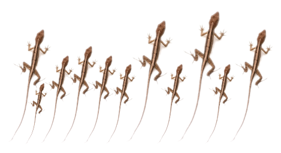
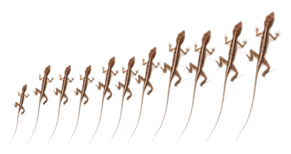

```{r setup, include = FALSE, cache = FALSE, purl = FALSE, fig.showtext = TRUE}
source("assets/setup.R")
knitr::opts_chunk$set(dev.args = list(png  = list(type = "cairo")))
library(xaringanExtra)
use_tile_view()
use_scribble()
use_search(show_icon = FALSE)
use_progress_bar(color = "#6d2b5e", location = "bottom", height = "10px")
use_freezeframe()
# use_webcam()
# use_panelset()
# use_extra_styles(hover_code_line = TRUE)

options(htmltools.preserve.raw = FALSE)

# http://tachyons.io/docs/
# https://roperzh.github.io/tachyons-cheatsheet/
use_tachyons()

# library(renderthis)
# to_pdf(from = "23-assumptions-and-nonparametrics.html",
#        to = "23-assumptions-and-nonparametrics.pdf",
#        complex_slides = TRUE, partial_slides = TRUE)
```

```{r libs, include=FALSE, warning=FALSE}
library(tidyverse)
library(cowplot)
library(scales)
```

<!-- - Тесты на нормальность распределения -->
- Трансформации данных
- Непараметрические методы
- Альтернативы одновыборочному и парному t-тестам
  - Тест знаков и тест Вилкоксона
- Альтернативы двухвыборочному t-тесту
  - Тест U Манна-Уитни и тест Колмогорова-Смирнова
- Пермутационные тесты

---

## Если нарушаются условия применимости метода

--

.pull-left[
__Подход__

- параметрический метод с другими условиями применимости
]

--

.pull-right[
__Пример использования__

- обобщенная линейная модель, вместо простой линейной регрессии
]

--

.pull-left[
- подходящая трансформация данных $^*$
]
.pull-right[
- логарифмирование счетных данных для нормализации формы распределения
]

--

.pull-left[
- непараметрические методы $^*$
]
.pull-right[
- тест Вилкоксона вместо t-теста
]

--

.pull-left[
- пермутационные тесты $^*$
]
.pull-right[
- распределения любых статистик для $H_0$ генерируются из самих данных
]

---

class: middle, center, inverse

# Трансформация данных

---

## Трансформация данных

__Трансформация данных__ — математическая операция, которую применяют к значениям переменной (т.е. к ряду данных целиком, а не к единичным наблюдениям)

- для коррекции формы распределения
- для выравнивания дисперсий

--

### Самые распространенные трансформации

- логарифм
- квадратный корень
- арксинус-преобразование

???

Не всегда лучший, но самый простой способ.

---

## Логарифмирование

```{r}
gg_log <- ggplot() + stat_function(fun = log, colour = "darkcyan", n = 1000, size = 1) + xlim(0, 10) + labs(x = "x", y = "x`=log(x)")

dloglnorm <- function(x, ...){
  dlnorm(exp(x), ...)
}
gg_dlognorm <- ggplot() + 
  stat_function(fun = dlnorm, args = list(meanlog = 0, sdlog = 1), 
                colour = "darkred", n = 1000, size = 1) + 
    stat_function(fun = dlnorm, args = list(meanlog = 1.5, sdlog = 0.3), 
                colour = "darkblue", n = 1000, size = 1) + xlim(0, 10) +
  labs(x = "x", y = "Плотность\nвероятности")

gg_dlognorm_t <- ggplot() + 
  stat_function(fun = dloglnorm, args = list(meanlog = 0, sdlog = 1), 
                colour = "darkred", n = 1000, size = 1) + 
    stat_function(fun = dloglnorm, args = list(meanlog = 1.5, sdlog = 0.3), 
                colour = "darkblue", n = 1000, size = 1) + xlim(-5, 5) +
  labs(x = "x`=log(x)", y = "Плотность\nвероятности")
```

.pull-left[

```{r gg-log, opts.label='fig.column.small'}
gg_log
```
]

.pull-right[

$$x^\prime = \log(x)$$

Если в данных есть нули, то прибавляют маленькую константу $x^\prime = \log(x + 1)$.

]

--

.pull-left[
```{r gg-dlognorm, opts.label='fig.column.small'}
gg_dlognorm
```

]

--

.pull-right[
```{r gg-dlognorm-t, opts.label='fig.column.small'}
gg_dlognorm_t
```
]

--

Подойдет, если 

- распределение имеет длинный правый хвост
- измерения — это отношения, произведения, подсчеты численности
- в группах с большим средним большое стандартное отклонение
- диапазон данных несколько порядков 

---

## Извлечение корня

```{r}
gg_sqrt <- ggplot() + stat_function(fun = sqrt, colour = "darkcyan", n = 1000, size = 1) + xlim(0, 10) + labs(x = "x", y = "x`=sqrt(x)")

dsqrtnorm <- function(x, ...){
  dnorm(x^2, ...)
}

gg_dsqrt <- ggplot() + 
  stat_function(fun = dsqrtnorm, args = list(mean = 27, sd = 8), 
                colour = "darkred", n = 1000, size = 1) + 
    stat_function(fun = dsqrtnorm, args = list(mean = 55, sd = 18), 
                colour = "darkblue", n = 1000, size = 1) + xlim(0, 10) +
  labs(x = "x", y = "Плотность\nвероятности")
# gg_dsqrt
gg_dsqrt_t <- ggplot() + 
  stat_function(fun = dnorm, args = list(mean = 27, sd = 8), 
                colour = "darkred", n = 1000, size = 1) + 
    stat_function(fun = dnorm, args = list(mean = 55, sd = 18), 
                colour = "darkblue", n = 1000, size = 1) + xlim(0, 100) +
  labs(x = "x`=sqrt(x)", y = "Плотность\nвероятности")
# gg_dsqrt_t
```

.pull-left[
```{r gg-sqrt, opts.label='fig.column.small'}
gg_sqrt
```

]
.pull-right[

$$x^\prime = \sqrt{x}$$

Иногда используют корни других степеней.

]

--

.pull-left[
```{r gg-dsqrt, opts.label='fig.column.small'}
gg_dsqrt
```

]

--

.pull-right[
```{r gg-dsqrt-t, opts.label='fig.column.small'}
gg_dsqrt_t
```
]

--

Подойдет, если 

- распределение имеет длинный левый хвост
- данные - это подсчеты численности
- в группах с большим средним большое стандартное отклонение

---

## Арксинус-преобразование для долей

.pull-left[
```{r gg-asin, opts.label='fig.column.small'}
asin_transf <- function(p) {
  asin(sqrt(p))
}

gg_asin <- ggplot() + stat_function(fun = asin_transf, colour = "darkcyan", n = 1000, size = 1) + xlim(0, 1) + labs(x = "p", y = "p`=arcsin(sqrt(p))")
gg_asin
```

]
.pull-right[
$$p^\prime = \arcsin{\sqrt{p}}$$

Значения долей ограничены $0 \le p \le 1$.
Если много долей, близких к 0 или 1, трансформация "растянет" концы шкалы.
]

--

Усовершенствованные варианты:

- $p^\prime = \arcsin{\sqrt{\cfrac{x + 3/8}{n + 3/4}}}$ (Johnson, Kotz, 1969)
- $p^\prime = 2\sqrt{n}\cdot\Big(\arcsin{\sqrt{\cfrac{x + 3/8}{n + 3/4}}} - \arcsin{\sqrt{p}}\Big)$ (Freeman, Tukey, 1950)


---

## Основные трансформации данных

<br/>

### Степенные

| Название         | Трансформация   | Обратная трансформация |
| ---------------- | --------------- | ---------------------- | 
| степень -2       | $x^\prime = 1/x^2$         | $x = \sqrt{1/x^\prime}$ |
| степень -1       | $x^\prime = 1/x$           | $x = 1/x^\prime$        |
| степень -0.5     | $x^\prime = 1/\sqrt{x}$    | $x = 1/x^{\prime~2}$    |
| степень 0.5      | $x^\prime = \sqrt{x}$      | $x = x^{\prime~2}$      |
| логарифмирование | $x^\prime = \log(x)$        | $x = e^{x}$             |
<br/>

### Для долей<br/>

| Название         | Трансформация   | Обратная трансформация |
| ---------------- | --------------- | ---------------------- | 
| Арксинус-трансформация | $p^\prime = \arcsin{\sqrt{p}}$ | $p = \sin(p^\prime)^2$ |
| Логит-преобразование   | $p^\prime = \log{\Big(\cfrac{p}{1-p}\Big)}$ | $p = \cfrac{e^{p^\prime}}{1+e^{p^\prime}} = \cfrac{1}{1+e^{-p^\prime}}$ |


---

## Подбор подходящей трансформации

Нечестно специально выбирать трансформацию, приводящую к наиболее значимому результату теста.

Выбирайте трансформацию, которая лучше всего приближает к выполнению условий применимости.

---

## Пример: морские заповедники

Эффективны ли морские заповедники для сохранения природы (Halpern, 2003)?

32 пары заповедник—контрольная точка (до заповедника или рядом с ним)

Показатель успеха защиты $I = \cfrac{B_\text{заповедник}}{B_\text{контроль}}$.

$H_0: \mu = 1$ — среднее отношение биомасс не зависит от статуса акватории
$H_1: \mu \ne 1$ — среднее отношение биомасс различается в охраняемых и не охраняемых акваториях

---

## Проверяем условия для одновыборочного t-теста

```{r gg-MR, opts.label='fig.wide.small'}
library(car)
MR <- read.csv("data/marine_reserve_Halpern_2003.csv", stringsAsFactors = FALSE)
op <- par(mfrow = c(1, 2), cex = 1.2, mar = c(4, 4, 0.1, 0.1))
hist(MR$biomassRatio, main = "", xlab = "Отношение биомасс", ylab = "Частота")
qqPlot(MR$biomassRatio, id = F, xlab = "Квантили нормального распределения", ylab = "Квантили данных")
par(op)
```

--

Асимметрия вправо. Попробуем логарифмировать данные.

--

```{r gg-MR-log, opts.label='fig.wide.small'}
MR$biomassRatio_log <- log(MR$biomassRatio)
op <- par(mfrow = c(1, 2), cex = 1.2, mar = c(4, 4, 0.1, 0.1))
hist(MR$biomassRatio_log, breaks = seq(-0.25, 1.5, by = 0.25), main = "", xlab = "Логарифм отношения биомасс", ylab = "Частота")
qqPlot(MR$biomassRatio_log, id = F, xlab = "Квантили нормального распределения", ylab = "Квантили логарифмированных данных")
par(op)
```

--

Неидеально, но явно лучше. 

---

## Одновыборочный t-тест по трансформированным данным

- $H_0: \mu = 0$ — средний логарифм отношения биомасс не зависит от статуса
- $H_1: \mu \ne 0$ — средний логарифм отношения биомасс различается  
  в защищенных и не защищенных акваториях

--

Формулировка изменилась, т.к. $log(1) = 0$

--

```{r}
sd_mr <- sd(MR$biomassRatio_log)
n_mr <- nrow(MR)
m_mr <- mean(MR$biomassRatio_log)
tt_mr <- t.test(MR$biomassRatio_log, mu = 0, var.equal = T)
tcrit_mr <- qt(0.975, df = n_mr - 1)
t_mr <- format(tt_mr$statistic, digits = 2, nsmall = 2)
p_mr <-tt_mr$p.value
CIlog_mr <- tt_mr$conf.int
CI_mr <- exp(tt_mr$conf.int)
```

<br/>

В нашем примере средний логарифм отношения биомасс $\overline {log(I)} = \overline{log\Big(\frac{B_\text{заповедник}}{B_\text{контроль}}\Big)} = `r format(m_mr, digits = 3, nsmall = 3)`$.

--

<br/>

$s = `r format(sd_mr, nsmall = 3, digits = 3)`$, $n = `r n_mr`$

$t = \frac{`r format(m_mr, digits = 3, nsmall = 3)` - 0}{`r format(sd_mr, nsmall = 3, digits = 3)` / \sqrt{`r n_mr`}} = `r t_mr`$, $df = `r n_mr` - 1 = `r n_mr - 1`$

<br/>

$p = `r format(p_mr, scientific = TRUE)`$

Т.е. средний логарифм биомассы статистически значимо выше в охраняемых акваториях.


---

## Доверительный интервал по трансформированным данным


$$\overline {log(I)} - t_{\alpha, df} \cdot SE_{\overline {log(I)}} \le \overline {log(I)} \le \overline {log(I)} + t_{\alpha, df} \cdot SE_{\overline {log(I)}}$$

--

В этом интервале лежит средний логарифм (в 95% провторных выборок):

$$`r format(m_mr, digits = 3, nsmall = 3)` - `r format(tcrit_mr, nsmall = 2)` \cdot \frac{`r format(sd_mr, nsmall = 3, digits = 3)`} {\sqrt{`r n_mr`}} \le \overline {log(I)} \le `r format(m_mr, digits = 3, nsmall = 3)` + `r format(tcrit_mr, nsmall = 2)` \cdot \frac{`r format(sd_mr, nsmall = 3, digits = 3)`} {\sqrt{`r n_mr`}}$$

--

$$`r format(CIlog_mr[1], digits = 3, nsmall = 3)` \le \overline {log(I)} \le `r format(CIlog_mr[2], digits = 3, nsmall = 3)`$$

--

Само среднее (геометрическое - из-за логарифмирования)  
лежит в другом интервале: 

$$e^{`r format(CIlog_mr[1], digits = 3, nsmall = 3)`}  \le \text{среднее геометрическое } {I} \le  e^{`r format(CIlog_mr[2], digits = 3, nsmall = 3)`}$$

--

$$`r format(CI_mr[1], digits = 3, nsmall = 3)`  \le \text{среднее геометрическое } {I} \le  `r format(CI_mr[2], digits = 3, nsmall = 3)`$$

--

Т.е. в заповедниках биомасса в среднем выше, чем в неохраняемых акваториях в $`r format(CI_mr[1], digits = 3, nsmall = 3)`$ — $`r format(CI_mr[2], digits = 3, nsmall = 3)`$ раз.

---

class: middle, center, inverse

# Непараметрические методы

---

## Непараметрические методы

- не делают никаких предположений о значениях __параметров__ статистических распределений
- имеют менее жесткие условия применимости (например, не требуют нормальности)
- часто основаны на использовании рангов

---

## Ранги

```{r}
dat <- c(10, 4, 7, 8, 7, 6, 11, 6, 13, 6, 10)
```
.pull-left[

Допустим, вы поймали несколько ящериц и измерили их длину (см).

`r dat`



]

--

.pull-right[
<br/>
Данные можно рассортировать.

`r sort(dat)`



]

--

.pull-left[

__Ранг__ наблюдения — это его порядковый номер в отсортированном ряду. Одинаковые наблюдения ("связанные ранги", tied ranks) получат один и тот же ранг — чаще это среднее их номеров.
]

--

.pull-right[
`r rank(sort(dat))`
]

--

<br/>

Исходные значения можно заменить на их ранги и работать уже с ними.

`r rank(dat)`

---

## Ошибки I и II рода


.pull-left[
__Вероятность ошибки I рода__

У параметрических тестов соответствует $\alpha$ только если выполнены условия применимости. Если нет, то увеличивается.


У непараметрических тестов — соответствует  $\alpha$, если выполнены более мягкие условия применимости.
]

.pull-right[
__Вероятность ошибки II рода__

<br/><br/><br/><br/>

У непараметрических тестов увеличивается вероятность ошибки II рода $\beta$, из-за потери информации при переходе к рангам.
]

---

class: middle, center, inverse

# Проверка гипотез для одной или парных выборок  
при помощи непараметрических тестов

---

## Тест знаков

Sign test

Альтернатива одновыборочному или парному t-тестам, когда данные не подчиняются нормальному распределению.

Проверяет равенство медианы переменной $x$ конкретному значению $m_0$.

- $H_0: m = m_0$
- $H_A: m \ne m_0$

--

Обозначим $x > m_0$ как "+", а $x < m_0$ как "—", остальные не будем учитывать вообще.

--

При $H_0$ можно ожидать что, доля "+" и "—" равна 0.5.

--

Для вычисления p используется биномиальное распределение.

---

## Пример: половой конфликт и происхождение видов

Половой конфликт более выражен у видов, чьи самки спариваются больше одного раза. Значит ли это, что у них быстрее видообразование (Arnqvist et al., 2000)?

25 пар групп насекомых со множественным и однократным спариванием.

В каких из этих групп таксонов больше родственных видов?

.small[
.scroll-box-18[
```{r}
SC <- read.csv("data/sexual_conflict_Arnqvist_etal_2000.csv", stringsAsFactors = FALSE)
SC %>% kable(col.names = c("Пара таксонов", "Множественное", "Однократное", "Разница")) %>% add_header_above(c(' ' = 1,'Спаривание (число таксонов)' = 2,' ' = 1),escape = FALSE) %>% kable_styling(bootstrap_options = "basic")
```
]]

---

## Проверяем условия для одновыборочного t-теста

```{r gg-SC, opts.label='fig.wide.small'}
op <- par(mfrow = c(1, 2), cex = 1.2, mar = c(4, 4, 0.1, 0.1))
hist(SC$difference, main = "", nclass = 35, xlab = "Разница числа видов\nсо множественным и однократным спариванием", ylab = "Частота")
qqPlot(SC$difference, id = F, xlab = "Квантили нормального распределения", ylab = "Квантили данных")
par(op)
```

--

Есть наблюдение-выброс — таксон, в котором видов со множественным спариванием на 20400 больше, чем с однократным.

Никакая трансформация не поможет.

---

## Гипотезы для теста знаков

- $H_0: m = m_0$ — медианная разница числа видов между группами  
со множественным и однократным спариванием равна 0.
- $H_A: m \ne m_0$ — медианная разница числа видов между этими группами не равна 0.

--

<br/> 

При $H_0$ разница числа видов > 0 у половины наблюдений, а у другой половины < 0.

--

Тест знаков — это биномиальный тест.

---

## Расставляем знаки

.small[
.scroll-box-26[
```{r}
SC <- SC %>% mutate(Sign = ifelse(.$difference > 0, "+", ifelse(.$difference == 0, "0", "-"))) 

SCtbl <- SC
SCtbl$Sign = cell_spec(SCtbl$Sign, background = ifelse(SCtbl$Sign == "+", "lightcoral", "lightblue"), color = "black", align = "center")

SCtbl %>% kable(col.names = c("Пара таксонов", "Множественное", "Однократное", "Разница", "Знак"), escape = FALSE) %>% add_header_above(c(' ' = 1,'Спаривание (число таксонов)' = 2,' ' = 2))  %>% kable_styling(bootstrap_options = "basic", full_width = F)
```
]]

--

<br/>

Подсчитаем количество

```{r}
t(table(SC$Sign)) %>% kable()
```

---

## Тест знаков

Гипотезы можно переформулировать как для биномиального теста

.pull-left[

$H_0: \pi = 0.5$ — доля "-" в генеральной совокупности равна $0.5$

$H_A: \pi \ne 0.5$ — доля "-" не равна $0.5$

]
.pull-right[

```{r}
t(table(SC$Sign)) %>% kable()
```

]

--

<br/>

Биномиальное распределение:  
$P(X \text{'успех'}) = \frac{n!}{X! (n-X)!} \pi^X (1 - \pi)^{n-X}$

--

<br/>

Какова вероятность получить $\le 7$ "-" из 25 когда $p_{\text{"-"}} = 0.5$?

--

Находим и суммируем вероятности для 0-7:

$$P(X \le 7) = \sum^7_{i = 0} \frac{25!}{i! (25-i)!} 0.5^i (1 - 0.5)^{25-i} = 0.02164$$

--

Двусторонняя альтернативная гипотеза, поэтому $p = 2 \cdot 0.02164 = 0.043$

---

## Тест знаковых рангов Вилкоксона

Wilcoxon signed-rank test

"Усовершенствованная" (плохо) версия теста знаков.

Сохраняет информацию о величине отличия от $m_0$.

--

<br/>

__Осторожно!__

Условие применимости: распределение измерений __симметрично__ относительно медианы.

Почти невыполнимо, т.к. в большинстве случаев проблемы с нормальностью распределения именно из-за асимметрии.

--

<br/>

Лучше использовать тест знаков.

---

class: middle, center, inverse

# Сравнение двух групп <br/>
при помощи непараметрических тестов

---

## Тест U Манна-Уитни

The Mann-Whitney U-test 

Альтернатива двухвыборочному t-тесту.

По ранжированным данным сравнивает среднее значение рангов в двух выборках.

p-значение зависит от степени несоответствия средних рангов.

--

<br/>

Особенности:

- Регистрирует в основном различия медиан
- Есть адаптации для связанных рангов

--

<br/>

= тест суммы рангов Вилкоксона (Wilcoxon rank sum test). 

Не путайте с тестом знаковых рангов Вилкоксона.


???

Приблизительные значения p можно найти по трансформированным значениям U-статистики.
Их распределение можно аппроксимировать нормальным.

$Z=\frac{2 U-n_1 n_2}{\sqrt{n_1 n_2\left(n_1+n_2+1\right) / 3}}$


---

## Пример: канибализм у сверчков

У сверчков Cyphoderris strepitans  во время спаривания самец предлагает самке съесть свои мясистые крылья.

Зависит ли вероятность спаривания от того, голодные ли самки (Johnson, 1999)?

Свежих самцов предлагали самкам из двух групп:

- 11 голодных 
- 13 сытых

Регистрировали время до начала спаривания.

---


## Проверяем условия для двухвыборочного t-теста

```{r gg-CR, opts.label='fig.wide.taller'}
MT <- read.csv("data/mating_time_Chadwick_etal_1999.csv", stringsAsFactors = FALSE)
op <- par(mfrow = c(2, 2), cex = 1.2, mar = c(4, 4, 0.1, 0.1))
hist(MT$timeToMating[MT$feedingStatus == "starved"], breaks = seq(0, 110, by = 10), main = "", xlab = "Время до спаривания\nу голодных самок", ylab = "Частота")
qqPlot(MT$timeToMating[MT$feedingStatus == "starved"], id = F, xlab = "Квантили нормального распределения", ylab = "Квантили данных")
hist(MT$timeToMating[MT$feedingStatus == "fed"], breaks = seq(0, 110, by = 10), main = "", xlab = "Время до спаривания\nу сытых самок", ylab = "Частота")
qqPlot(MT$timeToMating[MT$feedingStatus == "fed"], id = F, xlab = "Квантили нормального распределения", ylab = "Квантили данных")
par(op)
```

--

Асимметрия вправо. В одной группе есть выброс. В другой полимодальное распределение. Малый объем выборки.

Логарифмирование не поможет.

---

## Медианное время до спаривания

- у голодных самок 13.0 ч.
- у сытых самок 22.8 ч.

```{r opts.label='fig.wider'}
gg_mating <- ggplot(data = MT, aes(x = feedingStatus, y = timeToMating)) +
  geom_boxplot(aes(fill = feedingStatus))

gg_mating_fin <- gg_mating +
  scale_fill_brewer(palette = "Set1", labels = c("Сытые", "Голодные"), direction = -1) +
  scale_x_discrete(labels = c("Сытые", "Голодные")) +
  labs(x = "Аппетит", y = "Время до спаривания, ч.", fill = "Аппетит")
gg_mating_fin
```

<br/>

Гипотезы для теста Манна-Уитни

- $H_0: m_1 - m_2 = 0$ — медианное время до спаривания одинаковое  
у сытых и голодных самок.
- $H_A: m_1 - m_2 \ne 0$ — медианное время до спаривания разное  
у сытых и голодных самок.

---

## Ранжируем данные
.pull-left-40[

.small[
.scroll-box-26[
```{r}
library(forcats)
MTtb <- MT %>% arrange(timeToMating) %>% mutate(Rank = rank(timeToMating), feedingStatus = fct_recode(feedingStatus, "Голодные" = "starved", "Сытые" = "fed"))

# MTtb$feedingStatus = cell_spec(MTtb$feedingStatus, color = ifelse(MTtb$feedingStatus == "Голодные", "darkred", "blue"))
MTtb %>% kbl(col.names = c("Аппетит", "Время до спаривания", "Ранг"), escape = F) %>% 
   kable_styling(bootstrap_options = "basic") %>% 
  row_spec(which(MTtb$feedingStatus == "Голодные"), color = "black", background = "lightcoral") %>% 
  row_spec(which(MTtb$feedingStatus == "Сытые"), color = "black", background = "lightblue") %>% 
  column_spec(1, bold = T)
```
]
]]
.pull-right-60[

Сумма рангов в группе 1 (голодные): $R_1 = 121$ 

]

--

<br/>
Сколько раз у наблюдений из группы 1 меньший ранг, чем в группе 2 (во всех возможных парах):  
$U_1 = n_1 \cdot n_2 + \cfrac{n_1 (n_1 + 1)}{2} - R_1 = \\ = 11 \cdot 13 +\cfrac{11(11+1)}{2} - 121 = 88$

--
<br/>
Аналогично для группы 2:  
$U_2 = n_1 \cdot n_2 - U_1 = 11 \cdot 13 - 88 = 55$

--

<br/>
Максимальное из них — это U-статистика:
$U = U_1 = 88$

--

<br/>
P-значение определяем по U-распределению. 

Критическое значение $U_{0.05, df = 2, n_1 = 11, n_2  = 13} = 106$,
поэтому $p > 0.05$, сохраняем $H_0$.

```{r}
# Тест Манна-Уитни = Тест суммы рангов Вилкоксона
ut_MT <- wilcox.test(timeToMating ~ feedingStatus, data = MT)
```

---

## Тест Колмогорова-Смирнова

The Kolmogorov-Smirnov test 

Сравнивает кумулятивное распределение в двух выборках (goodness-of-fit test).

p-значение зависит от степени несоответствия кумулят.

--

<br/>

__Недостатки__:

- Регистрирует любые различия формы распределений. Т.е. не умеет отличать положение медианы от различий размаха и асимметрии.
- Плохо работает со связанными рангами.

--

<br/>

Лучше использовать тест U Манна-Уитни

---

class: middle, center, inverse

# Пермутационные методы

---

## Пермутационные методы

- используют перестановки (пермутации, permutations) исходных данных для тестирования гипотез

--
  - о равенстве средних (аналог t-тестов)

--
  - о связи между категориальными переменными (таблицы сопряженности)

--
  - о связи между непрерывными переменными (коэффициент корреляции)

--
- делают меньше предположений о распределении данных

---

## Пермутационный тест в общем виде

.pull-left-60[
__0.__ Вычисляем тестовую статистику на исходных данных.
]
.pull-right-40[

]

--

.pull-left-60[
__1.__ Делаем пермутации

Случайно переставляем данные, смешивая сравниваемые группы.  
Это моделирует ситуацию для $H_0$.
]
.pull-right-40[
<br/>

]

---

## Пермутационный тест в общем виде

.pull-left-60[
__0.__ Вычисляем тестовую статистику на исходных данных.
]
.pull-right-40[

]

.pull-left-60[
__1.__ Делаем пермутации

Случайно переставляем данные, смешивая сравниваемые группы.  
Это моделирует ситуацию для $H_0$.

__2.__ Вычисляем тестовую статистику на пермутированных данных.

]

.pull-right-40[

]

---

## Пермутационный тест в общем виде

.pull-left-60[
__0.__ Вычисляем тестовую статистику на исходных данных.
]
.pull-right-40[

]

.pull-left-60[
__1.__ Делаем пермутации

Случайно переставляем данные, смешивая сравниваемые группы.  
Это моделирует ситуацию для $H_0$.

__2.__ Вычисляем тестовую статистику на пермутированных данных.

__3.__ Повторяем 1 и 2 много раз ( $\ge 1000$)

Получаем распределение тестовой статистики при $H_0$ (с учетом вычисленного про исходным данным значения).

]
.pull-right-40[

]

--

.pull-left-60[
__4.__ Вычисляем p

Например, в двустороннем тесте разницы средних, если статистика >0, _p_ — удвоенная доля пермутаций, где значение статистики больше исходного (и наоборот, если < 0).

]
.pull-right-40[

]


---

## Условия применимости пермутационного теста о сравнении средних

- данные — это случайная выборка
- распределение переменной одинаковое в сравниваемых группах (устойчив при больших выборках)

--

- p-значение зависит от количества пермутаций

--

Число возможных пермутаций $n!$,  
т.е. годится для не слишком малых выборок ( $n>5$ или $7$).


---

## Мощность

- При малых выборках мощность меньше, чем у параметрического t-теста, но больше, чем у теста U Манна-Уитни.
- При больших выборках сходная мощность у всех трех типов.

---

## Пермутационный тест для сверчков-каннибалов

```{r echo=FALSE, fig.show='hide'}
means <- tapply(X = MT$timeToMating, INDEX = MT$feedingStatus, FUN = mean, na.rm = TRUE)
initial_d <- diff(means)

# Функция, которая считает нужную статистику по пермутированным данным
permute_diff <- function(value, group){
  # Простейшие проверки
  if(any(is.na(value)) | any(is.na(group))) stop("No NAs are allowed in value and group")
  if(length(value) != length(group)) stop("Lengths of value and group should be equal")
  # Пермутируем индексы наблюдений в случайном порядке
  i <- sample(length(value))
  # Считаем разницу средних по пермутированным данным
  d <- diff(tapply(X = value, INDEX = group[i], FUN = mean))
  return(d)
}
# Проверяем, работает ли
# replicate(5, permute_diff(MT$timeToMating, MT$feedingStatus))

# Пермутационный тест
# Повторяем заданное число раз
n_perm <- 10000
set.seed(930846)
perm_d <- replicate(n = n_perm, 
                        expr = permute_diff(value = MT$timeToMating, 
                                            group = MT$feedingStatus))
# Добавляем исходное значение
perm_result <- c(perm_d, initial_d)

# Гистограмма распределения тестовой статистики
hist(perm_result, right = FALSE)
points(initial_d, 0, col = "red", pch = 17, cex = 2)

# Доля от общего числа пермутаций
fraction_perm <- sum(as.numeric(perm_result <= initial_d)) / n_perm

# P-value
p_val <- 2 * fraction_perm

####
set.seed(3424)
i_perm <- sample(nrow(MT))
m_perm <- tapply(X = MT$timeToMating, INDEX = MT$feedingStatus[i_perm], FUN = mean, na.rm = TRUE)
d_perm <- diff(m_perm)
```


### Считаем статистику на исходных данных

.pull-left-40[

.small[.scroll-box-30[
```{r}
MTsort <- MT %>% arrange(desc(feedingStatus)) %>% mutate(feedingStatus = fct_recode(feedingStatus, "Голодные" = "starved", "Сытые" = "fed"))

MTsort$timeToMating = cell_spec(MTsort$timeToMating, color = ifelse(MTsort$feedingStatus == "Голодные", "red", "navyblue"), background = "white")

MTsort$feedingStatus = cell_spec(MTsort$feedingStatus, background = ifelse(MTsort$feedingStatus == "Голодные", "lightcoral", "lightblue"), color = "black")

MTsort %>% kbl(col.names = c("Аппетит", "Время до спаривания"), escape = F) %>% 
  kable_styling(bootstrap_options = "basic", full_width = F)
```
]
]]

.center[
Среднее время до спаривания

у голодных самок $\bar y_{голодные} = `r format(means[2], digits = 2, nsmall = 2)`$

у сытых самок $\bar y_{сытые} = `r format(means[1], digits = 2, nsmall = 2)`$

<br/>

Разница $y_{голодные}  - y_{сытые}  = `r format(initial_d, digits = 2, nsmall = 2)`$
]

---

### Считаем статистику на пермутированных данных

.pull-left-40[

.small[.scroll-box-30[
```{r}
MTsort_p <- MTsort
MTsort_p$feedingStatus <- MTsort$feedingStatus[i_perm]
MTsort_p %>% kbl(col.names = c("Аппетит", "Время до спаривания"), escape = F) %>% 
  kable_styling(bootstrap_options = "basic")
```
]
]]

.center[
Среднее время до спаривания в этой пермутации получилось

у голодных самок $\bar y_{голодные_1} = `r format(m_perm[2], digits = 2, nsmall = 2)`$

у сытых самок $\bar y_{сытые_1} = `r format(m_perm[1], digits = 2, nsmall = 2)`$

<br/>

Разница $y_{голодные_1}  - y_{сытые_1}  = `r format(d_perm, digits = 2, nsmall = 2)`$
]

---

### Распределение статистики по пермутированным данным

Если процесс повторить 10000 раз, получится такое распределение

```{r opts.label='fig.wide'}
perm_hist <- function(){
br <- pretty(range(perm_result), n = 100)
op <- par(cex = 1.2, mar = c(4, 4, 0.1, 0.1))
hist(perm_result, right = FALSE, main = "", xlab = "Разница средних", ylab = "Частота", breaks = br)
hist(perm_result[perm_result <= initial_d], right = FALSE, main = "", xlab = "Разница средних", ylab = "Частота", breaks = br, col = "pink1", add = TRUE)
points(initial_d, 0, col = "red", pch = 17, cex = 2)
par(op)
}
```


В нашем двустороннем тесте p-значение — это удвоенная доля пермутаций, в которых значение меньше исходного.

$p = 2 \cdot `r format(fraction_perm, digits = 3, nsmall=3)` = `r format(p_val, digits = 3, nsmall=3)`$

--

Сохраняем $H_0$

Т.е. не обнаружено статистически-значимых различий среднего времени до спаривания у голодных и сытых самок.

---

## Обращайте внимание, что вы сравниваете


```{r opts.label='fig.wide'}
gg_mating_mean <- ggplot(data = MT, aes(x = feedingStatus, y = timeToMating)) +
  stat_summary(fun.data = mean_cl_boot, aes(colour = feedingStatus))

gg_mating_mean_fin <- gg_mating_mean +
  scale_colour_brewer(palette = "Set1", labels = c("Сытые", "Голодные"), direction = -1) +
  scale_x_discrete(labels = c("Сытые", "Голодные")) +
  labs(x = "Аппетит", y = "Время до спаривания, ч.", colour = "Аппетит")

plot_grid(gg_mating_fin + theme(legend.position = "bottom"),
gg_mating_mean_fin + theme(legend.position = "bottom"), nrow = 1)
```

--

Тест U Манна-Уитни сравнивает медианы, а в пермутационном тесте мы решили сравнивать средние значения (хотя могли бы медианы). Это разные гипотезы.

---

class: middle, center, inverse

# Summary

---

## Summary

- Условия применимости статистических методов не всегда выполняются.

- Если нарушаются условия применимости метода, можно использовать
  - другой параметрический метод
  - трансформировать данные
  - непараметрические методы
  - пермутационные методы

---

## Что почитать

Whitlock, M., & Schluter, D. (2015). The analysis of biological data (Second edition). Roberts and Company Publishers.


