```{r setup, include = FALSE, cache = FALSE, purl = FALSE, fig.showtext = TRUE}
source("assets/setup.R")
```

```{r libs, include=FALSE, warning=FALSE}
library(tidyverse)
library(cowplot)
library(scales)
```

- Организационные моменты
- Что такое статистика и чем она занимается
- Выборочный метод
- Случайная выборка
- Проблемы при отборе проб
- Типы данных и переменных
- Частоты и вероятности
- Типы исследований

---

class: middle, center, inverse

# Организационные моменты

???

- расписание
- теория и практика
+ сайт курса
+ чат в telegram
- оценки
- зачет
+ установка R

---

## Ресурсы курса в сети

.center[]

.pull-left[
.center[
Вебсайт (презентации и код)  
[varmara.github.io/biostat101](https://varmara.github.io/biostat101)  
  
]
]

.pull-right[
.center[
Чат для вопросов  
https://t.me/+dnpejPBFBPdjOGQy  
  
]
]

---

## Программы для работы

.pull-left-55[

1. С сайта Comprehensive R Archive Network [cran.r-project.org](https://cran.r-project.org/) нужно скачать
  - __R__
  - __RTools__ — только для пользователей Windows. Это набор утилит для компиляции пакетов R из исходного кода.  

2. __RStudio__ — среда разработки для R (в октябре RStudio станет Posit).  
[rstudio.com](https://rstudio.com)

  Если что, можно воспользоваться __RStudio Cloud__— это облачная версия RStudio (25 часов в месяц на бесплатном тарифе).  
  [rstudio.cloud](https://rstudio.cloud)
]
.pull-right-45[


]

---

class: middle, center, inverse

# Что такое статистика и чем она занимается

---


---

## Типы исследований


---

## Индивидуальная изменчивость


---

## Индивидуальная изменчивость

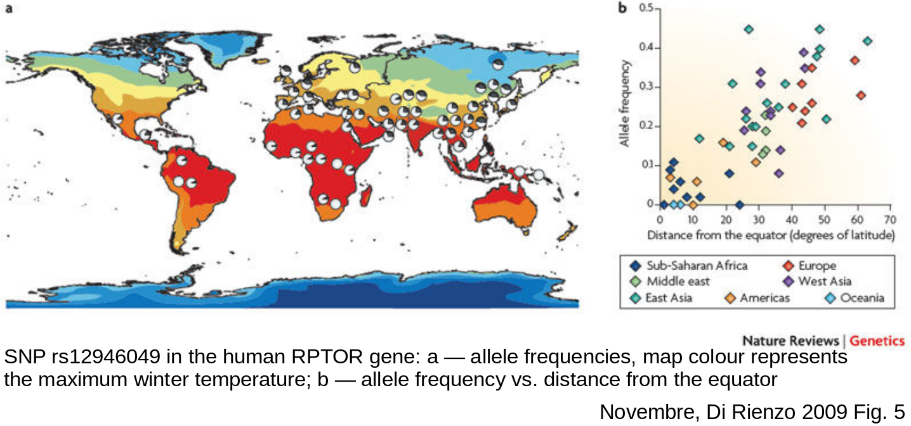

---

## Генеральная совокупность и выборка

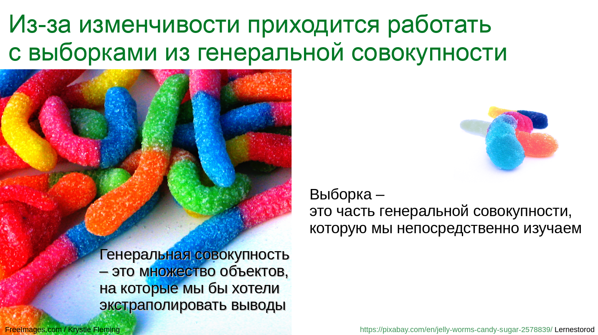


---

## Генеральная совокупность и выборка

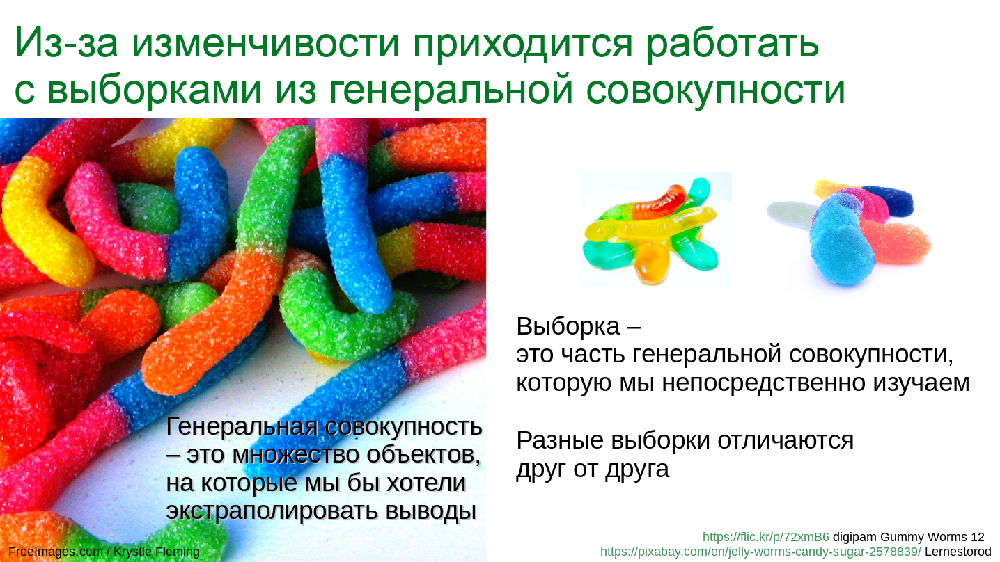

---

## Статистика

изучает методы описания и измерения чего-либо с использованием выборок

<!-- 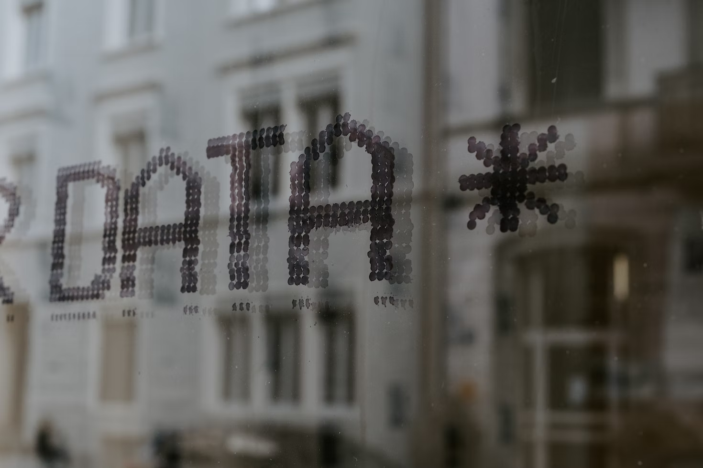 -->

<!-- .tiny[Claudio Schwarz at Unsplash.com] -->


---

background-image: url("img/statistics-estimation-question-doubt-problem-3385451-pixabay.png")
background-position: center
background-size: cover

## Оценивание

оценка значений свойств генеральной совокупности  
по данным выборки

- доля бракованных деталей в партии
- изменчивость размера раковины с возрастом улитки
- уровень экспрессии белка


---

## Неопределенность оценок

Вследствие работы с выборками выборочные оценки параметров генеральной совокупности неточны. 

Есть статистические методы оценки этой степени неопределенности.

.pull-down[


]

???

Поскольку в выборке представлены не все объекты, возникает некоторая неопределенность в оценках. Задача статистики описать эту неопределенность, и оценить, насколько оценки отступают от истинных значений.

---

## Параметры и статистики

.pull-left[

__Параметры__ (_parameters_) описывают генеральную совокупность.  
<br/>

Обозначаются греческими буквами:  

- $\mu$ — среднее, 
- $\sigma$ — стандартное отклонение


]

--

.pull-right[

__Статистики__ (_statistics_) описывают выборку и являются оценками параметров.

Обозначаются латинскими буквами:  

- $\bar x$ — среднее, 
- $s$ — стандартное отклонение


]


---

## Исследование отношений между группами и между переменными

- Связь между размером самки мечехвоста и числом самцов, следующих за ней
- Энергетическая ценность икры в зависимости от возраста рыбы
- Скорость реакции у хорошо и плохо спавших людей

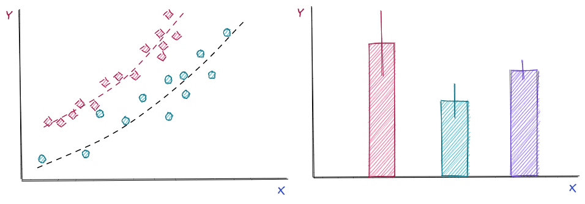

---

## Тестирование гипотез

Статистическая гипотеза — это какое-либо утверждение о значении параметра в генеральной совокупности

- Средняя продолжительность жизни крыс увеличивается при использовании лекарства A больше, чем лекарства Б
- Размер лепестков двух видов ирисов различаются


---


class: middle, center, inverse

# Выборочный метод

---

## Выборочный метод

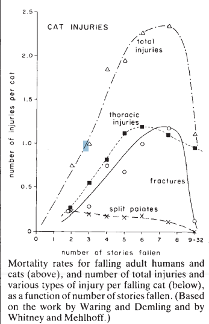

---

## Выборочный метод


---

## Выборочный метод


---

## Выборочный метод

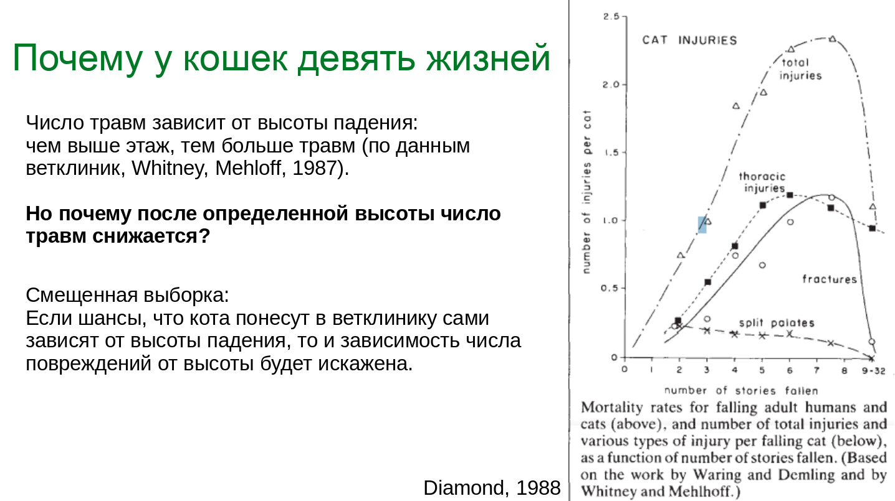

---

## Что такое "хорошая выборка"?

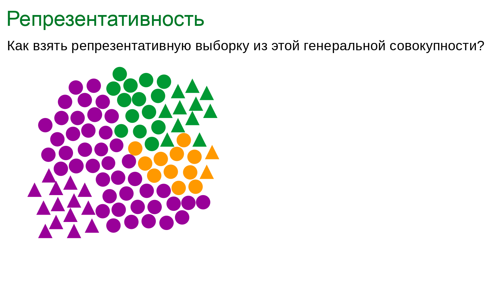

---

## Что такое "хорошая выборка"?

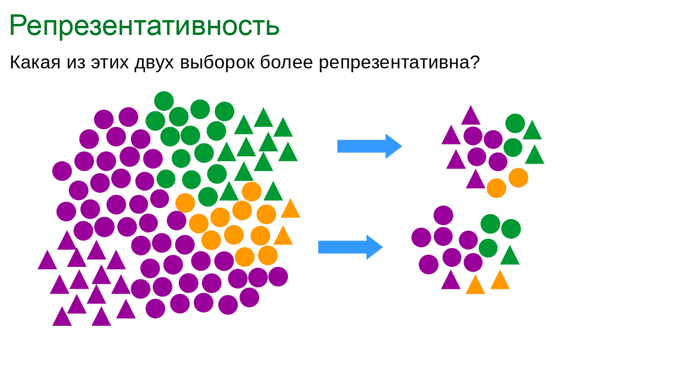

---

## Что такое "хорошая выборка"?

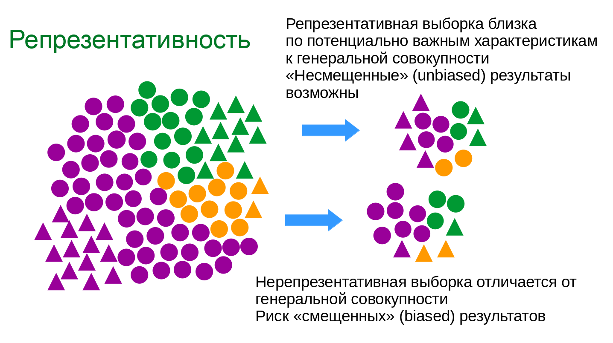

---

## Что такое "хорошая выборка"?

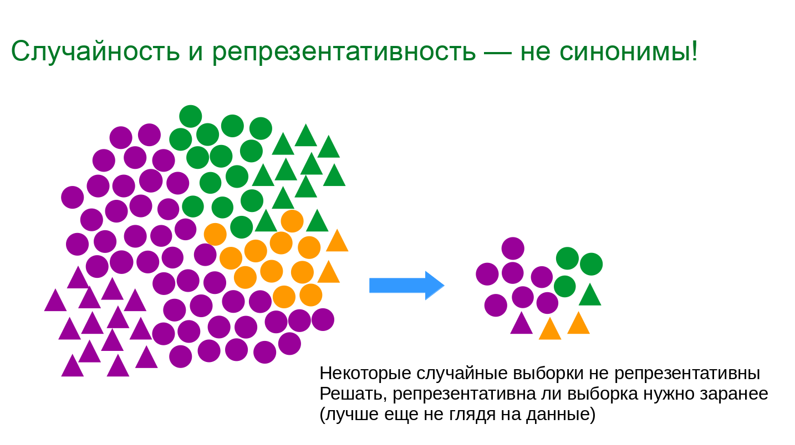

---

## Точность = правильность + воспроизводимость

- правильность (accuracy) — отсутствие погрешности (bias)
- воспроизводимость (precision) — маленький разброс значений

```{r opts.label='fig.wider.taller'}
library(ggforce)

n_reps <- 6
set.seed(9328)
dfr <- data.frame(
  x0 = rep(0, 6),
  y0 =  rep(0, 6),
  r = seq(1, 0.1, length.out = 6),
  fl = rep(1:2, 3)
)
dart <- ggplot() + geom_circle(data = dfr, aes(x0 = x0, y0 = y0, r = r, fill = fl)) +
  scale_fill_gradient(low = "#99aae1", high = "#dadbf7", guide = "none") +
  coord_equal() + theme_void() + theme(plot.title = element_text(hjust = 0.5))

HvLb <- dart +
  annotate(geom = "point", size = 3, shape = 21, colour = "black", fill = "orange",
                x = rnorm(n_reps, 0, 0.25), y = rnorm(n_reps, 0, 0.25)) +
  labs(title = "Низкая воспроизводимость, \nмаленькая погрешность")

LvHb <- dart +
  annotate(geom = "point", size = 3, shape = 21, colour = "black", fill = "orange",
                x = rnorm(n_reps, 0, 0.1), y = rnorm(n_reps, 0, 0.1)) +
labs(title = "Высокая воспроизводимость, \nмаленькая погрешность")

HvHb <- dart +
  annotate(geom = "point", size = 3, shape = 21, colour = "black", fill = "orange",
                x = rnorm(n_reps, 0.4, 0.25), y = rnorm(n_reps, 0.3, 0.25)) +
labs(title = "Низкая воспроизводимость, \nбольшая погрешность")

LvLb <- dart +
  annotate(geom = "point", size = 3, shape = 21, colour = "black", fill = "orange",
                x = rnorm(n_reps, 0.4, 0.1), y = rnorm(n_reps, 0.3, 0.1)) +
  labs(title = "Высокая воспроизводимость, \nбольшая погрешность")

plot_grid(HvLb, HvHb, LvHb, LvLb, nrow = 2)
```

---

class: middle, center, inverse

# Случайная выборка

---

## Случайная выборка

Требование многих статистических методов.

Критерии:

- __Вероятность попадания в выборку должна быть одинакова__ для всех объектов генеральной совокупности.
- Выбор объектов должен быть независим, т.е. попадание одного объекта в выборку не должно влиять на попадание других. Т.е. __наблюдения должны быть независимы друг от друга__.

???

- нарушение случайности: отбор по размеру, отказ отвечать на вопросы, встречаемость на определенной удаленной территории.
- нарушение независимости: опрос всех жителей квартиры по поводу предпочтений.


---

## Повторности и псевдоповторности


---

## Повторности и псевдоповторности

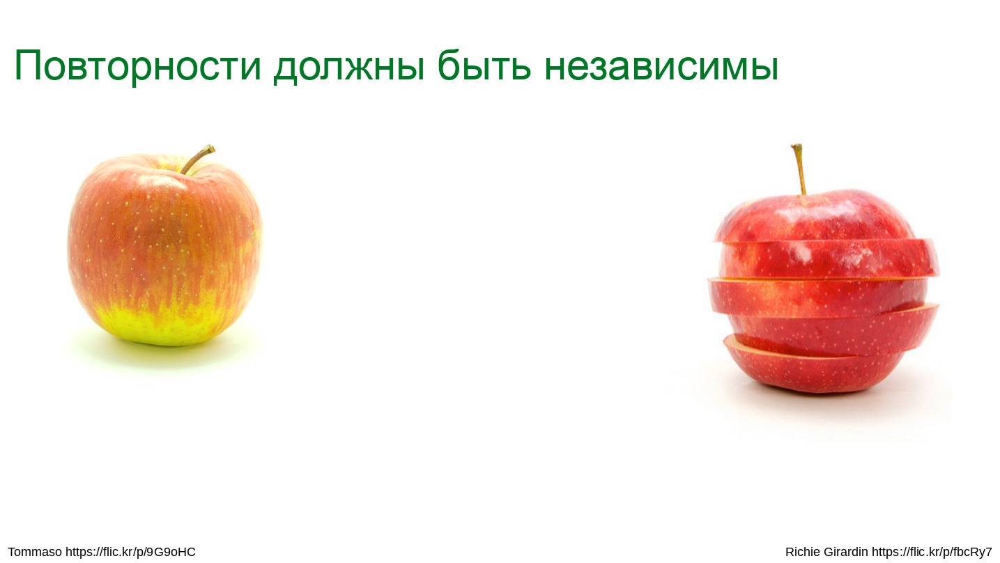

---

## Повторности и псевдоповторности

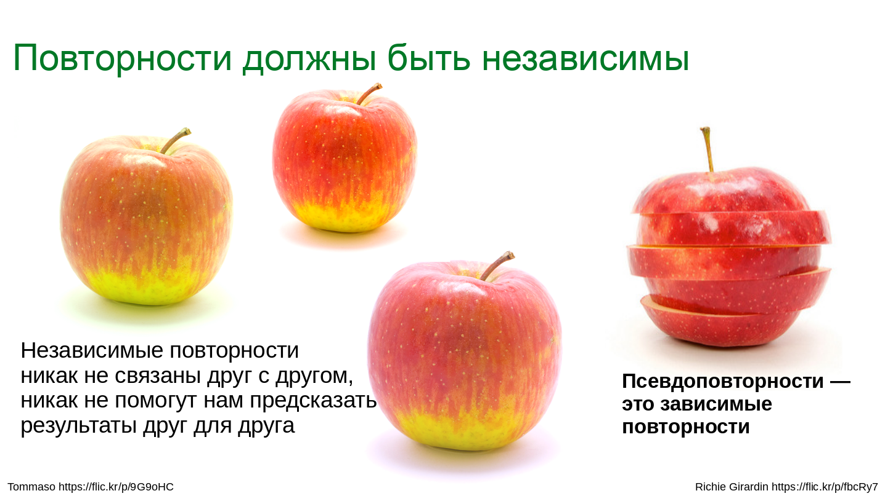

---

## Повторности и псевдоповторности


---

## Повторности и псевдоповторности

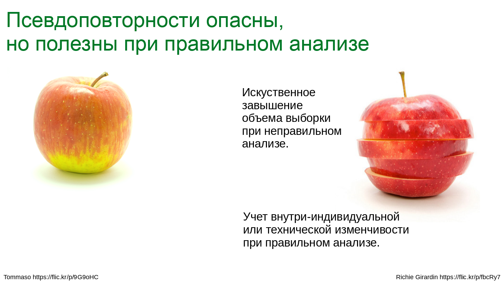

---

## Как взять случайную выборку?

Нет универсальной процедуры

.pull-left[

Если можно пронумеровать все объекты, можно выбрать, воспользовавшись генератором случайных чисел.

]
.pull-right[

Иногда проще выбрать случайные группы объектов (случайная выборка групп ≠ случайная выборка объектов).

]

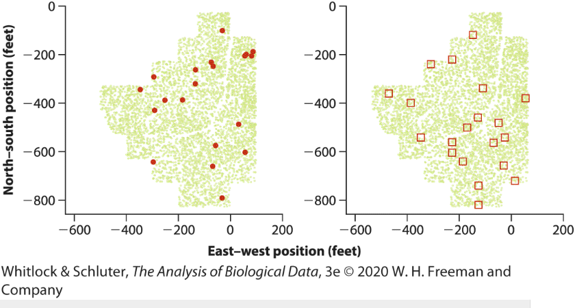

---

class: middle, center, inverse

# Проблемы при отборе выборок

---

## "Удобная выборка" (the sample of convenience)

Когда в выборку попадают только объекты, легко доступные исследователю.

Например, ближайшие, за которыми не нужно гоняться.

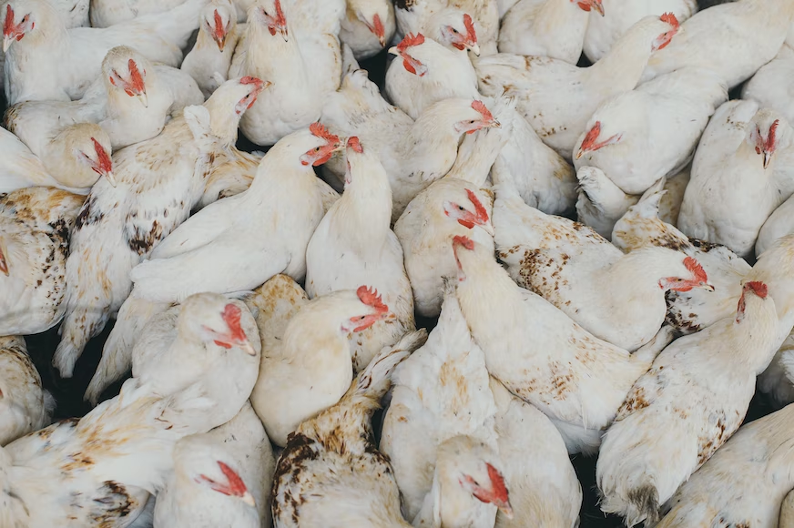

.tiny[Egor Myznik at unsplash.com]


---

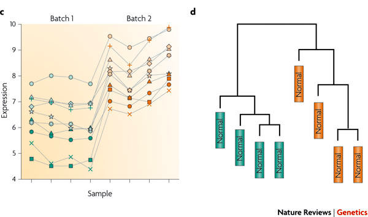
.tiny[Leek et al. 2010 Fig.1 c, d]

Данные об экспрессии генов в мочевом пузыре у здоровых пациентов (из исследования рака мочевого пузыря Dyrskjot et al. 2004).

--

### Пакетный эффект (batch effect)

Если объекты расположены не случайно в пространстве и / или во времени, это порождает "пакетный эффекты" (batch effect).

???

Данные об экспрессии генов в мочевом пузыре у здоровых пациентов (из исследования рака мочевого пузыря Dyrskjot et al. 2004). Не смотря на нормализацию данных, все еще заметен батч-эффект. Цвет — дата анализа


---

## Погрешности выбора (selection bias)

- Cамоотбор (self-selection)
- Эффект волонтера (volunteer-effect)

.pull-down[

.tiny[publicdomainpictures.net / Karen Arnold]
]


---

## Плацебо эффект

ожидания человека заставляют его уверится в том, что есть эффект (положительный или отрицательный).

<!--  -->


.tiny[Alexander Grey at Usplash]

---

## Эффект наблюдателя/экспериментатора (observer/experimenter effect)

- __Самосбывающееся пророчество__ (self-fulfilling prophecy) — подопытный ведет себя так, как подсознательно подсказывает ему экспериментатор.
- __Погрешность экспериментатора__ (experimenter bias) — экспериментатор регистрирует паттерн, который подсознательно желает увидеть.

.center[
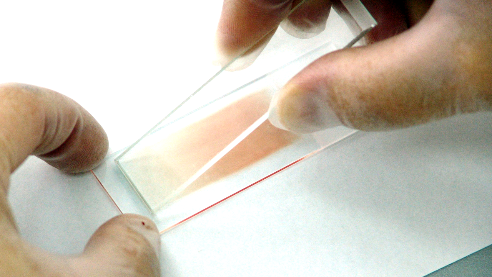
]

.tiny[Максим Кукушкин / publicdomainpictures.net]

???

Либо экспериментатор сам подсознательно подсказывает, как себя вести. Либо экспериментатор регистрирует паттерн, который подсознательно желает увидеть.

---

background-image: url("img/plan-arrow-hello-im-nick-unsplash.png")
background-position: center
background-size: cover

## Как бороться с проблемами при отборе проб?

.pull-right[

- Рандомизация
- Стратификация
- Слепые процедуры
- Двойные слепые процедуры
- Статистическое моделирование и коррекция батч-эффектов
- Стандартизация всех процедур
]

.pull-down[
.tiny[Hello I'm Nick at Unsplash.com]
]

???

Другие проблемы
- ожидания экспериментатора и "запросы", вернее их понимание участниками (социология)
- искусственная среда не воспроизводит полностью реальность
- нестандартизованные процедуры (как инструментальные, так и обращение с экспериментальными объектами) - источники "шума" в данных


---

class: middle, center, inverse

# Типы данных и переменных

---

## Типы данных

Переменная (variable) — любое свойство или измерение.

Переменные могут относиться к разным типам данных.


---

## Качественные / категориальные переменные

qualitative / categorical variables (иногда discrete, но см. след. слайд)

.center[

]

.pull-left[
.center[Номинальные  
(nominal)]
- цвет глаз (карие, зеленые, голубые)
- состояние (живой, мертвый)
]
.pull-right[
.center[Порядковые / ранговые  
(ordinal / rank)]
- рост (низкий, средний, высокий)
- состояние здоровья (плохое, удовлетворительное, хорошее, прекрасное)
- стадия жизненного цикла (яйцо, личинка, ювениль, взрослая особь)
]

---

## Количественные / числовые переменные

(quantitative / numerical variables)

.center[
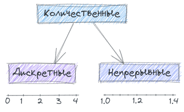
]

.pull-left[
.center[Дискретные  
(discrete)]
- состояние (1 - живой, 0 - мертвый)
- возраст (число полных лет)
- число щетинок на каком-то сегменте (шт.)
]

.pull-right[
.center[Непрерывные  
(continuous)]
- рост (см)
- возраст (например, число дней)
- цвет (длина волны)
]

Часто непрерывные данные округляются, так что становятся похожи на дискретные.

---

## Предикторы и отклики

При исследовании зависимостей принято делить переменные на предикторы и отклики в зависимости от их роли.


- Энергетическая ценность икры (отклик) в зависимости от возраста рыбы (предиктор)
- Длина ушей (отклик) поссумов из разных популяций (предиктор).

---

## Наличие связи между переменными <br/>не означает причинно-следственных отношений

> Correlation does not imply causation

--

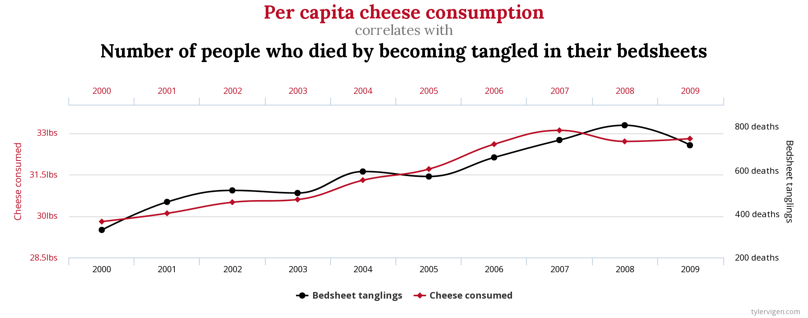
.tiny[https://www.tylervigen.com/spurious-correlations]

---

## Деление на предикторы и отклики условно


.tiny[https://xkcd.com/925]

--

Не всегда очевидно, что предиктор, а что отклик.  
В таких случаях требуется эксперимент.

---

class: middle, center, inverse

# Частоты и вероятности

```{r}
library("fishdata")
# Galaxis maculatus, 2015-2016, in the Wellington region of New Zealand
# data("adults")
# data("adult_metrics")
# ad <- adults %>% 
#   left_join(adult_metrics, 'fish_code')
# 
# gg_fisha <- ggplot(ad, aes(x = standard_length)) + labs(x = "Длина, см")
# gg_fisha + geom_histogram() + labs(y = "Количество рыб, шт.")
# gg_fisha + geom_density() + labs(y = "Плотность вероятности")
data("juveniles")
data("juvenile_metrics")
juv <- juveniles %>%
left_join(juvenile_metrics, 'fish_code') %>%
filter(month == "August")
```

---

## Вариационный ряд

Размеры мальков пятнистой галаксии (_Galaxis maculatus_), выловленных в августе 2015 г. в районе Веллингтона, Новая Зеландия. 


.pull-left[

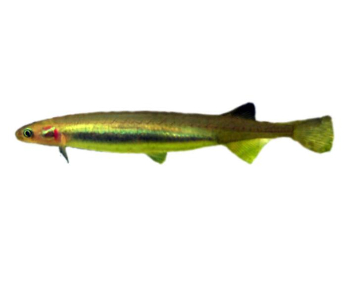

.tiny[Lycaon.cl, CC BY-SA 3.0, via Wikimedia Commons]

]

.pull-right[

`r round(head(juv$standard_length[1:5]), 1)`, ...

И т.д.

Всего `r length(juv$standard_length)` __наблюдения__ или `r length(juv$standard_length)` __варианты__.

.tiny[Данные из пакета `fishdata`]

]

---

## Частотное распределение

__Частоты__ наблюдений можно получить, подсчитав, сколько значений вариант попадает в каждый из равных интервалов.


.pull-left[


.tiny[Lycaon.cl, CC BY-SA 3.0, via Wikimedia Commons]

]

.pull-right[

```{r}
gg_fishj <- ggplot(juv, aes(x = standard_length)) + labs(x = "Длина, см")
gg_fishj + geom_histogram(fill = "darkolivegreen4", colour = "white") + labs(y = "Количество рыб, шт.")
```

.tiny[Данные из пакета `fishdata`]

]


---

## Распределение вероятностей

Распределение значений потенциально-возможных значений переменной называется __распределение вероятностей__.

Ниже — график распределения вероятностей _для выборки_ пятнистой галаксии. Это называется __эмпирическое распределение вероятностей__

.pull-left[


.tiny[Lycaon.cl, CC BY-SA 3.0, via Wikimedia Commons]

]

.pull-right[

```{r}
gg_fishj + geom_density(alpha = 0.25, fill = "darkolivegreen", colour = "darkolivegreen4") + labs(y = "Плотность вероятности")
```

.tiny[Данные из пакета `fishdata`]

]


---

## Теоретическое распределение вероятностей

Распределение вероятностей в генеральной совокупности практически никогда не известно.

__Теоретические распределения вероятностей__ можно использовать для описания реальных распределений.

.pull-left[


.tiny[Lycaon.cl, CC BY-SA 3.0, via Wikimedia Commons]

]

.pull-right[

```{r}
gg_fishj + 
  geom_density(alpha = 0.25, 
               fill = "darkolivegreen", 
               colour = "darkolivegreen4") + 
  labs(y = "Плотность вероятности") + 
  stat_function(fun = dnorm, 
                args = list(mean = mean(juv$standard_length), 
                            sd = sd(juv$standard_length)), 
                colour = 'orangered', size = 0.75)
```

.tiny[Данные из пакета `fishdata`]

]

Например, здесь можно использовать __нормальное распределение__.

---

## Примеры распределений вероятностей

Нормальное распределение, распределение Пуассона, отрицательное биномиальное распределение — за этими распределениями стоят конкретные явления.

t-, F-, $\chi^2$-распределения статистик, которые используются для тестирования гипотез


```{r opts.label='fig.wide.taller'}
t_size <- 16

gg_norm <-
  ggplot(data = data.frame(x = -5:5), aes(x = x))+
  stat_function(fun = dnorm, 
                args = list(mean = 0, sd = 1), 
                colour = 'red4', size = 0.75) +
  ggtitle("Нормальное р.") +
  annotate("text", x = Inf, y = Inf, hjust = 1.1, vjust = 1.2, 
           label = "N(mu == 0, sigma==1)", parse = TRUE) + 
  theme(title = element_text(size = t_size))

gg_pois <- data.frame(x = 0:20) %>% 
  mutate(y = dpois(x, 3)) %>% 
  ggplot(aes(x = x, y = y)) +
  geom_col(fill = 'red4', colour = "white") +
  ggtitle("Р. Пуассона") +
  annotate("text", x = Inf, y = Inf, hjust = 1.1, vjust = 1.2, 
           label = "Pois(lambda == 3)", parse = TRUE) + 
  theme(title = element_text(size = t_size))

gg_negbin <- data.frame(x = 0:20) %>% 
  mutate(y = dnbinom(x, size = 0.1, mu = 3)) %>% 
  ggplot(aes(x = x, y = y)) +
  geom_col(fill = 'red4', colour = "white")  +
  ggtitle("Отрицательное\nбиномиальное р.") +
  annotate("text", x = Inf, y = Inf, hjust = 1.1, vjust = 1.2, 
           label = "Negbin(mu == 3,~k == 0.1)", parse = TRUE) + 
  theme(title = element_text(size = t_size))

gg_t <- ggplot(data = data.frame(x = -5:5), aes(x = x))+
  stat_function(fun = dt, 
                args = list(df = 5), 
                colour = 'red4', size = 0.75)  +
  ggtitle("t-распределение") +
  annotate("text", x = Inf, y = Inf, hjust = 1.1, vjust = 1.2, 
           label = "t(df == 5)", parse = TRUE) + 
  theme(title = element_text(size = t_size))

gg_f <- ggplot(data = data.frame(x = 0:5), aes(x = x))+
  stat_function(fun = df, 
                args = list(df1 = 3, df2 = 7), 
                colour = 'red4', size = 0.75)  +
  ggtitle("F-распределение") +
  annotate("text", x = Inf, y = Inf, hjust = 1.1, vjust = 1.2, 
           label = "F(df[1] == 3,~df[2] == 7)", parse = TRUE) + 
  theme(title = element_text(size = t_size))

gg_chisq <- ggplot(data = data.frame(x = 0:20), aes(x = x))+
  stat_function(fun = dchisq, 
                args = list(df = 5), 
                colour = 'red4', size = 0.75)  +
  ggtitle(expression(chi^2~"-распределение")) +
  annotate("text", x = Inf, y = Inf, hjust = 1.1, vjust = 1.2, 
           label = "chi^2 ~ (df == 5)", parse = TRUE) + 
  theme(title = element_text(size = t_size))

plot_grid(gg_norm, gg_pois, gg_negbin, gg_t, gg_f, gg_chisq, 
          nrow = 2, axis = "tblr", align = "hv")
```


---


class: middle, center, inverse

# Summary

---

## Что почитать

- Нинбург, Е. А. (2006). Технология научного исследования. Методические рекомендации (Vol. 1). Всемирный фонд дикой природы (WWF) - Россия.
- Barnard, C. J., Gilbert, F. S., & MacGregor, P. K. (2007). Asking questions in biology: A guide to hypothesis testing, experimental design and presentation in practical work and research projects. Pearson Education.
- Glass, D. J. (2007). Experimental design for biologists. Cold Spring Harbor Laboratory Press.
- Ruxton, G. D., & Colegrave, N. (2006). Experimental design for the life sciences. Oxford University Press Oxford.
- Whitlock, M., & Schluter, D. (2015). The analysis of biological data (Second edition). Roberts and Company Publishers.
