```{r setup, include = FALSE, cache = FALSE, purl = FALSE, fig.showtext = TRUE}
# Read presentation and ggplot setup parameters
source("assets/setup.R")
```

```{r libs, include=FALSE, warning=FALSE}
library(tidyverse)
library(cowplot)
library(scales)
```


---

class: middle, center, inverse

# Вероятность

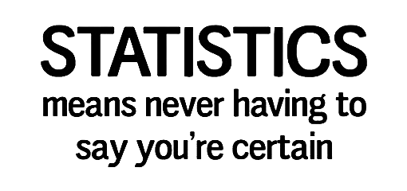

???

Начинаем разговор о неопределенности оценок. Действительно, статистика позволяет (или заставляет) говорить, что ты не уверен, и в какой именно степени не уверен в своих оценках.

Вероятности чертовски важны в биологии, т.к. мы практически всегда (в 99% случаев) работаем с выборками. Свойства этих выборок во многом определяются случайностями в процессе сбора данных.


---

## Вероятность

Представьте, что вы едете утром в лифте в 15 этажном доме, но нажали на случайную кнопку. 

- Какова вероятность, что вы приедете на нужный вам этаж с первой попытки? 
- Какова вероятность того, что вы сначала попадете на неправильный этаж?

---

__Случайное испытание__ 

В результате случайного испытания происходит случайное __событие__

???

TODO: Примеры случайных испытаний и событий:

- бросаем кубик - выпало три
- монетка - выпал орел

---

## Вероятность

Вероятность события — это доля случаев, когда происходит это событие в ряду испытаний.

$$0 \le P \le 1$$

--

$P(A)$ — вероятность того, что произошло событие $A$:

- $P(\text{выпало 3})$
- $P(\text{выпало нечетное число})$
- $P(\text{в семье из 3 детей все девочки})$
- $P(\text{в последовательности из 10 нуклеотидов только G})$
- в случайной выборке людей оцениваем пропорцию рыжеволосых
- в случайной выборке новорожденных считаем долю детей с синдромом Дауна

???

TODO: Проверить фриквентистское определение вероятности

---

## Диаграмма Венна

.pull-left[


.tiny[Whitlock, Schluter, 2015, fig.5.2-1-2]

]

--

.pull-right[

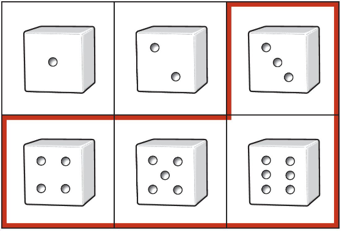

]


--

Вероятность события легко оценить, посчитав долю элементарных исходов, благоприятствующих этому событию.


---

## Совместные и несовместные события

События A и B называются несовместными, если
$Pr(A and B) = 0$

- Выпало 4 и выпало 2 — несовместные события (mutually exclusive events).
- Выпало 4 и выпало четное число — совместные события.

---

class: middle, center, inverse

# Распределения вероятностей

---

## Распределение вероятностей

Все возможные исходы и их вероятности.

Дискретные и непрерывные распределения вероятностей

---

## Дикретные распределения вероятностей

.pull-left[

Для кубика вероятность каждого исхода 1/6.

```{r}
data.frame(A = 1:6, P = rep(1/6, 6)) %>% 
  ggplot(aes(x = A, y = P)) +
  geom_col() +
  coord_cartesian(ylim = c(0, 1)) +
  scale_x_continuous(breaks = 1:6, labels = 1:6) +
  labs(x = "Событие")
```

]
.pull-right[

Для честной монетки вероятность каждого исхода 1/2

```{r}
data.frame(A = 0:1, P = rep(1/2, 2)) %>% 
  ggplot(aes(x = A, y = P)) +
  geom_col() +
  coord_cartesian(ylim = c(0, 1)) +
  scale_x_continuous(breaks = 0:1, labels = c("Решка", "Орел")) +
  labs(x = "Событие")
```

]

---

## Непрерывные распределения вероятностей

.pull-left[

```{r g-norm, echo=FALSE, purl=FALSE}
ND_curve <- ggplot(data = data.frame(x = 0:20), aes(x = x)) +
  stat_function(fun = dnorm, args = list(mean = 10, sd = 2), colour = 'steelblue3', size = 1) +
  labs(y = 'Плотность вероятности')
ND_curve
```

]
.pull-right[

Нормальное распределение — это пример такого распределения. 

- Симметричное
- Унимодальное
- Непрерывное

]

--

Нормальное распределение часто получается из мерных данных.

Многие распределения других типов тоже могут приближаться к нормальному.

???

Непрерывные переменные могут принимать любое значение в пределах диапазона. Т.е. между любыми двумя возможными значениями — бесконечное число других возможных значений.

---

## Относительная частота и плотность вероятности


.pull-left[

```{r gg-norm-hist-curve}
set.seed(39025)
N <- 100000
binwidth <- 0.5
mu <- 10
sig <- 2
dfr <- data.frame(x = rnorm(N, mean = mu, sd = sig))
ggplot(data = dfr, aes(x = x)) +
  geom_histogram(aes(y = ..density..), fill = 'white', colour = 'black', binwidth = binwidth) +
  labs(y = 'Плотность вероятности') +
  stat_function(fun = dnorm, args = list(mean = mean(dfr$x), sd = sd(dfr$x)),
                colour = 'steelblue', size = 1) +
scale_y_continuous(sec.axis = sec_axis(~.* N * binwidth, name = 'Частота')) +
  coord_cartesian(xlim = c(0, 20), ylim = c(0, 0.25))
```

]

.pull-right[

На "сырых" данных мы можем посчитать число наблюдений с разными значениями $x$. Это называется __частота__.

Теоретическое распределение описывает вероятность получить разные значения $x$. Для непрерывных величин это называется __плотность вероятности__.

]

__Плотность вероятности__ $f(x)$ — это способ задания вероятности непрерывной случайной величины $x$ на любом диапазоне значений.

$-\infty < x < +\infty$.

---

## Вероятности --- это площади под кривой распределения

.pull-left[

```{r }
ND_curve + 
  stat_function(geom = 'area', fun = dnorm, args = list(mean = mu, sd = sig), 
                xlim = c(0, 20), alpha = 0.6, fill = 'red3')  +
  annotate(geom = 'text', parse = TRUE,
           x = mu, y = 0.05,
           label = "P[group('(',list(-infinity, infinity),')')] == 1")
```

]
.pull-right[

Площадь под всей кривой $= 1$.

]

Действительно, ведь это вероятность того, что величина примет хоть какое-нибудь значение.

---

## Вероятности — площади под кривой распределения

.pull-left[

```{r g-norm-interval}
x1 <- 11
x2 <- 14
ND_curve + 
    stat_function(geom = 'area', fun = dnorm, args = list(mean = mu, sd = sig), 
                  xlim = c(x1, x2), alpha = 0.6, fill = 'red3')
```

]
.pull-right[

Вероятность встречи значений $x$ из определенного промежутка можно узнать, проинтегрировав функцию распределения $f(x)$.

]


---

## Вероятность конкретного значения нельзя определить

.pull-left[

```{r gg-x3}
x3 = 7
gg_x3 <- ND_curve + 
  geom_vline(xintercept = x3, linetype = 'dashed', colour = 'red') +
  annotate('point', x = x3, y = dnorm(x3, mean = mu, sd = sig),
           colour = 'steelblue', fill = 'lightblue', shape = 21, size = 3) +
  annotate(geom = 'text', parse = TRUE,
           x = x3, y = dnorm(x3, mean = mu, sd = sig),
           label = paste0("P[(x == ", x3, ")] == 0"),
           hjust = 1.1)
gg_x3
```

]
.pull-right[

Конкретное значение --- это точка, а под точкой нет площади.

]

---

class: middle, center, inverse

# Действия с вероятностями

---

## Группы крови


В среднеевропейской популяции частота встречаемости групп крови по системе AB0 представлена в таблице.

.pull-left[

```{r tbl-blood1}
dfr_ab0 <- data.frame(blood = c("0", "A", "B", "AB"), probability = c(0.43, 0.42, 0.11, 0.04)) %>% mutate(blood = factor(blood, levels = c("0", "A", "B", "AB")))

dfr_ab0 %>% rename("Группа крови" = blood, "Вероятность" = probability) %>% kable()
```

.tiny[[http://www.almazovcentre.ru/](http://www.almazovcentre.ru/?page_id=4595), 18.08.2022]

]

.pull-right[
```{r}
pal_blood <- RColorBrewer::brewer.pal(8, "Paired")

library(ggmosaic)
ggplot(data = dfr_ab0) +
  geom_mosaic(aes(weight = probability, x = product(blood)), offset = 0.01, colour = "white", show.legend = F, fill = pal_blood[1]) + 
  labs(x = "Группа крови") +
  theme_minimal(base_size = 22) +
  theme(axis.text.x = element_text(hjust = 0), axis.text.y = element_blank())
```

]


Нельзя иметь одновременно две группы крови по системе AB0, поэтому это несовместные события.

Рассмотрим на их примере действия с вероятностями.

---

## Сложение вероятностей

Если события A и B несовместны, то вероятность того, что произойдет одно или другое — это сумма их вероятностей.

$P(A~or~B) = P(A) + P(B)$

--

<br/>

Какова вероятность, что у человека кровь одной из трех групп: (A, B или AB)?

.pull-left[

```{r tbl-blood1}
```

.tiny[[http://www.almazovcentre.ru/](http://www.almazovcentre.ru/?page_id=4595), 18.08.2022]
]

--

.pull-right[
```{r}
ggplot(data = dfr_ab0) +
  geom_mosaic(aes(weight = probability, x = product(blood)), offset = 0.01, colour = "white", show.legend = F, fill = pal_blood[c(1, 6, 6, 6)]) + 
  labs(x = "Группа крови") +
  theme_minimal(base_size = 22) +
  theme(axis.text.x = element_text(hjust = 0), axis.text.y = element_blank())
```
]

$P(A~or~B~or~AB) = P(A) + P(B) + P(AB) = 0.57$

---

## Пространство всех событий

Сумма вероятностей всех возможных несовместных событий равна 1

.pull-left[

```{r tbl-blood1}
```

.tiny[[http://www.almazovcentre.ru/](http://www.almazovcentre.ru/?page_id=4595), 18.08.2022]
]

.pull-right[

```{r}
ggplot(data = dfr_ab0) +
  geom_mosaic(aes(weight = probability, x = product(blood)), offset = 0.01, colour = "white", show.legend = F, fill = pal_blood[rep(6, 4)]) + 
  labs(x = "Группа крови") +
  theme_minimal(base_size = 22) +
  theme(axis.text.x = element_text(hjust = 0), axis.text.y = element_blank())
```
]

$P(0) + P(A) + P(B) + P(AB) = 1$

---

## Отрицание

Вероятность того, что событие не произойдет равна 1 минус вероятность того, что оно произойдет.

.pull-left[

```{r tbl-blood1}
```

.tiny[[http://www.almazovcentre.ru/](http://www.almazovcentre.ru/?page_id=4595), 18.08.2022]

]
.pull-right[

```{r}
ggplot(data = dfr_ab0) +
  geom_mosaic(aes(weight = probability, x = product(blood)), offset = 0.01, colour = "white", show.legend = F, fill = pal_blood[c(6, 1, 6, 6)]) + 
  labs(x = "Группа крови") +
  theme_minimal(base_size = 22) +
  theme(axis.text.x = element_text(hjust = 0), axis.text.y = element_blank())
```
]

$P(not A) = 1 - P(A) = 0.58$


---

## Независимые события

События независимы, если то, что произошло одно из них, никак не влияет на то, что произойдет второе.

<br/>


Помимо групп крови по системе AB0 есть еще резус фактор Rh + или -.  
Эти признаки взаимно независимы. 

В европейской популяции частота Rh+ 0.85.

```{r tbl-blood1}
```

---

## Произведение независимых событий

Если события A и B независимы, то вероятность того, что произошли оба события одновременно равна произведению их вероятностей. (Это справедливо для любого числа независимых событий).

$P(A~and~B) = P(A) \times P(B)$

<br/>

В европейской популяции частота Rh+ 0.85. Каковы вероятности групп крови AB0 с учетом Rh (если предположить, что они независимы)?

.pull-left[

```{r tbl-blood1}
```

]

--

.pull-right[
```{r tbl-blood2}
dfr_ab0rh <- data.frame(blood = c("0_+", "0_–", "A_+", "A_–", "B_+", "B_–", "AB_+", "AB_–"), probability = c(0.3655, 0.0645, 0.3570, 0.0630, 0.0935, 0.0165, 0.0340, 0.0060)) %>% separate(blood, into = c("AB0", "Rh"), sep = "_", remove = F) %>% mutate(AB0 = factor(AB0, levels = c("0", "A", "B", "AB")))

dfr_ab0rh %>% rename("Вероятность" = probability) %>% select(-blood) %>%  kable()
# %>% pivot_wider(id_cols = "AB0", names_from = Rh, values_from = "probability")
```
]

---

## Независимые события и их произведение

В европейской популяции частота Rh+ 0.85. Каковы вероятности групп крови AB0 с учетом Rh (если предположить, что они независимы)?

.pull-left[

```{r tbl-blood2}
```

]
.pull-right[

Поскольку Rh и AB0 независимы, то соотношение Rh+ и  Rh- будет одинаково в каждой группе AB0.

```{r}
ggplot(data = dfr_ab0rh) +
  geom_mosaic(aes(weight = probability, x = product(Rh, AB0), fill = Rh), offset = 0.01, colour = "white", show.legend = F) + 
  scale_fill_manual(values =  pal_blood) +
  theme_minimal(base_size = 22) +
  theme(axis.text.x = element_text(hjust = 0))
```

]

???

Множество независимых событий: Мендель и бобы, желтые (рецессивный признак) и зеленые (доминантный признак). Можно идентифицировать гетерозигот по потомству. 3/4 потомков должны быть зеленые. Какова вероятность того, что 10 потомков гетерозиготы будут зелеными? (3/4)^10 = 0.056. Пример из Whitlock, Schluter, 2015

---

class: middle, center, inverse

# Деревья вероятностей

---

## Деревья вероятностей (probability trees)

Дерево вероятностей — это способ изобразить вероятности сочетаний нескольких случайных событий.

<br/>

В европейской популяции частота Rh+ 0.85. 

Какова вероятность, 

- что у случайно выбранного человека будет Rh-?
- что у двух случайных людей будет Rh-?
- что у двух случайных людей будет одинаковый резус-фактор?

---

## Нарисуем дерево вероятностей

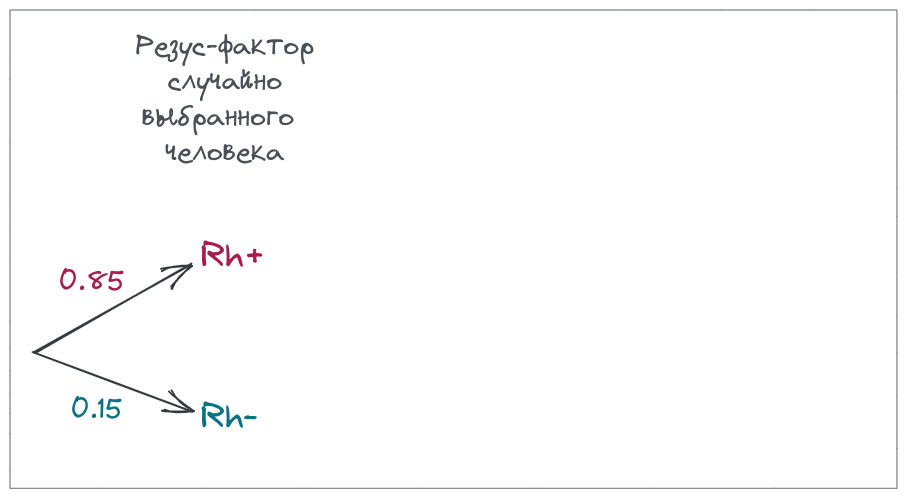
Если речь идет об одном случайно выбранном человеке — все просто.

---

## Нарисуем дерево вероятностей

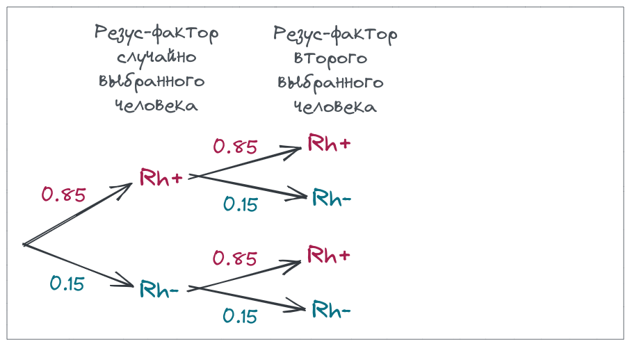
Резус фактор второго случайно выбранного человека не зависит от первого.

Поэтому вероятность сочетаний ресус-факторов этих двух случайно выбранных людей можно посчитать, перемножив вероятности.


---

## Теперь можно ответить на вопросы


.pull-left-60[
Какова вероятность, что
- у случайно выбранного человека Rh-?
- у двух случайных людей Rh-?
- у двух случайных людей одинаковый резус-фактор?
]

--

.pull-right-40[
<br/>
- 0.15
- 0.0225
- 0.7225 + 0.0225 = 0.745
]

---

class: middle, center, inverse

# Зависимые события

---

## Зависимые события (dependent events)

События __зависимы__, если от появления одного из них зависит вероятность появления другого.

По результатам мета-анализа исследований влияния курения на возникновение рака легких видно, что для курящих вероятность появления рака легких выше, чем для некурящих. Это зависимые события.

.pull-left[

<br/>

```{r tbl-lung}
# количество проанализированных исследований Barukčić, 2019
dfr_lung <- data.frame(
  Smoking = c("Yes", "No", "Yes", "No"),
  Lung_cancer = c("Yes", "Yes", "No", "No"),
  Frequency = c(17393, 433, 2043, 8527)
  ) %>% 
  mutate(Smoking = factor(Smoking, levels = c("Yes", "No")),
         Lung_cancer = factor(Lung_cancer, levels = c("Yes", "No")))

library("janitor")
dfr_lung %>% pivot_wider(id_cols = "Lung_cancer", names_from = Smoking, values_from = "Frequency") %>% adorn_totals(where = c("row", "col")) %>% kable() %>% row_spec(3, bold = TRUE) %>% column_spec(c(1, 4), bold = TRUE) 
```

.tiny[Данные Barukčić, 2019, table 7; DOI: [10.22270/jddt.v9i1-s.2273](https://doi.org/10.22270/jddt.v9i1-s.2273)]

]

.pull-right[
```{r gg-lung-mosaic, opts.label='fig.medium.taller'}
dfr_lung <- dfr_lung %>% mutate(Probability = round(prop.table(Frequency) * 100, 1))

g <- ggplot(data = dfr_lung) +
  geom_mosaic(aes(weight = Frequency, x = product(Smoking), fill = Lung_cancer), offset = 0.01, colour = "white", show.legend = F) + 
  labs(y = "Lung cancer") +
  scale_fill_brewer(palette = "Set1") +
  theme_minimal(base_size = 22) +
  theme(axis.text.x = element_text(hjust = 0))

temp <- ggplot_build(g)$data %>%
        as.data.frame %>%
        mutate(x.position = (xmax + xmin) / 2,
               y.position = (ymax + ymin) / 2) %>%
        right_join(dfr_lung, by = c("x__Smoking" = "Smoking", "x__fill__Lung_cancer" = "Lung_cancer"))

gg_lung_mosaic <- g + geom_text(x = temp$x.position, y = temp$y.position, label = paste0(temp$Probability, "%"), size = 7) 
gg_lung_mosaic
```
]

???

Barukčić, I. (2019). Smoking of tobacco is the cause of human lung cancer. Journal of Drug Delivery and Therapeutics, 9(1-s), 148-160. DOI: [10.22270/jddt.v9i1-s.2273](https://doi.org/10.22270/jddt.v9i1-s.2273)


---

## Дерево вероятностей для этих данных


.pull-left-60[

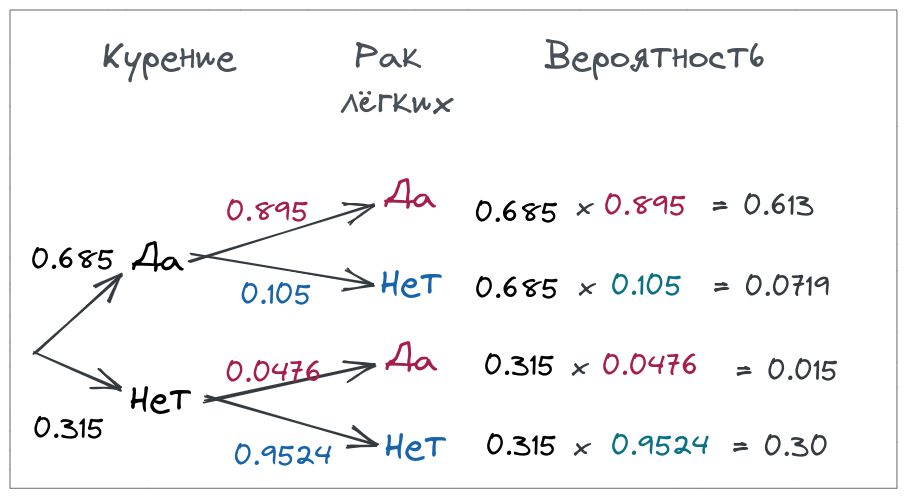

]
.pull-right-40[

```{r opts.label='fig.medium.tall'}
gg_lung_mosaic
```

]

--

Поскольку события "курение" и "рак легких" - зависимые, то не выполняется правило умножения.

--

$P(курение~и~рак) \ne P(курение) \times P(рак)$

На самом деле $P(курение~и~рак) = 0.613$, 

а если бы мы считали по формуле для независимых событий, 

$P(курение) \times P(рак) = 0.613 \times (0.613 + 0.015) = 0.385$,

что не верно.

---

class: middle, center, inverse

# Условная вероятность

---

## Условная вероятность (conditional probability)

__Условная вероятность__ — вероятность события, при каком-то условии (например, при условии, что произошло какое-то другое событие или события).

--

.pull-left-60[


]
.pull-right-40[
```{r opts.label='fig.medium.tall'}
gg_lung_mosaic
```
]

--

$P(рак = да|курит = да) = 0.613$ — вероятность рака легких при условии, что человек курит

$P(рак = да |курит = нет) = 0.015$ — вероятность рака легких при условии, что человек НЕ курит

---

## Формула полной вероятности (law of the total probability)

Вероятность события $A$ можно вычислить исходя из его вероятностей при условии каждого из несовместных событий $B_i$.

$$P(A) = \sum_{i = 1}^{n} P(A|B_i) P(B_i)$$

--

.pull-left-55[


]
.pull-right-45[
```{r opts.label='fig.medium'}
gg_lung_mosaic
```
]

И действительно, вероятность того, что у случайно выбранного человека рак, будет складываться из площадей красных прямоугольников.
 
???

Т.е. как будто у нас получается взвешенное среднее вероятности A при всех несовместных событиях.

Иначе можно сказать, что априорная вероятность события равна среднему его апостериорной вероятности.

---

## The general multiplication rule

Вероятность того, что произошли оба события, даже если они зависимы

$$P(A~and~B) = P(A) \cdot P(B|A) = \\ = P(B) \cdot P(A|B)$$
--

.pull-left-55[


]
.pull-right-45[
```{r opts.label='fig.medium'}
gg_lung_mosaic
```
]

---

class: middle, center, inverse

# Теорема Байеса


---

## Теорема Байеса

$$P(A|B) = \frac{P(B|A)P(A)}{P(B)}$$

--

Доказательство следует из общего правила умножения:

$P(A~and~B) = P(A) \cdot P(B|A)$  
$P(A~and~B) = P(B) \cdot P(A|B)$  
$P(A) \cdot P(B|A) = P(B) \cdot P(A|B)$

делим обе части на $P(B)$  

$P(A|B) = \frac{P(B|A)P(A)}{P(B)}$

???

На самом деле теорему придумал не Байес, а Лаплас. И на портретах не Байес, поскольку его одежда не соответствует сану. См. [Queen's Lecture 2017 Zoubin Ghahramani](https://www.youtube.com/watch?v=QsEjL1kVuUE). 37:36

---

## Пример использования теоремы Байеса: <br/>экспресс-тест на ковид

$$P(D+|T+) = \frac{P(T+|D+)P(D+)}{P(T+)}$$

|  | Болезнь есть (D+) | Болезни нет (D–) | |
| --- | --- | --- | --- |
| Тест положительный (T+) | $P(T+\rvert D+)$  <br/> чувствительность | $P(T+\rvert D-)$ <br/>   1–специфичность | $\sum(T+)$ |
| Тест отрицательный (T-) | $P(T-\rvert D+)$ <br/> 1–чувствительность | $P(T-\rvert D)$  <br/>специфичность | $\sum(T-)$ |
| | $\sum(D+)$ | $\sum(D-)$ | $\sum$ |


---

## Пример использования теоремы Байеса: <br/>экспресс-тест на ковид

.pull-left[

Чувствительность (sensitivity) — способность выявлять истинно-положительный результат.

Пусть чувствительность теста $P(+|covid) = 0.8$ или 80% 

|       | covid-19 |
| ----- | -------- |
| тест+ | 80       |
| тест- | 20       |

]
.pull-right[

Специфичность (specificity) — способность выявлять истинно-отрицательный результат.

Пусть специфичность 100%

|       | здоровые|
| ----- | ------- | 
| тест+ |         |
| тест- | 100     |

]


???

Можно еще риск синдрома Дауна. Данные из Newberger 2000. Пример из Whitlock, Schluter, 2015.

---

class: middle, center, inverse

# Парадокс Монти Холла

---

## Парадокс Монти Холла

.pull-left-60[

Представьте, что вы участвуете в телешоу. Перед вами три двери. За одной — автомобиль, за двумя другими — коза.  

Вы выбираете дверь. Ведущий открывает еще одну, за которой коза, и предлагает вам изменить свой выбор.

<br/>

__Что выгоднее, менять или сохранять первоначальный выбор?__

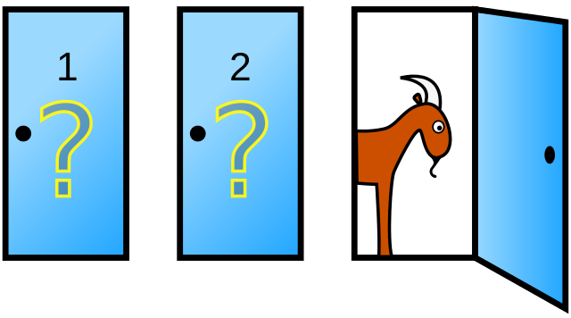  
.tiny[Cepheus, Public domain, via Wikimedia Commons]

]

.pull-right-40[


.tiny[[Источник](http://www.singsnap.com/karaoke/member/kandie), accessed янв 29, 2015]

]

--

Что за чушь! Должно быть без разницы, ведь вероятность того, что за какой-либо дверью машина — 1/3!

--

Но не все так просто...


---

## Возможные начальные конфигурации

.pull-left-60[

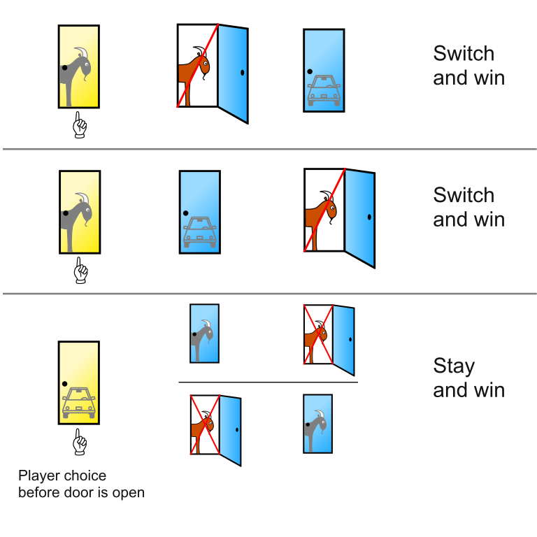

.tiny[Cepheus, Public domain, via Wikimedia Commons]

]

--

.pull-right-40[

В двух случаях из трех возможных игрок выигрывает, изменив свой первоначальный выбор. 

Т.е. если вы __меняете свой выбор__, то вероятность выигрыша 2/3 (66%).

А если вы __не меняете свой выбор__, то вероятность выигрыша 1/3 (33%).

]

---

## Если после открытия двери с козой вы заново случайным образом выбираете из двух дверей

.pull-left-60[

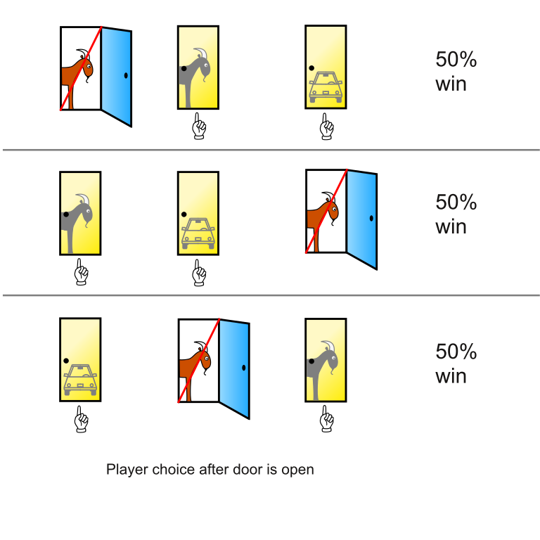

.tiny[Cepheus, Public domain, via Wikimedia Commons]

]

--

.pull-right-40[

Т.е. если вы делаете __новый выбор из двух возможностей__, вероятность выигрыша при любом раскладе будет 50%.

]


---

## На самом деле, с вероятностями не происходит ничего странного

.pull-left-45[

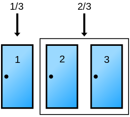 

.tiny[Cepheus, Public domain, via Wikimedia Commons]

<br/>

До того, как ведущий открыл дверь, вероятности, что выигрыш

- за выбранной дверью 1/3
- за двумя другими 2/3

]

--

.pull-right-55[

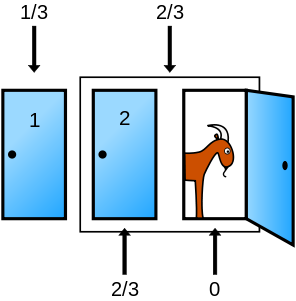  

После того, как ведущий открыл дверь с козой, вероятности, что выигрыш

- за выбранной дверью 1/3
- за двумя другими 2/3 (но только за закрытой дверью, т.к. за отрытой дверью — уже точно 0)

]

---

## Дерево возможных событий, если выбрана дверь 1


.pull-left-40[

(можно построить аналогичные при другом выборе)

Посчитаем условную вероятность "в лоб", сверяясь с картинкой.
<br/><br/>

]

--

.pull-right-60[

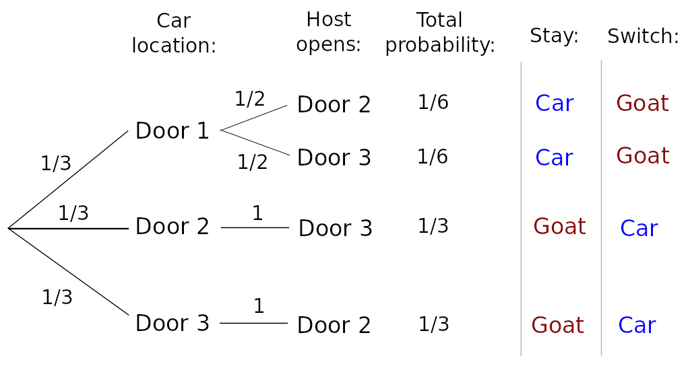

.tiny[Rick Block, Public domain, via Wikimedia Commons]

]

--

Пусть вы вначале выбрали дверь 1, а ведущий открыл дверь 3 и вы изменили свое решение, выбрав дверь 2. 

<br/>

Тогда условная вероятность выигрыша будет равна вероятности того, что ведущий открыл дверь 3 и машина за дверью 2, деленной на вероятность того, что ведущий открыл дверь 3.
$P(M = 2|X = 3) = \frac{1/3}{1/3 + 1/6} = 2/3$


---

## Более формальное решение

.pull-left-55[


.tiny[Rick Block, Public domain, via Wikimedia Commons]

]

--

.pull-right-45[

Пусть игрок выбрал дверь 1

$M = 1, 2, 3$ — за какой дверью машина?

$X = 1, 2, 3$ — какую дверь открывает Монти Холл? (предположим, 3)

$P(X = 3|M = 1) = 1/2$  
$P(X = 3|M = 2) = 1$  
$P(X = 3|M = 3) = 0$

<br/>

]

--

Мы хотим узнать

$P(M = 1|X = 3) = ?$  
$P(M = 2|X = 3) = ?$

---

## Применим теорему Байеса (1)

.pull-left-55[


.tiny[Rick Block, Public domain, via Wikimedia Commons]

]

.pull-right-45[

Пусть игрок выбрал дверь 1

$M = 1, 2, 3$ — за какой дверью машина?

$X = 1, 2, 3$ — какую дверь открывает Монти Холл? (предположим, 3)

$\color{blue}{P(X = 3|M = 1)} = 1/2$  
$\color{red}{P(X = 3|M = 2)} = 1$  
$\color{purple}{P(X = 3|M = 3)} = 0$

$\color{green}{P(M = 1, 2, 3)} = 1/3$

]

--

Если игрок __не меняет__ свой выбор

.large[
$P(M = 1|X = 3) = \frac{\color{blue}{P(X=3,M=1)}}{P(X=3)}=$
]

--

.large[
$= \frac{\color{blue}{P(X=3|M=1)}\color{green}{P(M=1)}}{\sum^{3}_{i = 1} P(X=3|M=i)\color{green}{P(M=i)}} =$
]

--

.large[
$= \frac{\color{blue}{P(X=3|M=1)}\color{green}{P(M=1)}}{\color{blue}{P(X=3|M=1)}\color{green}{P(M=1)}\;+\;\color{red}{P(X=3|M=2)}\color{green}{P(M=2)}\;+\;\color{purple}{P(X=3|M=3)}\color{green}{P(M=3)}} =$
]

--

.large[
$=\frac{\color{blue}{1/2} \cdot \color{green}{1/3}}{\color{blue}{1/2} \cdot \color{green}{1/3} + \color{red}{1} \cdot \color{green}{1/3} + \color{purple}{0} \cdot \color{green}{1/3}} = \frac{1/6}{1/2} = 1/3$
]

---

## Применим теорему Байеса (2)

.pull-left-55[


.tiny[Rick Block, Public domain, via Wikimedia Commons]

]

.pull-right-45[

Пусть игрок выбрал дверь 1

M = 1, 2, 3 — за какой дверью машина?

X = 1, 2, 3 — какую дверь открывает Монти Холл? (предположим, 3)

$\color{blue}{P(X = 3|M = 1)} = 1/2$  
$\color{red}{P(X = 3|M = 2)} = 1$  
$\color{purple}{P(X = 3|M = 3)} = 0$

$\color{green}{P(M = 1, 2, 3)} = 1/3$

]

--

Если игрок __изменяет__ свой выбор

$P(M = 2|X = 3) = \frac{\color{red}{P(X=3,M=2)}}{P(X=3)}=$

--

$= \frac{\color{red}{P(X=3|M=2)}\color{green}{P(M=1)}}{\sum^{3}_{i = 1} P(X=3|M=i)\color{green}{P(M=i)}} =$

--

$= \frac{\color{red}{P(X=3|M=2)}\color{green}{P(M=1)}}{\color{blue}{P(X=3|M=1)}\color{green}{P(M=1)}\;+\;\color{red}{P(X=3|M=2)}\color{green}{P(M=2)}\;+\;\color{purple}{P(X=3|M=3)}\color{green}{P(M=3)}} =$

--

$=\frac{\color{red}{1} \cdot \color{green}{1/3}}{\color{blue}{1/2} \cdot \color{green}{1/3} + \color{red}{1} \cdot \color{green}{1/3} + \color{purple}{0} \cdot \color{green}{1/3}} = \frac{1/3}{1/2} = 2/3$

???

Геометрическая интерпретация теоремы Байеса https://www.youtube.com/watch?v=HZGCoVF3YvM

Там же чудесная история из Канемана про Стива фермера/библиотекаря, которую, при случае, можно было бы рассказать во время практики.

---

class: middle, center, inverse

# Колоколообразные кривые

---

##


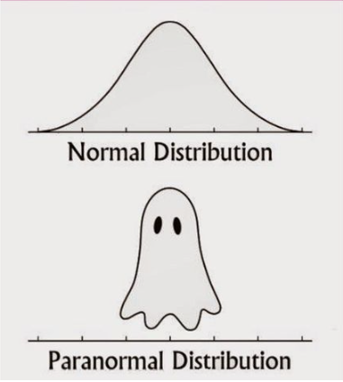

---

class: middle, center, inverse

# Нормальное распределение (WS10)

---

##


---

class: middle, center, inverse

# Формула нормального распределения

---

##


---

class: middle, center, inverse

# Свойства нормального распределения

---

##


