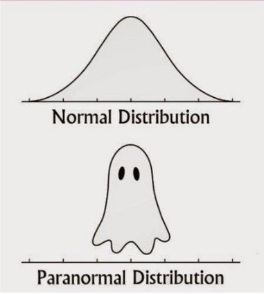

---

## Дерево возможных событий, если выбрана дверь 1

.pull-left-40[

(можно построить аналогичные при другом выборе)

Посчитаем условную вероятность "в лоб", сверяясь с картинкой.
 
 
]

--

.pull-right-60[

.tiny[Rick Block, Public domain, via Wikimedia Commons]

]

--

Пусть вы вначале выбрали дверь 1, а ведущий открыл дверь 3 и вы изменили свое решение, выбрав дверь 2. 
 
 
Тогда условная вероятность выигрыша будет равна вероятности того, что ведущий открыл дверь 3 и машина за дверью 2, деленной на вероятность того, что ведущий открыл 3 дверь.

P(M = 2|X = 3) = (1/3) / (1/3 + 1/6) = 2/3

$P(M = 2|X = 3) = \frac{1/3}{1/3 + 1/6} = 2/3$

---

## Более формальное решение

.pull-left-55[

.tiny[Rick Block, Public domain, via Wikimedia Commons]

]

--

.pull-right-45[

Пусть игрок выбрал дверь 1

$M = 1, 2, 3$ — за какой дверью машина?

$X = 1, 2, 3$ — какую дверь открывает Монти Холл? (предположим, 3)

$P(X = 3|M = 1) = 1/2$  
$P(X = 3|M = 2) = 1$  
$P(X = 3|M = 3) = 0$

 

]

--

Мы хотим узнать

$P(M = 1|X = 3) = ?$  
$P(M = 2|X = 3) = ?$

---

## Применим теорему Байеса (1)

.pull-left-55[

.tiny[Rick Block, Public domain, via Wikimedia Commons]

]

.pull-right-45[

Пусть игрок выбрал дверь 1

$M = 1, 2, 3$ — за какой дверью машина?

$X = 1, 2, 3$ — какую дверь открывает Монти Холл? (предположим, 3)

$\color{blue}{P(X = 3|M = 1)} = 1/2$  
$\color{red}{P(X = 3|M = 2)} = 1$  
$\color{purple}{P(X = 3|M = 3)} = 0$

$\color{green}{P(M = 1, 2, 3)} = 1/3$

]

--

Если игрок __не меняет__ свой выбор

.large[
$P(M = 1|X = 3) = \frac{\color{blue}{P(X=3,M=1)}}{P(X=3)}=$
]

--

.large[
$= \frac{\color{blue}{P(X=3|M=1)}\color{green}{P(M=1)}}{\sum^{3}_{i = 1} P(X=3|M=i)\color{green}{P(M=i)}} =$
]

--

.large[
$= \frac{\color{blue}{P(X=3|M=1)}\color{green}{P(M=1)}}{\color{blue}{P(X=3|M=1)}\color{green}{P(M=1)}\;+\;\color{red}{P(X=3|M=2)}\color{green}{P(M=2)}\;+\;\color{purple}{P(X=3|M=3)}\color{green}{P(M=3)}} =$
]

--

.large[
$=\frac{\color{blue}{1/2} \cdot \color{green}{1/3}}{\color{blue}{1/2} \cdot \color{green}{1/3} + \color{red}{1} \cdot \color{green}{1/3} + \color{purple}{0} \cdot \color{green}{1/3}} = \frac{1/6}{1/2} = 1/3$
]

---

## Применим теорему Байеса (2)

.pull-left-55[

.tiny[Rick Block, Public domain, via Wikimedia Commons]

]

.pull-right-45[

Пусть игрок выбрал дверь 1

M = 1, 2, 3 — за какой дверью машина?

X = 1, 2, 3 — какую дверь открывает Монти Холл? (предположим, 3)

$\color{blue}{P(X = 3|M = 1)} = 1/2$  
$\color{red}{P(X = 3|M = 2)} = 1$  
$\color{purple}{P(X = 3|M = 3)} = 0$

$\color{green}{P(M = 1, 2, 3)} = 1/3$

]

--

Если игрок __изменяет__ свой выбор

$P(M = 2|X = 3) = \frac{\color{red}{P(X=3,M=2)}}{P(X=3)}=$

--

$= \frac{\color{red}{P(X=3|M=2)}\color{green}{P(M=1)}}{\sum^{3}_{i = 1} P(X=3|M=i)\color{green}{P(M=i)}} =$

--

$= \frac{\color{red}{P(X=3|M=2)}\color{green}{P(M=1)}}{\color{blue}{P(X=3|M=1)}\color{green}{P(M=1)}\;+\;\color{red}{P(X=3|M=2)}\color{green}{P(M=2)}\;+\;\color{purple}{P(X=3|M=3)}\color{green}{P(M=3)}} =$

--

$=\frac{\color{red}{1} \cdot \color{green}{1/3}}{\color{blue}{1/2} \cdot \color{green}{1/3} + \color{red}{1} \cdot \color{green}{1/3} + \color{purple}{0} \cdot \color{green}{1/3}} = \frac{1/3}{1/2} = 2/3$

???

Геометрическая интерпретация теоремы Байеса https://www.youtube.com/watch?v=HZGCoVF3YvM

Там же чудесная история из Канемана про Стива фермера/библиотекаря, которую, при случае, можно было бы рассказать во время практики.

---

class: middle, center, inverse

# Колоколообразные кривые

---

##

---

class: middle, center, inverse

# Нормальное распределение (WS10)

---

##

---

class: middle, center, inverse

# Формула нормального распределения

---

##

---

class: middle, center, inverse

# Свойства нормального распределения

---

##

